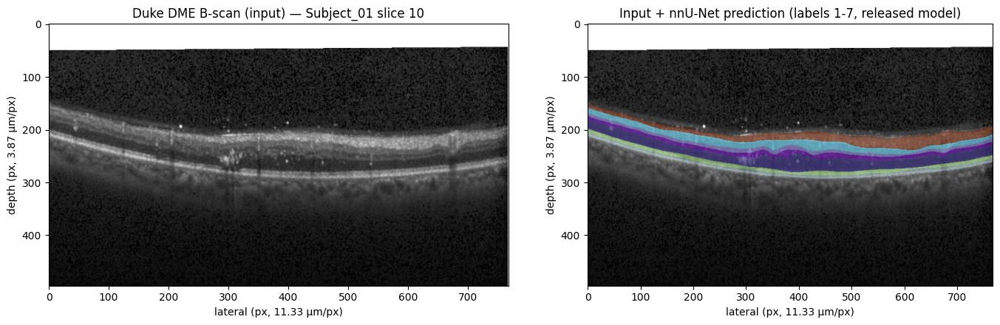

# PhenoPaper Colab notebooks

<!-- publication-summary:start -->

<!-- publication-summary:end -->

AI-verified Google Colab demonstrations for selected plant phenotyping papers. Each notebook runs a small, documented part of a paper’s workflow; it does not establish paper-wide performance or reproduce every experiment.

公開論文の解析手順を小さな例で実行できる Colab ノートブックです。

## About PhenoPaper / PhenoPaperについて

This repository is part of [PhenoPaper](https://phenopaper.smartbreed-plant-phenotyping-platform.com/). Browse this collection on the [PhenoPaper Colab notebooks page](https://phenopaper.smartbreed-plant-phenotyping-platform.com/colab-notebooks).

このリポジトリは[PhenoPaper](https://phenopaper.smartbreed-plant-phenotyping-platform.com/)プロジェクトの機能の一つです。ノートブック一覧は[PhenoPaperのColabノートブックページ](https://phenopaper.smartbreed-plant-phenotyping-platform.com/colab-notebooks)から閲覧できます。

### What “AI-verified” means / 「AI-verified」の意味

“AI-verified” means that the notebook completed its recorded execution checks in the stated Colab runtime. It does not authenticate the paper, repository, or notebook provenance, and it does not guarantee scientific correctness or faithful reproduction of the paper.

「AI-verified」は、記載されたColabランタイムでノートブックの実行確認を行ったという意味です。論文・レポジトリ・ノートブックの出所や真正性、科学的な正確さ、原著の忠実な再現を保証するものではありません。

<!-- notebook-index:start -->
## Contents

- [Notebook index](#notebook-index)
- [Failed attempts](FAILED.md)
- [Unverified and incomplete notebooks](UNVERIFIED.md)
- [Validation and limitations](#validation-and-limitations)
- [Maintainers](#maintainers)
- [Sources and rights](#sources-and-rights)

### Notebook index

Browse all 220 AI-verified notebooks alphabetically:

- [Page 1: notebooks 1–50](catalog/page-001.md)
- [Page 2: notebooks 51–100](catalog/page-002.md)
- [Page 3: notebooks 101–150](catalog/page-003.md)
- [Page 4: notebooks 151–200](catalog/page-004.md)
- [Page 5: notebooks 201–220](catalog/page-005.md)

<!-- notebook-index:end -->

## Failed attempts

[Failed reproduction attempts](FAILED.md) — failed runs and recorded reasons.

## Unverified references

[Unverified and incomplete notebooks](UNVERIFIED.md) — drafts and stopped attempts, with reasons. Excluded from the AI-verified count.

## Notebooks

<!-- publication-table:start -->

Showing the 2 most recently published notebooks of 220. [Browse the complete alphabetical catalog](#notebook-index).

| Paper and run details | Preview |
| --- | --- |
| **Deep learning for interactive and automated inner retinal layer segmentation in OCT of patients with retinitis pigmentosa using limited training data** public_id: <code>p-0ae0dbcc01aa432ef3cec43245e2765a</code>        <b>Generated with:</b> OpenCode 1.18.34 · spark-local/GLM-5.3-Flash-EXL3 · variant: high · reasoning effort: high <b>Demonstration:</b> Runs the paper&#x27;s released pretrained nnU-Net on one public Duke DME OCT B-scan to segment the 7 retinal layers and reproduce the author&#x27;s layer-thickness metric against the human annotation; a held-in training sample and pipeline sanity check, not a verification of the paper&#x27;s RP results (private UMG-RP data).  <b>Semantic tags:</b> task:segmentation |  Duke DME B-scan (Subject_01, slice 10) with the 7-layer segmentation predicted by the paper&#x27;s released nnU-Net model (CPU inference). |
| **A procedure for automated tree pruning suggestion using LiDAR scans of fruit trees** public_id: <code>p-8d7350b7e41d907b60ba9345196c8b94</code>        <b>Generated with:</b> OpenCode 1.18.34 · spark-local/GLM-5.3-Flash-EXL3 · variant: high · reasoning effort: high <b>Demonstration:</b> Graph-based pruning-effect simulation (arXiv:2102.03700v1 §II-B) on the paper&#x27;s real avocado LiDAR tree row-55s-tree-15e with a single reference-informed cut, scored against the real post-limb-removal scan (voxel F1 0.12; the paper&#x27;s F1 0.78 is a synthetic-stand, multi-cut setting).  <b>Semantic tags:</b> environment:field, modality:point_cloud, organ:whole_plant, task:morphology, task:segmentation, trait:architecture, trait:yield |  Reference removal (from the real post-limb-removal scan, left) versus the simulated graph-path removal for one cut point (right) in the elevation view of row-55s-tree-15e. |

<!-- publication-table:end -->

## Validation and limitations

Each notebook contains saved outputs from a recorded Colab run, with its pinned sources, input/output description, adaptations, and limitations. Runtime availability and package compatibility can change. AI-generated content is not guaranteed to be error-free.

各ノートブックに、実行結果、出典、入力・出力、変更点、制約を記録しています。

## Maintainers

See [PUBLISHING.md](PUBLISHING.md) for the notebook validation and publication procedure.

## Sources and rights

Each notebook identifies its paper, implementation, pinned revision, asset provenance, and known license or reuse limitations. Preview images are figures saved by the notebooks; check the upstream terms documented in each notebook before reusing code, weights, images, or paper content.
