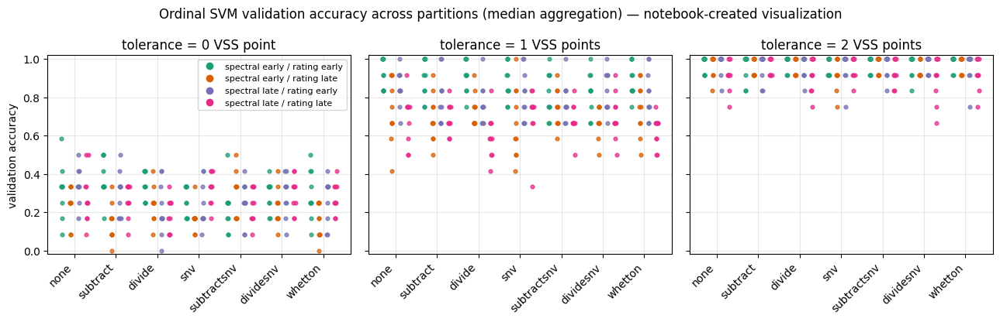
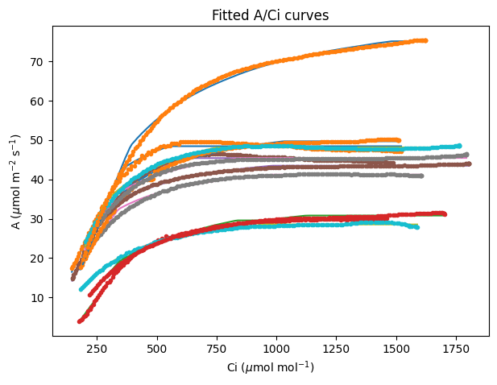

# PhenoPaper Colab notebooks

<!-- publication-summary:start -->

<!-- publication-summary:end -->

AI-verified Google Colab demonstrations for selected plant phenotyping papers. Each notebook runs a small, documented part of a paper’s workflow; it does not establish paper-wide performance or reproduce every experiment.

公開論文の解析手順を小さな例で実行できる Colab ノートブックです。

## About PhenoPaper / PhenoPaperについて

This repository is part of [PhenoPaper](https://phenopaper.smartbreed-plant-phenotyping-platform.com/). Browse this collection on the [PhenoPaper Colab notebooks page](https://phenopaper.smartbreed-plant-phenotyping-platform.com/colab-notebooks).

このリポジトリは[PhenoPaper](https://phenopaper.smartbreed-plant-phenotyping-platform.com/)プロジェクトの機能の一つです。ノートブック一覧は[PhenoPaperのColabノートブックページ](https://phenopaper.smartbreed-plant-phenotyping-platform.com/colab-notebooks)から閲覧できます。

### What “AI-verified” means / 「AI-verified」の意味

“AI-verified” means that the notebook completed its recorded execution checks in the stated Colab runtime. It does not authenticate the paper, repository, or notebook provenance, and it does not guarantee scientific correctness or faithful reproduction of the paper.

「AI-verified」は、記載されたColabランタイムでノートブックの実行確認を行ったという意味です。論文・レポジトリ・ノートブックの出所や真正性、科学的な正確さ、原著の忠実な再現を保証するものではありません。

<!-- notebook-index:start -->
## Contents

- [Notebook index](#notebook-index)
- [Failed attempts](FAILED.md)
- [Unverified and incomplete notebooks](UNVERIFIED.md)
- [Validation and limitations](#validation-and-limitations)
- [Maintainers](#maintainers)
- [Sources and rights](#sources-and-rights)

### Notebook index

Browse all 285 AI-verified notebooks alphabetically

- [3D reconstruction identifies loci linked to variation in angle of individual sorghum leaves](notebooks/p-96dc254f7fd6d49e5304d420acb82d9d.ipynb) · [Open in Colab](https://colab.research.google.com/github/phytometrics/phenopaper-colab-notebooks/blob/main/notebooks/p-96dc254f7fd6d49e5304d420acb82d9d.ipynb) <b>Journal:</b> PeerJ <b>Authors:</b> Tross MC, Gaillard M, Zwiener M, Miao C, Grove RJ, Li B, Benes B, Schnable JC.
- [3D shape sensing and deep learning-based segmentation of strawberries](notebooks/p-91cc48912990fd6351a5516aa3393cdb.ipynb) · [Open in Colab](https://colab.research.google.com/github/phytometrics/phenopaper-colab-notebooks/blob/main/notebooks/p-91cc48912990fd6351a5516aa3393cdb.ipynb) <b>Journal:</b> Computers and Electronics in Agriculture <b>Authors:</b> Justin Le Louëdec · Grzegorz Cielniak
- [3D sorghum reconstructions from depth images enable identification of quantitative trait loci regulating shoot architecture](notebooks/p-076a5cd5ebdeed1a9ffaf2ec05b49074.ipynb) · [Open in Colab](https://colab.research.google.com/github/phytometrics/phenopaper-colab-notebooks/blob/main/notebooks/p-076a5cd5ebdeed1a9ffaf2ec05b49074.ipynb) <b>Journal:</b> bioRxiv <b>Authors:</b> Ryan F. McCormick · Sandra K. Truong · John E. Mullet
- [3dCAP-Wheat: An Open-Source Comprehensive Computational Framework Precisely Quantifies Wheat Foliar, Nonfoliar, and Canopy Photosynthesis.](notebooks/p-b437e7e7fb6660387c003ea80e5bd235.ipynb) · [Open in Colab](https://colab.research.google.com/github/phytometrics/phenopaper-colab-notebooks/blob/main/notebooks/p-b437e7e7fb6660387c003ea80e5bd235.ipynb) <b>Journal:</b> Plant phenomics (Washington, D.C.) <b>Authors:</b> Chang TG, Shi Z, Zhao H, Song Q, He Z, Van Rie J, Den Boer B, Galle A, Zhu XG.
- [A dataset of tomato fruits images for object detection in the complex lighting environment of plant factories.](notebooks/p-61f25e176f25878b149b71125d03bb03.ipynb) · [Open in Colab](https://colab.research.google.com/github/phytometrics/phenopaper-colab-notebooks/blob/main/notebooks/p-61f25e176f25878b149b71125d03bb03.ipynb) <b>Journal:</b> Data in brief <b>Authors:</b> Wu ZW, Liu MH, Sun CX, Wang XF.
- [A deep learning-based toolkit for 3D nuclei segmentation and quantitative analysis in cellular and tissue context](notebooks/p-f84d74d4cde3d6dd8559f857b44e97ae.ipynb) · [Open in Colab](https://colab.research.google.com/github/phytometrics/phenopaper-colab-notebooks/blob/main/notebooks/p-f84d74d4cde3d6dd8559f857b44e97ae.ipynb) <b>Journal:</b> Development <b>Authors:</b> Athul Vijayan · Tejasvinee Atul Mody · Qin Yu · Adrian Wolny · Lorenzo Cerrone · Soeren Strauss · Miltos Tsiantis · Richard S. Smith · Fred A. Hamprecht · Anna Kreshuk · Kay Schneitz
- [A Density-Based Algorithm for the Detection of Individual Trees from LiDAR Data](notebooks/p-98941196b03501305654120eaa5423d5.ipynb) · [Open in Colab](https://colab.research.google.com/github/phytometrics/phenopaper-colab-notebooks/blob/main/notebooks/p-98941196b03501305654120eaa5423d5.ipynb) <b>Journal:</b> Remote Sensing <b>Authors:</b> Melissa Latella · Fabio Sola · Carlo Camporeale
- [A framework for genomics-informed ecophysiological modeling in plants.](notebooks/p-ab60978ac3d2386bad43907dc62862af.ipynb) · [Open in Colab](https://colab.research.google.com/github/phytometrics/phenopaper-colab-notebooks/blob/main/notebooks/p-ab60978ac3d2386bad43907dc62862af.ipynb) <b>Journal:</b> Journal of experimental botany <b>Authors:</b> Wang DR, Guadagno CR, Mao X, Mackay DS, Pleban JR, Baker RL, Weinig C, Jannink JL, Ewers BE.
- [A generator of morphological clones for plant species](notebooks/p-c207aaffecf97ff42fd465ffaed5302e.ipynb) · [Open in Colab](https://colab.research.google.com/github/phytometrics/phenopaper-colab-notebooks/blob/main/notebooks/p-c207aaffecf97ff42fd465ffaed5302e.ipynb) <b>Journal:</b> bioRxiv <b>Authors:</b> Potapov I, Järvenpää M, Åkerblom M, Raumonen P, Kaasalainen M.
- [A high resolution model of the grapevine leaf morphospace predicts synthetic leaves](notebooks/p-42f16e56ceb965c67ac889ef03b65eee.ipynb) · [Open in Colab](https://colab.research.google.com/github/phytometrics/phenopaper-colab-notebooks/blob/main/notebooks/p-42f16e56ceb965c67ac889ef03b65eee.ipynb) <b>Journal:</b> bioRxiv <b>Authors:</b> Chitwood, D. H. · Torres-Lomas, E. · Hadi, E. S. · Peterson, W. L. G. · Fischer, M. F. · Rogers, S. E. · He, C. · Acierno, M. G. F. · Azumaya, S. · Benjamin, S. W. · Chalise, D. P. · Chess, E. E. · Engelsma, A. J. · Fu, Q. · Jaikham, J. · Knight, B. M. · Kodjak, N. S. · Lengyel, A. · Munoz, B. L. · Patterson, J. T. · Rincon, S. I. · Schumann, F. L. · Shi, Y. · Smith, C. C. · St. Clair, M. K. · Sweeney, C. S. · Whitaker, P. · Wu, J. · Diaz-Garcia, L.
- [A High-Resolution Multifocal RGB Pollen Grain Image Dataset for Deep Learning Computer Vision Tasks from Biobío Region, Chile.](notebooks/p-43ba90c5388dc75860441a1289f95762.ipynb) · [Open in Colab](https://colab.research.google.com/github/phytometrics/phenopaper-colab-notebooks/blob/main/notebooks/p-43ba90c5388dc75860441a1289f95762.ipynb) <b>Journal:</b> Scientific data <b>Authors:</b> Sanhueza I, Coelho P, Viafora L, Jofre-Cerda R, Salamanca-Levi V, Muñoz-Cepeda B, Obregón-Rivas AM, Cofré J, Rondanelli-Reyes M, Lamas I, Troncoso J, Toro C, Cariñe J, Staforelli-Vivanco J.
- [A leaf phenomics approach for estimating belowground traits in North American licorice.](notebooks/p-62932b4d8903b310dda0752a343426c5.ipynb) · [Open in Colab](https://colab.research.google.com/github/phytometrics/phenopaper-colab-notebooks/blob/main/notebooks/p-62932b4d8903b310dda0752a343426c5.ipynb) <b>Journal:</b> American journal of botany <b>Authors:</b> Harris ZN, Tran V, Piotter E, Hanlon MT, Rubin MJ, Miller AJ.
- [A lightweight and explainable CNN model for empowering plant disease diagnosis](notebooks/p-cd491f1c0d8b2d53c198839547951c56.ipynb) · [Open in Colab](https://colab.research.google.com/github/phytometrics/phenopaper-colab-notebooks/blob/main/notebooks/p-cd491f1c0d8b2d53c198839547951c56.ipynb) <b>Journal:</b> Scientific Reports <b>Authors:</b> Chiranjit Pal · Swastik Karmakar · Imon Mukherjee · Partha Pratim Chakrabarti
- [A Low-Cost Photogrammetry System for 3D Plant Modeling and Phenotyping](notebooks/p-0dfec3c680bb0e32ef572c9bcc0a1d2c.ipynb) · [Open in Colab](https://colab.research.google.com/github/phytometrics/phenopaper-colab-notebooks/blob/main/notebooks/p-0dfec3c680bb0e32ef572c9bcc0a1d2c.ipynb) <b>Journal:</b> arXiv <b>Authors:</b> Joe Hrzich · Michael A. Beck · Christopher P. Bidinosti · Christopher J. Henry · Kalhari Manawasinghe · Karen Tanino
- [A massive community-science flower color dataset reveals convergent evolution of delayed flowering phenology in North American red-flowering plants](notebooks/p-1b1ab42c1c7a9204d2b3804fdede6367.ipynb) · [Open in Colab](https://colab.research.google.com/github/phytometrics/phenopaper-colab-notebooks/blob/main/notebooks/p-1b1ab42c1c7a9204d2b3804fdede6367.ipynb) <b>Journal:</b> bioRxiv <b>Authors:</b> McKenzie PF, Berardi AE, Hopkins R.
- [A methodology for detection and localization of fruits in apples orchards from aerial images](notebooks/p-db90fe39eb1b5f45e23f18ba807d0fdb.ipynb) · [Open in Colab](https://colab.research.google.com/github/phytometrics/phenopaper-colab-notebooks/blob/main/notebooks/p-db90fe39eb1b5f45e23f18ba807d0fdb.ipynb) <b>Journal:</b> arXiv <b>Authors:</b> Thiago T. Santos · Luciano Gebler
- [A Mobile-Based System for Detecting Plant Leaf Diseases Using Deep Learning](notebooks/p-dd752d0cd5144d35a2a1df29379ddbae.ipynb) · [Open in Colab](https://colab.research.google.com/github/phytometrics/phenopaper-colab-notebooks/blob/main/notebooks/p-dd752d0cd5144d35a2a1df29379ddbae.ipynb) <b>Journal:</b> AgriEngineering <b>Authors:</b> Ahmed Abdelmoamen Ahmed · Gopireddy Harshavardhan Reddy
- [A new method for individual treetop detection with low-resolution aerial laser scanned data](notebooks/p-2dc738c2de2363279e1b2fbda660dc0b.ipynb) · [Open in Colab](https://colab.research.google.com/github/phytometrics/phenopaper-colab-notebooks/blob/main/notebooks/p-2dc738c2de2363279e1b2fbda660dc0b.ipynb) <b>Journal:</b> Modeling Earth Systems and Environment <b>Authors:</b> Gergő Diószegi · Vanda Éva Molnár · Loránd Attila Nagy · Péter Enyedi · Péter Török · Szilárd Szabó
- [A Novel CNN Gradient Boosting Ensemble for Guava Disease Detection](notebooks/p-324fc62e79f61ae67c5b95c671c559e9.ipynb) · [Open in Colab](https://colab.research.google.com/github/phytometrics/phenopaper-colab-notebooks/blob/main/notebooks/p-324fc62e79f61ae67c5b95c671c559e9.ipynb) <b>Journal:</b> arXiv <b>Authors:</b> Tamim Ahasan Rijon · Yeasin Arafath
- [A novel dual-excitation pulse-amplitude-modulation fluorometer for investigating photosynthesis of plants](notebooks/p-445c34da82cdb01531f293f0701af907.ipynb) · [Open in Colab](https://colab.research.google.com/github/phytometrics/phenopaper-colab-notebooks/blob/main/notebooks/p-445c34da82cdb01531f293f0701af907.ipynb) <b>Journal:</b> bioRxiv <b>Authors:</b> Havelka, M. · Nedbal, L. · Suhling, K. · Nedbal, J.
- [A procedure for automated tree pruning suggestion using LiDAR scans of fruit trees](notebooks/p-8d7350b7e41d907b60ba9345196c8b94.ipynb) · [Open in Colab](https://colab.research.google.com/github/phytometrics/phenopaper-colab-notebooks/blob/main/notebooks/p-8d7350b7e41d907b60ba9345196c8b94.ipynb) <b>Journal:</b> arXiv <b>Authors:</b> Fredrik Westling · James Underwood · Mitch Bryson
- [A stomata classification and detection system in microscope images of maize cultivars.](notebooks/p-aed3b833ea96ef7e087ce2bdfd29de23.ipynb) · [Open in Colab](https://colab.research.google.com/github/phytometrics/phenopaper-colab-notebooks/blob/main/notebooks/p-aed3b833ea96ef7e087ce2bdfd29de23.ipynb) <b>Journal:</b> PloS one <b>Authors:</b> Aono AH, Nagai JS, Dickel GDSM, Marinho RC, de Oliveira PEAM, Papa JP, Faria FA.
- [A Transferable Quantitative Framework for Extracting Engineering-Relevant Descriptors from Biological Protective Surfaces: Intra-Specimen Descriptor Mapping of Five Citrus Peels](notebooks/p-012105486e7a5cee8189252b79eca895.ipynb) · [Open in Colab](https://colab.research.google.com/github/phytometrics/phenopaper-colab-notebooks/blob/main/notebooks/p-012105486e7a5cee8189252b79eca895.ipynb) <b>Journal:</b> Biomimetics (Basel, Switzerland) <b>Authors:</b> Bengisu M, Akdağ B, Şahmurat F, Tekin Z, Turhan KN.
- [A two-stage screening approach integrated with GWAS for rare phenotypes such as spontaneous haploid genome doubling in maize.](notebooks/p-2622cabc3ec497c6b30382594a3f9389.ipynb) · [Open in Colab](https://colab.research.google.com/github/phytometrics/phenopaper-colab-notebooks/blob/main/notebooks/p-2622cabc3ec497c6b30382594a3f9389.ipynb) <b>Journal:</b> Frontiers in plant science <b>Authors:</b> Fakude M, Foster TL, Chen YR, Murithi A, Aboobucker SI, Frei UK, Dixon PM, Lübberstedt T.
- [Accurately Identifying Sound vs. Rotten Cranberries Using Convolutional Neural Network](notebooks/p-f1b4f3cd160c996964aff858a481e94a.ipynb) · [Open in Colab](https://colab.research.google.com/github/phytometrics/phenopaper-colab-notebooks/blob/main/notebooks/p-f1b4f3cd160c996964aff858a481e94a.ipynb) <b>Journal:</b> Information <b>Authors:</b> Sayed Mehedi Azim · Austin Spadaro · Joseph Kawash · James J. Polashock · Abdollah Dehzangi
- [Active Learning with Gaussian Processes for High Throughput Phenotyping](notebooks/p-315c655a33b6833a2eeaeabc3bd74d9f.ipynb) · [Open in Colab](https://colab.research.google.com/github/phytometrics/phenopaper-colab-notebooks/blob/main/notebooks/p-315c655a33b6833a2eeaeabc3bd74d9f.ipynb) <b>Journal:</b> arXiv <b>Authors:</b> Sumit Kumar · Wenhao Luo · George Kantor · Katia Sycara
- [Advanced Image Analysis Methods for Automated Segmentation of Subnuclear Chromatin Domains](notebooks/p-e6c97314f8fd238c832e9295bff1dccb.ipynb) · [Open in Colab](https://colab.research.google.com/github/phytometrics/phenopaper-colab-notebooks/blob/main/notebooks/p-e6c97314f8fd238c832e9295bff1dccb.ipynb) <b>Journal:</b> Epigenomes <b>Authors:</b> Johann To Berens P, Schivre G, Theune M, Peter J, Sall SO, Mutterer J, Barneche F, Bourbousse C, Molinier J.
- [Advancing fine branch biomass estimation with lidar and structural models](notebooks/p-62c7cba3ad70919fc6c3454f3aa8535b.ipynb) · [Open in Colab](https://colab.research.google.com/github/phytometrics/phenopaper-colab-notebooks/blob/main/notebooks/p-62c7cba3ad70919fc6c3454f3aa8535b.ipynb) <b>Journal:</b> Annals of botany <b>Authors:</b> Millan M, Bonnet A, Dauzat J, Vezy R.
- [AI-Powered Automated Hydroponic System for Smart Agriculture](notebooks/p-edea3f34e04b2b1aa4089733cfec5483.ipynb) · [Open in Colab](https://colab.research.google.com/github/phytometrics/phenopaper-colab-notebooks/blob/main/notebooks/p-edea3f34e04b2b1aa4089733cfec5483.ipynb) <b>Journal:</b> MethodsX <b>Authors:</b> Baraskar PT, Khatri V, Kolhe P, Katyarmal M, Khedekar S.
- [AKFruitYield: Modular benchmarking and video analysis software for Azure Kinect cameras for fruit size and fruit yield estimation in apple orchards](notebooks/p-abf755e7e4f15c82e220bb66d292e6e5.ipynb) · [Open in Colab](https://colab.research.google.com/github/phytometrics/phenopaper-colab-notebooks/blob/main/notebooks/p-abf755e7e4f15c82e220bb66d292e6e5.ipynb) <b>Journal:</b> SoftwareX <b>Authors:</b> Juan Carlos Miranda · Jaume Arnó · Jordi Gené-Mola · Spyros Fountas · Eduard Gregorio
- [Amphistomy increases leaf photosynthesis more in coastal than montane plants of Hawaiian &#x27;ilima (Sida fallax).](notebooks/p-cdc0de3c4676cb6979306758217e42dc.ipynb) · [Open in Colab](https://colab.research.google.com/github/phytometrics/phenopaper-colab-notebooks/blob/main/notebooks/p-cdc0de3c4676cb6979306758217e42dc.ipynb) <b>Journal:</b> American journal of botany <b>Authors:</b> Triplett G, Buckley TN, Muir CD.
- [An artificial neural network-based deep learning model to predict combined stress impact and interaction in plants.](notebooks/p-f3519059a34a39dca007cc56c27c6112.ipynb) · [Open in Colab](https://colab.research.google.com/github/phytometrics/phenopaper-colab-notebooks/blob/main/notebooks/p-f3519059a34a39dca007cc56c27c6112.ipynb) <b>Journal:</b> Applications in plant sciences <b>Authors:</b> Priya P, Pandey P, Jain R, Kandpal M, Jain S, Chaudhury R, Ramegowda V, Senthil-Kumar M.
- [An image dataset of Chinese hickory in natural orchards.](notebooks/p-40af28901ccb9acf8437d9f57bdd55c4.ipynb) · [Open in Colab](https://colab.research.google.com/github/phytometrics/phenopaper-colab-notebooks/blob/main/notebooks/p-40af28901ccb9acf8437d9f57bdd55c4.ipynb) <b>Journal:</b> Scientific data <b>Authors:</b> Jia N, Fu C, Chen K, Liu J.
- [Analysis of Cantaloupe Fruit Maturity Based on Fruit Skin Color Using Naive Bayes Classifier](notebooks/p-a50a1d755f801e5f83b95aef05faab50.ipynb) · [Open in Colab](https://colab.research.google.com/github/phytometrics/phenopaper-colab-notebooks/blob/main/notebooks/p-a50a1d755f801e5f83b95aef05faab50.ipynb) <b>Journal:</b> Journal of Physics: Conference Series <b>Authors:</b> M A Bustomi · M F Asy’ari
- [Analyzing Nitrogen Effects on Rice Panicle Development by Panicle Detection and Time-Series Tracking.](notebooks/p-46381bbe837bfc0c5522f980b3360462.ipynb) · [Open in Colab](https://colab.research.google.com/github/phytometrics/phenopaper-colab-notebooks/blob/main/notebooks/p-46381bbe837bfc0c5522f980b3360462.ipynb) <b>Journal:</b> Plant phenomics (Washington, D.C.) <b>Authors:</b> Zhou Q, Guo W, Chen N, Wang Z, Li G, Ding Y, Ninomiya S, Mu Y.
- [Annual Shoot Segmentation and Physiological Age Classification from TLS Data in Trees with Acrotonic Growth](notebooks/p-9cdc06a8cf9320b81b8531c92f5928fc.ipynb) · [Open in Colab](https://colab.research.google.com/github/phytometrics/phenopaper-colab-notebooks/blob/main/notebooks/p-9cdc06a8cf9320b81b8531c92f5928fc.ipynb) <b>Journal:</b> Forests <b>Authors:</b> Bastien Lecigne · Sylvain Delagrange · Olivier Taugourdeau
- [Anomaly detection in feature space for detecting changes in phytoplankton populations](notebooks/p-7ed948baa8dc690f07be5826e57e318c.ipynb) · [Open in Colab](https://colab.research.google.com/github/phytometrics/phenopaper-colab-notebooks/blob/main/notebooks/p-7ed948baa8dc690f07be5826e57e318c.ipynb) <b>Journal:</b> Frontiers in Marine Science <b>Authors:</b> Massimiliano Ciranni · Francesca Odone · Vito Paolo Pastore
- [AraDQ: an automated digital phenotyping software for quantifying disease symptoms of flood-inoculated Arabidopsis seedlings.](notebooks/p-c900721bb15ebda5e76a1dc19ac75f74.ipynb) · [Open in Colab](https://colab.research.google.com/github/phytometrics/phenopaper-colab-notebooks/blob/main/notebooks/p-c900721bb15ebda5e76a1dc19ac75f74.ipynb) <b>Journal:</b> Plant Methods <b>Authors:</b> Jae Hoon Lee · Unseok Lee · Ji Hye Yoo · Taek Sung Lee · Je Hyeong Jung · Hyoung Seok Kim
- [As good as human experts in detecting plant roots in minirhizotron images but efficient and reproducible: the convolutional neural network “RootDetector”](notebooks/p-0d2eb12e796dec66496f74d8e0aa04b7.ipynb) · [Open in Colab](https://colab.research.google.com/github/phytometrics/phenopaper-colab-notebooks/blob/main/notebooks/p-0d2eb12e796dec66496f74d8e0aa04b7.ipynb) <b>Journal:</b> Scientific Reports <b>Authors:</b> Peters B, Blume-Werry G, Gillert A, Schwieger S, von Lukas UF, Kreyling J.
- [Assembly history modulates vertical root distribution in a grassland experiment](notebooks/p-4d29b51e938eae2b1accf1c5affaf930.ipynb) · [Open in Colab](https://colab.research.google.com/github/phytometrics/phenopaper-colab-notebooks/blob/main/notebooks/p-4d29b51e938eae2b1accf1c5affaf930.ipynb) <b>Journal:</b> bioRxiv <b>Authors:</b> Alonso-Crespo IM, Weidlich EW, Temperton VM, Delory BM.
- [Assessing the hydromechanical control of plant growth.](notebooks/p-f4b6761b68409a38fe07554143d7229c.ipynb) · [Open in Colab](https://colab.research.google.com/github/phytometrics/phenopaper-colab-notebooks/blob/main/notebooks/p-f4b6761b68409a38fe07554143d7229c.ipynb) <b>Journal:</b> Journal of the Royal Society, Interface <b>Authors:</b> Laplaud V, Muller E, Demidova N, Drevensek S, Boudaoud A.
- [Automatic Fruit Morphology Phenome and Genetic Analysis: An Application in the Octoploid Strawberry.](notebooks/p-c8cd55dbad6ff8d5097de6e2073ea071.ipynb) · [Open in Colab](https://colab.research.google.com/github/phytometrics/phenopaper-colab-notebooks/blob/main/notebooks/p-c8cd55dbad6ff8d5097de6e2073ea071.ipynb) <b>Journal:</b> Plant phenomics (Washington, D.C.) <b>Authors:</b> Zingaretti LM, Monfort A, Pérez-Enciso M.
- [Automatic identification of avocado fruit diseases based on machine learning and chromatic descriptors](notebooks/p-18c98e448f127215b03cd3165068391d.ipynb) · [Open in Colab](https://colab.research.google.com/github/phytometrics/phenopaper-colab-notebooks/blob/main/notebooks/p-18c98e448f127215b03cd3165068391d.ipynb) <b>Journal:</b> Revista Chapingo Serie Horticultura <b>Authors:</b> Colegio de Postgraduados, Campus Montecillo. México · Ulises Enrique Campos-Ferreira · Juan Manuel González‐Camacho · Colegio de Postgraduados, Campus Montecillo. México · José Alfredo Carrillo-Salazar · Colegio de Postgraduados, Campus Montecillo. México
- [Automatic measurement of rice tiller angle from unmanned aerial vehicle images](notebooks/p-e7f7198f538d43be30658816c05dc291.ipynb) · [Open in Colab](https://colab.research.google.com/github/phytometrics/phenopaper-colab-notebooks/blob/main/notebooks/p-e7f7198f538d43be30658816c05dc291.ipynb) <b>Journal:</b> The Plant Phenome Journal <b>Authors:</b> Tan-Hanh Pham · Yubin Yang · Jing Zhang · Sanai Li · Stanley Omar PB. Samonte · Fugen Dou · Darlene L. Sanchez · Lloyd T. Wilson · Tanumoy Bera · Jing Wang · Kim‐Doang Nguyen
- [Automatic rape flower cluster counting method based on low-cost labelling and UAV-RGB images.](notebooks/p-bbb6f18ec693f941aa83ad24494c855d.ipynb) · [Open in Colab](https://colab.research.google.com/github/phytometrics/phenopaper-colab-notebooks/blob/main/notebooks/p-bbb6f18ec693f941aa83ad24494c855d.ipynb) <b>Journal:</b> Plant methods <b>Authors:</b> Li J, Wang E, Qiao J, Li Y, Li L, Yao J, Liao G.
- [Automatic Segmentation of Mauritia flexuosa in Unmanned Aerial Vehicle (UAV) Imagery Using Deep Learning](notebooks/p-1de963fe75f6acd9fe786c291b459370.ipynb) · [Open in Colab](https://colab.research.google.com/github/phytometrics/phenopaper-colab-notebooks/blob/main/notebooks/p-1de963fe75f6acd9fe786c291b459370.ipynb) <b>Journal:</b> Forests <b>Authors:</b> Giorgio Morales · Guillermo Kemper · Grace Sevillano · Daniel Arteaga · Ivan Ortega · Joel Telles
- [Automatic stem-leaf segmentation of maize shoots using three-dimensional point cloud](notebooks/p-128cba6ab1174fbf78bf2b45045261b8.ipynb) · [Open in Colab](https://colab.research.google.com/github/phytometrics/phenopaper-colab-notebooks/blob/main/notebooks/p-128cba6ab1174fbf78bf2b45045261b8.ipynb) <b>Journal:</b> Computers and Electronics in Agriculture <b>Authors:</b> Teng Miao · Chao Zhu · Tongyu Xu · Tao Yang · Na Li · Yuncheng Zhou · Hanbing Deng
- [Balancing accuracy, completeness, and efficiency for rice 3D reconstruction through CBAM-UNet-based multi-view segmentation and camera configuration optimization](notebooks/p-5cd1fcabe4b5cf13394eaab9a7b8a8d2.ipynb) · [Open in Colab](https://colab.research.google.com/github/phytometrics/phenopaper-colab-notebooks/blob/main/notebooks/p-5cd1fcabe4b5cf13394eaab9a7b8a8d2.ipynb) <b>Journal:</b> Frontiers in Plant Science <b>Authors:</b> Haoyang Zhou · Rongjie Chen · Hao Wang · Minglu Li · Yongkang Teng · Shenghao Ye · Menglei Wei · Kun Yu · Pingping Fang · Jing Cao · Fanglin Zhu · Wenyu Zhang · Ting Sun · Min Jiang
- [Bayesian functional regression as an alternative statistical analysis of high-throughput phenotyping data of modern agriculture.](notebooks/p-921e3c64e6cd8f598d5f56edbe436f1f.ipynb) · [Open in Colab](https://colab.research.google.com/github/phytometrics/phenopaper-colab-notebooks/blob/main/notebooks/p-921e3c64e6cd8f598d5f56edbe436f1f.ipynb) <b>Journal:</b> Plant Methods <b>Authors:</b> Abelardo Montesinos‐López · Osval A. Montesinos‐López · Gustavo de los Campos · José Crossa · Juan Burgueño · Francisco Javier Luna-Vázquez
- [Bayesian hierarchical models can infer interpretable predictions of leaf area index from heterogeneous datasets](notebooks/p-dca1f8bc026f5ddf6d23c5a61e5d7b85.ipynb) · [Open in Colab](https://colab.research.google.com/github/phytometrics/phenopaper-colab-notebooks/blob/main/notebooks/p-dca1f8bc026f5ddf6d23c5a61e5d7b85.ipynb) <b>Journal:</b> bioRxiv <b>Authors:</b> Stojanovic, O. · Siegmann, B. · Jarmer, T. · Pipa, G. · Leugering, J.
- [Benchmarking Phenotypic Clustering Algorithms via Empirically Calibrated Simulations: A Diagnostic Framework to Improve Biodiversity Assessment in Neglected Crops](notebooks/p-7eee532480e40ef516c03c17bdc802e7.ipynb) · [Open in Colab](https://colab.research.google.com/github/phytometrics/phenopaper-colab-notebooks/blob/main/notebooks/p-7eee532480e40ef516c03c17bdc802e7.ipynb) <b>Journal:</b> Journal not supplied <b>Authors:</b> Naino Jika AK.
- [Biomechanical phenotyping pipeline for stalk lodging resistance in maize.](notebooks/p-027ec3986a9b1bed36d090ca31702f07.ipynb) · [Open in Colab](https://colab.research.google.com/github/phytometrics/phenopaper-colab-notebooks/blob/main/notebooks/p-027ec3986a9b1bed36d090ca31702f07.ipynb) <b>Journal:</b> MethodsX <b>Authors:</b> Kaitlin Tabaracci · Norbert Bokros · Yusuf Oduntan · Bharath Kunduru · Joseph DeKold · Endalkachew Mengistie · Armando G. McDonald · Christopher J. Stubbs · Rajandeep S. Sekhon · Seth DeBolt · Daniel J. Robertson
- [Breedbase: a digital ecosystem for modern plant breeding.](notebooks/p-6969756b25d1518115626bfbea413f28.ipynb) · [Open in Colab](https://colab.research.google.com/github/phytometrics/phenopaper-colab-notebooks/blob/main/notebooks/p-6969756b25d1518115626bfbea413f28.ipynb) <b>Journal:</b> G3 (Bethesda, Md.) <b>Authors:</b> Morales N, Ogbonna AC, Ellerbrock BJ, Bauchet GJ, Tantikanjana T, Tecle IY, Powell AF, Lyon D, Menda N, Simoes CC, Saha S, Hosmani P, Flores M, Panitz N, Preble RS, Agbona A, Rabbi I, Kulakow P, Peteti P, Kawuki R, Esuma W, Kanaabi M, Chelangat DM, Uba E, Olojede A, Onyeka J, Shah T, Karanja M, Egesi C, Tufan H, Paterne A, Asfaw A, Jannink JL, Wolfe M, Birkett CL, Waring DJ, Hershberger JM, Gore MA, Robbins KR, Rife T, Courtney C, Poland J, Arnaud E, Laporte MA, Kulembeka H, Salum K, Mrema E, Brown A, Bayo S, Uwimana B, Akech V, Yencho C, de Boeck B, Campos H, Swennen R, Edwards JD, Mueller LA.
- [Central object segmentation by deep learning for fruits and other roundish objects](notebooks/p-bca1dffe8b831525417a430bec348e04.ipynb) · [Open in Colab](https://colab.research.google.com/github/phytometrics/phenopaper-colab-notebooks/blob/main/notebooks/p-bca1dffe8b831525417a430bec348e04.ipynb) <b>Journal:</b> arXiv <b>Authors:</b> Motohisa Fukuda · Takashi Okuno · Shinya Yuki
- [Cherry CO Dataset: A Dataset for Cherry Detection, Segmentation and Maturity Recognition](notebooks/p-3ca72f400e86485e3f370832f8d1b867.ipynb) · [Open in Colab](https://colab.research.google.com/github/phytometrics/phenopaper-colab-notebooks/blob/main/notebooks/p-3ca72f400e86485e3f370832f8d1b867.ipynb) <b>Journal:</b> IEEE Robotics and Automation Letters <b>Authors:</b> Luis Cossio-Montefinale · Javier Ruíz-del-Solar · Rodrigo Verschae
- [ChronoRoot 2.0: An Open AI-Powered Platform for 2D Temporal Plant Phenotyping](notebooks/p-ca7ab4f349f060f9c51e0a3ab1a29e14.ipynb) · [Open in Colab](https://colab.research.google.com/github/phytometrics/phenopaper-colab-notebooks/blob/main/notebooks/p-ca7ab4f349f060f9c51e0a3ab1a29e14.ipynb) <b>Journal:</b> CONICET Digital (CONICET) <b>Authors:</b> Rafael Nicolás Gaggion Zulpo · Rodrigo Bonazzola · María Florencia Legascue · María Florencia Mammarella · Florencia S. Rodríguez · Federico Emanuel Aballay · Florencia Belén Catulo · Andana Fleur Jami Charlotte Barrios · Franco Accavallo · Santiago Nahuel Villarreal · Martin Crespi · Martiniano M. Ricardi · Ezequiel Petrillo · Thomas Blein · Federico Ariel · Enzo Ferrante
- [CitDet: A Benchmark Dataset for Citrus Fruit Detection](notebooks/p-aec5f4a3b637086223a53c458d9c0bd3.ipynb) · [Open in Colab](https://colab.research.google.com/github/phytometrics/phenopaper-colab-notebooks/blob/main/notebooks/p-aec5f4a3b637086223a53c458d9c0bd3.ipynb) <b>Journal:</b> arXiv <b>Authors:</b> Jordan A. James · Heather K. Manching · Matthew R. Mattia · Kim D. Bowman · Amanda M. Hulse-Kemp · William J. Beksi
- [Clustering-Guided Multi-Layer Contrastive Representation Learning for Citrus Disease Classification](notebooks/p-2e8c3a2843f22434ab184e04160afc16.ipynb) · [Open in Colab](https://colab.research.google.com/github/phytometrics/phenopaper-colab-notebooks/blob/main/notebooks/p-2e8c3a2843f22434ab184e04160afc16.ipynb) <b>Journal:</b> arXiv <b>Authors:</b> Jun Chen · Yonghua Yu · Weifu Li · Yaohui Chen · Hong Chen
- [Colony-Level 3D Photogrammetry Reveals That Total Linear Extension and Initial Growth Do Not Scale With Complex Morphological Growth in the Branching Coral, Acropora cervicornis](notebooks/p-570151845380c4fdd6aa3762be2973f3.ipynb) · [Open in Colab](https://colab.research.google.com/github/phytometrics/phenopaper-colab-notebooks/blob/main/notebooks/p-570151845380c4fdd6aa3762be2973f3.ipynb) <b>Journal:</b> Frontiers in Marine Science <b>Authors:</b> Wyatt C. Million · Sibelle O’Donnell · Erich Bartels · Carly D. Kenkel
- [Color Sensor for the Determination of the Ripening Stage of Cherry Tomatoes](notebooks/p-2cb18c0c533d73995c27418d988c8078.ipynb) · [Open in Colab](https://colab.research.google.com/github/phytometrics/phenopaper-colab-notebooks/blob/main/notebooks/p-2cb18c0c533d73995c27418d988c8078.ipynb) <b>Journal:</b> Journal not supplied <b>Authors:</b> Vandeir Aniceto Pinheiro
- [Color Sensor for the Determination of the Ripening Stage of Cherry Tomatoes](notebooks/p-30b2f0e3a292ceea837204361f928619.ipynb) · [Open in Colab](https://colab.research.google.com/github/phytometrics/phenopaper-colab-notebooks/blob/main/notebooks/p-30b2f0e3a292ceea837204361f928619.ipynb) <b>Journal:</b> Journal not supplied <b>Authors:</b> Vandeir Aniceto Pinheiro
- [Combining computer vision and deep learning to enable ultra-scale aerial phenotyping and precision agriculture: A case study of lettuce production.](notebooks/p-7d1d3ea16f792f95af52018cdc953137.ipynb) · [Open in Colab](https://colab.research.google.com/github/phytometrics/phenopaper-colab-notebooks/blob/main/notebooks/p-7d1d3ea16f792f95af52018cdc953137.ipynb) <b>Journal:</b> Horticulture research <b>Authors:</b> Bauer A, Bostrom AG, Ball J, Applegate C, Cheng T, Laycock S, Rojas SM, Kirwan J, Zhou J.
- [Combining Local and Global Viewpoint Planning for Fruit Coverage](notebooks/p-b5b3ac3433945ba4a283ae8f5ad3f177.ipynb) · [Open in Colab](https://colab.research.google.com/github/phytometrics/phenopaper-colab-notebooks/blob/main/notebooks/p-b5b3ac3433945ba4a283ae8f5ad3f177.ipynb) <b>Journal:</b> arXiv <b>Authors:</b> Tobias Zaenker · Chris Lehnert · Chris McCool · Maren Bennewitz
- [Components of Water Use Efficiency Have Unique Genetic Signatures in the Model C 4 Grass Setaria .](notebooks/p-55cecb890eeed28624a594bf7f6f2af7.ipynb) · [Open in Colab](https://colab.research.google.com/github/phytometrics/phenopaper-colab-notebooks/blob/main/notebooks/p-55cecb890eeed28624a594bf7f6f2af7.ipynb) <b>Journal:</b> PLANT PHYSIOLOGY <b>Authors:</b> Max Feldman · Patrick Z. Ellsworth · Noah Fahlgren · Malia Gehan · Asaph B. Cousins · Ivan Baxter
- [Computer Vision Approach for Phenotypic Characterization of Horticultural Crops](notebooks/p-03f7bc9fab12994c7bbe235d3f6a75c6.ipynb) · [Open in Colab](https://colab.research.google.com/github/phytometrics/phenopaper-colab-notebooks/blob/main/notebooks/p-03f7bc9fab12994c7bbe235d3f6a75c6.ipynb) <b>Journal:</b> Journal of Bio-Environment Control <b>Authors:</b> Seungri Yoon · Minju Shin · Jin Hyun Kim · Ho Jeong Jeong · Junyoung Park · Tae In Ahn
- [Computer vision approach to characterize size and shape phenotypes of horticultural crops using high-throughput imagery](notebooks/p-416be65b376f5b29b11774a0a72ea1f5.ipynb) · [Open in Colab](https://colab.research.google.com/github/phytometrics/phenopaper-colab-notebooks/blob/main/notebooks/p-416be65b376f5b29b11774a0a72ea1f5.ipynb) <b>Journal:</b> Computers and Electronics in Agriculture <b>Authors:</b> Samiul Haque · Edgar Lobatón · Natalie G. Nelson · G. Craig Yencho · Kenneth V. Pecota · Russell Mierop · Michael W. Kudenov · Mike Boyette · Cranos Williams
- [Converging functional phenotyping with systems mapping to illuminate the genotype-phenotype associations.](notebooks/p-f883e21e50d48220be739f6cefc2f867.ipynb) · [Open in Colab](https://colab.research.google.com/github/phytometrics/phenopaper-colab-notebooks/blob/main/notebooks/p-f883e21e50d48220be739f6cefc2f867.ipynb) <b>Journal:</b> Horticulture research <b>Authors:</b> Sun T, Shi Z, Jiang R, Moshelion M, Xu P.
- [CoverageTool: A semi-automated graphic software: applications for plant phenotyping](notebooks/p-2ef7965b4468bbda8e86cda4aec579ae.ipynb) · [Open in Colab](https://colab.research.google.com/github/phytometrics/phenopaper-colab-notebooks/blob/main/notebooks/p-2ef7965b4468bbda8e86cda4aec579ae.ipynb) <b>Journal:</b> Plant Methods <b>Authors:</b> Merchuk-Ovnat L, Ovnat Z, Amir-Segev O, Kutsher Y, Saranga Y, Reuveni M.
- [Crop Height and Plot Estimation for Phenotyping from Unmanned Aerial Vehicles using 3D LiDAR](notebooks/p-661ca6372a08bb11eab9cb4cf0f75a61.ipynb) · [Open in Colab](https://colab.research.google.com/github/phytometrics/phenopaper-colab-notebooks/blob/main/notebooks/p-661ca6372a08bb11eab9cb4cf0f75a61.ipynb) <b>Journal:</b> arXiv <b>Authors:</b> Harnaik Dhami · Kevin Yu · Tianshu Xu · Qian Zhu · Kshitiz Dhakal · James Friel · Song Li · Pratap Tokekar
- [CVRP: A rice image dataset with high-quality annotations for image segmentation and plant phenomics research.](notebooks/p-c2a47db78f63545f233b669b0d53bca4.ipynb) · [Open in Colab](https://colab.research.google.com/github/phytometrics/phenopaper-colab-notebooks/blob/main/notebooks/p-c2a47db78f63545f233b669b0d53bca4.ipynb) <b>Journal:</b> Plant Phenomics <b>Authors:</b> Zhiyan Tang · Jiandong Sun · Yunlu Tian · Jiexiong Xu · Weikun Zhao · Gang Jiang · Jiaqi Deng · Xiangchao Gan
- [Deep aerenchyma: a transformer-based pipeline for scalable phenotyping of rice root aerenchyma lacunae across environments.](notebooks/p-0f6c6d73a489f456dd530c51fce2b6f8.ipynb) · [Open in Colab](https://colab.research.google.com/github/phytometrics/phenopaper-colab-notebooks/blob/main/notebooks/p-0f6c6d73a489f456dd530c51fce2b6f8.ipynb) <b>Journal:</b> Plant Methods <b>Authors:</b> Hani Atef · Laura Fierro-Dominguez · Paula Andrea Lozano-Montaña · Sergi Navarro Sanz · Julie Bals · Benoît Clerget · Christophe Périn · Maria Camila Rebolledo · Romain Fernandez
- [Deep Convolutional Neural Networks for Palm Fruit Maturity Classification](notebooks/p-5cc2e249d222fcf2cf282f904231bfae.ipynb) · [Open in Colab](https://colab.research.google.com/github/phytometrics/phenopaper-colab-notebooks/blob/main/notebooks/p-5cc2e249d222fcf2cf282f904231bfae.ipynb) <b>Journal:</b> arXiv <b>Authors:</b> Mingqiang Han · Chunlin Yi
- [Deep learning enables image-based tree counting, crown segmentation, and height prediction at national scale](notebooks/p-3dd3bdfbdecce562aa58a6f17a2d2362.ipynb) · [Open in Colab](https://colab.research.google.com/github/phytometrics/phenopaper-colab-notebooks/blob/main/notebooks/p-3dd3bdfbdecce562aa58a6f17a2d2362.ipynb) <b>Journal:</b> PNAS Nexus <b>Authors:</b> Sizhuo Li · Martin Brandt · Rasmus Fensholt · Ankit Kariryaa · Christian Igel · Fabian Gieseke · Thomas Nord-Larsen · Stefan Oehmcke · Ask Holm Carlsen · Samuli Junttila · Xiaoye Tong · Alexandre d’Aspremont · Philippe Ciais
- [Deep learning for interactive and automated inner retinal layer segmentation in OCT of patients with retinitis pigmentosa using limited training data](notebooks/p-0ae0dbcc01aa432ef3cec43245e2765a.ipynb) · [Open in Colab](https://colab.research.google.com/github/phytometrics/phenopaper-colab-notebooks/blob/main/notebooks/p-0ae0dbcc01aa432ef3cec43245e2765a.ipynb) <b>Journal:</b> openRxiv <b>Authors:</b> Dorothea Laurence · Martin Schilling · Nina-Antonia Grimm · Emilie Macé · Sebastian Bemme · Constantin Pape
- [Deep Learning for Plant Identification and Disease Classification from Leaf Images: Multi-prediction Approaches](notebooks/p-fd7a0342f94d7b79c11a77e475eba4c7.ipynb) · [Open in Colab](https://colab.research.google.com/github/phytometrics/phenopaper-colab-notebooks/blob/main/notebooks/p-fd7a0342f94d7b79c11a77e475eba4c7.ipynb) <b>Journal:</b> ACM Computing Surveys <b>Authors:</b> Jianping Yao · Son N. Tran · Saurabh Garg · Samantha Sawyer
- [Deep learning models for semantic segmentation and automatic estimation of severity of foliar symptoms caused by diseases or pests](notebooks/p-1ce9f387ecdb78ea36f45870fd9104ab.ipynb) · [Open in Colab](https://colab.research.google.com/github/phytometrics/phenopaper-colab-notebooks/blob/main/notebooks/p-1ce9f387ecdb78ea36f45870fd9104ab.ipynb) <b>Journal:</b> Center for Open Science <b>Authors:</b> Juliano de Paula Gonçalves · Francisco de Assis de Carvalho Pinto · Daniel Marçal de Queiroz · Flora Maria de Melo Villar · Jayme G.A. Barbedo · Emerson Medeiros Del Ponte
- [Deep learning-driven automatic counting of petal number in cut chrysanthemum inflorescence.](notebooks/p-0b16d2f84472b2dd6f481c1da6690fee.ipynb) · [Open in Colab](https://colab.research.google.com/github/phytometrics/phenopaper-colab-notebooks/blob/main/notebooks/p-0b16d2f84472b2dd6f481c1da6690fee.ipynb) <b>Journal:</b> Plant Phenomics <b>Authors:</b> Shanpeng Xu · Jingshan Lu · Lian Ding · Fei Zhang · Fadi Chen · Zhenxing Wang · Sumei Chen · Weimin Fang · Zhiyong Guan
- [DeepPod: a convolutional neural network based quantification of fruit number in Arabidopsis](notebooks/p-0d7cdc834f0208fdfc68b402628bdfd7.ipynb) · [Open in Colab](https://colab.research.google.com/github/phytometrics/phenopaper-colab-notebooks/blob/main/notebooks/p-0d7cdc834f0208fdfc68b402628bdfd7.ipynb) <b>Journal:</b> GigaScience <b>Authors:</b> Azam Hamidinekoo · Gina A. Garzón-Martínez · Morteza Ghahremani · Fiona Corke · Reyer Zwiggelaar · John H. Doonan · Chuan Lü
- [DeepStomata: Facial Recognition Technology for Automated Stomatal Aperture Measurement](notebooks/p-4471692ed96241966f8a065745f5ce8b.ipynb) · [Open in Colab](https://colab.research.google.com/github/phytometrics/phenopaper-colab-notebooks/blob/main/notebooks/p-4471692ed96241966f8a065745f5ce8b.ipynb) <b>Journal:</b> bioRxiv <b>Authors:</b> Yosuke Toda · Shigeo Toh · Gildas Bourdais · Silke Robatzek · Dan Maclean · Toshinori Kinoshita
- [Detection of Fast-Changing Intra-seasonal Vegetation Dynamics of Drylands Using Solar-Induced Chlorophyll Fluorescence (SIF)](notebooks/p-efdfc8711913b8cea420633b3f6bd7b6.ipynb) · [Open in Colab](https://colab.research.google.com/github/phytometrics/phenopaper-colab-notebooks/blob/main/notebooks/p-efdfc8711913b8cea420633b3f6bd7b6.ipynb) <b>Journal:</b> Copernicus GmbH <b>Authors:</b> Jiaming Wen · Giulia Tagliabue · Micol Rossini · Francesco Pietro Fava · Cinzia Panigada · Lutz Merbold · Sonja Leitner · Ying Sun
- [Detection of tree stress from sub-daily sap flow variability](notebooks/p-b69eca42d55fc44cf901d348d34d6842.ipynb) · [Open in Colab](https://colab.research.google.com/github/phytometrics/phenopaper-colab-notebooks/blob/main/notebooks/p-b69eca42d55fc44cf901d348d34d6842.ipynb) <b>Journal:</b> Biogeosciences <b>Authors:</b> Anna T. Schackow · Susan C. Steele-Dunne · David T. Milodowski · Jean-Marc Limousin · Ana Bastos
- [Development of a high-throughput field phenotyping rover optimized for size-limited breeding fields as open-source hardware](notebooks/p-c0fdebde1d5529f726acefa644e618fb.ipynb) · [Open in Colab](https://colab.research.google.com/github/phytometrics/phenopaper-colab-notebooks/blob/main/notebooks/p-c0fdebde1d5529f726acefa644e618fb.ipynb) <b>Journal:</b> Ikushugaku zasshi <b>Authors:</b> Ken Kuroki · Kai Yan · Hiroyoshi Iwata · Kentaro K. Shimizu · Toshiaki Tameshige · Shuhei Nasuda · Wei Guo
- [Development of Lightweight Deep Learning Model for Watermelon Disease Classification; Deployable to Mobile Device](notebooks/p-8f2b65434ad1d919bccfe12caf205ff8.ipynb) · [Open in Colab](https://colab.research.google.com/github/phytometrics/phenopaper-colab-notebooks/blob/main/notebooks/p-8f2b65434ad1d919bccfe12caf205ff8.ipynb) <b>Journal:</b> Global Journal of Politics and Law Research <b>Authors:</b> Jesse Ugwu · Amr Ahmed
- [Differences in apple fruit shape are independent of fruit size](notebooks/p-8c0429be8d5b0e6fba2bac19bdf09935.ipynb) · [Open in Colab](https://colab.research.google.com/github/phytometrics/phenopaper-colab-notebooks/blob/main/notebooks/p-8c0429be8d5b0e6fba2bac19bdf09935.ipynb) <b>Journal:</b> The Plant Phenome Journal <b>Authors:</b> Kylie DeViller · Daniel H. Chitwood · Sean Myles · Mao Li · Zoë Migicovsky
- [Digital Phenotyping in Plant Breeding: Evaluating Relative Maturity, Stand Count, and Plant Height in Dry Beans (Phaseolus vulgaris L.) via RGB Drone-Based Imagery and Deep Learning Approaches](notebooks/p-7f085a3a8c238d6f2a7e0569b7ef521d.ipynb) · [Open in Colab](https://colab.research.google.com/github/phytometrics/phenopaper-colab-notebooks/blob/main/notebooks/p-7f085a3a8c238d6f2a7e0569b7ef521d.ipynb) <b>Journal:</b> Research Square <b>Authors:</b> Leonardo Volpato · Evan M. Wright · Francisco E. Gomez
- [DiSCount: computer vision for automated quantification of Striga seed germination.](notebooks/p-970513dc011c14d8207ae3d9cf35b642.ipynb) · [Open in Colab](https://colab.research.google.com/github/phytometrics/phenopaper-colab-notebooks/blob/main/notebooks/p-970513dc011c14d8207ae3d9cf35b642.ipynb) <b>Journal:</b> Plant methods <b>Authors:</b> Masteling R, Voorhoeve L, IJsselmuiden J, Dini-Andreote F, de Boer W, Raaijmakers JM.
- [Domain‐independent adaptive histogram‐based features for pomegranate fruit and leaf diseases classification](notebooks/p-ebae12f1eb1e37fc5316ed57eba1723e.ipynb) · [Open in Colab](https://colab.research.google.com/github/phytometrics/phenopaper-colab-notebooks/blob/main/notebooks/p-ebae12f1eb1e37fc5316ed57eba1723e.ipynb) <b>Journal:</b> CAAI Transactions on Intelligence Technology <b>Authors:</b> Mohanmuralidhar Prajwala · Prabhuswamy Prajwal Kumar · Shanubhog Maheshwarappa Gopinath · Palaiahnakote Shivakumara · Mahadevappa Basavanna · Daniel Lopresti
- [Drone phenotyping and machine learning enable discovery of loci regulating daily floral opening in lettuce](notebooks/p-86c185fe2f37a319f44e780d01bf0002.ipynb) · [Open in Colab](https://colab.research.google.com/github/phytometrics/phenopaper-colab-notebooks/blob/main/notebooks/p-86c185fe2f37a319f44e780d01bf0002.ipynb) <b>Journal:</b> bioRxiv <b>Authors:</b> Han, R. · Wong, A. J. Y. · Tang, Z. · Truco, M. J. · Lavelle, D. O. · Kozik, A. · Jin, Y. · Michelmore, R. W.
- [Drought Stress Detection in Juvenile Oilseed Rape Using Hyperspectral Imaging with a Focus on Spectra Variability](notebooks/p-d9dd30bad55e1f1258900ce0e831bf27.ipynb) · [Open in Colab](https://colab.research.google.com/github/phytometrics/phenopaper-colab-notebooks/blob/main/notebooks/p-d9dd30bad55e1f1258900ce0e831bf27.ipynb) <b>Journal:</b> Remote Sensing <b>Authors:</b> Wiktor R. Żelazny · Jan Lukáš
- [Drought stress detection technique for wheat crop using machine learning](notebooks/p-ead632fb0835e0a94127f2d9adc08be6.ipynb) · [Open in Colab](https://colab.research.google.com/github/phytometrics/phenopaper-colab-notebooks/blob/main/notebooks/p-ead632fb0835e0a94127f2d9adc08be6.ipynb) <b>Journal:</b> PeerJ Computer Science <b>Authors:</b> Gupta A, Kaur L, Kaur G.
- [Drought-Spec-Net: Early Tomato Drought Detection and Potential Yield-Impact Assessment Using Vis–NIR Data](notebooks/p-6ae840df1b23fe0c8f41e6ec273e7230.ipynb) · [Open in Colab](https://colab.research.google.com/github/phytometrics/phenopaper-colab-notebooks/blob/main/notebooks/p-6ae840df1b23fe0c8f41e6ec273e7230.ipynb) <b>Journal:</b> bioRxiv <b>Authors:</b> Hossain, K. · Maiti, A. · Chinnannan, K. · Nimmakayala, P. · Sweeney, E. · Wang, Z. · Chiwele, N. · Khamboo, L. · Nallagari, L. M. · Bucksch, A.
- [DynG: a dynamic scaling factor for thermographic stomatal conductance estimation under changing environmental conditions.](notebooks/p-4dee69b3ba1b0df3a727a2497e7a59bd.ipynb) · [Open in Colab](https://colab.research.google.com/github/phytometrics/phenopaper-colab-notebooks/blob/main/notebooks/p-4dee69b3ba1b0df3a727a2497e7a59bd.ipynb) <b>Journal:</b> New Phytologist <b>Authors:</b> Jiayu Zhang · Elias Kaiser · L.F.M. Marcelis · Silvère Vialet‐Chabrand
- [Earbox, an open tool for high-throughput measurement of the spatial organization of maize ears and inference of novel traits.](notebooks/p-116ad61400d168b145488899a4e023d4.ipynb) · [Open in Colab](https://colab.research.google.com/github/phytometrics/phenopaper-colab-notebooks/blob/main/notebooks/p-116ad61400d168b145488899a4e023d4.ipynb) <b>Journal:</b> Plant methods <b>Authors:</b> Oury V, Leroux T, Turc O, Chapuis R, Palaffre C, Tardieu F, Prado SA, Welcker C, Lacube S.
- [EcoBOT: an AI/ML enabled automated phenotyping capability for model plants.](notebooks/p-c23da1f44cefa8b2f9a86687e8c02a83.ipynb) · [Open in Colab](https://colab.research.google.com/github/phytometrics/phenopaper-colab-notebooks/blob/main/notebooks/p-c23da1f44cefa8b2f9a86687e8c02a83.ipynb) <b>Journal:</b> Frontiers in Plant Science <b>Authors:</b> Peter F. Andeer · Petrus H. Zwart · Daniela Ushizima · Marcus M. Noack · Lloyd T. Cornmesser · Thomas M. Vess · Zineb Sordo · Stephen Tan · Joseph Zorzi · Chelsea Hernandez · Vlastimil Novak · Yezhang Ding · John P. Vogel · Benjamin P. Bowen · James A. Sethian · Trent R. Northen
- [Ensemble of BLUP, Machine Learning, and Deep Learning Models Predict Maize Yield Better Than Each Model Alone](notebooks/p-b8857f10f1bb9955b5001d4f6deb2885.ipynb) · [Open in Colab](https://colab.research.google.com/github/phytometrics/phenopaper-colab-notebooks/blob/main/notebooks/p-b8857f10f1bb9955b5001d4f6deb2885.ipynb) <b>Journal:</b> Journal not supplied <b>Authors:</b> Kick DR, Washburn JD.
- [Estimating photosynthetic capacity from leaf reflectance and Chl fluorescence by coupling radiative transfer to a model for photosynthesis.](notebooks/p-fa3906fba18509294e40956ca07453b8.ipynb) · [Open in Colab](https://colab.research.google.com/github/phytometrics/phenopaper-colab-notebooks/blob/main/notebooks/p-fa3906fba18509294e40956ca07453b8.ipynb) <b>Journal:</b> The New phytologist <b>Authors:</b> Vilfan N, van der Tol C, Verhoef W.
- [Evaluating a Cassava Crop Growth Model by Optimizing Genotypic-Specific Parameters Using Multi-environment Trial Breeding Data](notebooks/p-c923a53ae672c6d7e6646c58272d8a8b.ipynb) · [Open in Colab](https://colab.research.google.com/github/phytometrics/phenopaper-colab-notebooks/blob/main/notebooks/p-c923a53ae672c6d7e6646c58272d8a8b.ipynb) <b>Journal:</b> bioRxiv <b>Authors:</b> Okoma PM, Kayondo SS, Rabbi IY, Moreno-Cadena PL, Hoogenboom G, Jannink J.
- [Evaluating Neural Radiance Fields for 3D Plant Geometry Reconstruction in Field Conditions](notebooks/p-91751d0a207149359810682ae9e8d398.ipynb) · [Open in Colab](https://colab.research.google.com/github/phytometrics/phenopaper-colab-notebooks/blob/main/notebooks/p-91751d0a207149359810682ae9e8d398.ipynb) <b>Journal:</b> Plant phenomics (Washington, D.C.) <b>Authors:</b> Arshad MA, Jubery T, Afful J, Jignasu A, Balu A, Ganapathysubramanian B, Sarkar S, Krishnamurthy A.
- [Evaluation of a low-cost staining method for improved visualization of sweet potato whitefly (Bemisia tabaci) eggs on multiple crop plant species](notebooks/p-50e1c2fb18dfbb4e76ee141d512cf54b.ipynb) · [Open in Colab](https://colab.research.google.com/github/phytometrics/phenopaper-colab-notebooks/blob/main/notebooks/p-50e1c2fb18dfbb4e76ee141d512cf54b.ipynb) <b>Journal:</b> Plant Methods <b>Authors:</b> Benjamin van Raalte · Kristal Watrous · Miguel Lujan · Ricky Le · Penglin Sun · Benjamin Ellis · Kerry E. Mauck
- [Evaluation of Low-Cost Multi-Spectral Sensors for Measuring Chlorophyll Levels Across Diverse Leaf Types.](notebooks/p-64d8b1b4cd1285cfc9085533d39f04d1.ipynb) · [Open in Colab](https://colab.research.google.com/github/phytometrics/phenopaper-colab-notebooks/blob/main/notebooks/p-64d8b1b4cd1285cfc9085533d39f04d1.ipynb) <b>Journal:</b> Sensors (Basel, Switzerland) <b>Authors:</b> Lopin P, Nawsang P, Laywisadkul S, Lopin KV.
- [Explainable transformer framework for fast cotton leaf diagnostics and fabric defect detection.](notebooks/p-2a57fe0d874b7f4710197a8f4ebaa5d4.ipynb) · [Open in Colab](https://colab.research.google.com/github/phytometrics/phenopaper-colab-notebooks/blob/main/notebooks/p-2a57fe0d874b7f4710197a8f4ebaa5d4.ipynb) <b>Journal:</b> iScience <b>Authors:</b> Rahman Swapno SMM, Sakib A, Uddin Khondakar Pranta AS, Hossain A, Debnath J, Al Noman A, Al Sakib A, Ahmed MR, Haque R, Appaji A.
- [EyeHex toolbox for complete segmentation of ommatidia in fruit fly eyes](notebooks/p-b7c6308752f1384cda7c2cd721d55453.ipynb) · [Open in Colab](https://colab.research.google.com/github/phytometrics/phenopaper-colab-notebooks/blob/main/notebooks/p-b7c6308752f1384cda7c2cd721d55453.ipynb) <b>Journal:</b> Biology open <b>Authors:</b> Tran H, Dostatni N, Ramaekers A.
- [FedPome: federated deep learning for real-time pomegranate disease classification](notebooks/p-dc32b44045d5a76d29a5d4826a91da83.ipynb) · [Open in Colab](https://colab.research.google.com/github/phytometrics/phenopaper-colab-notebooks/blob/main/notebooks/p-dc32b44045d5a76d29a5d4826a91da83.ipynb) <b>Journal:</b> Frontiers in plant science <b>Authors:</b> S L, C K AP, M A, V V, Krishna YH, Mohanty A.
- [Few-Shot Learning Enables Population-Scale Analysis of Leaf Traits in Populus trichocarpa](notebooks/p-2a008c1d33407a4fc692d3f464b17bc5.ipynb) · [Open in Colab](https://colab.research.google.com/github/phytometrics/phenopaper-colab-notebooks/blob/main/notebooks/p-2a008c1d33407a4fc692d3f464b17bc5.ipynb) <b>Journal:</b> Plant Phenomics <b>Authors:</b> Lagergren J, Pavicic M, Chhetri HB, York LM, Hyatt D, Kainer D, Rutter EM, Flores K, Bailey-Bale J, Klein M, Taylor G, Jacobson D, Streich J.
- [FluoSpec 2-An Automated Field Spectroscopy System to Monitor Canopy Solar-Induced Fluorescence.](notebooks/p-922683b82a1bc389b720ed916b63b03e.ipynb) · [Open in Colab](https://colab.research.google.com/github/phytometrics/phenopaper-colab-notebooks/blob/main/notebooks/p-922683b82a1bc389b720ed916b63b03e.ipynb) <b>Journal:</b> Sensors (Basel, Switzerland) <b>Authors:</b> Yang X, Shi H, Stovall A, Guan K, Miao G, Zhang Y, Zhang Y, Xiao X, Ryu Y, Lee JE.
- [Foundation model-based apple ripeness and size estimation for selective harvesting](notebooks/p-91db2d982b94ef65fa927d29ad3b6a64.ipynb) · [Open in Colab](https://colab.research.google.com/github/phytometrics/phenopaper-colab-notebooks/blob/main/notebooks/p-91db2d982b94ef65fa927d29ad3b6a64.ipynb) <b>Journal:</b> Computers and Electronics in Agriculture. <b>Authors:</b> Zhu K, Li J, Zhang K, Arunachalam C, Bhattacharya S, Lu R, Li Z.
- [Foundation Model-Based Apple Ripeness and Size Estimation for Selective Harvesting](notebooks/p-924191f1c63d31c8015fd5aea7c983a3.ipynb) · [Open in Colab](https://colab.research.google.com/github/phytometrics/phenopaper-colab-notebooks/blob/main/notebooks/p-924191f1c63d31c8015fd5aea7c983a3.ipynb) <b>Journal:</b> arXiv <b>Authors:</b> Keyi Zhu · Jiajia Li · Kaixiang Zhang · Chaaran Arunachalam · Siddhartha Bhattacharya · Renfu Lu · Zhaojian Li
- [FQGR-net: Morphology-based litchi flower quantification and gender recognition.](notebooks/p-3f9aa46c732dc37158c82721d4b77927.ipynb) · [Open in Colab](https://colab.research.google.com/github/phytometrics/phenopaper-colab-notebooks/blob/main/notebooks/p-3f9aa46c732dc37158c82721d4b77927.ipynb) <b>Journal:</b> Plant phenomics (Washington, D.C.) <b>Authors:</b> Li J, Ma Z, Lin J, Wang Q, Lin X, Xia J, Xin B.
- [FreezeNet: A Lightweight Model for Enhancing Freeze Tolerance Assessment and Genetic Analysis in Wheat](notebooks/p-8695d90dc25029eac651b1c2513552ca.ipynb) · [Open in Colab](https://colab.research.google.com/github/phytometrics/phenopaper-colab-notebooks/blob/main/notebooks/p-8695d90dc25029eac651b1c2513552ca.ipynb) <b>Journal:</b> Plant Phenomics <b>Authors:</b> Sun F, Yin M, Zheng S, Ma S, Ling HQ, He F, Jiang N.
- [From field to sky: measurement and modeling of transgenic switchgrass pollen dispersal in the atmosphere](notebooks/p-31395b78d4983e57d3118f644d1e91b1.ipynb) · [Open in Colab](https://colab.research.google.com/github/phytometrics/phenopaper-colab-notebooks/blob/main/notebooks/p-31395b78d4983e57d3118f644d1e91b1.ipynb) <b>Journal:</b> Environmental Monitoring and Assessment <b>Authors:</b> Nimmala M, Gruszewski HA, Hanlon R, Bilyeu L, Newton T, Stockdale J, Millwood RJ, Stewart CN, Powers CW, Ross SD, Foroutan H, Schmale Iii DG.
- [From phenoscope to GreenLab model of Arabidopsis to decipher genotype and treatment effects.](notebooks/p-9d45ec693d0b3c48f4d6df41f5fa4968.ipynb) · [Open in Colab](https://colab.research.google.com/github/phytometrics/phenopaper-colab-notebooks/blob/main/notebooks/p-9d45ec693d0b3c48f4d6df41f5fa4968.ipynb) <b>Journal:</b> Plant Phenomics <b>Authors:</b> Hanna Bacave · Paul Huguet · Elodie Gilbault · Edgar Belin · Olivier Zurfluh · Olivier Loudet · Véronique Letort · Anne Goelzer
- [Fruit Mapping with Shape Completion for Autonomous Crop Monitoring](notebooks/p-8eb90bb31facdd5a480f07afd1ce3074.ipynb) · [Open in Colab](https://colab.research.google.com/github/phytometrics/phenopaper-colab-notebooks/blob/main/notebooks/p-8eb90bb31facdd5a480f07afd1ce3074.ipynb) <b>Journal:</b> arXiv <b>Authors:</b> Salih Marangoz · Tobias Zaenker · Rohit Menon · Maren Bennewitz
- [Fruit Quality and Defect Image Classification with Conditional GAN Data Augmentation](notebooks/p-26d8c7da5c7b556d0abd4aac161bf583.ipynb) · [Open in Colab](https://colab.research.google.com/github/phytometrics/phenopaper-colab-notebooks/blob/main/notebooks/p-26d8c7da5c7b556d0abd4aac161bf583.ipynb) <b>Journal:</b> arXiv <b>Authors:</b> Jordan J. Bird · Chloe M. Barnes · Luis J. Manso · Anikó Ekárt · Diego R. Faria
- [Fruit Water Stress Index of Apple Measured by Means of Temperature-Annotated 3D Point Cloud.](notebooks/p-c68f024f754f5e5752d9bde93985eeb6.ipynb) · [Open in Colab](https://colab.research.google.com/github/phytometrics/phenopaper-colab-notebooks/blob/main/notebooks/p-c68f024f754f5e5752d9bde93985eeb6.ipynb) <b>Journal:</b> Plant phenomics (Washington, D.C.) <b>Authors:</b> Tsoulias N, Khosravi A, Herppich WB, Zude-Sasse M.
- [FruitTouch: A Perceptive Gripper for Gentle and Scalable Fruit Harvesting](notebooks/p-378c307fa0acccd359ef9c4c7aae2faf.ipynb) · [Open in Colab](https://colab.research.google.com/github/phytometrics/phenopaper-colab-notebooks/blob/main/notebooks/p-378c307fa0acccd359ef9c4c7aae2faf.ipynb) <b>Journal:</b> IEEE Robotics and Automation Letters <b>Authors:</b> Ruohan Zhang · Mohammad Amin Mirzaee · Wenzhen Yuan
- [FruitTouch: A Perceptive Gripper for Gentle and Scalable Fruit Harvesting](notebooks/p-679adbc34da980ccda3bce4f119b1f58.ipynb) · [Open in Colab](https://colab.research.google.com/github/phytometrics/phenopaper-colab-notebooks/blob/main/notebooks/p-679adbc34da980ccda3bce4f119b1f58.ipynb) <b>Journal:</b> arXiv <b>Authors:</b> Ruohan Zhang · Mohammad Amin Mirzaee · Wenzhen Yuan
- [Fusarium head blight detection from spectral measurements in a field phenotyping setting — A pre-registered study](notebooks/p-7d753ef33c923f5ede0c23bf0a03496c.ipynb) · [Open in Colab](https://colab.research.google.com/github/phytometrics/phenopaper-colab-notebooks/blob/main/notebooks/p-7d753ef33c923f5ede0c23bf0a03496c.ipynb) <b>Journal:</b> Biosystems Engineering <b>Authors:</b> Wiktor R. Żelazny · J. Chrpová · Pavel Hamouz
- [Garryanalyzer: A morphometric workflow and open-source ImageJ plug-in for quantitative morphological analysis of Pacific Northwest Quercus leaves.](notebooks/p-a0e294445f62e5511c479afcf51c9cb9.ipynb) · [Open in Colab](https://colab.research.google.com/github/phytometrics/phenopaper-colab-notebooks/blob/main/notebooks/p-a0e294445f62e5511c479afcf51c9cb9.ipynb) <b>Journal:</b> Applications in plant sciences <b>Authors:</b> Xie Z, Bahar T, Karoly K.
- [Generalizability of machine learning models for plant traits using hyperspectral reflectance data: The case of maize](notebooks/p-adf65bce9a7077b3dc0142a48ae262b1.ipynb) · [Open in Colab](https://colab.research.google.com/github/phytometrics/phenopaper-colab-notebooks/blob/main/notebooks/p-adf65bce9a7077b3dc0142a48ae262b1.ipynb) <b>Journal:</b> bioRxiv <b>Authors:</b> Xu R, Ferguson JN, Kromdijk J, Nikoloski Z.
- [Genetic image-processing using regularized selection indices](notebooks/p-f147c5d63cc9dab480984041d56ee80b.ipynb) · [Open in Colab](https://colab.research.google.com/github/phytometrics/phenopaper-colab-notebooks/blob/main/notebooks/p-f147c5d63cc9dab480984041d56ee80b.ipynb) <b>Journal:</b> bioRxiv (Cold Spring Harbor Laboratory) <b>Authors:</b> Marco Lopez‐Cruz · Eric Olson · G. Rovere · José Crossa · Susanne Dreisigacker · Suchismita Mondal · Ravi Nandan Singh · Gustavo de los Campos
- [GenoDrawing: An Autoencoder Framework for Image Prediction from SNP Markers](notebooks/p-b02aa84ae09932b7a23e3aff507295b7.ipynb) · [Open in Colab](https://colab.research.google.com/github/phytometrics/phenopaper-colab-notebooks/blob/main/notebooks/p-b02aa84ae09932b7a23e3aff507295b7.ipynb) <b>Journal:</b> Plant Phenomics <b>Authors:</b> Jurado-Ruiz F, Rousseau D, Botía JA, Aranzana MJ.
- [Genome-wide association analysis of hyperspectral reflectance data to dissect growth-related traits genetic architecture in maize under inoculation with plant growth-promoting bacteria](notebooks/p-7477b41db6eeb5a2e9715fd1cb6e033e.ipynb) · [Open in Colab](https://colab.research.google.com/github/phytometrics/phenopaper-colab-notebooks/blob/main/notebooks/p-7477b41db6eeb5a2e9715fd1cb6e033e.ipynb) <b>Journal:</b> openRxiv <b>Authors:</b> Rafael Massahiro Yassue · Giovanni Galli · Chun-Peng James Chen · Roberto Fritsche-Neto · Gota Morota
- [GO-VMP: Global Optimization for View Motion Planning in Fruit Mapping](notebooks/p-01f25d139654ed7a11b8126ce09db7de.ipynb) · [Open in Colab](https://colab.research.google.com/github/phytometrics/phenopaper-colab-notebooks/blob/main/notebooks/p-01f25d139654ed7a11b8126ce09db7de.ipynb) <b>Journal:</b> arXiv <b>Authors:</b> Allen Isaac Jose · Sicong Pan · Tobias Zaenker · Rohit Menon · Sebastian Houben · Maren Bennewitz
- [Graph-Based Data Fusion Applied to: Change Detection and Biomass Estimation in Rice Crops](notebooks/p-a7b73ba81c4ea1bf5e2ef744a678bbd7.ipynb) · [Open in Colab](https://colab.research.google.com/github/phytometrics/phenopaper-colab-notebooks/blob/main/notebooks/p-a7b73ba81c4ea1bf5e2ef744a678bbd7.ipynb) <b>Journal:</b> Remote Sensing <b>Authors:</b> David Alejandro Jimenez-Sierra · Hernán Darío Benítez-Restrepo · Hernán Darío Vargas-Cardona · Jocelyn Chanussot
- [Graph-based methods for analyzing orchard tree structure using noisy point cloud data](notebooks/p-26cdb3bb9f60e6976f58bf89d57a8708.ipynb) · [Open in Colab](https://colab.research.google.com/github/phytometrics/phenopaper-colab-notebooks/blob/main/notebooks/p-26cdb3bb9f60e6976f58bf89d57a8708.ipynb) <b>Journal:</b> Computers and Electronics in Agriculture <b>Authors:</b> Fredrik Anders Westling · James Underwood · Mitch Bryson
- [Graph-based methods for analyzing orchard tree structure using noisy point cloud data](notebooks/p-71c91bb57f5b99c01292a68c6235d7a8.ipynb) · [Open in Colab](https://colab.research.google.com/github/phytometrics/phenopaper-colab-notebooks/blob/main/notebooks/p-71c91bb57f5b99c01292a68c6235d7a8.ipynb) <b>Journal:</b> arXiv <b>Authors:</b> Fredrik Westling · Dr James Underwood · Dr Mitch Bryson
- [Graph-based methods for analyzing orchard tree structure using noisy point cloud data](notebooks/p-8ca78fc2f9d3df4db313496ba8789ed6.ipynb) · [Open in Colab](https://colab.research.google.com/github/phytometrics/phenopaper-colab-notebooks/blob/main/notebooks/p-8ca78fc2f9d3df4db313496ba8789ed6.ipynb) <b>Journal:</b> Computers and Electronics in Agriculture. <b>Authors:</b> Westling F, Underwood J, Bryson M.
- [GridScore: a tool for accurate, cross-platform phenotypic data collection and visualization.](notebooks/p-324daa00b292d7c0cf2927ddbb2643c6.ipynb) · [Open in Colab](https://colab.research.google.com/github/phytometrics/phenopaper-colab-notebooks/blob/main/notebooks/p-324daa00b292d7c0cf2927ddbb2643c6.ipynb) <b>Journal:</b> BMC Bioinformatics <b>Authors:</b> Sebastian Raubach · Miriam Schreiber · Paul D. Shaw
- [Growth couples temporal and spatial fluctuations of tissue properties during morphogenesis](notebooks/p-2b897db4c4c96991c5e7e563953acd79.ipynb) · [Open in Colab](https://colab.research.google.com/github/phytometrics/phenopaper-colab-notebooks/blob/main/notebooks/p-2b897db4c4c96991c5e7e563953acd79.ipynb) <b>Journal:</b> Journal not supplied <b>Authors:</b> Fruleux A, Hong L, Roeder AHK, Li C, Boudaoud A.
- [GWAS supported by computer vision identifies large numbers of candidate regulators of in planta regeneration in Populus trichocarpa.](notebooks/p-501281b0f6e37c9cabbd8b3e5e638563.ipynb) · [Open in Colab](https://colab.research.google.com/github/phytometrics/phenopaper-colab-notebooks/blob/main/notebooks/p-501281b0f6e37c9cabbd8b3e5e638563.ipynb) <b>Journal:</b> G3 (Bethesda, Md.) <b>Authors:</b> Nagle MF, Yuan J, Kaur D, Ma C, Peremyslova E, Jiang Y, Niño de Rivera A, Jawdy S, Chen JG, Feng K, Yates TB, Tuskan GA, Muchero W, Fuxin L, Strauss SH.
- [High throughput assessment of blueberry fruit internal bruising using deep learning models](notebooks/p-44844a141a913a88054c011c6f6323cb.ipynb) · [Open in Colab](https://colab.research.google.com/github/phytometrics/phenopaper-colab-notebooks/blob/main/notebooks/p-44844a141a913a88054c011c6f6323cb.ipynb) <b>Journal:</b> Frontiers in plant science <b>Authors:</b> Tan C, Li C, Perkins-Veazie P, Oh H, Xu R, Iorizzo M.
- [High throughput measurement of Arabidopsis thaliana fitness traits using transfer learning](notebooks/p-08088351f8b61330a98bade47b5afb9c.ipynb) · [Open in Colab](https://colab.research.google.com/github/phytometrics/phenopaper-colab-notebooks/blob/main/notebooks/p-08088351f8b61330a98bade47b5afb9c.ipynb) <b>Journal:</b> bioRxiv (Cold Spring Harbor Laboratory) <b>Authors:</b> Peipei Wang · Fanrui Meng · Paityn Donaldson · Sarah Horan · Nicholas Panchy · Elyse Vischulis · Eamon Winship · Jeffrey K. Conner · Patrick J. Krysan · Shin‐Han Shiu · Melissa D. Lehti‐Shiu
- [High-Resolution Leaf Image Sequences with Geometric Alignment for Dynamic Phenotyping of Foliar Diseases](notebooks/p-796df36c0c9a3f8c7f2a708c79eaecd1.ipynb) · [Open in Colab](https://colab.research.google.com/github/phytometrics/phenopaper-colab-notebooks/blob/main/notebooks/p-796df36c0c9a3f8c7f2a708c79eaecd1.ipynb) <b>Journal:</b> Journal not supplied <b>Authors:</b> Jonas Anderegg · Bruce A. McDonald
- [High-throughput characterization, correlation, and mapping of leaf photosynthetic and functional traits in the soybean (Glycine max) nested association mapping population.](notebooks/p-cf57edd8223a2135a5d5ac89d6ebc0e4.ipynb) · [Open in Colab](https://colab.research.google.com/github/phytometrics/phenopaper-colab-notebooks/blob/main/notebooks/p-cf57edd8223a2135a5d5ac89d6ebc0e4.ipynb) <b>Journal:</b> Genetics <b>Authors:</b> Montes CM, Fox C, Sanz-Sáez Á, Serbin SP, Kumagai E, Krause MD, Xavier A, Specht JE, Beavis WD, Bernacchi CJ, Diers BW, Ainsworth EA.
- [High-Throughput Field Plant Phenotyping: A Self-Supervised Sequential CNN Method to Segment Overlapping Plants](notebooks/p-9509ca4adeb1b05d75ea813b28d6a667.ipynb) · [Open in Colab](https://colab.research.google.com/github/phytometrics/phenopaper-colab-notebooks/blob/main/notebooks/p-9509ca4adeb1b05d75ea813b28d6a667.ipynb) <b>Journal:</b> Plant Phenomics <b>Authors:</b> Guo X, Qiu Y, Nettleton D, Schnable PS.
- [High-Throughput Phenotyping of Leaf Discs Infected with Grapevine Downy Mildew Using Shallow Convolutional Neural Networks](notebooks/p-26c2e1c7a8207e3c58ba42b0756e8ebe.ipynb) · [Open in Colab](https://colab.research.google.com/github/phytometrics/phenopaper-colab-notebooks/blob/main/notebooks/p-26c2e1c7a8207e3c58ba42b0756e8ebe.ipynb) <b>Journal:</b> Agronomy <b>Authors:</b> Daniel Zendler · Nagarjun Malagol · Anna Schwandner · Reinhard Töpfer · Ludger Hausmann · Eva Zyprian
- [Hyperbolic topological data analysis mapper reveals dynamic trait–environment patterns in plant phenomics](notebooks/p-f11327c20f89d4cca9b254e910691487.ipynb) · [Open in Colab](https://colab.research.google.com/github/phytometrics/phenopaper-colab-notebooks/blob/main/notebooks/p-f11327c20f89d4cca9b254e910691487.ipynb) <b>Journal:</b> Plant Phenomics <b>Authors:</b> Jan Zdražil · Lingping Kong · Lukáš Spíchal · Václav Snášel · Nuria De Diego
- [Hyperspectral segmentation of plants in fabricated ecosystems](notebooks/p-8febe1ed612cab104a90ea3f3401511a.ipynb) · [Open in Colab](https://colab.research.google.com/github/phytometrics/phenopaper-colab-notebooks/blob/main/notebooks/p-8febe1ed612cab104a90ea3f3401511a.ipynb) <b>Journal:</b> Frontiers in High Performance Computing <b>Authors:</b> Petrus H. Zwart · Peter Andeer · Trent R. Northen
- [Identification and segmentation of branch whorls and sawlogs in standing timber using terrestrial laser scanning and deep learning](notebooks/p-222e2638715fa7096617c40c9817c004.ipynb) · [Open in Colab](https://colab.research.google.com/github/phytometrics/phenopaper-colab-notebooks/blob/main/notebooks/p-222e2638715fa7096617c40c9817c004.ipynb) <b>Journal:</b> Forestry: An International Journal of Forest Research <b>Authors:</b> Mika Pehkonen · Mikko Vastaranta · Markus Holopainen · Juha Hyyppä · Antero Kukko · Jiri Pyörälä
- [Image analysis for estimating the fresh weight of tomatoes](notebooks/p-a3f1468a9d39e532abd9a169fb967994.ipynb) · [Open in Colab](https://colab.research.google.com/github/phytometrics/phenopaper-colab-notebooks/blob/main/notebooks/p-a3f1468a9d39e532abd9a169fb967994.ipynb) <b>Journal:</b> Horticultura Brasileira <b>Authors:</b> Sandra Eulália Santos Faria · Alcinei Mí­stico Azevedo · Nayany Gomes Rabelo · Varlen Zeferino Anastácio · Valentina de Melo Maciel · Deltimara Viana Matos · Elias Barbosa Rodrigues · Vinícius Bernardes · Jaílson Ramos Magalhães · Guilherme dos S Silva · Ana Clara Gonçalves Fernandes
- [Image Harvest: an open-source platform for high-throughput plant image processing and analysis.](notebooks/p-eb22c152f82984e9e6f4f5878976feba.ipynb) · [Open in Colab](https://colab.research.google.com/github/phytometrics/phenopaper-colab-notebooks/blob/main/notebooks/p-eb22c152f82984e9e6f4f5878976feba.ipynb) <b>Journal:</b> Journal of Experimental Botany <b>Authors:</b> Avi C. Knecht · Malachy T. Campbell · Adam Caprez · David Swanson · Harkamal Walia
- [Image segmentation method for physically touching soybean seeds](notebooks/p-14b928e2e3551f85dd637595b256b287.ipynb) · [Open in Colab](https://colab.research.google.com/github/phytometrics/phenopaper-colab-notebooks/blob/main/notebooks/p-14b928e2e3551f85dd637595b256b287.ipynb) <b>Journal:</b> Software Impacts <b>Authors:</b> Wei Lin · Daoyi Ma · Qin Su · Shuo Liu · Hongjian Liao · Heyang Yao · Peiquan Xu
- [imageseg: an R package for deep learning-based image segmentation](notebooks/p-4c14194846cde3222f61f636951580e7.ipynb) · [Open in Colab](https://colab.research.google.com/github/phytometrics/phenopaper-colab-notebooks/blob/main/notebooks/p-4c14194846cde3222f61f636951580e7.ipynb) <b>Journal:</b> bioRxiv <b>Authors:</b> Niedballa J, Axtner J, Döbert TF, Tilker A, Nguyen A, Wong ST, Fiderer C, Heurich M, Wilting A.
- [imageseg: An R package for deep learning‐based image segmentation](notebooks/p-57d1cc70a72351df04ec0bdb081a5b99.ipynb) · [Open in Colab](https://colab.research.google.com/github/phytometrics/phenopaper-colab-notebooks/blob/main/notebooks/p-57d1cc70a72351df04ec0bdb081a5b99.ipynb) <b>Journal:</b> Methods in Ecology and Evolution <b>Authors:</b> Jürgen Niedballa · Jan Axtner · Timm Fabian Döbert · Andrew Tilker · An Nguyen · Seth T. Wong · Christian Fiderer · Marco Heurich · Andreas Wilting
- [Imaging with spatio-temporal modelling to characterize the dynamics of plant-pathogen lesions](notebooks/p-8c237a85e3bfd1e56afa9df78ac3a530.ipynb) · [Open in Colab](https://colab.research.google.com/github/phytometrics/phenopaper-colab-notebooks/blob/main/notebooks/p-8c237a85e3bfd1e56afa9df78ac3a530.ipynb) <b>Journal:</b> PLoS Computational Biology <b>Authors:</b> Melen Leclerc · Stéphane Jumel · Frédéric Hamelin · Rémi Treilhaud · Nicolas Parisey · Youcef Mammeri
- [Improving multi-trait genomic prediction using synthetic traits from hyperspectral data based on co-heritability.](notebooks/p-5cef55df708861354e2d65e2021deab5.ipynb) · [Open in Colab](https://colab.research.google.com/github/phytometrics/phenopaper-colab-notebooks/blob/main/notebooks/p-5cef55df708861354e2d65e2021deab5.ipynb) <b>Journal:</b> TAG. Theoretical and applied genetics. Theoretische und angewandte Genetik <b>Authors:</b> Upadhyay A, Azam R, Yuan M, Ivanovic S, Ferguson JN, Paul RE, Koyejo S, El-Kebir M, Lipka AE, Leakey ADB, Fernandes SB.
- [Improving the 3D representation of plant architecture and parameterization efficiency of functional–structural tree models using terrestrial LiDAR data](notebooks/p-5c9a697cdcf4a609715f4223aa5e9646.ipynb) · [Open in Colab](https://colab.research.google.com/github/phytometrics/phenopaper-colab-notebooks/blob/main/notebooks/p-5c9a697cdcf4a609715f4223aa5e9646.ipynb) <b>Journal:</b> AoB PLANTS <b>Authors:</b> Vera Bekkers · Jochem Evers · Alvaro Lau
- [Improving Wheat Yield Prediction Using Secondary Traits and High-Density Phenotyping Under Heat-Stressed Environments.](notebooks/p-b01140e333cf94b9e0d92f3df1020c27.ipynb) · [Open in Colab](https://colab.research.google.com/github/phytometrics/phenopaper-colab-notebooks/blob/main/notebooks/p-b01140e333cf94b9e0d92f3df1020c27.ipynb) <b>Journal:</b> Frontiers in plant science <b>Authors:</b> Rahman MM, Crain J, Haghighattalab A, Singh RP, Poland J.
- [In Situ Root Dataset Expansion Strategy Based on an Improved CycleGAN Generator.](notebooks/p-8f55a8fbe9d410d7a55170108973d846.ipynb) · [Open in Colab](https://colab.research.google.com/github/phytometrics/phenopaper-colab-notebooks/blob/main/notebooks/p-8f55a8fbe9d410d7a55170108973d846.ipynb) <b>Journal:</b> Plant phenomics (Washington, D.C.) <b>Authors:</b> Yu Q, Wang N, Tang H, Zhang J, Xu R, Liu L.
- [In-Depth Quantification of Cell Division and Elongation Dynamics at the Tip of Growing Arabidopsis Roots Using 4D Microscopy, AI-Assisted Image Processing and Data Sonification.](notebooks/p-282084b764b7ac5d56e78cd1a5bf9278.ipynb) · [Open in Colab](https://colab.research.google.com/github/phytometrics/phenopaper-colab-notebooks/blob/main/notebooks/p-282084b764b7ac5d56e78cd1a5bf9278.ipynb) <b>Journal:</b> Plant &amp; cell physiology <b>Authors:</b> Goh T, Song Y, Yonekura T, Obushi N, Den Z, Imizu K, Tomizawa Y, Kondo Y, Miyashima S, Iwamoto Y, Inami M, Chen YW, Nakajima K.
- [Individual tree segmentation of airborne and UAV LiDAR point clouds based on the watershed and optimized connection center evolution clustering](notebooks/p-6e86a87cb81f3e95d027928e41018947.ipynb) · [Open in Colab](https://colab.research.google.com/github/phytometrics/phenopaper-colab-notebooks/blob/main/notebooks/p-6e86a87cb81f3e95d027928e41018947.ipynb) <b>Journal:</b> Ecology and Evolution <b>Authors:</b> Yi Li · Donghui Xie · Yingjie Wang · Shuangna Jin · Kun Zhou · Zhixiang Zhang · Weihua Li · Wuming Zhang · Xihan Mu · Guangjian Yan
- [Integrating spectral, texture, soil and fertilization information for plot-level prediction of sugarcane yield, millable stalk population and Brix from Jilin-1 imagery](notebooks/p-61a6050762a9ebd5d9bb785d2c368efe.ipynb) · [Open in Colab](https://colab.research.google.com/github/phytometrics/phenopaper-colab-notebooks/blob/main/notebooks/p-61a6050762a9ebd5d9bb785d2c368efe.ipynb) <b>Journal:</b> Journal not supplied <b>Authors:</b> Zhang Y, Xu G, Li D, Lu Y, Jiang H, Luo S, Wen M, Zhang J, Chen X, Zheng Q, Wang C, Liu Z, Ku M, Chen J.
- [Kinetic parameter prediction using neural networks identifies limitations to C 4 photosynthesis](notebooks/p-777b4fc5fbfd2aec864a56327234d76b.ipynb) · [Open in Colab](https://colab.research.google.com/github/phytometrics/phenopaper-colab-notebooks/blob/main/notebooks/p-777b4fc5fbfd2aec864a56327234d76b.ipynb) <b>Journal:</b> New Phytologist <b>Authors:</b> Wendering P, Ferguson J, Xu R, Kromdijk J, Nikoloski Z.
- [KineticGP: a computational framework for genomic prediction of leaf photosynthesis traits](notebooks/p-88d0f80b038259b9b4b2891d38bdcb0a.ipynb) · [Open in Colab](https://colab.research.google.com/github/phytometrics/phenopaper-colab-notebooks/blob/main/notebooks/p-88d0f80b038259b9b4b2891d38bdcb0a.ipynb) <b>Journal:</b> Journal not supplied <b>Authors:</b> Xu R, Ferguson J, Hobby D, Rahimi-Majd M, Wendering P, Kromdijk J, Nikoloski Z.
- [Label3DMaize: toolkit for 3D point cloud data annotation of maize shoots.](notebooks/p-8d1e171ca872b7e24d1f590750fd419d.ipynb) · [Open in Colab](https://colab.research.google.com/github/phytometrics/phenopaper-colab-notebooks/blob/main/notebooks/p-8d1e171ca872b7e24d1f590750fd419d.ipynb) <b>Journal:</b> GigaScience <b>Authors:</b> Miao T, Wen W, Li Y, Wu S, Zhu C, Guo X.
- [LAI estimation across California vineyards using sUAS multi-seasonal multi-spectral, thermal, and elevation information and machine learning](notebooks/p-744e01868519d1b75843047a6938744a.ipynb) · [Open in Colab](https://colab.research.google.com/github/phytometrics/phenopaper-colab-notebooks/blob/main/notebooks/p-744e01868519d1b75843047a6938744a.ipynb) <b>Journal:</b> Irrigation Science <b>Authors:</b> Rui Gao · Alfonso F. Torres‐Rua · Mahyar Aboutalebi · William A. White · Martha C. Anderson · William P. Kustas · Nurit Agam · María Mar Alsina · Joseph G. Alfieri · Lawrence E. Hipps · Nick Dokoozlian · Héctor Nieto · Feng Gao · Lynn G. McKee · John H. Prueger · Luis Sanchez · Andrew J. McElrone · N. E. Bambach-Ortiz · Calvin Coopmans · Ian Gowing
- [LeafArea Package: A Tool for Estimating Leaf Area in Andean Fruit Species](notebooks/p-733c8706d8b237503cb84a1dea7532f4.ipynb) · [Open in Colab](https://colab.research.google.com/github/phytometrics/phenopaper-colab-notebooks/blob/main/notebooks/p-733c8706d8b237503cb84a1dea7532f4.ipynb) <b>Journal:</b> International Journal of Plant Biology <b>Authors:</b> Pedro Alexander Velasquez-Vasconez · Danita Andrade Díaz
- [LeafGen: Structure-aware Leaf Image Generation for Annotation-free Leaf Instance Segmentation.](notebooks/p-07c9da3eccfa6f320360b76303c5390b.ipynb) · [Open in Colab](https://colab.research.google.com/github/phytometrics/phenopaper-colab-notebooks/blob/main/notebooks/p-07c9da3eccfa6f320360b76303c5390b.ipynb) <b>Journal:</b> Plant phenomics (Washington, D.C.) <b>Authors:</b> Asada N, Liu X, Xu K, Miyakawa R, Yang Y, Santo H, Toda Y, Okura F.
- [Learn from Foundation Model: Fruit Detection Model without Manual Annotation](notebooks/p-91a6aeece03df866cc6aef5ec1083b2d.ipynb) · [Open in Colab](https://colab.research.google.com/github/phytometrics/phenopaper-colab-notebooks/blob/main/notebooks/p-91a6aeece03df866cc6aef5ec1083b2d.ipynb) <b>Journal:</b> arXiv <b>Authors:</b> Yanan Wang · Zhenghao Fei · Ruichen Li · Yibin Ying
- [Light dynamically regulates growth rate and cellular organisation of the Arabidopsis root meristem.](notebooks/p-90a1ec533d4072d493ab8988b00cbe88.ipynb) · [Open in Colab](https://colab.research.google.com/github/phytometrics/phenopaper-colab-notebooks/blob/main/notebooks/p-90a1ec533d4072d493ab8988b00cbe88.ipynb) <b>Journal:</b> bioRxiv <b>Authors:</b> Blein, T. · Duerr, J. · Pasternak, T. · Haser, T. · Falk, T. · Liu, K. · Ditengou, F. A. · Ronneberger, O. · Palme, K.
- [Lincoln&#x27;s Annotated Spatio-Temporal Strawberry Dataset (LAST-Straw)](notebooks/p-25fc2dd035859c1889f9633edd77c633.ipynb) · [Open in Colab](https://colab.research.google.com/github/phytometrics/phenopaper-colab-notebooks/blob/main/notebooks/p-25fc2dd035859c1889f9633edd77c633.ipynb) <b>Journal:</b> arXiv (Cornell University) <b>Authors:</b> Katherine James · Karoline Heiwolt · Daniel James Sargent · Grzegorz Cielniak
- [Looking behind occlusions: A study on amodal segmentation for robust on-tree apple fruit size estimation](notebooks/p-0e108836e8a4514b8486db589101c1d8.ipynb) · [Open in Colab](https://colab.research.google.com/github/phytometrics/phenopaper-colab-notebooks/blob/main/notebooks/p-0e108836e8a4514b8486db589101c1d8.ipynb) <b>Journal:</b> Computers and Electronics in Agriculture <b>Authors:</b> Jordi Gené-Mola · Mar Ferrer-Ferrer · Eduard Gregorio · Pieter M. Blok · J. Hemming · Josep Ramon Morros · Joan R. Rosell-Polo · Verónica Vilaplana · Javier Ruiz‐Hidalgo
- [Low-Cost Custom-Built Flow Meters for Plant Hydraulic Conductance: Validation of Accuracy, Precision, and Reproducibility.](notebooks/p-b7be1e0f7d7414d15b12905b922078b4.ipynb) · [Open in Colab](https://colab.research.google.com/github/phytometrics/phenopaper-colab-notebooks/blob/main/notebooks/p-b7be1e0f7d7414d15b12905b922078b4.ipynb) <b>Journal:</b> Plant direct <b>Authors:</b> Samson-Tshimbalanga J, Périé C, Urli M.
- [MA-UQNet: A multi-modal uncertainty quantification neural network for remote sensing-based wheat aboveground biomass estimation](notebooks/p-907e1df7e3c1fa6fcd55ff01f69cfba9.ipynb) · [Open in Colab](https://colab.research.google.com/github/phytometrics/phenopaper-colab-notebooks/blob/main/notebooks/p-907e1df7e3c1fa6fcd55ff01f69cfba9.ipynb) <b>Journal:</b> Artificial Intelligence in Agriculture <b>Authors:</b> Qiang Wu · Jiao Wang · Yuke Du · Dingyi Hou · Xiaoyu Cao · Xiaochun Wang · Hao Yang · Guijun Yang · Xinming Ma · Jinpeng Cheng
- [Machine learning classification of plant genotypes grown under different light conditions through the integration of multi-scale time-series data.](notebooks/p-ec195643370bc393728d48833a209286.ipynb) · [Open in Colab](https://colab.research.google.com/github/phytometrics/phenopaper-colab-notebooks/blob/main/notebooks/p-ec195643370bc393728d48833a209286.ipynb) <b>Journal:</b> Computational and structural biotechnology journal <b>Authors:</b> Sakeef N, Scandola S, Kennedy C, Lummer C, Chang J, Uhrig RG, Lin G.
- [Making WAVES in Breedbase: An Integrated Spectral Data Storage and Analysis Pipeline for Plant Breeding Programs](notebooks/p-57dbb7f466cda2e3dae16b3ae6a2857e.ipynb) · [Open in Colab](https://colab.research.google.com/github/phytometrics/phenopaper-colab-notebooks/blob/main/notebooks/p-57dbb7f466cda2e3dae16b3ae6a2857e.ipynb) <b>Journal:</b> Journal not supplied <b>Authors:</b> Hershberger J, Morales N, Simoes CC, Ellerbrock B, Bauchet G, Mueller LA, Gore MA.
- [Mapping lignification dynamics with a combination of chemistry, data segmentation and ratiometric analysis](notebooks/p-cd3b7c4a2dfbfd18ed589bd4fe9fbe29.ipynb) · [Open in Colab](https://colab.research.google.com/github/phytometrics/phenopaper-colab-notebooks/blob/main/notebooks/p-cd3b7c4a2dfbfd18ed589bd4fe9fbe29.ipynb) <b>Journal:</b> bioRxiv <b>Authors:</b> Morel O, Lion C, Neutelings G, Stefanov J, Baldacci-Cresp F, Simon C, Gierlinger N, Biot C, Hawkins S, Spriet C.
- [Maturity Classification of Rapeseed Using Hyperspectral Image Combined with Machine Learning.](notebooks/p-93fa928d5885615b855d12b533c5ccf4.ipynb) · [Open in Colab](https://colab.research.google.com/github/phytometrics/phenopaper-colab-notebooks/blob/main/notebooks/p-93fa928d5885615b855d12b533c5ccf4.ipynb) <b>Journal:</b> Plant phenomics (Washington, D.C.) <b>Authors:</b> Feng H, Chen Y, Song J, Lu B, Shu C, Qiao J, Liao Y, Yang W.
- [MinneApple: A Benchmark Dataset for Apple Detection and Segmentation](notebooks/p-feca74983cc9d1c5ff2a8dc4937dc604.ipynb) · [Open in Colab](https://colab.research.google.com/github/phytometrics/phenopaper-colab-notebooks/blob/main/notebooks/p-feca74983cc9d1c5ff2a8dc4937dc604.ipynb) <b>Journal:</b> arXiv <b>Authors:</b> Nicolai Häni · Pravakar Roy · Volkan Isler
- [Model selection and parameter estimation for root architecture models using likelihood-free inference.](notebooks/p-9d34a23737718edc5e1277da0358385a.ipynb) · [Open in Colab](https://colab.research.google.com/github/phytometrics/phenopaper-colab-notebooks/blob/main/notebooks/p-9d34a23737718edc5e1277da0358385a.ipynb) <b>Journal:</b> Journal of the Royal Society, Interface <b>Authors:</b> Ziegler C, Dyson RJ, Johnston IG.
- [Multi-scale spatial-temporal remote sensing fusion for phenology identification in rice germplasm resources.](notebooks/p-a349992a9a7f836d25123f526c58c28a.ipynb) · [Open in Colab](https://colab.research.google.com/github/phytometrics/phenopaper-colab-notebooks/blob/main/notebooks/p-a349992a9a7f836d25123f526c58c28a.ipynb) <b>Journal:</b> Plant Phenomics <b>Authors:</b> Huimin Wang · Wei Guo · Yue Mu · Yang Zhang · Haozhou Wang · Yandong Yang · Hu Xu · Yanfeng Ding · Shirong Zhou · Ganghua Li · Seishi Ninomiya
- [Multi-view BLUP: a promising solution for post-omics data integrative prediction](notebooks/p-2bd31da0e632a80444251edc20a538de.ipynb) · [Open in Colab](https://colab.research.google.com/github/phytometrics/phenopaper-colab-notebooks/blob/main/notebooks/p-2bd31da0e632a80444251edc20a538de.ipynb) <b>Journal:</b> Journal of Genetics and Genomics <b>Authors:</b> Wu B, Xiong H, Zhuo L, Xiao Y, Yan J, Yang W.
- [MultiSpecies Canopy Segmentation: Interactive Machine-Learning and Pseudo-Labelling are key](notebooks/p-2dd6fd1be92fcec749243867b246d5e1.ipynb) · [Open in Colab](https://colab.research.google.com/github/phytometrics/phenopaper-colab-notebooks/blob/main/notebooks/p-2dd6fd1be92fcec749243867b246d5e1.ipynb) <b>Journal:</b> openRxiv <b>Authors:</b> Charles Rongione · Abraham George Smith · Céline Chevalier · Christophe De Vleeschouwer · Guillaume Lobet · Xavier Draye
- [Natural variation in stomata size contributes to the local adaptation of water-use efficiency in Arabidopsis thaliana.](notebooks/p-a19e4f562c64e84e85556bde60dcad78.ipynb) · [Open in Colab](https://colab.research.google.com/github/phytometrics/phenopaper-colab-notebooks/blob/main/notebooks/p-a19e4f562c64e84e85556bde60dcad78.ipynb) <b>Journal:</b> Molecular ecology <b>Authors:</b> Dittberner H, Korte A, Mettler-Altmann T, Weber APM, Monroe G, de Meaux J.
- [NeuraLeaf: Disentangled Neural Parametric Modeling of Leaf Shape, Deformation, and Appearance](notebooks/p-744d06547d0cf81dc008f601a6fe839c.ipynb) · [Open in Colab](https://colab.research.google.com/github/phytometrics/phenopaper-colab-notebooks/blob/main/notebooks/p-744d06547d0cf81dc008f601a6fe839c.ipynb) <b>Journal:</b> International Journal of Computer Vision <b>Authors:</b> Yang Yang · Risa Shinoda · Hiroaki Santo · Yasuyuki Matsushita · Fumio Okura
- [Non-destructive monitoring of netted muskmelon quality based on its external phenotype using Random Forest](notebooks/p-f600321f0edf4546dceb0d2a346d3e43.ipynb) · [Open in Colab](https://colab.research.google.com/github/phytometrics/phenopaper-colab-notebooks/blob/main/notebooks/p-f600321f0edf4546dceb0d2a346d3e43.ipynb) <b>Journal:</b> PloS one <b>Authors:</b> Qian L, Daren L, Qingliang N, Danfeng H, Liying C.
- [Non-invasive hydrodynamic imaging in plant roots at cellular resolution](notebooks/p-004ce732f6d0d7eb85c1fa4c08db5865.ipynb) · [Open in Colab](https://colab.research.google.com/github/phytometrics/phenopaper-colab-notebooks/blob/main/notebooks/p-004ce732f6d0d7eb85c1fa4c08db5865.ipynb) <b>Journal:</b> Nature Communications <b>Authors:</b> Flavius C. Pascut · Valentin Couvreur · Daniela Dietrich · Nicky Leftley · Guilhem Reyt · Yann Boursiac · Monica Calvo-Polanco · Ilda Casimiro · Christophe Maurel · David E. Salt · Xavier Draye · Darren M. Wells · Malcolm J. Bennett · Kevin F. Webb
- [Non-invasive phenotyping for water and nitrogen uptake by deep roots explored using machine learning](notebooks/p-53c30ffda67420ce4c09594eec1ecbce.ipynb) · [Open in Colab](https://colab.research.google.com/github/phytometrics/phenopaper-colab-notebooks/blob/main/notebooks/p-53c30ffda67420ce4c09594eec1ecbce.ipynb) <b>Journal:</b> Plant and Soil <b>Authors:</b> Satyasaran Changdar · Olga Popovic · Tomke Susanne Wacker · Bo Markussen · Erik Bjørnager Dam · Kristian Thorup-Kristensen
- [Noninvasive Diagnosis of Seedless Fruit Using Deep Learning in Persimmon](notebooks/p-a607ba3fc5816205c2c44e7b7818d992.ipynb) · [Open in Colab](https://colab.research.google.com/github/phytometrics/phenopaper-colab-notebooks/blob/main/notebooks/p-a607ba3fc5816205c2c44e7b7818d992.ipynb) <b>Journal:</b> The Horticulture Journal <b>Authors:</b> Kanae Masuda · Maria Suzuki · Kohei Baba · Kouki Takeshita · Tetsuya Suzuki · Mayu Sugiura · Takeshi Niikawa · Seiichi Uchida · Takashi Akagi
- [Novel method for the quantification of rosette area from images of Arabidopsis seedlings grown on agar plates.](notebooks/p-947828c971e3a9b186c0001caf61e052.ipynb) · [Open in Colab](https://colab.research.google.com/github/phytometrics/phenopaper-colab-notebooks/blob/main/notebooks/p-947828c971e3a9b186c0001caf61e052.ipynb) <b>Journal:</b> Applications in plant sciences <b>Authors:</b> Knapp A, Stefani J, Katz E, Bloom AJ.
- [NucVerse3D: Generalizable 3D nuclear instance segmentation across heterogeneous microscopy modalities](notebooks/p-9b8c52df6dcf519bd23a6ae2d96a60c5.ipynb) · [Open in Colab](https://colab.research.google.com/github/phytometrics/phenopaper-colab-notebooks/blob/main/notebooks/p-9b8c52df6dcf519bd23a6ae2d96a60c5.ipynb) <b>Journal:</b> bioRxiv (Cold Spring Harbor Laboratory) <b>Authors:</b> Jorge Vergara · Cristian Pérez-Gallardo · Ricardo Velasco · Dilan Martínez · Diego Badilla · Esteban G. Contreras · Pamela Guevara · Fabián Segovia‐Miranda · Hernán Morales‐Navarrete
- [Object detection and size determination of pineapple fruit input to a juicing factory in Eastern Cape, South Africa: A deep learning approach](notebooks/p-676bd2b6c0020eb8a2ba4b41e580ca41.ipynb) · [Open in Colab](https://colab.research.google.com/github/phytometrics/phenopaper-colab-notebooks/blob/main/notebooks/p-676bd2b6c0020eb8a2ba4b41e580ca41.ipynb) <b>Journal:</b> Springer Science and Business Media LLC <b>Authors:</b> Harris J, Er Ş.
- [On the use of leaf water to determine plant water source: A proof of concept](notebooks/p-6b94ff9aaefa10c2e9176919d75d6f0d.ipynb) · [Open in Colab](https://colab.research.google.com/github/phytometrics/phenopaper-colab-notebooks/blob/main/notebooks/p-6b94ff9aaefa10c2e9176919d75d6f0d.ipynb) <b>Journal:</b> Hydrological Processes <b>Authors:</b> Paolo Benettin · Magali F. Nehemy · Lucas A. Cernusak · Ansgar Kahmen · Jeffrey J. McDonnell
- [OpenAlea.HydroRoot: A modelling framework to dissect, predict and phenotype branched root hydraulic architecture](notebooks/p-f9a489165e744785cca13c6c4acd9895.ipynb) · [Open in Colab](https://colab.research.google.com/github/phytometrics/phenopaper-colab-notebooks/blob/main/notebooks/p-f9a489165e744785cca13c6c4acd9895.ipynb) <b>Journal:</b> Journal not supplied <b>Authors:</b> Bauget F, Ndour A, Boursiac Y, Maurel C, Laplaze L, Lucas M, Pradal C.
- [OpenEar: an ultra-affordable, high-throughput, and accurate maize ear phenotyping system.](notebooks/p-fe5b7b0c511e3a6e2185295a6dd692ad.ipynb) · [Open in Colab](https://colab.research.google.com/github/phytometrics/phenopaper-colab-notebooks/blob/main/notebooks/p-fe5b7b0c511e3a6e2185295a6dd692ad.ipynb) <b>Journal:</b> Plant Methods <b>Authors:</b> Shaoqi Fan · Guoji Li · Revocatus Bahitwa · Zhiguo Jia · Hongwei Zhang · Jinghong Shao · Qiuying Yu · Xi Chen · Yiheng Qian · Mingchi Xu · Linlin Zhu · Hai Wang
- [Operational Framework for Field-Scale Crop Sowing and Emergence Date Estimation Using Daily Synthetic Harmonized Landsat Sentinel-2 Time Series](notebooks/p-cac607b350005b99ef850fe315328b02.ipynb) · [Open in Colab](https://colab.research.google.com/github/phytometrics/phenopaper-colab-notebooks/blob/main/notebooks/p-cac607b350005b99ef850fe315328b02.ipynb) <b>Journal:</b> Journal of Remote Sensing <b>Authors:</b> Uilson R. V. Aires · Vitor S. Martins · Lucas B. Ferreira · Xin Zhang · Kambham R. Reddy · Yun Yang · Ieda D. A. Sanches
- [Orangutan : An R Package for Analyzing and Visualizing Phenotypic Data in the Context of Species Descriptions and Population Comparisons.](notebooks/p-4d490655aff364e012a19a3dc5d16265.ipynb) · [Open in Colab](https://colab.research.google.com/github/phytometrics/phenopaper-colab-notebooks/blob/main/notebooks/p-4d490655aff364e012a19a3dc5d16265.ipynb) <b>Journal:</b> Ecology and evolution <b>Authors:</b> Torres J.
- [OrchardQuant ‐ 3D : combining drone and LiDAR to perform scalable 3D phenotyping for characterising key canopy and floral traits in fruit orchards](notebooks/p-138a6dea3b64aadf4843d6d64fcbf37b.ipynb) · [Open in Colab](https://colab.research.google.com/github/phytometrics/phenopaper-colab-notebooks/blob/main/notebooks/p-138a6dea3b64aadf4843d6d64fcbf37b.ipynb) <b>Journal:</b> Plant Biotechnology Journal <b>Authors:</b> Yunpeng Xia · Hanghang Li · Fanhang Zhang · Gang Sun · Kaijie Qi · Robert Jackson · Felipe Pinheiro · Xiaoman Liu · Yue Mu · Shaoling Zhang · Greg Deakin · E. Charles Whitfield · Shutian Tao · Ji Zhou
- [Outdoor RGB and Point Cloud Depth Dataset for Palm Oil Fresh Fruit Bunch Ripeness Classification and Localization](notebooks/p-11c4b6b273fd39d69633ddcae1b70f2b.ipynb) · [Open in Colab](https://colab.research.google.com/github/phytometrics/phenopaper-colab-notebooks/blob/main/notebooks/p-11c4b6b273fd39d69633ddcae1b70f2b.ipynb) <b>Journal:</b> Scientific data <b>Authors:</b> Goh JY, Mohamed Ali MS, Md Yunos Y, Sheikh UU, Khan MS.
- [Petal to the metal: The slow road to automating large-scale phenology labeling for herbarium specimens](notebooks/p-447c3f5fed9ffacd051467132402e2db.ipynb) · [Open in Colab](https://colab.research.google.com/github/phytometrics/phenopaper-colab-notebooks/blob/main/notebooks/p-447c3f5fed9ffacd051467132402e2db.ipynb) <b>Journal:</b> bioRxiv <b>Authors:</b> Grady EL, LaFrance R, Li D, Dinnage R, Denny EG, Deck J, Guralnick RP.
- [Petal to the metal: The slow road to automating large-scale phenology labeling for herbarium specimens.](notebooks/p-b47e5ef7351e1f4dfa343ee31bd353d7.ipynb) · [Open in Colab](https://colab.research.google.com/github/phytometrics/phenopaper-colab-notebooks/blob/main/notebooks/p-b47e5ef7351e1f4dfa343ee31bd353d7.ipynb) <b>Journal:</b> Applications in plant sciences <b>Authors:</b> Grady EL, LaFrance R, Li D, Dinnage R, Denny EG, Deck J, Guralnick RP.
- [PhenoApp: A mobile tool for plant phenotyping to record field and greenhouse observations](notebooks/p-70fa1c051d6fb330e7e8104d716387cf.ipynb) · [Open in Colab](https://colab.research.google.com/github/phytometrics/phenopaper-colab-notebooks/blob/main/notebooks/p-70fa1c051d6fb330e7e8104d716387cf.ipynb) <b>Journal:</b> F1000Research <b>Authors:</b> Franco Röckel · Toni Schreiber · Danuta Schüler · Ulrike Braun · Ina Krukenberg · Florian Schwander · Andreas Peil · Christine Brandt · E. Willner · Daniel Gransow · Uwe Scholz · Steffen Kecke · Erika Maul · Matthias Lange · Reinhard Töpfer
- [Phenology and health of Stenocereus Queretaroensis : A multimodal dataset combining multispectral imagery and spectrophotometry.](notebooks/p-cc11f812b657fdb55b484614bdebe334.ipynb) · [Open in Colab](https://colab.research.google.com/github/phytometrics/phenopaper-colab-notebooks/blob/main/notebooks/p-cc11f812b657fdb55b484614bdebe334.ipynb) <b>Journal:</b> Data in brief <b>Authors:</b> Rivera-Romero CA, Pérez-Chimal RJ, Rivera-Romero R, Palacios-Hernández ER, Reyes-Portillo IA, Olivera-Reyna R, Olivera-Reyna R, Vite-Chavez O, Navarrete-Sanchez MA, Muñoz-Minjares JU.
- [Phenology-based learning framework for yield estimation and harvest forecasting of raspberry fruits](notebooks/p-4394433e0bd011cf33b4d5414630dadf.ipynb) · [Open in Colab](https://colab.research.google.com/github/phytometrics/phenopaper-colab-notebooks/blob/main/notebooks/p-4394433e0bd011cf33b4d5414630dadf.ipynb) <b>Journal:</b> arXiv <b>Authors:</b> Parham Jafary · Lesley G. Campbell · Anna Bazangeya · Michelle Pham · Sajad Saeedi · Kourosh Zareinia · Habiba Bougherara
- [Phenotyping grapevine resistance to downy mildew: deep learning as a promising tool to assess sporulation and necrosis.](notebooks/p-83b2a51c60a5a23fa6f5a266fc840633.ipynb) · [Open in Colab](https://colab.research.google.com/github/phytometrics/phenopaper-colab-notebooks/blob/main/notebooks/p-83b2a51c60a5a23fa6f5a266fc840633.ipynb) <b>Journal:</b> Plant Methods <b>Authors:</b> Felicià Maviane Macia · Tyrone Possamai · Marie-Annick Dorne · Marie-Céline Lacombe · Eric Duchêne · Didier Merdinoglu · Nemo Peeters · David Rousseau · Sabine Wiedemann-Merdinoglu
- [Phenotyping, genome-wide dissection, and prediction of maize root architecture for temperate adaptability.](notebooks/p-db3f8be98b089c555cac68adece401c3.ipynb) · [Open in Colab](https://colab.research.google.com/github/phytometrics/phenopaper-colab-notebooks/blob/main/notebooks/p-db3f8be98b089c555cac68adece401c3.ipynb) <b>Journal:</b> iMeta <b>Authors:</b> Weijun Guo · Fanhua Wang · Jianyue Lv · Jia Yu · Yue Wu · Hada Wuriyanghan · Liang Le · Li Pu
- [PhenoVision: A framework for automating and delivering research-ready plant phenology data from field images](notebooks/p-fe189ca7c3a7f2e045190dd6eff6102d.ipynb) · [Open in Colab](https://colab.research.google.com/github/phytometrics/phenopaper-colab-notebooks/blob/main/notebooks/p-fe189ca7c3a7f2e045190dd6eff6102d.ipynb) <b>Journal:</b> openRxiv <b>Authors:</b> Dinnage R, Grady E, Neal N, Deck J, Denny E, Walls R, Seltzer C, Guralnick R, Li D.
- [PhoTorch: a robust and generalized biochemical photosynthesis model fitting package based on PyTorch.](notebooks/p-f700126d169c9c1bf30e3739d2d87ac3.ipynb) · [Open in Colab](https://colab.research.google.com/github/phytometrics/phenopaper-colab-notebooks/blob/main/notebooks/p-f700126d169c9c1bf30e3739d2d87ac3.ipynb) <b>Journal:</b> Photosynthesis Research <b>Authors:</b> Tong Lei · Kyle T. Rizzo · Brian N. Bailey
- [Physiology-Driven Irrigation Scheduling in Ananas comosus via Hybrid Machine Learning: UAV-Based Phenotyping of Water-Related Traits Coupled with FAO-56 Soil Water Balance.](notebooks/p-e88e02e32c4282a27c3e0b0eef2b803f.ipynb) · [Open in Colab](https://colab.research.google.com/github/phytometrics/phenopaper-colab-notebooks/blob/main/notebooks/p-e88e02e32c4282a27c3e0b0eef2b803f.ipynb) <b>Journal:</b> Plants <b>Authors:</b> Jorge Enrique Chaparro · Jose Edinson Aedo · Nelson Barrera Lombana
- [Picture-based and conversational decision support to diagnose post-harvest apple diseases](notebooks/p-b7fc57797741c23192ed81af31b32b4d.ipynb) · [Open in Colab](https://colab.research.google.com/github/phytometrics/phenopaper-colab-notebooks/blob/main/notebooks/p-b7fc57797741c23192ed81af31b32b4d.ipynb) <b>Journal:</b> Expert Systems with Applications <b>Authors:</b> Gabriele Sottocornola · Sanja Baric · Maximilian Nocker · Fabio A. Stella · Markus Zanker
- [Plant cell wall enzymatic deconstruction: Bridging the gap between micro and nano scales.](notebooks/p-4ac8d64107193c40c6d43e0cc1923edd.ipynb) · [Open in Colab](https://colab.research.google.com/github/phytometrics/phenopaper-colab-notebooks/blob/main/notebooks/p-4ac8d64107193c40c6d43e0cc1923edd.ipynb) <b>Journal:</b> Bioresource technology <b>Authors:</b> Refahi Y, Zoghlami A, Viné T, Terryn C, Paës G.
- [Plant, space and time - linked together in an integrative and scalable data management system for phenomic approaches in agronomic field trials](notebooks/p-2b2f036450a96d50015e96cdb2b602fa.ipynb) · [Open in Colab](https://colab.research.google.com/github/phytometrics/phenopaper-colab-notebooks/blob/main/notebooks/p-2b2f036450a96d50015e96cdb2b602fa.ipynb) <b>Journal:</b> Plant Methods <b>Authors:</b> Andreas Honecker · Henrik Schumann · Diana Becirevic · Lasse Klingbeil · Kai Volland · Steffi Forberig · Marc Jansen · Hinrich Paulsen · Heiner Kuhlmann · Jens Léon
- [Plants stand still but hide: Imperfect and heterogeneous detection is the rule when counting plants](notebooks/p-02a5940d3fa514def02d03da85db0334.ipynb) · [Open in Colab](https://colab.research.google.com/github/phytometrics/phenopaper-colab-notebooks/blob/main/notebooks/p-02a5940d3fa514def02d03da85db0334.ipynb) <b>Journal:</b> Journal of Ecology <b>Authors:</b> Jan Perret · Aurélien Besnard · Anne Charpentier · Guillaume Papuga
- [Plants stand still but hide: imperfect and heterogeneous detection is the rule when counting plants](notebooks/p-cdeb807babf91f2b6fe0f203dd5b5868.ipynb) · [Open in Colab](https://colab.research.google.com/github/phytometrics/phenopaper-colab-notebooks/blob/main/notebooks/p-cdeb807babf91f2b6fe0f203dd5b5868.ipynb) <b>Journal:</b> bioRxiv <b>Authors:</b> Perret, J. · Besnard, A. · Charpentier, A. · Papuga, G.
- [PlantSR: Super-Resolution Improves Object Detection in Plant Images](notebooks/p-41ac18c535939dc00012d26edac9c18d.ipynb) · [Open in Colab](https://colab.research.google.com/github/phytometrics/phenopaper-colab-notebooks/blob/main/notebooks/p-41ac18c535939dc00012d26edac9c18d.ipynb) <b>Journal:</b> Journal of Imaging <b>Authors:</b> Tianyou Jiang · Qun Yu · Yang Zhong · Mingshun Shao
- [Predicting Phenotypic Traits Using a Massive RNA-seq Dataset](notebooks/p-1fad5a8aaeb9ad87574e562671e77946.ipynb) · [Open in Colab](https://colab.research.google.com/github/phytometrics/phenopaper-colab-notebooks/blob/main/notebooks/p-1fad5a8aaeb9ad87574e562671e77946.ipynb) <b>Journal:</b> Journal not supplied <b>Authors:</b> Hadish JA, Honaas LA, Ficklin SP.
- [Predicting photosynthetic pathway from anatomy using machine learning](notebooks/p-aaa04d55ed02d6b59bb4dbe28c44b888.ipynb) · [Open in Colab](https://colab.research.google.com/github/phytometrics/phenopaper-colab-notebooks/blob/main/notebooks/p-aaa04d55ed02d6b59bb4dbe28c44b888.ipynb) <b>Journal:</b> bioRxiv <b>Authors:</b> Gilman, I. S. · Heyduk, K. · Maya-Lastra, C. A. · Hancock, L. P. · Edwards, E. J.
- [Predicting plant trait dynamics from genetic markers](notebooks/p-34089365c8e5fb9d8b8e750c505484f8.ipynb) · [Open in Colab](https://colab.research.google.com/github/phytometrics/phenopaper-colab-notebooks/blob/main/notebooks/p-34089365c8e5fb9d8b8e750c505484f8.ipynb) <b>Journal:</b> Nature Plants <b>Authors:</b> David Hobby · Hao Tong · Marc C. Heuermann · Alain J Mbebi · Roosa A. E. Laitinen · Matteo Dell’Acqua · Thomas Altmann · Zoran Nikoloski
- [Prediction of fruit shapes in F1 progenies of chili peppers (Capsicum annuum) based on parental image data using elliptic Fourier analysis](notebooks/p-79c33e167e16a3ee77f188c7ec1a8d3d.ipynb) · [Open in Colab](https://colab.research.google.com/github/phytometrics/phenopaper-colab-notebooks/blob/main/notebooks/p-79c33e167e16a3ee77f188c7ec1a8d3d.ipynb) <b>Journal:</b> Computers and Electronics in Agriculture <b>Authors:</b> Fumiya Kondo · Yui Kumanomido · Mariasilvia D’Andrea · Valentino Palombo · Nahed Ahmed · Shino Futatsuyama · Kazuhiro Nemoto · Kenichi Matsushima
- [Predictions of oil volume in palm fruit and estimates of their ripeness: A comparative study of machine learning algorithms](notebooks/p-2fefe25503b28bfc4e9dc5bb5e548e9d.ipynb) · [Open in Colab](https://colab.research.google.com/github/phytometrics/phenopaper-colab-notebooks/blob/main/notebooks/p-2fefe25503b28bfc4e9dc5bb5e548e9d.ipynb) <b>Journal:</b> Acta Agrobotanica <b>Authors:</b> Sherif Eneye Shuaib · Pakwan Riyapan · Saysunee Jumrat · Yutthapong Pianroj · Jirapond Muangprathub
- [Proximal near-infrared hyperspectral imaging dataset for identifying epicuticular wax loss in Masena blueberries to evaluate post-harvest quality.](notebooks/p-5dc3efaf0691d4ff3f7932753388d892.ipynb) · [Open in Colab](https://colab.research.google.com/github/phytometrics/phenopaper-colab-notebooks/blob/main/notebooks/p-5dc3efaf0691d4ff3f7932753388d892.ipynb) <b>Journal:</b> Data in brief <b>Authors:</b> Faisal S, Thawdar Y, Ooi MP, Reutemann P, Fletcher D, Kuang YC, Abeysekera SK.
- [Quantifying physiological trait variation with automated hyperspectral imaging in rice.](notebooks/p-28f074ee4e709feeb203a3120b869fa0.ipynb) · [Open in Colab](https://colab.research.google.com/github/phytometrics/phenopaper-colab-notebooks/blob/main/notebooks/p-28f074ee4e709feeb203a3120b869fa0.ipynb) <b>Journal:</b> Frontiers in Plant Science <b>Authors:</b> To‐Chia Ting · Augusto Souza · Rachel K. Imel · Carmela R. Guadagno · Chris Hoagland · Yang Yang · Diane Wang
- [Rapid non-destructive method to phenotype stomatal traits](notebooks/p-fd6547e68e447695b47e63419be8b4a3.ipynb) · [Open in Colab](https://colab.research.google.com/github/phytometrics/phenopaper-colab-notebooks/blob/main/notebooks/p-fd6547e68e447695b47e63419be8b4a3.ipynb) <b>Journal:</b> bioRxiv <b>Authors:</b> Pathoumthong, P. · Zhang, Z. · Roy, S. · El Habti, A.
- [Raspberry Pi-powered imaging for plant phenotyping.](notebooks/p-59fad09308b383d488e949a8fb42837b.ipynb) · [Open in Colab](https://colab.research.google.com/github/phytometrics/phenopaper-colab-notebooks/blob/main/notebooks/p-59fad09308b383d488e949a8fb42837b.ipynb) <b>Journal:</b> Applications in Plant Sciences <b>Authors:</b> José C. Tovar · J. Steen Hoyer · Andy Lin · Allison Tielking · Steven T. Callen · S. Elizabeth Castillo · Michael D. Miller · Monica Tessman · Noah Fahlgren · James C. Carrington · Dmitri A. Nusinow · Malia Gehan
- [Rating Pome Fruit Quality Traits Using Deep Learning and Image Processing](notebooks/p-976ab37dbd74e4ac6793ec6fce37e741.ipynb) · [Open in Colab](https://colab.research.google.com/github/phytometrics/phenopaper-colab-notebooks/blob/main/notebooks/p-976ab37dbd74e4ac6793ec6fce37e741.ipynb) <b>Journal:</b> Journal not supplied <b>Authors:</b> Nhan H. Nguyen · Joseph Michaud · René Mogollón · Huiting Zhang · Heidi L. Hargarten · Rachel S. Leisso · Carolina A. Torres · Loren A. Honaas · Stephen Patrick Ficklin
- [Reciprocal BLUP: A Predictability-Guided Multi-Omics Framework for Plant Phenotype Prediction.](notebooks/p-66b346f895818d607747eca86f411abc.ipynb) · [Open in Colab](https://colab.research.google.com/github/phytometrics/phenopaper-colab-notebooks/blob/main/notebooks/p-66b346f895818d607747eca86f411abc.ipynb) <b>Journal:</b> Plants <b>Authors:</b> Hayato Yoshioka · Gota Morota · Hiroyoshi Iwata
- [Registration of spatio-temporal point clouds of plants for phenotyping.](notebooks/p-40268bb6a161b9ba8f5788fd628251c1.ipynb) · [Open in Colab](https://colab.research.google.com/github/phytometrics/phenopaper-colab-notebooks/blob/main/notebooks/p-40268bb6a161b9ba8f5788fd628251c1.ipynb) <b>Journal:</b> PLoS ONE <b>Authors:</b> Nived Chebrolu · Federico Magistri · Thomas Läbe · Cyrill Stachniss
- [Remote sensing and machine learning for yield prediction of lowland paddy crops](notebooks/p-da8b7fe022c16f028b094d90ebcf00fd.ipynb) · [Open in Colab](https://colab.research.google.com/github/phytometrics/phenopaper-colab-notebooks/blob/main/notebooks/p-da8b7fe022c16f028b094d90ebcf00fd.ipynb) <b>Journal:</b> F1000Research <b>Authors:</b> Septem Riza L, Yudianita AH, Nugraha E, Somantri L, Sitanggang IS, Abu Samah KAF, Nazir S.
- [RetOCTNet: Deep Learning–Based Segmentation of OCT Images Following Retinal Ganglion Cell Injury](notebooks/p-7516120ffdbb96b635da0d88bf46d6b8.ipynb) · [Open in Colab](https://colab.research.google.com/github/phytometrics/phenopaper-colab-notebooks/blob/main/notebooks/p-7516120ffdbb96b635da0d88bf46d6b8.ipynb) <b>Journal:</b> Translational Vision Science &amp; Technology <b>Authors:</b> Gabriela Sanchez-Rodriguez · Linjiang Lou · Machelle T. Pardue · Andrew J. Feola
- [RGB imaging and computer vision-based approaches for identifying spike number loci for wheat.](notebooks/p-7d625010ddd4b31654968ecaabf340a2.ipynb) · [Open in Colab](https://colab.research.google.com/github/phytometrics/phenopaper-colab-notebooks/blob/main/notebooks/p-7d625010ddd4b31654968ecaabf340a2.ipynb) <b>Journal:</b> Plant phenomics (Washington, D.C.) <b>Authors:</b> Li L, Hassan MA, Wang D, Wan G, Beegum S, Rasheed A, Xia X, He Y, Zhang Y, He Z, Liu J, Xiao Y.
- [RhizoVision Explorer: open-source software for root image analysis and measurement standardization.](notebooks/p-b14550f882c89332ee9aeb58cdb49bba.ipynb) · [Open in Colab](https://colab.research.google.com/github/phytometrics/phenopaper-colab-notebooks/blob/main/notebooks/p-b14550f882c89332ee9aeb58cdb49bba.ipynb) <b>Journal:</b> AoB PLANTS <b>Authors:</b> Seethepalli A, Dhakal K, Griffiths M, Guo H, Freschet GT, York LM.
- [Robust and automatic cell detection and segmentation from microscopic images of non‐setae phytoplankton species](notebooks/p-6f6f91d8a594aba5c651095e6036dbd9.ipynb) · [Open in Colab](https://colab.research.google.com/github/phytometrics/phenopaper-colab-notebooks/blob/main/notebooks/p-6f6f91d8a594aba5c651095e6036dbd9.ipynb) <b>Journal:</b> IET Image Processing <b>Authors:</b> Haiyong Zheng · Nan Wang · Zhibin Yu · Zhaorui Gu · Bing Zheng
- [Root phenotypic detection of different vigorous maize seeds based on Progressive Corrosion Joining algorithm of image.](notebooks/p-2edda3dbdfadc4a75a267219d46751a5.ipynb) · [Open in Colab](https://colab.research.google.com/github/phytometrics/phenopaper-colab-notebooks/blob/main/notebooks/p-2edda3dbdfadc4a75a267219d46751a5.ipynb) <b>Journal:</b> Plant methods <b>Authors:</b> Lu W, Li Y, Deng Y.
- [Root Phenotyping Using Pose Estimation](notebooks/p-ca62c72d99e31786d8df4af17a50ccc1.ipynb) · [Open in Colab](https://colab.research.google.com/github/phytometrics/phenopaper-colab-notebooks/blob/main/notebooks/p-ca62c72d99e31786d8df4af17a50ccc1.ipynb) <b>Journal:</b> Journal not supplied <b>Authors:</b> Elizabeth M. Berrigan · Lin Wang · Hannah Carrillo · Kimberly Echegoyen · Mikayla Kappes · Jorge Torres · Angel Ai-Perreira · Erica McCoy · Emily Shane · Charles Copeland · Lauren Ragel · Charidimos Georgousakis · Sang‐Hwa Lee · Dawn Reynolds · Avery Talgo · Juan Gonzalez · Ling Zhang · Ashish B. Rajurkar · M. Lozano Ruiz · Erin Daniels · Liezl Maree · Shree R. Pariyar · Wolfgang Busch · Talmo Pereira
- [RoPod, a customizable toolkit for non-invasive root imaging, reveals cell type-specific dynamics of plant autophagy](notebooks/p-872c60a837cfc85bf84b37dde14e20de.ipynb) · [Open in Colab](https://colab.research.google.com/github/phytometrics/phenopaper-colab-notebooks/blob/main/notebooks/p-872c60a837cfc85bf84b37dde14e20de.ipynb) <b>Journal:</b> bioRxiv <b>Authors:</b> Guichard, M. · Holla, S. · Wernerova, D. · Grossmann, G. E. A. · Minina, A. E. A.
- [Scaling photosynthetic function and CO 2 dynamics from leaf to canopy level for maize - dataset combining diurnal and seasonal measurements of vegetation fluorescence, reflectance and vegetation indices with canopy gross ecosystem productivity.](notebooks/p-2313f06d496c5a417df30f736068f32e.ipynb) · [Open in Colab](https://colab.research.google.com/github/phytometrics/phenopaper-colab-notebooks/blob/main/notebooks/p-2313f06d496c5a417df30f736068f32e.ipynb) <b>Journal:</b> Data in brief <b>Authors:</b> Campbell P, Middleton E, Huemmrich K, Ward L, Julitta T, Yang P, van der Tol C, Daughtry C, Russ A, Alfieri J, Kustas W.
- [Seed Morphology in Key Spanish Grapevine Cultivars](notebooks/p-02f6f83e31a71dc69ce32db56b013ca3.ipynb) · [Open in Colab](https://colab.research.google.com/github/phytometrics/phenopaper-colab-notebooks/blob/main/notebooks/p-02f6f83e31a71dc69ce32db56b013ca3.ipynb) <b>Journal:</b> Journal not supplied <b>Authors:</b> Cervantes E, Martín-Gómez JJ, Espinosa Roldán FE, Muñoz Organero G, Tocino Á, Cabello Sáenz de Santamaría F.
- [SeedGerm-VIG: an open and comprehensive pipeline to quantify seed vigor in wheat and other cereal crops using deep learning-powered dynamic phenotypic analysis.](notebooks/p-5cde365672db8ac0d0a4a5592fc30d2e.ipynb) · [Open in Colab](https://colab.research.google.com/github/phytometrics/phenopaper-colab-notebooks/blob/main/notebooks/p-5cde365672db8ac0d0a4a5592fc30d2e.ipynb) <b>Journal:</b> GigaScience <b>Authors:</b> Dai J, Wen Z, Ali M, Huang J, Liu S, Zhao J, Pinheiro F, Yang C, Wang B, Ye L, Guan X, Zhou J.
- [SeedGerm: a cost‐effective phenotyping platform for automated seed imaging and machine‐learning based phenotypic analysis of crop seed germination](notebooks/p-4b9e17d68a546cca54a31f48c22f9375.ipynb) · [Open in Colab](https://colab.research.google.com/github/phytometrics/phenopaper-colab-notebooks/blob/main/notebooks/p-4b9e17d68a546cca54a31f48c22f9375.ipynb) <b>Journal:</b> New Phytologist <b>Authors:</b> Joshua Colmer · Carmel M. O&#x27;Neill · Rachel Wells · Aaron Bostrom · Daniel Reynolds · Danny Websdale · Gagan Shiralagi · Wei Lu · Qiaojun Lou · Thomas Le Cornu · Joshua Ball · Jim Renema · Gema Flores Andaluz · Rene Benjamins · Steven Penfield · Ji Zhou
- [SEGMENT3D: A web-based application for collaborative segmentation of 3D images used in the shoot apical meristem](notebooks/p-46adbc3add7744936da1500b4bcd5ee3.ipynb) · [Open in Colab](https://colab.research.google.com/github/phytometrics/phenopaper-colab-notebooks/blob/main/notebooks/p-46adbc3add7744936da1500b4bcd5ee3.ipynb) <b>Journal:</b> 2018 IEEE 15th International Symposium on Biomedical Imaging (ISBI 2018) <b>Authors:</b> Thiago V Spina · Johannes Stegmaier · Alexandre X. Falcao · Elliot Meyerowitz · Alexandre Cunha
- [Self-pollinated cannabis seeds lead to less variation in shape: a technological approach of potential commercial interest.](notebooks/p-ea84fdc23cbdb4fa43830b2262339c66.ipynb) · [Open in Colab](https://colab.research.google.com/github/phytometrics/phenopaper-colab-notebooks/blob/main/notebooks/p-ea84fdc23cbdb4fa43830b2262339c66.ipynb) <b>Journal:</b> BMC plant biology <b>Authors:</b> Torne FF, Idaszkin YL, Bigatti G, Navarro P, González-José R, Márquez F.
- [Self-supervised Representation Learning for Reliable Robotic Monitoring of Fruit Anomalies](notebooks/p-65add3f3d49ff5dae3a1f577c49310dc.ipynb) · [Open in Colab](https://colab.research.google.com/github/phytometrics/phenopaper-colab-notebooks/blob/main/notebooks/p-65add3f3d49ff5dae3a1f577c49310dc.ipynb) <b>Journal:</b> arXiv <b>Authors:</b> Taeyeong Choi · Owen Would · Adrian Salazar-Gomez · Grzegorz Cielniak
- [Semi-automated high content analysis of pollen performance using tubetracker.](notebooks/p-cb702ccf3249852f0a993bad5fd464be.ipynb) · [Open in Colab](https://colab.research.google.com/github/phytometrics/phenopaper-colab-notebooks/blob/main/notebooks/p-cb702ccf3249852f0a993bad5fd464be.ipynb) <b>Journal:</b> Plant reproduction <b>Authors:</b> Ouonkap SVY, Oseguera Y, Okihiro B, Johnson MA.
- [SeptoSympto: A high-throughput image analysisof Septoria tritici blotch disease symptoms using deep learning methods](notebooks/p-f5cc2b2abde4aecd698ddbc66195da9a.ipynb) · [Open in Colab](https://colab.research.google.com/github/phytometrics/phenopaper-colab-notebooks/blob/main/notebooks/p-f5cc2b2abde4aecd698ddbc66195da9a.ipynb) <b>Journal:</b> Research Square <b>Authors:</b> Laura Mathieu · Maxime Reder · Ali Siah · Aurélie Ducasse · Camilla Langlands-Perry · Thierry C. Marcel · Jean‐Benoit Morel · Cyrille Saintenac · Elsa Ballini
- [Simultaneous and Dynamic Super-Resolution Imaging of Two Proteins in Arabidopsis thaliana using dual-color sptPALM](notebooks/p-ba72ff372a5624ef5f676f99fee55860.ipynb) · [Open in Colab](https://colab.research.google.com/github/phytometrics/phenopaper-colab-notebooks/blob/main/notebooks/p-ba72ff372a5624ef5f676f99fee55860.ipynb) <b>Journal:</b> bioRxiv <b>Authors:</b> Rohr L, Rausch L, Ehinger A, Burmeister NG, Meixner AJ, Kemmerling B, Harter K, zur Oven-Krockhaus S.
- [SISE, free LabView-based software for ion flux measurements.](notebooks/p-bd05a2d6963ba75f77fd9068930fe41a.ipynb) · [Open in Colab](https://colab.research.google.com/github/phytometrics/phenopaper-colab-notebooks/blob/main/notebooks/p-bd05a2d6963ba75f77fd9068930fe41a.ipynb) <b>Journal:</b> Plant methods <b>Authors:</b> Ahmad N, Tennakoon K, Hedrich R, Huang S, Roelfsema MRG.
- [Spatial analysis of cell patterning to aid genetic and phenotypic understanding of grass stomatal density: A case study in maize](notebooks/p-53f95a3aee70cb34c44b841dc78ab66c.ipynb) · [Open in Colab](https://colab.research.google.com/github/phytometrics/phenopaper-colab-notebooks/blob/main/notebooks/p-53f95a3aee70cb34c44b841dc78ab66c.ipynb) <b>Journal:</b> The Plant Phenome Journal <b>Authors:</b> John G. Hodge · Andrew D.B. Leakey
- [Spatial ploidy inference using quantitative imaging](notebooks/p-f27ea170567a399e3ab6755b83bb9397.ipynb) · [Open in Colab](https://colab.research.google.com/github/phytometrics/phenopaper-colab-notebooks/blob/main/notebooks/p-f27ea170567a399e3ab6755b83bb9397.ipynb) <b>Journal:</b> bioRxiv <b>Authors:</b> Russell, N. J. · Belato, P. B. · Oliver, L. S. · Chakraborty, A. · Roeder, A. H. K. · Fox, D. T. · Formosa-Jordan, P.
- [Spatial ploidy inference using quantitative imaging.](notebooks/p-ae3580837492741945d947fd48c62a2d.ipynb) · [Open in Colab](https://colab.research.google.com/github/phytometrics/phenopaper-colab-notebooks/blob/main/notebooks/p-ae3580837492741945d947fd48c62a2d.ipynb) <b>Journal:</b> Cell reports methods <b>Authors:</b> Russell NJ, Belato PB, Oliver LS, Chakraborty A, Roeder AHK, Fox DT, Formosa-Jordan P.
- [Species wide inventory of Arabidopsis thaliana organellar variation reveals ample phenotypic variation for photosynthetic performance](notebooks/p-df228fecc74b51818b905c703b3d9d66.ipynb) · [Open in Colab](https://colab.research.google.com/github/phytometrics/phenopaper-colab-notebooks/blob/main/notebooks/p-df228fecc74b51818b905c703b3d9d66.ipynb) <b>Journal:</b> bioRxiv (Cold Spring Harbor Laboratory) <b>Authors:</b> Tom P. J. M. Theeuwen · Raúl Y. Wijfjes · Delfi Dorussen · Aaron W. Lawson · Jorrit Lind · Kaining Jin · Janhenk Boekeloo · Dillian Tijink · David Hall · Corrie Hanhart · Frank Becker · Fred A. van Eeuwijk · David Kramer · T.G. Wijnker · Jeremy Harbinson · Maarten Koornneef · Mark G. M. Aarts
- [SPIRAL: A versatile online single time-point circadian analysis platform for rice.](notebooks/p-3d49f79c4f6ddcf132e37fdb913d2812.ipynb) · [Open in Colab](https://colab.research.google.com/github/phytometrics/phenopaper-colab-notebooks/blob/main/notebooks/p-3d49f79c4f6ddcf132e37fdb913d2812.ipynb) <b>Journal:</b> Science advances <b>Authors:</b> Shi Y, Yao L, Han Z, Ma Y, Xu Y, Wang X, Jiang Z, Wang S, Zhou M, Zou D, Zhang Z, Wang W.
- [Stepping up to the thermogradient plate: a data framework for predicting seed germination under climate change.](notebooks/p-26803902b06687ba40965f751a09e633.ipynb) · [Open in Colab](https://colab.research.google.com/github/phytometrics/phenopaper-colab-notebooks/blob/main/notebooks/p-26803902b06687ba40965f751a09e633.ipynb) <b>Journal:</b> Annals of botany <b>Authors:</b> Collette JC, Sommerville KD, Lyons MB, Offord CA, Errington G, Newby ZJ, von Richter L, Emery NJ.
- [Still image and spatial-temporal tomato data enabling detection, segmentation, tracking, and video-instance segmentation using strong and weak labels](notebooks/p-872c46dfb335fe02801fd6ff531b1a55.ipynb) · [Open in Colab](https://colab.research.google.com/github/phytometrics/phenopaper-colab-notebooks/blob/main/notebooks/p-872c46dfb335fe02801fd6ff531b1a55.ipynb) <b>Journal:</b> arXiv <b>Authors:</b> Michael Halstead · Esra Guclu · Mohamed Farag · Enrico Pallotta · Christian Hund · Ribana Roscher · Maren Bennewitz · Juergen Gall · Cyrill Stachniss · Chris McCool
- [Strawberry Water Content Estimation and Ripeness Classification Using Hyperspectral Sensing](notebooks/p-6588323e0dafad2ced934b8fd8513b39.ipynb) · [Open in Colab](https://colab.research.google.com/github/phytometrics/phenopaper-colab-notebooks/blob/main/notebooks/p-6588323e0dafad2ced934b8fd8513b39.ipynb) <b>Journal:</b> Agronomy <b>Authors:</b> Rahul Raj · Akansel Cosgun · Dana Kulić
- [Stress phenotyping of wild desert legume Acacia senegal with machine learning application and phytochemical characterization of bipinnate leaves.](notebooks/p-aab17249643718cb3456261950846f0c.ipynb) · [Open in Colab](https://colab.research.google.com/github/phytometrics/phenopaper-colab-notebooks/blob/main/notebooks/p-aab17249643718cb3456261950846f0c.ipynb) <b>Journal:</b> Frontiers in Nutrition <b>Authors:</b> Karnika Singh · Rakhi Agrawal · P. M. Vighnesh · Ankur Lhila · Roshan Bagla · Pankaj Kumar Sharma · Mukul Joshi · Tanmaya Mahapatra
- [Structural parameter determination and pruning pattern analysis of pear tree shoots for dormant pruning.](notebooks/p-968ac05ebbfa7011f712219eb872049b.ipynb) · [Open in Colab](https://colab.research.google.com/github/phytometrics/phenopaper-colab-notebooks/blob/main/notebooks/p-968ac05ebbfa7011f712219eb872049b.ipynb) <b>Journal:</b> Plant phenomics (Washington, D.C.) <b>Authors:</b> Li J, Sun H, Wu G, Xu H, Tao S, Guo W, Qi K, Yin H, Zhang S, Ninomiya S, Mu Y.
- [Sunpheno: A Deep Neural Network for Phenological Classification of Sunflower Images.](notebooks/p-b6193d683a443e1448f2a9348ee333e3.ipynb) · [Open in Colab](https://colab.research.google.com/github/phytometrics/phenopaper-colab-notebooks/blob/main/notebooks/p-b6193d683a443e1448f2a9348ee333e3.ipynb) <b>Journal:</b> Plants (Basel, Switzerland) <b>Authors:</b> Luoni SAB, Ricci R, Corzo MA, Hoxha G, Melgani F, Fernandez P.
- [Synthetic Forest: A UAV Laser Scanning Benchmark Dataset for Individual Tree Segmentation, Classification, and Wood Volume Estimation](notebooks/p-ed6224d1a6cda9f36e41dcf1a5a46ff1.ipynb) · [Open in Colab](https://colab.research.google.com/github/phytometrics/phenopaper-colab-notebooks/blob/main/notebooks/p-ed6224d1a6cda9f36e41dcf1a5a46ff1.ipynb) <b>Journal:</b> ISPRS Annals of the Photogrammetry, Remote Sensing and Spatial Information Sciences <b>Authors:</b> Habib Pourdelan · Martin Tomko · Kourosh Khoshelham
- [Temporal resolution trumps spectral resolution in UAV-based monitoring of canopy senescence dynamics](notebooks/p-6bfa2db1181f5e96758699694fbe8691.ipynb) · [Open in Colab](https://colab.research.google.com/github/phytometrics/phenopaper-colab-notebooks/blob/main/notebooks/p-6bfa2db1181f5e96758699694fbe8691.ipynb) <b>Journal:</b> bioRxiv <b>Authors:</b> Tschurr, F. · Roth, L. · Storni, N. · Zumsteg, O. · Walter, A. · Anderegg, J.
- [Terrestrial 3D laser scanning to track the increase in canopy height of both monocot and dicot crop species under field conditions](notebooks/p-afc9a52f508f9e671d1286f1768c4f20.ipynb) · [Open in Colab](https://colab.research.google.com/github/phytometrics/phenopaper-colab-notebooks/blob/main/notebooks/p-afc9a52f508f9e671d1286f1768c4f20.ipynb) <b>Journal:</b> Plant Methods <b>Authors:</b> Michael Friedli · Norbert Kirchgessner · Christoph Grieder · Frank Liebisch · Michael Mannale · Achim Walter
- [The benefits and struggles of FAIR data: the case of reusing plant phenotyping data](notebooks/p-3a7d5de0efc679750c07a5a798c3ec04.ipynb) · [Open in Colab](https://colab.research.google.com/github/phytometrics/phenopaper-colab-notebooks/blob/main/notebooks/p-3a7d5de0efc679750c07a5a798c3ec04.ipynb) <b>Journal:</b> Scientific Data <b>Authors:</b> Papoutsoglou EA, Athanasiadis IN, Visser RGF, Finkers R.
- [The effectiveness of Large Language Models with RAG for auto-annotating phenotype descriptions](notebooks/p-509b4366cbaad85fe7ae50a6209dbfdb.ipynb) · [Open in Colab](https://colab.research.google.com/github/phytometrics/phenopaper-colab-notebooks/blob/main/notebooks/p-509b4366cbaad85fe7ae50a6209dbfdb.ipynb) <b>Journal:</b> bioRxiv (Cold Spring Harbor Laboratory) <b>Authors:</b> David Kainer
- [The Euler Characteristic Transform Enables Classification of Complex Plant Shapes and Prediction of Leaf Venation from Blade Geometry](notebooks/p-cf6fbe09ef069c421bb4945ffc9580e4.ipynb) · [Open in Colab](https://colab.research.google.com/github/phytometrics/phenopaper-colab-notebooks/blob/main/notebooks/p-cf6fbe09ef069c421bb4945ffc9580e4.ipynb) <b>Journal:</b> bioRxiv <b>Authors:</b> Ayub Y, McGuire-Scullen S, Percival S, Weaver WN, Karki N, Yahiaoui W, Astudillo-Pavón K, Barrios A, Check JC, Colchado-López J, Dolgikh BA, Espinosa-Martínez DV, Fu Q, Galvan-Lara KM, García-Chávez JN, Garcia-Rios S, Grabb CN, Guadir-Lara GE, Hawkins JC, Hendrickson CL, Hightower AT, Hurtado-Olvera JJ, Kianian S, Lennon J, Li Z, Li J, Lieb B, Lin J, López-Sánchez P, Luna-Alvarez M, Martínez-Martínez C, Montemayor-Lara A, Moreno NA, Obisesan IA, Pérez-Flores O, Pimentel-Ruiz C, Pineda-Hernández E, Purvis C, Sharpe L, Smail S, Tajik F, Temple JA, Ticoras MA, Trusky JK, Van Wyk JJ, Villarreal-Huerta D, Wang EX, Willey N, Zheng J, Montgomery BL, Romero-Hernandez A, Josephs EB, Migicovsky Z, Diaz-Garcia L, Husbands AY, Smith SA, Laiadi Z, VanBuren R, Rougon-Cardoso A, Munch E, Chitwood DH.
- [The flora phenotype ontology (FLOPO): tool for integrating morphological traits and phenotypes of vascular plants.](notebooks/p-a6a0308cb166f8af9c1283324e171a00.ipynb) · [Open in Colab](https://colab.research.google.com/github/phytometrics/phenopaper-colab-notebooks/blob/main/notebooks/p-a6a0308cb166f8af9c1283324e171a00.ipynb) <b>Journal:</b> Journal of biomedical semantics <b>Authors:</b> Hoehndorf R, Alshahrani M, Gkoutos GV, Gosline G, Groom Q, Hamann T, Kattge J, de Oliveira SM, Schmidt M, Sierra S, Smets E, Vos RA, Weiland C.
- [The Performances of Hyperspectral Sensors for Proximal Sensing of Nitrogen Levels in Wheat.](notebooks/p-bab1929257e5e75c090a909e256e0bc1.ipynb) · [Open in Colab](https://colab.research.google.com/github/phytometrics/phenopaper-colab-notebooks/blob/main/notebooks/p-bab1929257e5e75c090a909e256e0bc1.ipynb) <b>Journal:</b> Sensors <b>Authors:</b> Huajian Liu · Brooke Bruning · Trevor Garnett · Bettina Berger
- [The photosynthetic pathways of plant species surveyed in Australia&#x27;s national terrestrial monitoring network.](notebooks/p-ac414e4ecdfa36a5ca662778c487df9d.ipynb) · [Open in Colab](https://colab.research.google.com/github/phytometrics/phenopaper-colab-notebooks/blob/main/notebooks/p-ac414e4ecdfa36a5ca662778c487df9d.ipynb) <b>Journal:</b> Scientific data <b>Authors:</b> Munroe SEM, McInerney FA, Andrae J, Welti N, Guerin GR, Leitch E, Hall T, Szarvas S, Atkins R, Caddy-Retalic S, Sparrow B.
- [The shape and volume of air, kernels, and cracks, in a nutshell](notebooks/p-7a5704f55833f08e19e9f134202c93d5.ipynb) · [Open in Colab](https://colab.research.google.com/github/phytometrics/phenopaper-colab-notebooks/blob/main/notebooks/p-7a5704f55833f08e19e9f134202c93d5.ipynb) <b>Journal:</b> Journal not supplied <b>Authors:</b> Erik J. Amézquita · Michelle Quigley · Patrick J. Brown · Daniel H. Chitwood · Elizabeth Munch
- [The shape and volume of air, kernels, and cracks, in a nutshell](notebooks/p-ba13883f7b82cc94cac3648cf3a69310.ipynb) · [Open in Colab](https://colab.research.google.com/github/phytometrics/phenopaper-colab-notebooks/blob/main/notebooks/p-ba13883f7b82cc94cac3648cf3a69310.ipynb) <b>Journal:</b> bioRxiv <b>Authors:</b> Erik J. Amézquita · Michelle Quigley · Patrick J. Brown · Elizabeth Munch · Daniel H. Chitwood
- [The shape of aroma: measuring and modeling citrus oil gland distribution](notebooks/p-15bcc9628ba4264fba5bb4e0db4759eb.ipynb) · [Open in Colab](https://colab.research.google.com/github/phytometrics/phenopaper-colab-notebooks/blob/main/notebooks/p-15bcc9628ba4264fba5bb4e0db4759eb.ipynb) <b>Journal:</b> Journal not supplied <b>Authors:</b> Amézquita E, Amézquita E, Quigley M, Ophelders T, Seymour D, Munch E, Chitwood D.
- [The Unstable Relationship Between Drought Status and Leaf Water Content Complicates the Remote Sensing of Tree Drought Stress](notebooks/p-eb5c040f3c23eee3fae265c35d253260.ipynb) · [Open in Colab](https://colab.research.google.com/github/phytometrics/phenopaper-colab-notebooks/blob/main/notebooks/p-eb5c040f3c23eee3fae265c35d253260.ipynb) <b>Journal:</b> Global Change Biology <b>Authors:</b> Boving I, Allen J, Brodrick PG, Chadwick KD, Trugman A, Anderegg LDL.
- [Tomato Multi-Angle Multi-Pose Dataset for Fine-Grained Phenotyping](notebooks/p-57f543a1057afd26a3fea631a7af9780.ipynb) · [Open in Colab](https://colab.research.google.com/github/phytometrics/phenopaper-colab-notebooks/blob/main/notebooks/p-57f543a1057afd26a3fea631a7af9780.ipynb) <b>Journal:</b> arXiv <b>Authors:</b> Yujie Zhang · Sabine Struckmeyer · Andreas Kolb · Sven Reichardt
- [TomatoPGT: A 3D point cloud dataset of tomato plants for segmentation and plant-trait extraction.](notebooks/p-b4752a1bb797dbe22bd57e5046de879a.ipynb) · [Open in Colab](https://colab.research.google.com/github/phytometrics/phenopaper-colab-notebooks/blob/main/notebooks/p-b4752a1bb797dbe22bd57e5046de879a.ipynb) <b>Journal:</b> Data in Brief <b>Authors:</b> Prasad Nethala · Dugan Um · Samantha L. McCoy · Seth Gibson · Mahendra Bhandari · Kiju Lee
- [TomatoWUR: An annotated dataset of tomato plants to quantitatively evaluate segmentation, skeletonisation, and plant-trait extraction algorithms for 3D plant phenotyping](notebooks/p-f9e85072e85f991349bd9c19f0104b00.ipynb) · [Open in Colab](https://colab.research.google.com/github/phytometrics/phenopaper-colab-notebooks/blob/main/notebooks/p-f9e85072e85f991349bd9c19f0104b00.ipynb) <b>Journal:</b> Data in Brief <b>Authors:</b> Bart M. van Marrewijk · Tim van Daalen · Katarína Smoleňová · Bolai Xin · Gerrit Polder · Gert Kootstra
- [Topological properties accurately predict cell division events and organization of shoot apical meristem in Arabidopsis thaliana.](notebooks/p-693a2a56425e76b3c425cc929186f228.ipynb) · [Open in Colab](https://colab.research.google.com/github/phytometrics/phenopaper-colab-notebooks/blob/main/notebooks/p-693a2a56425e76b3c425cc929186f228.ipynb) <b>Journal:</b> Development (Cambridge, England) <b>Authors:</b> Matz TW, Wang Y, Kulshreshtha R, Sampathkumar A, Nikoloski Z.
- [Toward Real Scenery: A Lightweight Tomato Growth Inspection Algorithm for Leaf Disease Detection and Fruit Counting](notebooks/p-80730c30ac62d7bc89356349e127135b.ipynb) · [Open in Colab](https://colab.research.google.com/github/phytometrics/phenopaper-colab-notebooks/blob/main/notebooks/p-80730c30ac62d7bc89356349e127135b.ipynb) <b>Journal:</b> Plant phenomics (Washington, D.C.) <b>Authors:</b> Kang R, Huang J, Zhou X, Ren N, Sun S.
- [Towards practical 2D grapevine bud detection with fully convolutional networks](notebooks/p-d382c9876e92f6b951898f726878c92e.ipynb) · [Open in Colab](https://colab.research.google.com/github/phytometrics/phenopaper-colab-notebooks/blob/main/notebooks/p-d382c9876e92f6b951898f726878c92e.ipynb) <b>Journal:</b> Computers and Electronics in Agriculture. <b>Authors:</b> Villegas Marset W, Pérez DS, Díaz CA, Bromberg F.
- [Tracking canopy gap dynamics across four sites in the Brazilian Amazon](notebooks/p-d258d4f4dcf8eb5d33bc8f892b665c15.ipynb) · [Open in Colab](https://colab.research.google.com/github/phytometrics/phenopaper-colab-notebooks/blob/main/notebooks/p-d258d4f4dcf8eb5d33bc8f892b665c15.ipynb) <b>Journal:</b> bioRxiv <b>Authors:</b> Gorgens, E. B. · Keller, M. · Jackwon, T. D. · Marra, D. M. · Reis, C. R. · Almeida, D. R. A. · Coomes, D. · Ometto, J. P.
- [Transfer learning for versatile plant disease recognition with limited data.](notebooks/p-fb64b46ffeb504759cfc7addb0e59e60.ipynb) · [Open in Colab](https://colab.research.google.com/github/phytometrics/phenopaper-colab-notebooks/blob/main/notebooks/p-fb64b46ffeb504759cfc7addb0e59e60.ipynb) <b>Journal:</b> Frontiers in plant science <b>Authors:</b> Xu M, Yoon S, Jeong Y, Park DS.
- [TTADDA-UAV: A multi-season RGB and multispectral UAV dataset of potato fields collected in Japan and the Netherlands.](notebooks/p-cbd73b97da4fe4be89e0a1d69b29641a.ipynb) · [Open in Colab](https://colab.research.google.com/github/phytometrics/phenopaper-colab-notebooks/blob/main/notebooks/p-cbd73b97da4fe4be89e0a1d69b29641a.ipynb) <b>Journal:</b> Data in brief <b>Authors:</b> van Marrewijk BM, Njane SN, Tsuda S, van Culemborg M, Polder G, Katayama K, van Daalen T, Zedde RV.
- [Ultrasonic Sensing of Plant Water Needs for Agriculture.](notebooks/p-dc3f89f59fbebda2aed792de1c7d31ab.ipynb) · [Open in Colab](https://colab.research.google.com/github/phytometrics/phenopaper-colab-notebooks/blob/main/notebooks/p-dc3f89f59fbebda2aed792de1c7d31ab.ipynb) <b>Journal:</b> Sensors (Basel, Switzerland) <b>Authors:</b> Gómez Álvarez-Arenas T, Gil-Pelegrin E, Ealo Cuello J, Fariñas MD, Sancho-Knapik D, Collazos Burbano DA, Peguero-Pina JJ.
- [Uncertainty Assessment in Deep Learning-based Plant Trait Retrievals from Hyperspectral data](notebooks/p-9baad9c5eb312453f79ed213979e5e7e.ipynb) · [Open in Colab](https://colab.research.google.com/github/phytometrics/phenopaper-colab-notebooks/blob/main/notebooks/p-9baad9c5eb312453f79ed213979e5e7e.ipynb) <b>Journal:</b> Biogeosciences <b>Authors:</b> Eya Cherif · Teja Kattenborn · Luke A. Brown · Michael Ewald · Katja Berger · Phuong D. Dao · Tobias B. Hank · Etienne Laliberté · Bing Lu · Hannes Feilhauer
- [Unravelling the different components of nonphotochemical quenching using a novel analytical pipeline.](notebooks/p-914960d699e096d19546d1101dd210a3.ipynb) · [Open in Colab](https://colab.research.google.com/github/phytometrics/phenopaper-colab-notebooks/blob/main/notebooks/p-914960d699e096d19546d1101dd210a3.ipynb) <b>Journal:</b> The New phytologist <b>Authors:</b> Ramakers LAI, Harbinson J, Wientjes E, van Amerongen H.
- [Using machine learning for image-based analysis of sweetpotato root sensory attributes.](notebooks/p-8469de70c76a84d7d0e0cef7a5e78faf.ipynb) · [Open in Colab](https://colab.research.google.com/github/phytometrics/phenopaper-colab-notebooks/blob/main/notebooks/p-8469de70c76a84d7d0e0cef7a5e78faf.ipynb) <b>Journal:</b> Smart agricultural technology <b>Authors:</b> Nakatumba-Nabende J, Babirye C, Tusubira JF, Mutegeki H, Nabiryo AL, Murindanyi S, Katumba A, Nantongo J, Sserunkuma E, Nakitto M, Ssali R, Makunde G, Moyo M, Campos H.
- [Using photographs and deep neural networks to understand flowering phenology and diversity in mountain meadows](notebooks/p-39c5425f038d55e6b475a2eb722d70be.ipynb) · [Open in Colab](https://colab.research.google.com/github/phytometrics/phenopaper-colab-notebooks/blob/main/notebooks/p-39c5425f038d55e6b475a2eb722d70be.ipynb) <b>Journal:</b> Remote Sensing in Ecology and Conservation <b>Authors:</b> Aji John · Elli J. Theobald · Nicoleta Cristea · Amanda Tan · Janneke Hille Ris Lambers
- [Variation within laminae: Semi-automated methods for quantifying leaf venation using phenoVein.](notebooks/p-668b86393f43ba07d15d1b0dd8036b29.ipynb) · [Open in Colab](https://colab.research.google.com/github/phytometrics/phenopaper-colab-notebooks/blob/main/notebooks/p-668b86393f43ba07d15d1b0dd8036b29.ipynb) <b>Journal:</b> Applications in plant sciences <b>Authors:</b> Newsome EL, Brock GL, Lutz J, Baker RL.
- [Viral infection impacts the 3D subcellular structure of the abundant marine diatom Guinardia delicatula](notebooks/p-39a81e5461357163ba90bf2d25a1f8d6.ipynb) · [Open in Colab](https://colab.research.google.com/github/phytometrics/phenopaper-colab-notebooks/blob/main/notebooks/p-39a81e5461357163ba90bf2d25a1f8d6.ipynb) <b>Journal:</b> bioRxiv <b>Authors:</b> Walde, M. · Camplong, C. · de Vargas, C. · Baudoux, A.-C. · Simon, N.
- [VolumePeeler: a novel FIJI plugin for geometric tissue peeling to improve visualization and quantification of 3D image stacks](notebooks/p-b11e2b3b758c4a1c8cfbbc8e2b29230e.ipynb) · [Open in Colab](https://colab.research.google.com/github/phytometrics/phenopaper-colab-notebooks/blob/main/notebooks/p-b11e2b3b758c4a1c8cfbbc8e2b29230e.ipynb) <b>Journal:</b> BMC Bioinformatics <b>Authors:</b> Gatica M, Navarro CF, Lavado A, Reig G, Pulgar E, Llanos P, Härtel S, Ravasio A, Bertocchi C, Concha ML, Cerda M.
- [Waveshift Augmentation: A Physics-Driven Strategy in Fine-Grained Plant Disease Classification](notebooks/p-47e17b81a5372dfb828faa1ddedd4da1.ipynb) · [Open in Colab](https://colab.research.google.com/github/phytometrics/phenopaper-colab-notebooks/blob/main/notebooks/p-47e17b81a5372dfb828faa1ddedd4da1.ipynb) <b>Journal:</b> IEEE Access <b>Authors:</b> Gent Imeraj · Hitoshi Iyatomi
- [Wheat grain width: a clue for re-exploring visual indicators of grain weight.](notebooks/p-28d396da9e31523d20a4971b9e1cf174.ipynb) · [Open in Colab](https://colab.research.google.com/github/phytometrics/phenopaper-colab-notebooks/blob/main/notebooks/p-28d396da9e31523d20a4971b9e1cf174.ipynb) <b>Journal:</b> Plant methods <b>Authors:</b> Haghshenas A, Emam Y, Jafarizadeh S.
- [Wheat3DGS: In-Field 3D Reconstruction, Instance Segmentation and Phenotyping of Wheat Heads with Gaussian Splatting](notebooks/p-2ef60eacb1b9cda52b0c64d787509bb5.ipynb) · [Open in Colab](https://colab.research.google.com/github/phytometrics/phenopaper-colab-notebooks/blob/main/notebooks/p-2ef60eacb1b9cda52b0c64d787509bb5.ipynb) <b>Journal:</b> 2025 IEEE/CVF Conference on Computer Vision and Pattern Recognition Workshops (CVPRW) <b>Authors:</b> Daiwei Zhang · Joaquin Gajardo · Tomislav Medic · Isinsu Katircioglu · Mike Boss · Norbert Kirchgessner · Achim Walter · Lukas Roth
- [WheatSpikeNet: an improved wheat spike segmentation model for accurate estimation from field imaging.](notebooks/p-b2c9032c744812c1d15f35db91dcbfd9.ipynb) · [Open in Colab](https://colab.research.google.com/github/phytometrics/phenopaper-colab-notebooks/blob/main/notebooks/p-b2c9032c744812c1d15f35db91dcbfd9.ipynb) <b>Journal:</b> Frontiers in plant science <b>Authors:</b> Batin MA, Islam M, Hasan MM, Azad A, Alyami SA, Hossain MA, Miklavcic SJ.
- [When to cluster phenotypic data? A simulation-based framework to guide decisions in agrobiodiversity research](notebooks/p-8d647b901d53aaa7f73f18ff5e0eafc4.ipynb) · [Open in Colab](https://colab.research.google.com/github/phytometrics/phenopaper-colab-notebooks/blob/main/notebooks/p-8d647b901d53aaa7f73f18ff5e0eafc4.ipynb) <b>Journal:</b> Journal not supplied <b>Authors:</b> JIKA AKN.
- [WISER: an innovative and efficient method for correcting population structure in omics-based selection and association studies](notebooks/p-f91efd84027a58fbe6f03a9730173049.ipynb) · [Open in Colab](https://colab.research.google.com/github/phytometrics/phenopaper-colab-notebooks/blob/main/notebooks/p-f91efd84027a58fbe6f03a9730173049.ipynb) <b>Journal:</b> bioRxiv <b>Authors:</b> Jacquin L, Guerra W, Lewandowski M, Patocchi A, Rymenants M, Durel C, Laurens F, Aranzana MJ, Muranty H.
- [YieldLearn: An interpretable machine-learning pipeline for estimating yield-related traits based on physiological indicators](notebooks/p-783e81f38f776c444d5960f7c72f2f25.ipynb) · [Open in Colab](https://colab.research.google.com/github/phytometrics/phenopaper-colab-notebooks/blob/main/notebooks/p-783e81f38f776c444d5960f7c72f2f25.ipynb) <b>Journal:</b> bioRxiv <b>Authors:</b> Zhang, X. · Shaterian, H. · Ashe, P.
- [‘Macrobot’–an automated segmentation-based system for powdery mildew disease quantification](notebooks/p-20afe95c7a327d82953a229470490c9b.ipynb) · [Open in Colab](https://colab.research.google.com/github/phytometrics/phenopaper-colab-notebooks/blob/main/notebooks/p-20afe95c7a327d82953a229470490c9b.ipynb) <b>Journal:</b> bioRxiv <b>Authors:</b> Lück S, Strickert M, Lorbeer M, Melchert F, Backhaus A, Kilias D, Seiffert U, Schweizer P, Djamei A, Douchkov D.

#### Detailed catalog with previews

- [Page 1: notebooks 1–50](catalog/page-001.md)
- [Page 2: notebooks 51–100](catalog/page-002.md)
- [Page 3: notebooks 101–150](catalog/page-003.md)
- [Page 4: notebooks 151–200](catalog/page-004.md)
- [Page 5: notebooks 201–250](catalog/page-005.md)
- [Page 6: notebooks 251–285](catalog/page-006.md)

<!-- notebook-index:end -->

## Failed attempts

[Failed reproduction attempts](FAILED.md) — failed runs and recorded reasons.

## Unverified references

[Unverified and incomplete notebooks](UNVERIFIED.md) — drafts and stopped attempts, with reasons. Excluded from the AI-verified count.

## Notebooks

<!-- publication-table:start -->

Showing the 2 most recently published notebooks of 285.

| Paper and run details | Preview |
| --- | --- |
| **Fusarium head blight detection from spectral measurements in a field phenotyping setting — A pre-registered study** <b>Journal:</b> Biosystems Engineering <b>Authors:</b> Wiktor R. Żelazny · J. Chrpová · Pavel Hamouz public_id: <code>p-7d753ef33c923f5ede0c23bf0a03496c</code>        <b>Generated with:</b> OpenCode 1.18.34 · spark-local/GLM-5.3-Flash-EXL3 · variant: high · reasoning effort: high <b>Demonstration:</b> Adapted Python port of the paper&#x27;s ordinal-SVM pipeline: 280 ensembles (4 timing combinations x 7 pre-processing schemes x 10 jack-knife partitions) on the 48 retained hill-plot pairs, median aggregation only; mean aggregation and the Bayesian modelling are out of scope.  <b>Semantic tags:</b> crop:wheat, environment:field, modality:spectral, organ:inflorescence, task:classification, task:stress_disease, trait:disease_symptoms |  Validation accuracy across the 10 partitions for each timing combination and pre-processing scheme at 0/1/2-class error tolerance (notebook-created visualization; paper Fig. 5 layout, median aggregation). |
| **PhoTorch: a robust and generalized biochemical photosynthesis model fitting package based on PyTorch.** <b>Journal:</b> Photosynthesis Research <b>Authors:</b> Tong Lei · Kyle T. Rizzo · Brian N. Bailey public_id: <code>p-f700126d169c9c1bf30e3739d2d87ac3</code>        <b>Generated with:</b> OpenCode 1.18.34 · spark-local/GLM-5.3-Flash-EXL3 · variant: high · reasoning effort: high <b>Demonstration:</b> Runs the author&#x27;s PhoTorch FvCB example end-to-end: fitting Vcmax25/Jmax25/TPU25/Rd25 per curve plus mesophyll conductance on the repository&#x27;s example A/Ci + light-response dataset, with fitted-versus-measured curve plots; a single-example demo, not the paper&#x27;s dataset-level robustness or speed benchmarks.  <b>Semantic tags:</b> task:physiology, trait:photosynthesis |  Fitted A/Ci curves (lines) over the measured example-data points (dots) from the author&#x27;s dfMAGIC043_lr.csv example, reproduced with PhoTorch at pinned commit e6e4265. |

<!-- publication-table:end -->

## Validation and limitations

Each notebook contains saved outputs from a recorded Colab run, with its pinned sources, input/output description, adaptations, and limitations. Runtime availability and package compatibility can change. AI-generated content is not guaranteed to be error-free.

各ノートブックに、実行結果、出典、入力・出力、変更点、制約を記録しています。

## Maintainers

See [PUBLISHING.md](PUBLISHING.md) for the notebook validation and publication procedure.

## Sources and rights

Each notebook identifies its paper, implementation, pinned revision, asset provenance, and known license or reuse limitations. Preview images are figures saved by the notebooks; check the upstream terms documented in each notebook before reusing code, weights, images, or paper content.
