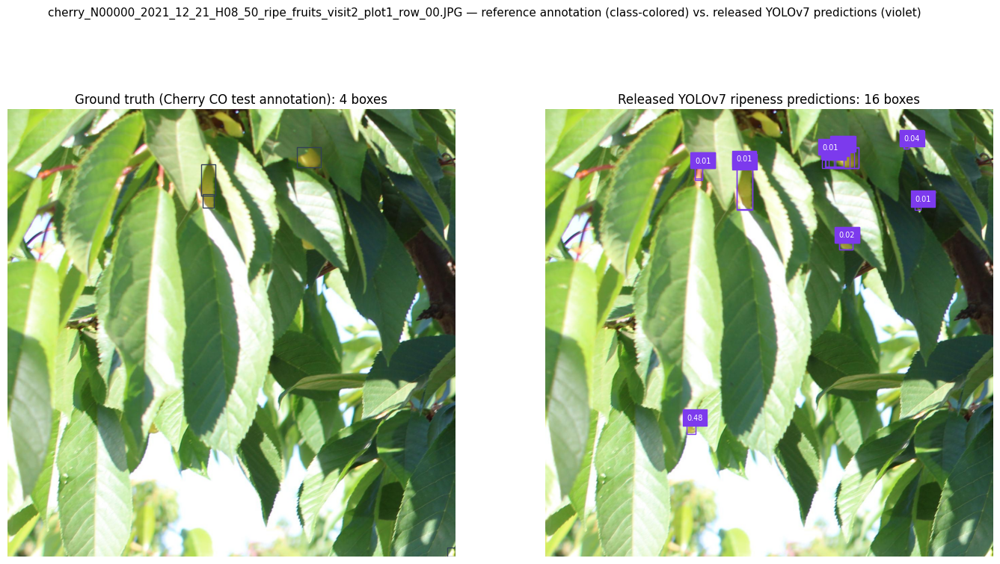
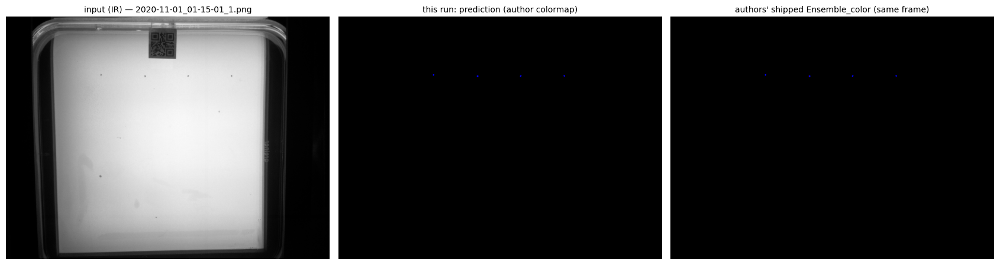
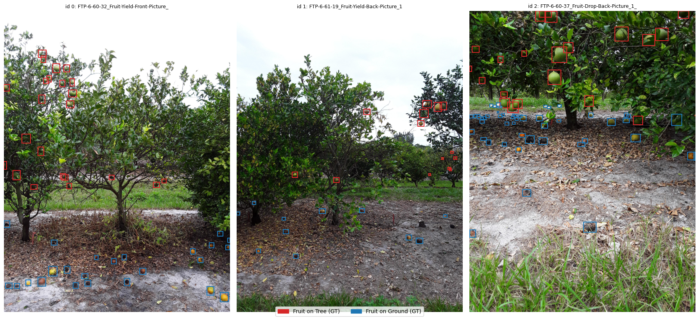
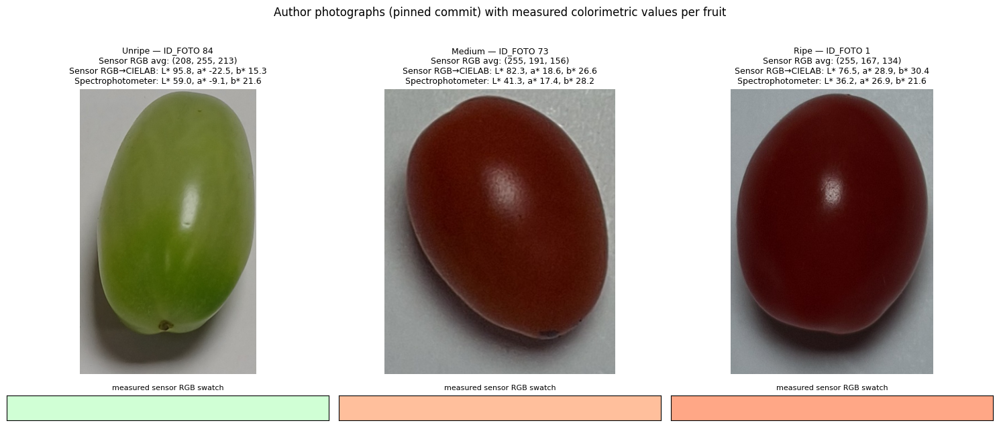
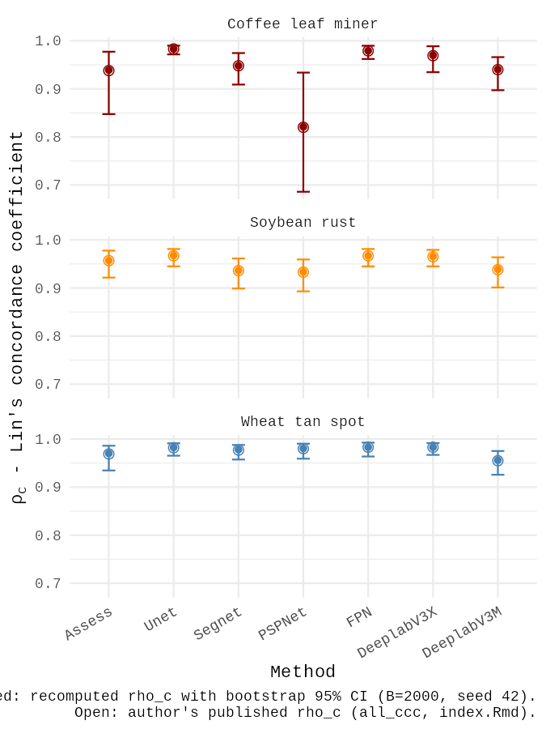
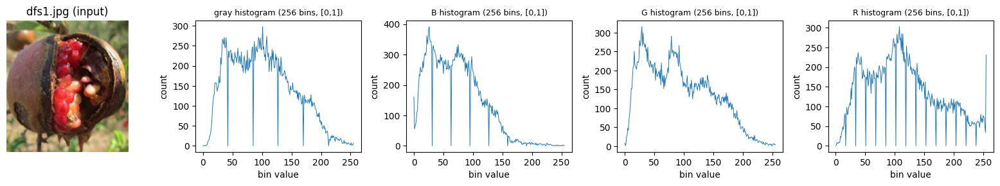
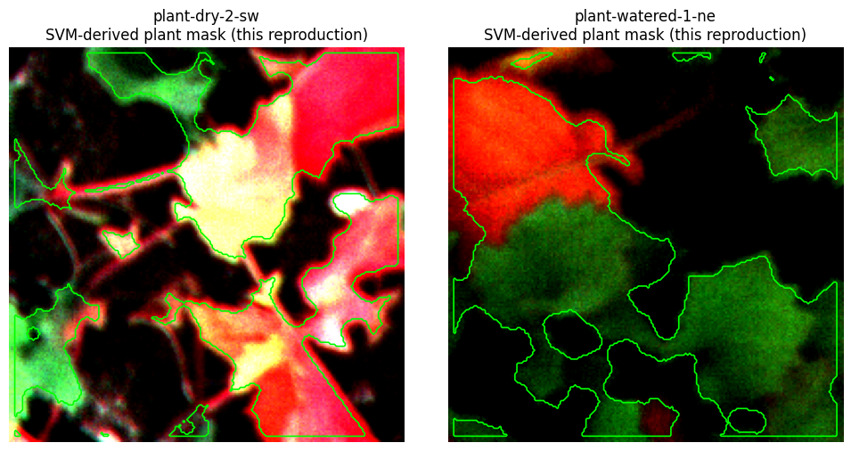

# Notebook catalog — page 2 of 6

[README / notebook index](../README.md#notebooks) · [Previous](page-001.md) · [Next](page-003.md)

Alphabetical entries 51–100 of 290. Generated from publication.json; includes generation conditions and execution previews.

| Paper and run details | Preview |
| --- | --- |
| **Benchmarking Phenotypic Clustering Algorithms via Empirically Calibrated Simulations: A Diagnostic Framework to Improve Biodiversity Assessment in Neglected Crops** <b>Journal:</b> Journal not supplied <b>Authors:</b> Naino Jika AK. public_id: <code>p-7eee532480e40ef516c03c17bdc802e7</code>        <b>Generated with:</b> OpenCode · spark-local/GLM-5.3-Flash-EXL3 · variant: low <b>Demonstration:</b> Runs the author&#x27;s original R pipeline (Zenodo 15877863) for the realistic fonio-calibrated scenario: 100 repetitions x 11 clustering algorithms with ARI/NMI/Silhouette/Davies-Bouldin, confirming near-random recovery (max mean ARI 0.044); the fonio raw dataset is not archived, so calibration uses the published trait statistics in params.R.  <b>Semantic tags:</b> task:classification |  Mean clustering performance under the realistic fonio-calibrated simulation (100 repetitions), computed with the author&#x27;s result_analysis.R: all 11 methods score near random (ARI well below 0.1). |
| **Biomechanical phenotyping pipeline for stalk lodging resistance in maize.** <b>Journal:</b> MethodsX <b>Authors:</b> Kaitlin Tabaracci · Norbert Bokros · Yusuf Oduntan · Bharath Kunduru · Joseph DeKold · Endalkachew Mengistie · Armando G. McDonald · Christopher J. Stubbs · Rajandeep S. Sekhon · Seth DeBolt · Daniel J. Robertson public_id: <code>p-027ec3986a9b1bed36d090ca31702f07</code>        <b>Generated with:</b> OpenCode · spark-local/GLM-5.3-Flash-EXL3 · variant: low <b>Demonstration:</b> Reproduces the InterMeas internode-length pipeline (blue-mat crop, YOLOv5m node detection with the authors&#x27; torchscript weight, pixel-to-cm conversion with z-score outlier check) on 3 author example stalks on CPU; the R conversion step is a headless Python port and only 3 of 48 example images are used.  <b>Semantic tags:</b> crop:maize, environment:field, environment:laboratory, organ:stem, task:morphology, trait:stress_response |  Detected nodes (red) and internode lengths in cm (cyan) overlaid on the cropped example stalks K21_408003-02/-03/-04 |
| **Breedbase: a digital ecosystem for modern plant breeding.** <b>Journal:</b> G3 (Bethesda, Md.) <b>Authors:</b> Morales N, Ogbonna AC, Ellerbrock BJ, Bauchet GJ, Tantikanjana T, Tecle IY, Powell AF, Lyon D, Menda N, Simoes CC, Saha S, Hosmani P, Flores M, Panitz N, Preble RS, Agbona A, Rabbi I, Kulakow P, Peteti P, Kawuki R, Esuma W, Kanaabi M, Chelangat DM, Uba E, Olojede A, Onyeka J, Shah T, Karanja M, Egesi C, Tufan H, Paterne A, Asfaw A, Jannink JL, Wolfe M, Birkett CL, Waring DJ, Hershberger JM, Gore MA, Robbins KR, Rife T, Courtney C, Poland J, Arnaud E, Laporte MA, Kulembeka H, Salum K, Mrema E, Brown A, Bayo S, Uwimana B, Akech V, Yencho C, de Boeck B, Campos H, Swennen R, Edwards JD, Mueller LA. public_id: <code>p-6969756b25d1518115626bfbea413f28</code>        <b>Generated with:</b> OpenCode · spark-local/GLM-5.3-Flash-EXL3 · variant: low <b>Demonstration:</b> Live read-only BrAPI v2 queries against the flagship Cassavabase Breedbase instance (serverinfo, programs incl. IITA, trials/germplasm totals, cyanide trait variables) compared with the paper&#x27;s 2022 figures; local Docker deployment is documented but not executed.  <b>Semantic tags:</b> task:visualization |  Live Cassavabase BrAPI v2 totalCount values (germplasm, trials) observed from the validated Colab CPU run |
| **Central object segmentation by deep learning for fruits and other roundish objects** <b>Journal:</b> arXiv <b>Authors:</b> Motohisa Fukuda · Takashi Okuno · Shinya Yuki public_id: <code>p-bca1dffe8b831525417a430bec348e04</code>        <b>Generated with:</b> Generation conditions not recorded <b>Demonstration:</b> Executed the authors&#x27; pinned CROP inference pipeline (D4-averaged, eleven-scale median) with the release-v1.0 dictionary on one author sample image, reporting pixel size and center of mass; single-image demonstration only, dataset-level accuracy untested.  <b>Semantic tags:</b> modality:rgb, organ:fruit, task:morphology, task:segmentation, task:time_series |  Author sample input 338_i.png with CROP&#x27;s measured center-of-mass marker (blue square) drawn on the original photo |
| **Cherry CO Dataset: A Dataset for Cherry Detection, Segmentation and Maturity Recognition** <b>Journal:</b> IEEE Robotics and Automation Letters <b>Authors:</b> Luis Cossio-Montefinale · Javier Ruíz-del-Solar · Rodrigo Verschae public_id: <code>p-3ca72f400e86485e3f370832f8d1b867</code>        <b>Generated with:</b> OpenCode 1.18.34 · spark-local/GLM-5.3-Flash-EXL3 · variant: high · reasoning effort: high <b>Demonstration:</b> Re-scores the authors&#x27; released YOLOv7 ripeness predictions against the official Cherry CO COCO test annotations with their own parsing code and COCOeval parameterization (evaluation-only partial reproduction; no training or inference; paper tables unread).  <b>Semantic tags:</b> crop:cherry, environment:field, organ:fruit, task:classification, task:object_detection, task:segmentation, trait:reproductive_traits |  Test image cherry_N00000_2021_12_21_H08_50_ripe_fruits_visit2_plot1_row_00: Cherry CO ground-truth ripeness boxes (class-colored) vs. the authors&#x27; released YOLOv7 predictions (violet, with confidence). |
| **ChronoRoot 2.0: An Open AI-Powered Platform for 2D Temporal Plant Phenotyping** <b>Journal:</b> CONICET Digital (CONICET) <b>Authors:</b> Rafael Nicolás Gaggion Zulpo · Rodrigo Bonazzola · María Florencia Legascue · María Florencia Mammarella · Florencia S. Rodríguez · Federico Emanuel Aballay · Florencia Belén Catulo · Andana Fleur Jami Charlotte Barrios · Franco Accavallo · Santiago Nahuel Villarreal · Martin Crespi · Martiniano M. Ricardi · Ezequiel Petrillo · Thomas Blein · Federico Ariel · Enzo Ferrante public_id: <code>p-ca7ab4f349f060f9c51e0a3ab1a29e14</code>       <b>Generated with:</b> OpenCode 1.18.34 · spark-local/GLM-5.3-Flash-EXL3 · variant: high · reasoning effort: high <b>Demonstration:</b> Runs the authors&#x27; Segmentation App CLI (nnU-Net Arabidopsis fold-0 inference plus alpha=0.85 temporal post-processing) on a 6-frame subset of the official rpi101_roots demo series and compares the masks with the authors&#x27; shipped reference outputs.  <b>Semantic tags:</b> crop:arabidopsis, organ:root, organ:whole_plant, task:morphology, task:time_series, task:tracking, trait:architecture, trait:growth_development, trait:root_architecture |  Demo IR input (left) with this run&#x27;s predicted mask (center) and the authors&#x27; shipped Ensemble_color reference (right) for the same frame; author colormap. |
| **CitDet: A Benchmark Dataset for Citrus Fruit Detection** <b>Journal:</b> arXiv <b>Authors:</b> Jordan A. James · Heather K. Manching · Matthew R. Mattia · Kim D. Bowman · Amanda M. Hulse-Kemp · William J. Beksi public_id: <code>p-aec5f4a3b637086223a53c458d9c0bd3</code>        <b>Generated with:</b> OpenCode 1.18.34 · spark-local/GLM-5.3-Flash-EXL3 · variant: high · reasoning effort: high <b>Demonstration:</b> Partial reproduction: downloads the CitDet test split, verifies the paper&#x27;s dataset statistics against the actual COCO annotations, previews expert ground-truth boxes, and runs a clearly-labeled untrained COCO-pretrained Faster R-CNN baseline through the author&#x27;s eval_coco_json.py path; the paper&#x27;s fine-tuned AP benchmarks and yield estimation are not reproduced.  <b>Semantic tags:</b> crop:citrus, environment:field, organ:fruit, task:object_detection, task:yield_biomass, trait:yield |  CitDet test images with expert ground-truth bounding boxes (red: Fruit on Tree, blue: Fruit on Ground) |
| **Clustering-Guided Multi-Layer Contrastive Representation Learning for Citrus Disease Classification** <b>Journal:</b> arXiv <b>Authors:</b> Jun Chen · Yonghua Yu · Weifu Li · Yaohui Chen · Hong Chen public_id: <code>p-2e8c3a2843f22434ab184e04160afc16</code>        <b>Generated with:</b> OpenCode · spark-local/GLM-5.3-Flash-EXL3 · variant: high <b>Demonstration:</b> Executed the authors&#x27; CMCRL self-supervised pre-training (jaccard-DBSCAN pseudo-labels plus cluster-centroid InfoNCE on ResNet50-IBN) on 485 CDD leaf images for 10 epochs and evaluated a frozen-encoder linear probe on 124 held-out images (top-1 91.1% vs 33.1% random init), below the paper&#x27;s full-scale 93.8% because of the reduced schedule.  <b>Semantic tags:</b> crop:citrus, task:classification, trait:disease_symptoms |  CDD leaf training-split samples per class (original inputs, 485-image pre-training subset) |
| **Colony-Level 3D Photogrammetry Reveals That Total Linear Extension and Initial Growth Do Not Scale With Complex Morphological Growth in the Branching Coral, Acropora cervicornis** <b>Journal:</b> Frontiers in Marine Science <b>Authors:</b> Wyatt C. Million · Sibelle O’Donnell · Erich Bartels · Carly D. Kenkel public_id: <code>p-570151845380c4fdd6aa3762be2973f3</code>        <b>Generated with:</b> OpenCode · spark-local/GLM-5.3-Flash-EXL3 · variant: low <b>Demonstration:</b> Re-computed the paper&#x27;s trait-growth statistics (Kendall&#x27;s tau, polynomial TLE-Vinter fits, field-vs-3D TLE validation) from the authors&#x27; published 156-colony phenotype table; adapted Python translation of unpublished R code, one breakage-exclusion discrepancy documented.  <b>Semantic tags:</b> environment:field, modality:photogrammetry, task:morphology, task:reconstruction, task:time_series, trait:architecture, trait:growth_development |  Second-order polynomial fit of growth in Vinter vs growth in TLE (0-6 and 6-12 months), reproduced from the published phenotype table |
| **Color Sensor for the Determination of the Ripening Stage of Cherry Tomatoes** <b>Journal:</b> Journal not supplied <b>Authors:</b> Vandeir Aniceto Pinheiro public_id: <code>p-2cb18c0c533d73995c27418d988c8078</code>        <b>Generated with:</b> OpenCode 1.18.34 · spark-local/GLM-5.3-Flash-EXL3 · variant: high · reasoning effort: high <b>Demonstration:</b> Reruns the authors&#x27; full preprocessing, colorimetric-calibration and decision-tree pipeline on all 130 cherry-tomato samples (89.1% dE reduction vs claimed 89.6%), CPU only; hardware and firmware generation are out of scope.  <b>Semantic tags:</b> crop:tomato, environment:laboratory, modality:rgb, organ:fruit, task:classification, trait:pigment_color |  Author photographs of three cherry tomatoes (Unripe, Medium, Ripe) labeled with their measured sensor RGB, RGB-to-CIELAB conversion and spectrophotometer reference values |
| **Color Sensor for the Determination of the Ripening Stage of Cherry Tomatoes** <b>Journal:</b> Journal not supplied <b>Authors:</b> Vandeir Aniceto Pinheiro public_id: <code>p-30b2f0e3a292ceea837204361f928619</code>        <b>Generated with:</b> OpenCode 1.18.34 · spark-local/GLM-5.3-Flash-EXL3 · variant: high · reasoning effort: high <b>Demonstration:</b> Reproduces the full software pipeline (RGB-to-CIELAB preprocessing, K-Means labeling, linear calibration retraining, depth-3 decision tree, three-scenario evaluation and ATmega C-header generation) on the authors&#x27; released 130-record cherry-tomato dataset; the release postdates the authors&#x27; saved 119-record notebook outputs, so headline metrics are quantified for both versions.  <b>Semantic tags:</b> crop:tomato, environment:laboratory, modality:rgb, organ:fruit, task:classification, trait:pigment_color |  Cherry-tomato photographs from photos_tomato/ (pinned commit 2678cf6), one per K-Means ground-truth maturity stage, labeled with ID_FOTO, image format and measured average CIELAB coordinates. |
| **Combining computer vision and deep learning to enable ultra-scale aerial phenotyping and precision agriculture: A case study of lettuce production.** <b>Journal:</b> Horticulture research <b>Authors:</b> Bauer A, Bostrom AG, Ball J, Applegate C, Cheng T, Laycock S, Rojas SM, Kirwan J, Zhou J. public_id: <code>p-7d1d3ea16f792f95af52018cdc953137</code>        <b>Generated with:</b> OpenCode · spark-local/GLM-5.3-Flash-EXL3 · variant: low <b>Demonstration:</b> Executed the AirSurf-Lettuce detection pipeline (CLAHE pre-processing, 20x20 sliding-window CNN with NMS, k-means size classification, harvest grid and 3D chart) on one author sample region; single-sample scope only, GPS tagging omitted.  <b>Semantic tags:</b> crop:lettuce, environment:aerial, environment:field, modality:spectral, organ:whole_plant, task:classification, task:counting, task:morphology, trait:yield |  AirSurf-L size-classification overlay on sample_region1.png: model predictions coloured blue (small), green (medium), red (large). |
| **Combining Local and Global Viewpoint Planning for Fruit Coverage** <b>Journal:</b> arXiv <b>Authors:</b> Tobias Zaenker · Chris Lehnert · Chris McCool · Maren Bennewitz public_id: <code>p-b5b3ac3433945ba4a283ae8f5ad3f177</code>        <b>Generated with:</b> OpenCode · spark-local/GLM-5.3-Flash-EXL3 · variant: low <b>Demonstration:</b> Partial reproduction of the ground-truth fruit-ROI pipeline of arXiv:2108.08114 (ECMR 2021) on the authors&#x27; pinned octree data: OctoMap .bt parsing, Scenario-1 (world14) GT reconstruction and per-fruit statistics; the ROS/Gazebo closed-loop planning itself is not reproduced and the viewpoint-utility section is an explicitly adapted illustration.  <b>Semantic tags:</b> environment:laboratory, modality:rgbd, organ:fruit, task:reconstruction, trait:reproductive_traits |  Input preview: author VG07_6 capsicum plant voxelization (grey) with reference fruit ROI cells (red), from the pinned .bt ground-truth files. |
| **Components of Water Use Efficiency Have Unique Genetic Signatures in the Model C 4 Grass Setaria .** <b>Journal:</b> PLANT PHYSIOLOGY <b>Authors:</b> Max Feldman · Patrick Z. Ellsworth · Noah Fahlgren · Malia Gehan · Asaph B. Cousins · Ivan Baxter public_id: <code>p-55cecb890eeed28624a594bf7f6f2af7</code>        <b>Generated with:</b> OpenCode · spark-local/GLM-5.3-Flash-EXL3 · variant: low <b>Demonstration:</b> Recomputes the Setaria WUE trait derivation: daily evapotranspiration with empty-pot correction, zoom-calibrated side-view plant area, loess smoothing, and WUEratio, WUEfit, WUEresidual from the authors&#x27; deposited data. The wet-treatment size-water-use correlation at 21 to 27 DAP reproduces the reported r greater than 0.94. QTL mapping and lme4 heritability are out of scope.  <b>Semantic tags:</b> crop:millet, organ:whole_plant, task:physiology, task:time_series, trait:growth_development, trait:water_status |  Pearson correlation of loess-smoothed plant size with water use by days after planting, left, and genotype-specific WUEresidual variability, right. Wet treatment matches the paper correlation greater than 0.94 at 21 to 27 DAP. |
| **Computer Vision Approach for Phenotypic Characterization of Horticultural Crops** <b>Journal:</b> Journal of Bio-Environment Control <b>Authors:</b> Seungri Yoon · Minju Shin · Jin Hyun Kim · Ho Jeong Jeong · Junyoung Park · Tae In Ahn public_id: <code>p-03f7bc9fab12994c7bbe235d3f6a75c6</code>        <b>Generated with:</b> OpenCode 1.18.34 · spark-local/GLM-5.3-Flash-EXL3 · variant: high · reasoning effort: high <b>Demonstration:</b> Single-example CPU reproduction of the KSBEC 2024 tomato pipeline on the author&#x27;s own greenhouse photo: released SVM exercised on author-style HOG features and HSV detection + mean-hue ripeness rating; qualitative only, the paper reports no quantitative metrics.  <b>Semantic tags:</b> crop:melon, crop:pepper, crop:tomato, environment:greenhouse, modality:rgb, modality:rgbd, organ:flower, organ:fruit, task:classification, task:object_detection, trait:pigment_color, trait:reproductive_traits |  Input tomato_test1.jpg (author greenhouse photo) beside the pipeline&#x27;s largest tomato detection with its mean-hue ripeness label (Unmature, hue 18.1). |
| **Computer vision approach to characterize size and shape phenotypes of horticultural crops using high-throughput imagery** <b>Journal:</b> Computers and Electronics in Agriculture <b>Authors:</b> Samiul Haque · Edgar Lobatón · Natalie G. Nelson · G. Craig Yencho · Kenneth V. Pecota · Russell Mierop · Michael W. Kudenov · Mike Boyette · Cranos Williams public_id: <code>p-416be65b376f5b29b11774a0a72ea1f5</code>        <b>Generated with:</b> OpenCode · spark-local/GLM-5.3-Flash-EXL3 · variant: low <b>Demonstration:</b> Reproduces the paper&#x27;s binary U.S. No. 1 vs Cull sweetpotato shape classifier from the 73-variable S3_Data.csv feature table using the author&#x27;s own Random Forest and MLP notebooks (fresh CPU run: RF 0.715, NN 0.794 holdout accuracy vs author-recorded 0.730/0.775); 3D reconstruction/feature extraction is out of scope because the NIR sorter images are unreleased, and the paper&#x27;s SAS Viya champion (84.59%) is reported as context only. |  Input preview from S3_Data.csv: class counts (U.S. No. 1 vs Cull) and distributions of the two key scalar features (Curvature, LWRatio) by class. |
| **Converging functional phenotyping with systems mapping to illuminate the genotype-phenotype associations.** <b>Journal:</b> Horticulture research <b>Authors:</b> Sun T, Shi Z, Jiang R, Moshelion M, Xu P. public_id: <code>p-f883e21e50d48220be739f6cefc2f867</code>        <b>Generated with:</b> OpenCode · spark-local/GLM-5.3-Flash-EXL3 · variant: low <b>Demonstration:</b> Executes the authors&#x27; own R pipeline on the committed 96-plant cowpea TR-VWC drought data, reproducing the Figure 1B loess dynamics and the two-equation Legendre/RK4 ODE fit (Figure 2 analog); the genome-wide 24-SNP association is not covered by available code or data.  <b>Semantic tags:</b> task:physiology, task:reconstruction, task:time_series |  Reproduced Figure 1B analog (loess-smoothed VWC and transpiration means, 96 cowpea plants, 6 drought days) side by side with the authors&#x27; committed reference PDF. |
| **CoverageTool: A semi-automated graphic software: applications for plant phenotyping** <b>Journal:</b> Plant Methods <b>Authors:</b> Merchuk-Ovnat L, Ovnat Z, Amir-Segev O, Kutsher Y, Saranga Y, Reuveni M. public_id: <code>p-2ef7965b4468bbda8e86cda4aec579ae</code>        <b>Generated with:</b> OpenCode · spark-local/GLM-5.3-Flash-EXL3 · variant: low <b>Demonstration:</b> AI-assisted Python re-implementation of CoverageTool&#x27;s documented color-metric coverage/PSA calculation applied to the paper&#x27;s Additional file 5 wheat flag-leaf scan (RGB tolerance 40: 16.23 percent coverage, 104.07 cm2 at 200 DPI); the Windows GUI binary itself cannot run in Colab.  <b>Semantic tags:</b> organ:leaf, organ:root, organ:whole_plant, task:morphology, trait:leaf_traits, trait:pigment_color, trait:root_architecture |  Additional file 5 wheat flag-leaf scan (left) beside the executed RGB tolerance-40 foreground mask (right, red) computed with the paper&#x27;s documented metric. |
| **Crop Height and Plot Estimation for Phenotyping from Unmanned Aerial Vehicles using 3D LiDAR** <b>Journal:</b> arXiv <b>Authors:</b> Harnaik Dhami · Kevin Yu · Tianshu Xu · Qian Zhu · Kshitiz Dhakal · James Friel · Song Li · Pratap Tokekar public_id: <code>p-661ca6372a08bb11eab9cb4cf0f75a61</code>        <b>Generated with:</b> OpenCode · spark-local/GLM-5.3-Flash-EXL3 · variant: low <b>Demonstration:</b> Executed the pinned author farm_generation.py (IROS 2020 Sec. V) on CPU to generate and validate a randomized Gazebo soybean farm (2700 plants, Delaunay terrain, per-plot height CSV); LiDAR height-estimation pipeline and commercial plant meshes are not reproduced.  <b>Semantic tags:</b> crop:wheat, environment:aerial, environment:field, modality:point_cloud, organ:whole_plant, task:morphology, trait:plant_height |  Generated farm outputs: randomized Delaunay terrain vertices colored by elevation (left) and 2700 soybean plant positions colored by terrain-adjusted pose Z (right) |
| **CVRP: A rice image dataset with high-quality annotations for image segmentation and plant phenomics research.** <b>Journal:</b> Plant Phenomics <b>Authors:</b> Zhiyan Tang · Jiandong Sun · Yunlu Tian · Jiexiong Xu · Weikun Zhao · Gang Jiang · Jiaqi Deng · Xiangchao Gan public_id: <code>p-c2a47db78f63545f233b669b0d53bca4</code>        <b>Generated with:</b> OpenCode · spark-local/GLM-5.3-Flash-EXL3 · variant: low <b>Demonstration:</b> Single-image partial reproduction: the authors&#x27; released Mask2Former checkpoint and config segment rice panicles on their bundled sample T42_1220.jpg with the authors&#x27; app.py inference/overlay logic; environment adapted (Python 3.11 venv, torch 2.1.2, mmcv 2.1.0, mmsegmentation 1.2.2) and no benchmark metrics re-measured.  <b>Semantic tags:</b> crop:rice, environment:field, environment:laboratory, organ:inflorescence, organ:seed, organ:whole_plant, task:counting, task:reconstruction, task:segmentation |  CVRP sample T42_1220.jpg with the released Mask2Former panicle prediction: input, red panicle mask, and authors&#x27;-style overlay |
| **Deep aerenchyma: a transformer-based pipeline for scalable phenotyping of rice root aerenchyma lacunae across environments.** <b>Journal:</b> Plant Methods <b>Authors:</b> Hani Atef · Laura Fierro-Dominguez · Paula Andrea Lozano-Montaña · Sergi Navarro Sanz · Julie Bals · Benoît Clerget · Christophe Périn · Maria Camila Rebolledo · Romain Fernandez public_id: <code>p-0f6c6d73a489f456dd530c51fce2b6f8</code>        <b>Generated with:</b> Generation conditions not recorded <b>Demonstration:</b> Segmentation overlays for three rice-root images. Not a multi-environment dataset-scale evaluation.  <b>Semantic tags:</b> crop:rice, organ:root, organ:tissue, task:morphology, task:segmentation, trait:root_architecture |  Rice-root aerenchyma segmentation overlays |
| **Deep Convolutional Neural Networks for Palm Fruit Maturity Classification** <b>Journal:</b> arXiv <b>Authors:</b> Mingqiang Han · Chunlin Yi public_id: <code>p-5cc2e249d222fcf2cf282f904231bfae</code>        <b>Generated with:</b> OpenCode 1.18.34 · spark-local/GLM-5.3-Flash-EXL3 · variant: high · reasoning effort: high <b>Demonstration:</b> Retrained the paper&#x27;s baseline CNN, frozen ResNet50V2 and InceptionV3 classifiers for 40 epochs each on the authors&#x27; released 9,781-image five-class palm-fruit dataset on a Colab T4; test accuracies 78.9%/86.7%/85.7% landed within 0.5 points of the published transfer-learning results (86.41%/85.24%) with the shallow baseline above its 70.89% reference.  <b>Semantic tags:</b> crop:oil_palm, organ:fruit, task:classification, trait:reproductive_traits |  Labeled training samples from the authors&#x27; released data3.zip: one 224x224 generator batch with its true ripeness class above each image. |
| **Deep learning enables image-based tree counting, crown segmentation, and height prediction at national scale** <b>Journal:</b> PNAS Nexus <b>Authors:</b> Sizhuo Li · Martin Brandt · Rasmus Fensholt · Ankit Kariryaa · Christian Igel · Fabian Gieseke · Thomas Nord-Larsen · Stefan Oehmcke · Ask Holm Carlsen · Samuli Junttila · Xiaoye Tong · Alexandre d’Aspremont · Philippe Ciais public_id: <code>p-3dd3bdfbdecce562aa58a6f17a2d2362</code>        <b>Generated with:</b> OpenCode 1.18.34 · spark-local/GLM-5.3-Flash-EXL3 · variant: high · reasoning effort: high <b>Demonstration:</b> Pretrained RGB tree-counting and crown-segmentation inference on the authors&#x27; 1 km2 Danish example tile, reproducing their stored density/segmentation rasters (count 18,871.3 vs 18,871.1; density r=1.0000; seg IoU 0.99999) in ~5 min on T4; height model, training, and national scale are out of scope.  <b>Semantic tags:</b> environment:aerial, organ:whole_plant, task:counting, task:morphology, task:segmentation, trait:architecture, trait:plant_height |  Example tile RGB with the authors&#x27; stored crown segmentation (center) and this notebook&#x27;s predicted segmentation (right) |
| **Deep learning for interactive and automated inner retinal layer segmentation in OCT of patients with retinitis pigmentosa using limited training data** <b>Journal:</b> openRxiv <b>Authors:</b> Dorothea Laurence · Martin Schilling · Nina-Antonia Grimm · Emilie Macé · Sebastian Bemme · Constantin Pape public_id: <code>p-0ae0dbcc01aa432ef3cec43245e2765a</code>        <b>Generated with:</b> OpenCode 1.18.34 · spark-local/GLM-5.3-Flash-EXL3 · variant: high · reasoning effort: high <b>Demonstration:</b> Runs the paper&#x27;s released pretrained nnU-Net on one public Duke DME OCT B-scan to segment the 7 retinal layers and reproduce the author&#x27;s layer-thickness metric against the human annotation; a held-in training sample and pipeline sanity check, not a verification of the paper&#x27;s RP results (private UMG-RP data).  <b>Semantic tags:</b> task:segmentation |  Duke DME B-scan (Subject_01, slice 10) with the 7-layer segmentation predicted by the paper&#x27;s released nnU-Net model (CPU inference). |
| **Deep Learning for Plant Identification and Disease Classification from Leaf Images: Multi-prediction Approaches** <b>Journal:</b> ACM Computing Surveys <b>Authors:</b> Jianping Yao · Son N. Tran · Saurabh Garg · Samantha Sawyer public_id: <code>p-fd7a0342f94d7b79c11a77e475eba4c7</code>        <b>Generated with:</b> OpenCode · spark-local/GLM-5.3-Flash-EXL3 · variant: low <b>Demonstration:</b> Minimal GSMo-CNN (stacked multi-output CNN) demo on a 6-class Plant Village subsample; scaled-down, not comparable to the paper&#x27;s full 10-run benchmark.  <b>Semantic tags:</b> organ:leaf, task:classification, trait:disease_symptoms |  Plant Village input preview: one real leaf image per selected class (Apple/Apple scab, Apple/Black rot, Apple/healthy, Tomato/Late blight, Tomato/Leaf mold, Tomato/healthy). |
| **Deep learning models for semantic segmentation and automatic estimation of severity of foliar symptoms caused by diseases or pests** <b>Journal:</b> Center for Open Science <b>Authors:</b> Juliano de Paula Gonçalves · Francisco de Assis de Carvalho Pinto · Daniel Marçal de Queiroz · Flora Maria de Melo Villar · Jayme G.A. Barbedo · Emerson Medeiros Del Ponte public_id: <code>p-1ce9f387ecdb78ea36f45870fd9104ab</code>        <b>Generated with:</b> OpenCode 1.18.34 · spark-local/GLM-5.3-Flash-EXL3 · variant: high · reasoning effort: high <b>Demonstration:</b> Reproduces the severity-agreement subsection: Lin&#x27;s CCC, bias/scale/location shifts, RMSE and predicted-vs-reference plots for six CNN models and ASSESS 2.0 from the authors&#x27; per-model CSVs (CPU, R via Rscript); segmentation training/evaluation is out of scope and the CCC code is an AI reimplementation validated against the authors&#x27; published values (max diff 0.0012).  <b>Semantic tags:</b> crop:coffee, crop:soybean, crop:wheat, modality:rgb, organ:leaf, task:segmentation, task:stress_disease, trait:disease_symptoms |  Recomputed Lin&#x27;s concordance coefficients with bootstrap 95% CIs per CNN model and ASSESS 2.0 across coffee leaf miner, soybean rust and wheat tan spot, overlaid with the authors&#x27; published values (open circles). |
| **Deep learning-driven automatic counting of petal number in cut chrysanthemum inflorescence.** <b>Journal:</b> Plant Phenomics <b>Authors:</b> Shanpeng Xu · Jingshan Lu · Lian Ding · Fei Zhang · Fadi Chen · Zhenxing Wang · Sumei Chen · Weimin Fang · Zhiyong Guan public_id: <code>p-0b16d2f84472b2dd6f481c1da6690fee</code>        <b>Generated with:</b> OpenCode · spark-local/GLM-5.3-Flash-EXL3 · variant: low <b>Demonstration:</b> Runs the authors&#x27; released SE-CSRNet inference (test.py) on all 70 bundled chrysanthemum test images, comparing density-integral predicted counts against ground-truth .h5 density integrals (MAE 6.08, RMSE 9.42); training and RF calibration stages are not released and are out of scope.  <b>Semantic tags:</b> organ:flower, organ:inflorescence, task:counting, trait:reproductive_traits |  Authors&#x27; test image Q1-105_IMG_9614 with its ground-truth petal density map (integral = 21) overlaid. |
| **DeepPod: a convolutional neural network based quantification of fruit number in Arabidopsis** <b>Journal:</b> GigaScience <b>Authors:</b> Azam Hamidinekoo · Gina A. Garzón-Martínez · Morteza Ghahremani · Fiona Corke · Reyer Zwiggelaar · John H. Doonan · Chuan Lü public_id: <code>p-0d7cdc834f0208fdfc68b402628bdfd7</code>        <b>Generated with:</b> OpenCode · spark-local/GLM-5.3-Flash-EXL3 · variant: high <b>Demonstration:</b> Single-image DeepPod reproduction: the authors&#x27; verbatim Octave patching and silique counting with a converted pretrained DenseNet-40-12 classifier on one annotated GigaDB Set-1 scan (val_db 87.23% vs paper 86.80%); one example, not a dataset-level verification.  <b>Semantic tags:</b> crop:arabidopsis, organ:fruit, organ:inflorescence, organ:stem, task:annotation_qc, task:classification, task:counting, task:object_detection, task:segmentation, trait:reproductive_traits |  Selected GigaDB Set-1 scan AT025_392341_004 (left) with the authors&#x27; manual reference annotations: tip (red), base (blue), stem (gray) points (right). |
| **DeepStomata: Facial Recognition Technology for Automated Stomatal Aperture Measurement** <b>Journal:</b> bioRxiv <b>Authors:</b> Yosuke Toda · Shigeo Toh · Gildas Bourdais · Silke Robatzek · Dan Maclean · Toshinori Kinoshita public_id: <code>p-4471692ed96241966f8a065745f5ce8b</code>        <b>Generated with:</b> Generation conditions not recorded <b>Demonstration:</b> Stomata detections, four-class labels, and aperture overlays on one author-provided image. Paper-wide performance is not claimed.  <b>Semantic tags:</b> organ:stomata, task:classification, task:object_detection, task:segmentation, trait:stomatal_traits |  Detected stomata with aperture annotations |
| **Detection of Fast-Changing Intra-seasonal Vegetation Dynamics of Drylands Using Solar-Induced Chlorophyll Fluorescence (SIF)** <b>Journal:</b> Copernicus GmbH <b>Authors:</b> Jiaming Wen · Giulia Tagliabue · Micol Rossini · Francesco Pietro Fava · Cinzia Panigada · Lutz Merbold · Sonja Leitner · Ying Sun public_id: <code>p-efdfc8711913b8cea420633b3f6bd7b6</code>        <b>Generated with:</b> OpenCode 1.18.34 · spark-local/GLM-5.3-Flash-EXL3 · variant: high · reasoning effort: high <b>Demonstration:</b> Adapted partial CPU reproduction of Wen et al. 2025 regional SIF pipeline: TROPOSIF v2.1 L2B self-gridded to 0.15 deg / 8-day over three Horn-of-Africa dryland sub-regions, compared with GOSIF and CHIRPS precipitation; MODIS/MERRA-2/ESA-CCI/RTSIF inputs are excluded (gated or too large), so SIF yield and Tair/VPD/SM correlations are out of scope.  <b>Semantic tags:</b> environment:field, modality:fluorescence, organ:whole_plant, task:time_series, trait:growth_development, trait:photosynthesis |  Input preview: TROPOSIF v2.1 SIF (SIF_Corr_743, cloud fraction below 0.8, SZA below 70 deg) gridded to the 0.15-degree author grid for the 8-day period starting 2019-10-08, with the three sub-region bounding boxes. |
| **Detection of tree stress from sub-daily sap flow variability** <b>Journal:</b> Biogeosciences <b>Authors:</b> Anna T. Schackow · Susan C. Steele-Dunne · David T. Milodowski · Jean-Marc Limousin · Ana Bastos public_id: <code>p-b69eca42d55fc44cf901d348d34d6842</code>        <b>Generated with:</b> OpenCode 1.18.34 · spark-local/GLM-5.3-Flash-EXL3 · variant: high · reasoning effort: high <b>Demonstration:</b> Computes the paper&#x27;s daily SLOPE and AREA hysteresis metrics for the three focal SAPFLUXNET sites and replicates the Fig. 3 seasonal cycles and the Fig. 7 sampling-rate sensitivity; three focal sites only, without the full 15-site selection or extreme-cluster analyses.  <b>Semantic tags:</b> environment:field, organ:stem, organ:whole_plant, task:physiology, task:stress_disease, task:time_series, trait:stomatal_traits, trait:stress_response, trait:water_status |  Focal-site seasonal cycles of daily SLOPE (blue) and AREA (black): across-year median with 7-day rolling mean and IQR bands |
| **Development of a high-throughput field phenotyping rover optimized for size-limited breeding fields as open-source hardware** <b>Journal:</b> Ikushugaku zasshi <b>Authors:</b> Ken Kuroki · Kai Yan · Hiroyoshi Iwata · Kentaro K. Shimizu · Toshiaki Tameshige · Shuhei Nasuda · Wei Guo public_id: <code>p-c0fdebde1d5529f726acefa644e618fb</code>        <b>Generated with:</b> OpenCode · spark-local/GLM-5.3-Flash-EXL3 · variant: low <b>Demonstration:</b> COLMAP (pycolmap) SfM reconstruction of 20 nadir frames of one furrow from the UGVPP rover&#x27;s released center-camera data, with sparse point cloud, camera drive path, and reprojection check; per-plot EasyIDP extraction and the YOLOv5 heading branch are not reproduced.  <b>Semantic tags:</b> crop:wheat, environment:field, organ:whole_plant, task:classification, trait:growth_development |  Reprojected SfM 3D points (green) overlaid on input frame DSC02516.JPG (UGVPP center camera, pinned commit a266881) |
| **Development of Lightweight Deep Learning Model for Watermelon Disease Classification; Deployable to Mobile Device** <b>Journal:</b> Global Journal of Politics and Law Research <b>Authors:</b> Jesse Ugwu · Amr Ahmed public_id: <code>p-8f2b65434ad1d919bccfe12caf205ff8</code>        <b>Generated with:</b> OpenCode 1.18.34 · spark-local/GLM-5.3-Flash-EXL3 · variant: high · reasoning effort: high <b>Demonstration:</b> Trained the authors&#x27; two-phase MobileNetV2 watermelon-disease classifier (20 frozen + 30 fine-tune epochs) on the full 1,155-image dataset in a fresh Colab T4 session, reaching 0.97 validation accuracy vs the paper&#x27;s ~0.99; a single run is not dataset-level verification and the authors&#x27; no-seed pipeline varies per run.  <b>Semantic tags:</b> crop:watermelon, task:classification, trait:disease_symptoms |  Deterministic per-class input samples from the Watermelon Disease Recognition Dataset: original 3024x3024 captures vs 224x224 network input |
| **Differences in apple fruit shape are independent of fruit size** <b>Journal:</b> The Plant Phenome Journal <b>Authors:</b> Kylie DeViller · Daniel H. Chitwood · Sean Myles · Mao Li · Zoë Migicovsky public_id: <code>p-8c0429be8d5b0e6fba2bac19bdf09935</code>        <b>Generated with:</b> OpenCode 1.18.34 · spark-local/GLM-5.3-Flash-EXL3 · variant: high · reasoning effort: high <b>Demonstration:</b> Re-executed the paper&#x27;s central Spearman rank-correlation test with Bonferroni correction on the authors&#x27; released TableS1.csv via a base-R port of TableS2.R in Colab (CPU), confirming PC1 vs aspect ratio rho = -0.964 (p under 1e-15) and no significant PC1 correlation with area or harvest weight; the image-processing, GPA and REML pipeline was not re-run.  <b>Semantic tags:</b> crop:apple, organ:fruit, task:morphology |  Notebook-created scatter panels of accession-level PC1 against aspect ratio, fruit area, and harvest weight (n = 534), colored by aspect ratio as in the authors&#x27; Figure 5 styling. |
| **Digital Phenotyping in Plant Breeding: Evaluating Relative Maturity, Stand Count, and Plant Height in Dry Beans (Phaseolus vulgaris L.) via RGB Drone-Based Imagery and Deep Learning Approaches** <b>Journal:</b> Research Square <b>Authors:</b> Leonardo Volpato · Evan M. Wright · Francisco E. Gomez public_id: <code>p-7f085a3a8c238d6f2a7e0569b7ef521d</code>        <b>Generated with:</b> OpenCode 1.18.34 · spark-local/GLM-5.3-Flash-EXL3 · variant: high · reasoning effort: high <b>Demonstration:</b> Reproduces the paper&#x27;s traditional relative-maturity benchmark for the 2020 SVREC environment (584 plots x 6 UAV flights): the authors&#x27; matuRity LOESS/SEG days-to-maturity estimation run verbatim in R on the GLI time series rebuilt from the paper&#x27;s Zenodo dataset, validated against the authors&#x27; committed reference outputs and ground-truth metrics; the CNN-LSTM, stand-count and plant-height branches are out of scope.  <b>Semantic tags:</b> crop:common_bean, environment:aerial, environment:field, modality:point_cloud, modality:rgb, organ:whole_plant, task:counting, task:morphology, task:object_detection, task:segmentation, task:time_series, task:tracking, trait:architecture, trait:growth_development, trait:plant_height |  Ground-truth relative maturity vs DPM estimated by the authors&#x27; LOESS (left) and SEG (right) methods for 124 ground-truth plots of the 2020 SVREC environment (this run). |
| **DiSCount: computer vision for automated quantification of Striga seed germination.** <b>Journal:</b> Plant methods <b>Authors:</b> Masteling R, Voorhoeve L, IJsselmuiden J, Dini-Andreote F, de Boer W, Raaijmakers JM. public_id: <code>p-970513dc011c14d8207ae3d9cf35b642</code>        <b>Generated with:</b> OpenCode · spark-local/GLM-5.3-Flash-EXL3 · variant: low <b>Demonstration:</b> The authors&#x27; DiSCount YOLOv3 inference pipeline (epoch-9000 weights, P=0.06, 608x608) run verbatim on one author-supplied Zenodo test image, counting 52 seeds and 1 radicle (1.92% germination) identically on CPU and T4; single-image scope does not verify the paper&#x27;s dataset-level accuracy.  <b>Semantic tags:</b> environment:laboratory, organ:seed, task:counting, trait:growth_development |  DiSCount output on the Zenodo test image series1_27-1.png: input (left) and detections (right) with Seed boxes in magenta and Radicle boxes in green |
| **Domain‐independent adaptive histogram‐based features for pomegranate fruit and leaf diseases classification** <b>Journal:</b> CAAI Transactions on Intelligence Technology <b>Authors:</b> Mohanmuralidhar Prajwala · Prabhuswamy Prajwal Kumar · Shanubhog Maheshwarappa Gopinath · Palaiahnakote Shivakumara · Mahadevappa Basavanna · Daniel Lopresti public_id: <code>p-ebae12f1eb1e37fc5316ed57eba1723e</code>        <b>Generated with:</b> OpenCode 1.18.34 · spark-local/GLM-5.3-Flash-EXL3 · variant: high · reasoning effort: high <b>Demonstration:</b> Executed the paper&#x27;s feature-extraction subsection on all nine author test images (grey/B/G/R 256-bin histograms with full and half-split Chi-Square distances per Ap_Chi_ALLFeatures.py); the ANN/CNN classification stage is not reproduced (no weights in the repository).  <b>Semantic tags:</b> modality:rgb, organ:fruit, organ:leaf, task:classification, task:stress_disease, trait:disease_symptoms |  Author test image dfs1.jpg (fruit-class1) with its computed normalized grey, B, G and R histograms (256 bins over [0,1]) |
| **Drone phenotyping and machine learning enable discovery of loci regulating daily floral opening in lettuce** <b>Journal:</b> bioRxiv <b>Authors:</b> Han, R. · Wong, A. J. Y. · Tang, Z. · Truco, M. J. · Lavelle, D. O. · Kozik, A. · Jin, Y. · Michelmore, R. W. public_id: <code>p-86c185fe2f37a319f44e780d01bf0002</code>        <b>Generated with:</b> OpenCode · spark-local/GLM-5.3-Flash-EXL3 · variant: low <b>Demonstration:</b> Reproduces the paper&#x27;s SVM floral-pixel classification (HSV features, ~99% CV accuracy) and Bayesian peak floral-opening-time MCMC on the authors&#x27; bundled example data on a Colab CPU runtime, via the authors&#x27; own R code with rstan replacing the now-uninstallable rethinking front-end; upstream orthomosaic/plot-delineation, genotyping and QTL stages are out of scope.  <b>Semantic tags:</b> crop:lettuce, environment:aerial, organ:flower, task:segmentation, task:time_series, trait:growth_development |  Fitted Gaussian-like floral opening curves for the demo RILs (RIL51, RIL29, RIL214) over standardized floral pixel counts at hourly time points, estimated by MCMC in Colab. |
| **Drought Stress Detection in Juvenile Oilseed Rape Using Hyperspectral Imaging with a Focus on Spectra Variability** <b>Journal:</b> Remote Sensing <b>Authors:</b> Wiktor R. Żelazny · Jan Lukáš public_id: <code>p-d9dd30bad55e1f1258900ce0e831bf27</code>        <b>Generated with:</b> OpenCode 1.18.34 · spark-local/GLM-5.3-Flash-EXL3 · variant: high · reasoning effort: high <b>Demonstration:</b> Recomputes 20 vegetation indices from the deposited hyperspectral pot cubes, retrains the plant-mask SVM from the authors&#x27; hand labels, and refits the Bayesian means/SDs models in PyMC; mean contrasts match the paper while some sigma-ratio magnitudes are attenuated. CPU-only minimal reproduction; full-spectrum PCA and SVM tuning are out of scope.  <b>Semantic tags:</b> crop:rapeseed, modality:spectral, organ:leaf, task:stress_disease, trait:pigment_color, trait:stress_response |  Pseudo-RGB input pot cubes with the SVM-derived plant mask (green contour) retrained in this reproduction from the authors&#x27; hand labels |
| **Drought stress detection technique for wheat crop using machine learning** <b>Journal:</b> PeerJ Computer Science <b>Authors:</b> Gupta A, Kaur L, Kaur G. public_id: <code>p-ead632fb0835e0a94127f2d9adc08be6</code>        <b>Generated with:</b> OpenCode · spark-local/GLM-5.3-Flash-EXL3 · variant: low <b>Demonstration:</b> Reproduces the paper&#x27;s nine Table-3-tuned water-stress classifiers on the authors&#x27; deposited 17,328x32 wheat CF feature matrix with 10-fold CV (RF test AUC 0.9705 vs published 0.9116, ranking reproduced), plus a one-image TV-L1+min-max pre-processing demo; feature re-derivation and Cfit k-means segmentation are out of scope.  <b>Semantic tags:</b> crop:wheat, organ:whole_plant, task:classification, task:object_detection, task:segmentation, task:stress_disease, trait:stress_response |  Out-of-fold ROC curves of the nine reproduced classifiers (RF highlighted), generated from the deposited wheat stress feature matrix. |
| **Drought-Spec-Net: Early Tomato Drought Detection and Potential Yield-Impact Assessment Using Vis–NIR Data** <b>Journal:</b> bioRxiv <b>Authors:</b> Hossain, K. · Maiti, A. · Chinnannan, K. · Nimmakayala, P. · Sweeney, E. · Wang, Z. · Chiwele, N. · Khamboo, L. · Nallagari, L. M. · Bucksch, A. public_id: <code>p-6ae840df1b23fe0c8f41e6ec273e7230</code>        <b>Generated with:</b> OpenCode · spark-local/GLM-5.3-Flash-EXL3 · variant: low <b>Demonstration:</b> Recomputed plant-level RGB-derived DSI and healthy fraction for all 44 author-released ilastik masks using the authors&#x27; pinned, unmodified script on Colab CPU; spectral Drought-Spec-Net training and AgriLLaMA reporting are out of scope (no released weights).  <b>Semantic tags:</b> crop:tomato, environment:greenhouse, modality:rgb, modality:spectral, organ:whole_plant, task:classification, task:segmentation, task:stress_disease, trait:stress_response, trait:yield |  Original greenhouse tomato image with the author-supplied ilastik mask overlay (green=healthy 128, red=visibly stressed 255) |
| **DynG: a dynamic scaling factor for thermographic stomatal conductance estimation under changing environmental conditions.** <b>Journal:</b> New Phytologist <b>Authors:</b> Jiayu Zhang · Elias Kaiser · L.F.M. Marcelis · Silvère Vialet‐Chabrand public_id: <code>p-4dee69b3ba1b0df3a727a2497e7a59bd</code>        <b>Generated with:</b> OpenCode · spark-local/GLM-5.3-Flash-EXL3 · variant: low <b>Demonstration:</b> Verbatim R reproduction of DynG&#x27;s core conversion (Eqn 5/7 worked example, Eqn 8 theoretical artificial-leaf conductance) and exact re-derivation of the released DynG(t) series (max delta 1.1e-15); thermogram-based phenotype phases are not released and out of scope.  <b>Semantic tags:</b> crop:arabidopsis, modality:thermal, organ:leaf, organ:stomata, task:physiology, trait:stomatal_traits |  DynG(t) recomputed from the authors&#x27; released Ig data (author script, this run) overlaid on the authors&#x27; released DynG_results.csv; the two curves coincide. |
| **Earbox, an open tool for high-throughput measurement of the spatial organization of maize ears and inference of novel traits.** <b>Journal:</b> Plant methods <b>Authors:</b> Oury V, Leroux T, Turc O, Chapuis R, Palaffre C, Tardieu F, Prado SA, Welcker C, Lacube S. public_id: <code>p-116ad61400d168b145488899a4e023d4</code>        <b>Generated with:</b> OpenCode · spark-local/GLM-5.3-Flash-EXL3 · variant: low <b>Demonstration:</b> Runs the authors&#x27; MATLAB Earbox trait analyser headless in GNU Octave on two repository sample maize ears with precomputed DL2 grain masks, computing ear length, diameter, grains per row, ring counts and fertile/aborted zones; CNN inference is not reproduced (unpublished weights) and only 2 ears x face 1 are executed.  <b>Semantic tags:</b> crop:maize, environment:laboratory, organ:inflorescence, organ:seed, task:counting, task:morphology, task:segmentation, trait:architecture, trait:reproductive_traits, trait:stress_response |  Sample ear RGB input with the authors&#x27; precomputed DL2 grain-mask contours (reference annotation) for B1E10_1 and 13_29_WW_Hyb_08_46_c_1. |
| **EcoBOT: an AI/ML enabled automated phenotyping capability for model plants.** <b>Journal:</b> Frontiers in Plant Science <b>Authors:</b> Peter F. Andeer · Petrus H. Zwart · Daniela Ushizima · Marcus M. Noack · Lloyd T. Cornmesser · Thomas M. Vess · Zineb Sordo · Stephen Tan · Joseph Zorzi · Chelsea Hernandez · Vlastimil Novak · Yezhang Ding · John P. Vogel · Benjamin P. Bowen · James A. Sethian · Trent R. Northen public_id: <code>p-c23da1f44cefa8b2f9a86687e8c02a83</code>        <b>Generated with:</b> OpenCode 1.18.34 · spark-local/GLM-5.3-Flash-EXL3 · variant: high · reasoning effort: high <b>Demonstration:</b> Runs the EcoBOT paper&#x27;s RhizoNet root-segmentation step (author code 41e1b31d + released model_64 weights) end-to-end on six real unseen EcoFAB scans from RhizoNet Fig. 3 with convexification and biomass pixel counts; original 600-dpi scans are not public, so figure-derived inputs are shown to over-segment and accuracy is not verified.  <b>Semantic tags:</b> environment:laboratory, organ:root, task:stress_disease, task:time_series, task:yield_biomass, trait:biomass, trait:growth_development, trait:stress_response |  Unseen EcoFAB scans from RhizoNet Fig. 3: raw input, hand-annotated reference, and the executed model_64 root-mask overlay. |
| **Ensemble of BLUP, Machine Learning, and Deep Learning Models Predict Maize Yield Better Than Each Model Alone** <b>Journal:</b> Journal not supplied <b>Authors:</b> Kick DR, Washburn JD. public_id: <code>p-b8857f10f1bb9955b5001d4f6deb2885</code>        <b>Generated with:</b> OpenCode · spark-local/GLM-5.3-Flash-EXL3 · variant: low <b>Demonstration:</b> Partial reproduction of the ensemble-composition analyses (pairwise improvement probability, scaling Monte Carlo, genetic-algorithm search) from the authors&#x27; stored predictions for 6 of 8 model types; DNN-CO/DNN-SO predictions are not publicly archived.  <b>Semantic tags:</b> crop:maize, environment:field, task:yield_biomass, trait:yield |  Ensemble-scaling Monte Carlo from stored predictions (blue, 6 types) against the authors&#x27; stored per-model-type result curves (dashed). |
| **Estimating photosynthetic capacity from leaf reflectance and Chl fluorescence by coupling radiative transfer to a model for photosynthesis.** <b>Journal:</b> The New phytologist <b>Authors:</b> Vilfan N, van der Tol C, Verhoef W. public_id: <code>p-fa3906fba18509294e40956ca07453b8</code>        <b>Generated with:</b> OpenCode · spark-local/GLM-5.3-Flash-EXL3 · variant: low <b>Demonstration:</b> Runs the authors&#x27; pinned Fluspect MATLAB code (d6c2fad) under Octave to invert per-leaf PROSPECT parameters (Cab, Cdm, Cw, Cs, Cca, N) from the repository&#x27;s example measured leaf reflectance/transmittance — stage 1 of the paper&#x27;s Method 3; the full Vcmax retrieval is not reproducible (chamber/FluoWat data and coupled-inversion script unpublished).  <b>Semantic tags:</b> modality:fluorescence, modality:spectral, organ:leaf, task:physiology, trait:photosynthesis |  Leaf 1: measured reflectance and 1−transmittance (x) versus the Fluspect-fitted spectra from the pinned author code inverted in Octave |
| **Evaluating a Cassava Crop Growth Model by Optimizing Genotypic-Specific Parameters Using Multi-environment Trial Breeding Data** <b>Journal:</b> bioRxiv <b>Authors:</b> Okoma PM, Kayondo SS, Rabbi IY, Moreno-Cadena PL, Hoogenboom G, Jannink J. public_id: <code>p-c923a53ae672c6d7e6646c58272d8a8b</code>        <b>Generated with:</b> OpenCode · spark-local/GLM-5.3-Flash-EXL3 · variant: low <b>Demonstration:</b> Re-runs the calibrated DSSAT-MANIHOT-Cassava v4.8 model (built from official source) for 67 UYT clones across the paper&#x27;s 8 evaluation environments from the pinned author repository and recomputes per-cultivar r, RMSE and Willmott d against observed storage-root dry weight; the repository does not record which genotype-parameter variant produced its bundled comparison table, so the difference to the authors&#x27; bundled simulation is quantified rather than assumed to vanish.  <b>Semantic tags:</b> crop:cassava, environment:field, organ:root, task:preprocessing, task:yield_biomass, trait:yield |  Our DSSAT re-run (HWAM) vs the authors&#x27; bundled simulated storage-root dry weight (HWAMS), 460 paired points over 8 evaluation environments, 1:1 line shown |
| **Evaluating Neural Radiance Fields for 3D Plant Geometry Reconstruction in Field Conditions** <b>Journal:</b> Plant phenomics (Washington, D.C.) <b>Authors:</b> Arshad MA, Jubery T, Afful J, Jignasu A, Balu A, Ganapathysubramanian B, Sarkar S, Krishnamurthy A. public_id: <code>p-91751d0a207149359810682ae9e8d398</code>        <b>Generated with:</b> OpenCode · spark-local/GLM-5.3-Flash-EXL3 · variant: low <b>Demonstration:</b> Scenario I single-plant NeRFacto (reduced 2000-iter T4 training) with TLS-ground-truth point-cloud F1 evaluation; recall 0.654 at d=0.005 m, precision low because the paper&#x27;s manual evaluation-volume crop is not reproduced.  <b>Semantic tags:</b> environment:field, modality:neural_3d, modality:point_cloud, organ:whole_plant, task:morphology, task:object_detection, task:reconstruction, trait:architecture |  Scenario I: TLS ground-truth point cloud (green) vs NeRFacto reconstruction (red) after released-matrix + ICP alignment, with an input Polycam frame. |
| **Evaluation of a low-cost staining method for improved visualization of sweet potato whitefly (Bemisia tabaci) eggs on multiple crop plant species** <b>Journal:</b> Plant Methods <b>Authors:</b> Benjamin van Raalte · Kristal Watrous · Miguel Lujan · Ricky Le · Penglin Sun · Benjamin Ellis · Kerry E. Mauck public_id: <code>p-50e1c2fb18dfbb4e76ee141d512cf54b</code>        <b>Generated with:</b> OpenCode · spark-local/GLM-5.3-Flash-EXL3 · variant: low <b>Demonstration:</b> Runs the authors&#x27; archived R analysis and paired Wilcoxon tests on the Dryad egg-count data for melon, cowpea, and tomato (3 of 5 crops; cassava/sweet-potato scripts not archived).  <b>Semantic tags:</b> crop:cassava, crop:cowpea, crop:melon, crop:potato, crop:sweet_potato, crop:tomato, modality:microscopy, organ:leaf, task:counting, task:preprocessing, task:tracking, task:visualization, trait:stress_response |  Between-counter percent difference in egg counts before vs. after staining (melon), boxplot reproduced from the authors&#x27; archived R script (paper Fig. 3-style). |
| **Evaluation of Low-Cost Multi-Spectral Sensors for Measuring Chlorophyll Levels Across Diverse Leaf Types.** <b>Journal:</b> Sensors (Basel, Switzerland) <b>Authors:</b> Lopin P, Nawsang P, Laywisadkul S, Lopin KV. public_id: <code>p-64d8b1b4cd1285cfc9085533d39f04d1</code>        <b>Generated with:</b> OpenCode · spark-local/GLM-5.3-Flash-EXL3 · variant: low <b>Demonstration:</b> Partial reproduction: PLS regression (8 components) predicting banana-leaf total chlorophyll from AS7265x spectra with the authors&#x27; 200-repeat stratified-group cross-validation; validation R² 0.961±0.011, MAE 3.06 µg/cm². Only one of the paper&#x27;s 15 sensor×leaf combinations is executed.  <b>Semantic tags:</b> crop:banana, crop:mango, crop:rice, modality:spectral, organ:leaf, task:physiology, trait:pigment_color |  Predicted vs. measured banana-leaf chlorophyll (µg/cm²) from the authors&#x27; PLS pipeline under stratified-group CV |

[README / notebook index](../README.md#notebooks) · [Previous](page-001.md) · [Next](page-003.md)
