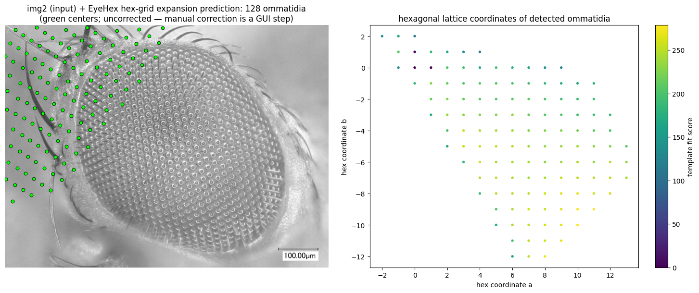
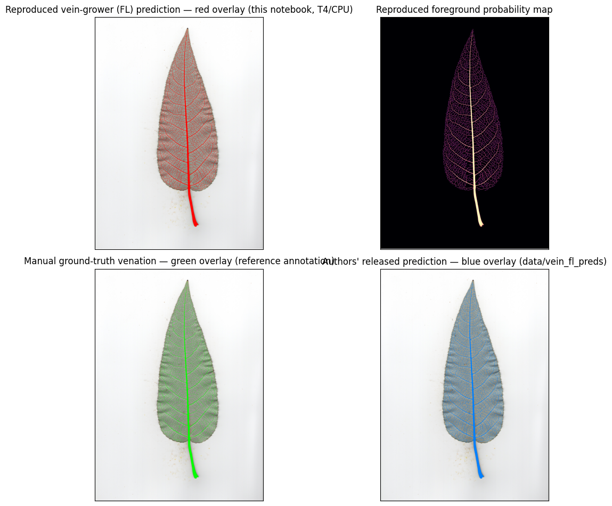
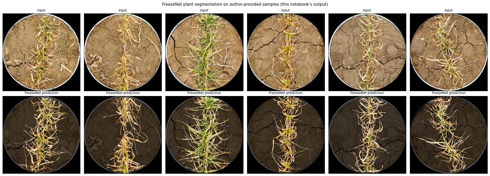
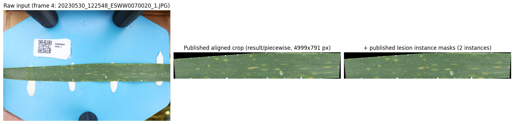
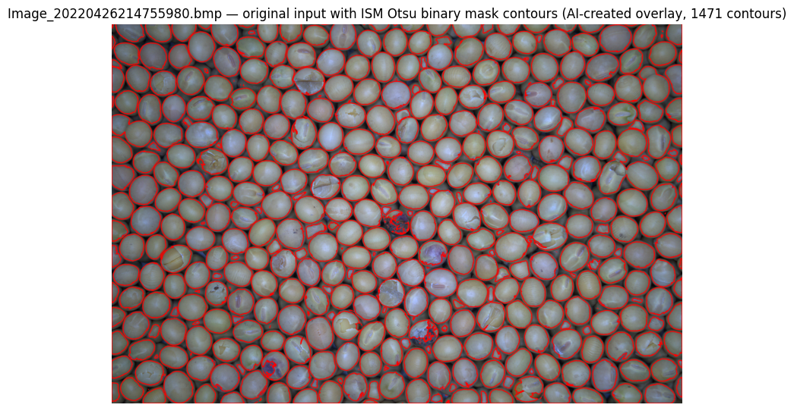

# Notebook catalog — page 3 of 6

[README / notebook index](../README.md#notebooks) · [Previous](page-002.md) · [Next](page-004.md)

Alphabetical entries 101–150 of 284. Generated from publication.json; includes generation conditions and execution previews.

| Paper and run details | Preview |
| --- | --- |
| **Explainable transformer framework for fast cotton leaf diagnostics and fabric defect detection.** <b>Journal:</b> iScience <b>Authors:</b> Rahman Swapno SMM, Sakib A, Uddin Khondakar Pranta AS, Hossain A, Debnath J, Al Noman A, Al Sakib A, Ahmed MR, Haque R, Appaji A. public_id: <code>p-2a57fe0d874b7f4710197a8f4ebaa5d4</code>        <b>Generated with:</b> OpenCode · spark-local/GLM-5.3-Flash-EXL3 · variant: low <b>Demonstration:</b> Single cotton leaf image classified with the author-shipped CottonLeafNet LEViT (levit_128s) and Grad-CAM overlay, following CottonVerse utils.py; one-sample demonstration, not a reproduction of the paper&#x27;s 10-fold metrics.  <b>Semantic tags:</b> crop:cotton, organ:leaf, task:classification, task:stress_disease, trait:disease_symptoms |  CottonLeafNet Healthy sample (author Kaggle dataset) with Grad-CAM overlay from the pinned LEViT model (prediction: Healthy 99.4%) |
| **EyeHex toolbox for complete segmentation of ommatidia in fruit fly eyes** <b>Journal:</b> Biology open <b>Authors:</b> Tran H, Dostatni N, Ramaekers A. public_id: <code>p-b7c6308752f1384cda7c2cd721d55453</code>        <b>Generated with:</b> OpenCode 1.18.34 · spark-local/GLM-5.3-Flash-EXL3 · variant: high · reasoning effort: high <b>Demonstration:</b> Headless CPU reproduction of the EyeHex segmentation phase on one brightfield sample image: the authors&#x27; Weka facet classifier and hexagonal-grid expansion ran on the authors&#x27; code with GUI steps replaced by their pinned reference seed and a deterministic seed search; the uncorrected count is a single-example plausibility result, not a validation of published accuracy.  <b>Semantic tags:</b> modality:microscopy, organ:fruit, task:counting, task:morphology, task:segmentation |  img2 sample input (grayscale) overlaid with the EyeHex hex-grid expansion prediction (green ommatidia centers) from the authors&#x27; classifier probability map. |
| **FedPome: federated deep learning for real-time pomegranate disease classification** <b>Journal:</b> Frontiers in plant science <b>Authors:</b> S L, C K AP, M A, V V, Krishna YH, Mohanty A. public_id: <code>p-dc32b44045d5a76d29a5d4826a91da83</code>        <b>Generated with:</b> OpenCode 1.18.34 · spark-local/GLM-5.3-Flash-EXL3 · variant: high · reasoning effort: high <b>Demonstration:</b> CPU inference with the authors&#x27; deployed ViT-B.onnx and exact app.py preprocessing on five real Mendeley dataset images (one per class); 5/5 matched folder labels at ~400-530 ms per image. Inference only - no federated training or accuracy benchmark.  <b>Semantic tags:</b> organ:fruit, organ:seed, task:classification, task:object_detection, trait:disease_symptoms |  Five real pomegranate fruit images from the paper&#x27;s Mendeley dataset with the deployed ViT-B.onnx model&#x27;s predicted class and confidence overlaid (green = matches the dataset folder label) |
| **Few-Shot Learning Enables Population-Scale Analysis of Leaf Traits in Populus trichocarpa** <b>Journal:</b> Plant Phenomics <b>Authors:</b> Lagergren J, Pavicic M, Chhetri HB, York LM, Hyatt D, Kainer D, Rutter EM, Flores K, Bailey-Bale J, Klein M, Taylor G, Jacobson D, Streich J. public_id: <code>p-2a008c1d33407a4fc692d3f464b17bc5</code>        <b>Generated with:</b> OpenCode 1.18.34 · spark-local/GLM-5.3-Flash-EXL3 · variant: high · reasoning effort: high <b>Demonstration:</b> Runs the authors&#x27; released vein-growing CNN (Focal Loss weights) on one held-out validation leaf-bottom scan (C_1_14_18_bot) and reproduces its vein segmentation, compared against the authors&#x27; released prediction and the manual ground-truth mask (Jaccard 0.6184); single example only, not the population-scale pipeline.  <b>Semantic tags:</b> crop:poplar, environment:field, modality:rgb, organ:leaf, task:morphology, task:segmentation, trait:leaf_traits |  Validation scan C_1_14_18_bot: reproduced vein-grower (Focal Loss) prediction overlay (red), predicted probability map, manual ground-truth venation (green), and the authors&#x27; released prediction (blue). |
| **FluoSpec 2-An Automated Field Spectroscopy System to Monitor Canopy Solar-Induced Fluorescence.** <b>Journal:</b> Sensors (Basel, Switzerland) <b>Authors:</b> Yang X, Shi H, Stovall A, Guan K, Miao G, Zhang Y, Zhang Y, Xiao X, Ryu Y, Lee JE. public_id: <code>p-922683b82a1bc389b720ed916b63b03e</code>        <b>Generated with:</b> OpenCode · spark-local/GLM-5.3-Flash-EXL3 · variant: low <b>Demonstration:</b> Runs the FluoSpec 2 author R post-processing (dark subtraction, nonlinearity correction, calibration to irradiance/radiance, reflectance, SF SIF retrieval) verbatim on the repository&#x27;s bundled 2017-05-02 QE-Pro/HR2000+ sample pair; single-example scope, hardware acquisition and SVD retrieval not covered.  <b>Semantic tags:</b> environment:field, modality:fluorescence, modality:spectroscopy, organ:whole_plant, task:physiology, task:preprocessing, trait:photosynthesis |  Calibrated QE-Pro spectra for the bundled 2017-05-02 sample: irradiance and radiance (mW m-2 sr-1 nm-1), reflectance, and SF-retrieved SIF in the 759-764 nm O2-A window. |
| **Foundation model-based apple ripeness and size estimation for selective harvesting** <b>Journal:</b> Computers and Electronics in Agriculture. <b>Authors:</b> Zhu K, Li J, Zhang K, Arunachalam C, Bhattacharya S, Lu R, Li Z. public_id: <code>p-91db2d982b94ef65fa927d29ad3b6a64</code>       <b>Generated with:</b> OpenCode · spark-local/GLM-5.3-Flash-EXL3 · variant: low <b>Demonstration:</b> Executed the authors&#x27; released Grounding-DINO + SAM ViT-H + 2D-LSeg pipeline on one UdL Fuji RGB-D test image (_MG_2657_24): 8 apples detected (5 ripe/3 unripe) with 2D-LSeg diameters 53.1-95.2 mm; single-example demonstration, not a dataset-level reproduction.  <b>Semantic tags:</b> crop:apple, modality:rgbd, organ:fruit, task:morphology, task:object_detection, trait:reproductive_traits |  Model predictions on _MG_2657_24: fine-tuned Grounding-DINO boxes (red=ripe, green=unripe), SAM ViT-H masks, and 2D-LSeg diameters (mm). Input from the authors&#x27; Kaggle dataset (GPL-3). |
| **Foundation Model-Based Apple Ripeness and Size Estimation for Selective Harvesting** <b>Journal:</b> arXiv <b>Authors:</b> Keyi Zhu · Jiajia Li · Kaixiang Zhang · Chaaran Arunachalam · Siddhartha Bhattacharya · Renfu Lu · Zhaojian Li public_id: <code>p-924191f1c63d31c8015fd5aea7c983a3</code>        <b>Generated with:</b> OpenCode 1.18.34 · spark-local/GLM-5.3-Flash-EXL3 · variant: high · reasoning effort: high <b>Demonstration:</b> Runs the author&#x27;s released inference pipeline (fine-tuned Grounding-DINO ripe/unripe detection, SAM ViT-H segmentation, six size-estimation algorithms) on one RGB-D apple sample; a single image does not verify dataset-level accuracy and no per-apple ground-truth sizes ship with the test split.  <b>Semantic tags:</b> crop:apple, modality:rgbd, organ:fruit, task:classification, task:morphology, task:object_detection, trait:growth_development, trait:reproductive_traits |  Sample _MG_2657_24 with SAM masks, Grounding-DINO ripe (red) / unripe (green) boxes, and estimated equatorial diameters in mm (2D-LSeg), produced by the author&#x27;s pipeline in this run. |
| **FQGR-net: Morphology-based litchi flower quantification and gender recognition.** <b>Journal:</b> Plant phenomics (Washington, D.C.) <b>Authors:</b> Li J, Ma Z, Lin J, Wang Q, Lin X, Xia J, Xin B. public_id: <code>p-3f9aa46c732dc37158c82721d4b77927</code>        <b>Generated with:</b> Generation conditions not recorded <b>Demonstration:</b> Predicted male/female flower-density maps and masks on two author-provided samples. Not the 1,150-image benchmark; the code repository declares no license.  <b>Semantic tags:</b> environment:field, organ:flower, task:classification, task:counting, trait:reproductive_traits |  Litchi flowers with male/female point annotations |
| **FreezeNet: A Lightweight Model for Enhancing Freeze Tolerance Assessment and Genetic Analysis in Wheat** <b>Journal:</b> Plant Phenomics <b>Authors:</b> Sun F, Yin M, Zheng S, Ma S, Ling HQ, He F, Jiang N. public_id: <code>p-8695d90dc25029eac651b1c2513552ca</code>       <b>Generated with:</b> OpenCode 1.18.34 · spark-local/GLM-5.3-Flash-EXL3 · variant: high · reasoning effort: high <b>Demonstration:</b> Executed the paper&#x27;s minimal phenotyping path (ring-crop, FreezeNet inference, HSV traits) on the 6 author sample images on CPU, matching the author&#x27;s own reference outputs within 0.012%; training, benchmark and GWAS are out of scope.  <b>Semantic tags:</b> crop:wheat, modality:rgb, organ:whole_plant, task:morphology, task:stress_disease, trait:pigment_color, trait:stress_response |  Author sample field images (top) with FreezeNet predicted plant masks overlaid (bottom); background dimmed, prediction from the paper-matched checkpoint. |
| **From field to sky: measurement and modeling of transgenic switchgrass pollen dispersal in the atmosphere** <b>Journal:</b> Environmental Monitoring and Assessment <b>Authors:</b> Nimmala M, Gruszewski HA, Hanlon R, Bilyeu L, Newton T, Stockdale J, Millwood RJ, Stewart CN, Powers CW, Ross SD, Foroutan H, Schmale Iii DG. public_id: <code>p-31395b78d4983e57d3118f644d1e91b1</code>        <b>Generated with:</b> OpenCode · spark-local/GLM-5.3-Flash-EXL3 · variant: low <b>Demonstration:</b> Executed the authors&#x27; model-measurement fusion for all 12 Aug 2022 45-min windows (pooled R=0.47 vs paper&#x27;s 0.19; the authors&#x27; private measured-concentration file is not in the deposit) and an AI-assisted NumPy re-run of the Lagrangian stochastic model for Aug 2 14:00-14:45 that matches the deposited field (Spearman 0.99).  <b>Semantic tags:</b> crop:maize, environment:aerial, environment:field, modality:fluorescence, organ:whole_plant, task:tracking, trait:reproductive_traits |  Measured vs Q-scaled modeled ED-sampler concentrations for the 12 45-min windows (log-log) beside the authors&#x27; deposited ground-level relative-concentration field for Aug 2 14:00-14:45 with sampler positions. |
| **From phenoscope to GreenLab model of Arabidopsis to decipher genotype and treatment effects.** <b>Journal:</b> Plant Phenomics <b>Authors:</b> Hanna Bacave · Paul Huguet · Elodie Gilbault · Edgar Belin · Olivier Zurfluh · Olivier Loudet · Véronique Letort · Anne Goelzer public_id: <code>p-9d45ec693d0b3c48f4d6df41f5fa4968</code>        <b>Generated with:</b> OpenCode 1.18.34 · spark-local/GLM-5.3-Flash-EXL3 · variant: high · reasoning effort: high <b>Demonstration:</b> Runs the authors&#x27; AraGreenlab GreenLab parameter estimation (leaf.a, leaf.b, RUE with 95% CIs) on the bundled measured example leaf area CSV via GNU Octave with documented toolbox shims; single-plant CPU-only partial demonstration, not validated against author reference outputs (none published).  <b>Semantic tags:</b> crop:arabidopsis, organ:leaf, organ:whole_plant, task:segmentation, task:time_series, task:tracking, trait:growth_development |  Measured leaf areas (dots) vs fitted GreenLab trajectories (lines); right panel: rosette totals. |
| **Fruit Mapping with Shape Completion for Autonomous Crop Monitoring** <b>Journal:</b> arXiv <b>Authors:</b> Salih Marangoz · Tobias Zaenker · Rohit Menon · Maren Bennewitz public_id: <code>p-8eb90bb31facdd5a480f07afd1ce3074</code>        <b>Generated with:</b> OpenCode · spark-local/GLM-5.3-Flash-EXL3 · variant: low <b>Demonstration:</b> Partial CPU demonstration of the paper&#x27;s Section IV-C path: superellipsoid fitting of a single capsicum fruit point cloud with volume accuracy acc_V 0.99 (full cloud) and 0.91 (partial-view shape completion); the full Gazebo/ROS pipeline is not executed.  <b>Semantic tags:</b> environment:greenhouse, modality:rgbd, organ:fruit, task:morphology, task:reconstruction, task:segmentation, trait:reproductive_traits |  Fitted superellipsoid surface vs the observed partial point cloud and the completed unobserved surface (static 3D views) |
| **Fruit Quality and Defect Image Classification with Conditional GAN Data Augmentation** <b>Journal:</b> arXiv <b>Authors:</b> Jordan J. Bird · Chloe M. Barnes · Luis J. Manso · Anikó Ekárt · Diego R. Faria public_id: <code>p-26d8c7da5c7b556d0abd4aac161bf583</code>        <b>Generated with:</b> OpenCode 1.18.34 · spark-local/GLM-5.3-Flash-EXL3 · variant: high · reasoning effort: high <b>Demonstration:</b> Generates 16 synthetic unhealthy and 16 synthetic healthy 256x256 lemon images with the authors&#x27; released epoch-1500 CGAN generator checkpoint and exact latent/label scheme; classification, pruning, and Grad-CAM are out of scope, and the 2000-epoch final generator is not in the repository.  <b>Semantic tags:</b> crop:citrus, organ:fruit, task:classification, trait:disease_symptoms |  Synthetic lemons from the released CGAN generator: top row unhealthy (label 0), bottom row healthy (label 1), 256x256 px. |
| **Fruit Water Stress Index of Apple Measured by Means of Temperature-Annotated 3D Point Cloud.** <b>Journal:</b> Plant phenomics (Washington, D.C.) <b>Authors:</b> Tsoulias N, Khosravi A, Herppich WB, Zude-Sasse M. public_id: <code>p-c68f024f754f5e5752d9bde93985eeb6</code>        <b>Generated with:</b> OpenCode · spark-local/GLM-5.3-Flash-EXL3 · variant: low <b>Demonstration:</b> Partial CPU reproduction: verifies the temperature-annotated DAFB132 fruit point clouds against References.xlsx and re-implements the paper&#x27;s calibration and FWSI_I/FWSI_N/dT equations for one measuring day; FWSI_J and the non-public segmentation/calibration pipeline are out of scope.  <b>Semantic tags:</b> crop:apple, environment:field, modality:point_cloud, modality:thermal, organ:fruit, task:physiology, task:reconstruction, task:segmentation, trait:temperature, trait:water_status |  Temperature-annotated apple fruit point clouds (2022-09-01, DAFB132), each point coloured by annotated surface temperature (degC) |
| **FruitTouch: A Perceptive Gripper for Gentle and Scalable Fruit Harvesting** <b>Journal:</b> IEEE Robotics and Automation Letters <b>Authors:</b> Ruohan Zhang · Mohammad Amin Mirzaee · Wenzhen Yuan public_id: <code>p-378c307fa0acccd359ef9c4c7aae2faf</code>        <b>Generated with:</b> OpenCode 1.18.34 · spark-local/GLM-5.3-Flash-EXL3 · variant: high · reasoning effort: high <b>Demonstration:</b> Runs the author&#x27;s unmodified GripGen script (scale 1.5, STL/OBJ export with boolean cutouts) and renders 10 internal tactile-observation images (openings 4-40 mm) with the author&#x27;s Cycles scene on a Colab T4; perception models and harvesting experiments are not reproducible from released assets.  <b>Semantic tags:</b> organ:fruit |  Internal tactile observation at 12 mm gripper opening: our T4 Cycles render (left) vs the author&#x27;s reference render from the pinned repository commit (right); MAE 3.36/255. |
| **FruitTouch: A Perceptive Gripper for Gentle and Scalable Fruit Harvesting** <b>Journal:</b> arXiv <b>Authors:</b> Ruohan Zhang · Mohammad Amin Mirzaee · Wenzhen Yuan public_id: <code>p-679adbc34da980ccda3bce4f119b1f58</code>        <b>Generated with:</b> OpenCode 1.18.34 · spark-local/GLM-5.3-Flash-EXL3 · variant: high · reasoning effort: high <b>Demonstration:</b> Runs the authors&#x27; released GripGen and tactile_render Blender pipelines unchanged on a T4 GPU to generate parametric gripper geometry (scales 1.0/1.5, verified pad-dimension scaling) and render 10 simulated in-gripper tactile observations (4-40 mm openings); perception models, datasets and physical experiments are not covered (no public assets).  <b>Semantic tags:</b> organ:fruit |  Simulated internal tactile observations from the in-gripper camera at gripper openings of 4-40 mm, produced by the authors&#x27; unmodified render_loop.py under headless Blender (Cycles 1024 samples) on a Colab T4. |
| **Garryanalyzer: A morphometric workflow and open-source ImageJ plug-in for quantitative morphological analysis of Pacific Northwest Quercus leaves.** <b>Journal:</b> Applications in plant sciences <b>Authors:</b> Xie Z, Bahar T, Karoly K. public_id: <code>p-a0e294445f62e5511c479afcf51c9cb9</code>        <b>Generated with:</b> OpenCode · spark-local/GLM-5.3-Flash-EXL3 · variant: low <b>Demonstration:</b> Reproduces the paper&#x27;s two-trait Lasso logistic regression (ellipsoid score + petiole:blade ratio) from the authors&#x27; own R script and measurement CSVs, verifying the published coefficients and 38/40 GBIF accuracy, and applies it to the 42 Portland trees; the ImageJ plug-in workflow itself is out of scope.  <b>Semantic tags:</b> environment:laboratory, organ:leaf, task:classification, task:morphology, trait:leaf_traits |  GBIF training leaves in the plane of the two traits retained by the Lasso (ellipsoid score vs petiole:blade ratio), colored by species (notebook-created visualization) |
| **Generalizability of machine learning models for plant traits using hyperspectral reflectance data: The case of maize** <b>Journal:</b> bioRxiv <b>Authors:</b> Xu R, Ferguson JN, Kromdijk J, Nikoloski Z. public_id: <code>p-adf65bce9a7077b3dc0142a48ae262b1</code>        <b>Generated with:</b> OpenCode · spark-local/GLM-5.3-Flash-EXL3 · variant: low <b>Demonstration:</b> Executed the authors&#x27; R NoC-selection comparison (PRESS vs repeated/single-CV MSE) for SLA and Vmax on 2021 genotype-averaged hyperspectral data under 20x5-fold CV; reduced 2-trait scope, not a full-paper reproduction.  <b>Semantic tags:</b> crop:maize, environment:field, modality:fluorescence, modality:spectral, organ:whole_plant, trait:photosynthesis |  NoC selection histograms across 20x5-fold outer CV: PRESS vs repeated-CV MSE vs single-CV MSE for SLA and Vmax |
| **Genetic image-processing using regularized selection indices** <b>Journal:</b> bioRxiv (Cold Spring Harbor Laboratory) <b>Authors:</b> Marco Lopez‐Cruz · Eric Olson · G. Rovere · José Crossa · Susanne Dreisigacker · Suchismita Mondal · Ravi Nandan Singh · Gustavo de los Campos public_id: <code>p-f147c5d63cc9dab480984041d56ee80b</code>        <b>Generated with:</b> OpenCode · spark-local/GLM-5.3-Flash-EXL3 · variant: low <b>Demonstration:</b> Executed the SFSI R-package vignette protocol for a single-environment single-time-point penalized selection index (L1-PSI, PC-SI) versus the canonical SI on the reduced CIMMYT wheatHTP hyperspectral dataset with the authors&#x27; 4 trial-level folds; small-sample REML variance components can make individual fold accuracies unstable.  <b>Semantic tags:</b> crop:maize, crop:wheat, modality:spectral, organ:seed, task:yield_biomass, trait:yield |  Testing accuracy of the L1-penalized selection index versus number of active predictors (per fold) and optimal regularized SI versus canonical SI, computed with the authors&#x27; R code |
| **GenoDrawing: An Autoencoder Framework for Image Prediction from SNP Markers** <b>Journal:</b> Plant Phenomics <b>Authors:</b> Jurado-Ruiz F, Rousseau D, Botía JA, Aranzana MJ. public_id: <code>p-b02aa84ae09932b7a23e3aff507295b7</code>        <b>Generated with:</b> OpenCode · spark-local/GLM-5.3-Flash-EXL3 · variant: low <b>Demonstration:</b> Pretrained GenoDrawing inference on the authors&#x27; 3-genotype example: 150 tSNP/rSNP inputs generate predicted apple images decoded by the released autoencoder, reassembling the paper&#x27;s comparison figure; single-example plausibility check only, not dataset-level metrics.  <b>Semantic tags:</b> crop:apple, organ:fruit, task:reconstruction, trait:reproductive_traits |  3x4 comparison: example apple-half images, encoder mean decoded images, and SNP-to-image predictions from targeted (tSNP) and random (rSNP) predictors for genotypes 2990, 12_j001, 2872. |
| **Genome-wide association analysis of hyperspectral reflectance data to dissect growth-related traits genetic architecture in maize under inoculation with plant growth-promoting bacteria** <b>Journal:</b> openRxiv <b>Authors:</b> Rafael Massahiro Yassue · Giovanni Galli · Chun-Peng James Chen · Roberto Fritsche-Neto · Gota Morota public_id: <code>p-7477b41db6eeb5a2e9715fd1cb6e033e</code>        <b>Generated with:</b> OpenCode · spark-local/GLM-5.3-Flash-EXL3 · variant: low <b>Demonstration:</b> Headless reproduction of the ShinyGWASPheWAS two-way Manhattan and PheWAS panels from the authors&#x27; pinned R code on their bundled GWAS result CSVs; interactive ggplotly layer and the GWA analyses themselves are out of scope.  <b>Semantic tags:</b> crop:maize, modality:spectral, organ:whole_plant, task:physiology, trait:architecture, trait:biomass, trait:growth_development, trait:plant_height |  Two-way Manhattan plot of PIP for PH/SD/SDM under B+/B- managements, generated with the authors&#x27; app.R code |
| **GO-VMP: Global Optimization for View Motion Planning in Fruit Mapping** <b>Journal:</b> arXiv <b>Authors:</b> Allen Isaac Jose · Sicong Pan · Tobias Zaenker · Rohit Menon · Sebastian Houben · Maren Bennewitz public_id: <code>p-01f25d139654ed7a11b8126ce09db7de</code>        <b>Generated with:</b> OpenCode 1.18.34 · spark-local/GLM-5.3-Flash-EXL3 · variant: high · reasoning effort: high <b>Demonstration:</b> Adapted CPU demonstration of GO-VMP&#x27;s joint SHPP+SCP ILP (lazy subtour elimination) solved to optimality with gurobipy on a small deterministic synthetic crop-row segment; the authors&#x27; ROS/Gazebo/MoveIt pipeline and dataset-level results are not reproduced.  <b>Semantic tags:</b> organ:fruit, task:object_detection, task:reconstruction |  ILP result for the demo segment: ILP-selected views (orange), selected exploration views (purple), planned minimum-motion-cost view path (dashed), and covered fruit ROI voxels (red). |
| **Graph-Based Data Fusion Applied to: Change Detection and Biomass Estimation in Rice Crops** <b>Journal:</b> Remote Sensing <b>Authors:</b> David Alejandro Jimenez-Sierra · Hernán Darío Benítez-Restrepo · Hernán Darío Vargas-Cardona · Jocelyn Chanussot public_id: <code>p-a7b73ba81c4ea1bf5e2ef744a678bbd7</code>        <b>Generated with:</b> OpenCode 1.18.34 · spark-local/GLM-5.3-Flash-EXL3 · variant: high · reasoning effort: high <b>Demonstration:</b> Runs the authors&#x27; pinned Python GBF-CD implementation (commit 2c11fd15) on the paper&#x27;s San Francisco scene (ns=4, Table 4) to produce a change map, the cohensKappa.m metric set, and the error label map; single-scene demonstration only, biomass branch out of scope.  <b>Semantic tags:</b> crop:rice, modality:spectral, organ:whole_plant, task:classification, task:yield_biomass, trait:biomass |  GBF-CD error map vs author-supplied reference change map on SF_dataset.mat: green = correct detections, blue = missed alarms (MA), red = false alarms (FA). |
| **Graph-based methods for analyzing orchard tree structure using noisy point cloud data** <b>Journal:</b> Computers and Electronics in Agriculture <b>Authors:</b> Fredrik Anders Westling · James Underwood · Mitch Bryson public_id: <code>p-26cdb3bb9f60e6976f58bf89d57a8708</code>        <b>Generated with:</b> OpenCode · spark-local/GLM-5.3-Flash-EXL3 · variant: high <b>Demonstration:</b> Runs the authors&#x27; GraphTreeLS graph-op segment (pinned comma/snark toolchain built from source) on one published 1.3M-point avocado scan inside Colab; the three reference trees are recovered exactly (v-measure 1.0) on this single example, with find-trunks/classify out of scope.  <b>Semantic tags:</b> modality:point_cloud |  Input preview of scan r49-t65e colored by the dataset&#x27;s reference tree_label (ground grey, centre orange, north green, south blue) |
| **Graph-based methods for analyzing orchard tree structure using noisy point cloud data** <b>Journal:</b> arXiv <b>Authors:</b> Fredrik Westling · Dr James Underwood · Dr Mitch Bryson public_id: <code>p-71c91bb57f5b99c01292a68c6235d7a8</code>        <b>Generated with:</b> OpenCode 1.18.34 · spark-local/GLM-5.3-Flash-EXL3 · variant: high · reasoning effort: high <b>Demonstration:</b> AI-assisted Python reproduction of the paper&#x27;s graph-operation tree segmentation (0.1 m voxels, 0.15 m edges, shortest-path trunk assignment) on one hand-labelled three-tree avocado point cloud from Mendeley h49fpprg6c, scored by v-measure against the closest-trunk baseline; single-example scope, not a dataset-level verification.  <b>Semantic tags:</b> environment:field, modality:point_cloud, organ:leaf, organ:stem, organ:whole_plant, task:classification, task:object_detection, task:segmentation, trait:architecture |  Manual tree labels (left) vs graph shortest-path segmentation (center) vs closest-trunk baseline (right) for the r49-t65e avocado stand; v-measure 1.0 on this separated stand. |
| **Graph-based methods for analyzing orchard tree structure using noisy point cloud data** <b>Journal:</b> Computers and Electronics in Agriculture. <b>Authors:</b> Westling F, Underwood J, Bryson M. public_id: <code>p-8ca78fc2f9d3df4db313496ba8789ed6</code>       <b>Generated with:</b> OpenCode 1.18.34 · spark-local/GLM-5.3-Flash-EXL3 · variant: high · reasoning effort: high <b>Demonstration:</b> Graph-based individual tree segmentation of one hand-labelled three-tree avocado stand (r60-t8w) via an AI-assisted numpy/scipy port of GraphTreeLS graph-op (pinned commit dc9ca8c); v-measure 1.000 vs 0.867 for the closest-trunk baseline on 492,140 labelled points; single-stand partial demonstration, trunk detection and matter classification out of scope.  <b>Semantic tags:</b> environment:field, modality:point_cloud, organ:leaf, organ:stem, organ:whole_plant, task:classification, task:object_detection, task:segmentation, trait:architecture |  Input stand r60-t8w point cloud (Mendeley 10.17632/h49fpprg6c.1) coloured by height above ground, with the dataset&#x27;s manual tree labels and matter labels. |
| **GridScore: a tool for accurate, cross-platform phenotypic data collection and visualization.** <b>Journal:</b> BMC Bioinformatics <b>Authors:</b> Sebastian Raubach · Miriam Schreiber · Paul D. Shaw public_id: <code>p-324daa00b292d7c0cf2927ddbb2643c6</code>        <b>Generated with:</b> OpenCode · spark-local/GLM-5.3-Flash-EXL3 · variant: low <b>Demonstration:</b> Headless ADAPTED PYTHON port of GridScore&#x27;s pipeline (guided-walk collection, trait validation, timeline/heatmap/stats charts, tab-delimited export) executed on the authors&#x27; exemplar barley trial; GUI/device features and any quantitative paper claims are not covered.  <b>Semantic tags:</b> environment:field, task:annotation_qc, task:visualization |  Scoring progress per trait over time on the authors&#x27; exemplar barley trial (GridScore Timeline logic reproduced) |
| **Growth couples temporal and spatial fluctuations of tissue properties during morphogenesis** <b>Journal:</b> Journal not supplied <b>Authors:</b> Fruleux A, Hong L, Roeder AHK, Li C, Boudaoud A. public_id: <code>p-2b897db4c4c96991c5e7e563953acd79</code>        <b>Generated with:</b> OpenCode · spark-local/GLM-5.3-Flash-EXL3 · variant: low <b>Demonstration:</b> Recomputes the authors&#x27; documented minimal example (bot-p1 sepal, 0-72 h): CFT growth spectrum, scaling exponent alpha_t, SD, Kendall temporal correlation Gt, and the Fig. 6G master curve; deterministic quantities match the authors&#x27; Data.mat within 1e-12, one example only.  <b>Semantic tags:</b> crop:arabidopsis, organ:cell, organ:flower, organ:tissue, task:time_series, trait:growth_development |  bot-p1 point with bootstrap uncertainty overlaid on the Fig. 6G-style master curve (gray: all Data.mat series) |
| **GWAS supported by computer vision identifies large numbers of candidate regulators of in planta regeneration in Populus trichocarpa.** <b>Journal:</b> G3 (Bethesda, Md.) <b>Authors:</b> Nagle MF, Yuan J, Kaur D, Ma C, Peremyslova E, Jiang Y, Niño de Rivera A, Jawdy S, Chen JG, Feng K, Yates TB, Tuskan GA, Muchero W, Fuxin L, Strauss SH. public_id: <code>p-501281b0f6e37c9cabbd8b3e5e638563</code>        <b>Generated with:</b> OpenCode · spark-local/GLM-5.3-Flash-EXL3 · variant: low <b>Demonstration:</b> Runs the authors&#x27; pinned MTMC-SKAT R workflow (3 kb windows, 1 kb stagger, adaptive-resampling empirical P-values) on the bundled 200-genotype poplar TDZ shoot-area sample for chromosome 10; a small partial demonstration, not the full 1,219-genotype GWAS.  <b>Semantic tags:</b> crop:poplar, organ:tissue, task:segmentation, task:time_series, trait:growth_development |  Two-panel Manhattan plot of MTMC-SKAT P-values across 30 SNP windows on chromosome 10 (model-based and empirical), from the bundled 200-genotype poplar sample. |
| **High throughput assessment of blueberry fruit internal bruising using deep learning models** <b>Journal:</b> Frontiers in plant science <b>Authors:</b> Tan C, Li C, Perkins-Veazie P, Oh H, Xu R, Iorizzo M. public_id: <code>p-44844a141a913a88054c011c6f6323cb</code>        <b>Generated with:</b> OpenCode 1.18.34 · spark-local/GLM-5.3-Flash-EXL3 · variant: high · reasoning effort: high <b>Demonstration:</b> Executed the authors&#x27; published three-model blueberry-bruising inference pipeline (YOLOv8 detection, YOLOv8-seg fruit segmentation, YOLO11-seg bruise segmentation) on their example photograph in a fresh Colab CPU runtime, computing per-berry bruising ratios; dataset-level evaluation and training are out of scope.  <b>Semantic tags:</b> crop:blueberry, environment:laboratory, organ:fruit, task:morphology, task:object_detection, task:segmentation, trait:stress_response |  Author example input (left) beside the executed pipeline output (right): green fruit masks, red predicted bruise masks, detection boxes and per-berry bruising ratios. |
| **High throughput measurement of Arabidopsis thaliana fitness traits using transfer learning** <b>Journal:</b> bioRxiv (Cold Spring Harbor Laboratory) <b>Authors:</b> Peipei Wang · Fanrui Meng · Paityn Donaldson · Sarah Horan · Nicholas Panchy · Elyse Vischulis · Eamon Winship · Jeffrey K. Conner · Patrick J. Krysan · Shin‐Han Shiu · Melissa D. Lehti‐Shiu public_id: <code>p-08088351f8b61330a98bade47b5afb9c</code>        <b>Generated with:</b> Generation conditions not recorded <b>Demonstration:</b> Applied the authors&#x27; released frozen Faster R-CNN seed model (TF1 graph loaded via tensorflow.compat.v1) to two annotated 2900x2900 seed-scan tiles and reproduced the authors&#x27; score-at-least-0.5 counting rule, matching the XML ground truth within plus or minus 3 seeds; single-example scope only.  <b>Semantic tags:</b> crop:arabidopsis, organ:fruit, organ:seed, task:counting, task:object_detection, task:segmentation, trait:reproductive_traits |  Seed-scan tile scan15_110918016.jpg_2_2 with the authors&#x27; frozen Faster R-CNN model detections (score threshold 0.5; 374 predicted vs 373 XML-annotated seeds) |
| **High-Resolution Leaf Image Sequences with Geometric Alignment for Dynamic Phenotyping of Foliar Diseases** <b>Journal:</b> Journal not supplied <b>Authors:</b> Jonas Anderegg · Bruce A. McDonald public_id: <code>p-796df36c0c9a3f8c7f2a708c79eaecd1</code>        <b>Generated with:</b> OpenCode 1.18.34 · spark-local/GLM-5.3-Flash-EXL3 · variant: high · reasoning effort: high <b>Demonstration:</b> Loads and inspects one wheat-leaf image series (ESWW0070020_1, 2023) with the authors&#x27; DatasetTools, re-runs the published piecewise-affine registration from raw images and cross-checks the published aligned crops (mean abs diff 0.86-1.30 of 255); single leaf, CPU-only, no model inference.  <b>Semantic tags:</b> crop:wheat, modality:rgb, organ:leaf, task:registration, task:segmentation, trait:disease_symptoms |  Raw input frame vs published aligned crop vs published lesion instance-mask overlay (dataset annotation products) for leaf series ESWW0070020_1 |
| **High-throughput characterization, correlation, and mapping of leaf photosynthetic and functional traits in the soybean (Glycine max) nested association mapping population.** <b>Journal:</b> Genetics <b>Authors:</b> Montes CM, Fox C, Sanz-Sáez Á, Serbin SP, Kumagai E, Krause MD, Xavier A, Specht JE, Beavis WD, Bernacchi CJ, Diers BW, Ainsworth EA. public_id: <code>p-cf57edd8223a2135a5d5ac89d6ebc0e4</code>        <b>Generated with:</b> OpenCode · spark-local/GLM-5.3-Flash-EXL3 · variant: low <b>Demonstration:</b> Partial reproduction: the published PLSR coefficients regenerate the authors&#x27; per-plot Vcmax25 estimates exactly (r=1.0, 8887 plots), and NAM::gwas recovers both reported Vcmax25 MTAs on a ~72-minute CPU scan; no-window model and two-half polygenic term are documented adaptations.  <b>Semantic tags:</b> crop:soybean, environment:field, modality:spectral, organ:leaf, task:physiology, trait:leaf_traits, trait:photosynthesis, trait:pigment_color |  Manhattan plot of the empirical-Bayes NAM GWAS for PLSR-modeled Vcmax25 in this notebook; both reported MTAs (Chr 10, Chr 19) are recovered. |
| **High-Throughput Field Plant Phenotyping: A Self-Supervised Sequential CNN Method to Segment Overlapping Plants** <b>Journal:</b> Plant Phenomics <b>Authors:</b> Guo X, Qiu Y, Nettleton D, Schnable PS. public_id: <code>p-9509ca4adeb1b05d75ea813b28d6a667</code>        <b>Generated with:</b> OpenCode 1.18.34 · spark-local/GLM-5.3-Flash-EXL3 · variant: high · reasoning effort: high <b>Demonstration:</b> Pretrained SS-CNN separates foreground/background plant pixels in 23 late-stage field photos and the authors&#x27; pinned R code extracts heights and growth curves (partial demonstration; heights in pixels, no FPCA/training).  <b>Semantic tags:</b> environment:field, organ:whole_plant, task:morphology, task:segmentation, task:time_series, trait:growth_development, trait:plant_height |  Demo photo CAM449_2017-07-20-14-32: our SS-CNN separation (left) vs the authors&#x27; shipped reference (right); red=foreground, blue=background plant pixels. |
| **High-Throughput Phenotyping of Leaf Discs Infected with Grapevine Downy Mildew Using Shallow Convolutional Neural Networks** <b>Journal:</b> Agronomy <b>Authors:</b> Daniel Zendler · Nagarjun Malagol · Anna Schwandner · Reinhard Töpfer · Ludger Hausmann · Eva Zyprian public_id: <code>p-26c2e1c7a8207e3c58ba42b0756e8ebe</code>        <b>Generated with:</b> OpenCode · spark-local/GLM-5.3-Flash-EXL3 · variant: low <b>Demonstration:</b> Runs the authors&#x27; unmodified two-CNN leaf-disc scoring pipeline (classify_leaf_disc.py + plot_coords.R + plot_pheno.R) on the four bundled example discs with the pretrained CNN1/CNN2 models, matching the authors&#x27; reference table; training and population-scale validation are not reproduced.  <b>Semantic tags:</b> crop:grapevine, organ:leaf, task:segmentation, task:stress_disease, trait:disease_symptoms |  Original microscope leaf-disc inputs with CNN2-predicted sporangiophore tile positions overlaid (four bundled examples, model predictions) |
| **Hyperbolic topological data analysis mapper reveals dynamic trait–environment patterns in plant phenomics** <b>Journal:</b> Plant Phenomics <b>Authors:</b> Jan Zdražil · Lingping Kong · Lukáš Spíchal · Václav Snášel · Nuria De Diego public_id: <code>p-f11327c20f89d4cca9b254e910691487</code>        <b>Generated with:</b> OpenCode · spark-local/GLM-5.3-Flash-EXL3 · variant: low <b>Demonstration:</b> Reproduces the paper&#x27;s descriptor-branch HTDA-Mapper (Fig. 5) by running the authors&#x27; unmodified Poincare-ball components on their full 27,761-plant descriptor table; the gtda Mapper glue is a documented adaptation, and node-level identity with the published figure is not claimed.  <b>Semantic tags:</b> crop:arabidopsis, organ:whole_plant, task:morphology, task:time_series, trait:growth_development |  HTDA-Mapper graph of the 27,761-plant descriptor dataset (Poincare-ball branch, this run&#x27;s output); nodes coloured by dominant growth condition. |
| **Hyperspectral segmentation of plants in fabricated ecosystems** <b>Journal:</b> Frontiers in High Performance Computing <b>Authors:</b> Petrus H. Zwart · Peter Andeer · Trent R. Northen public_id: <code>p-8febe1ed612cab104a90ea3f3401511a</code>        <b>Generated with:</b> OpenCode 1.18.34 · spark-local/GLM-5.3-Flash-EXL3 · variant: high · reasoning effort: high <b>Demonstration:</b> Inference-only reproduction of the paper&#x27;s segmentation on the sample EcoFAB growth series (front view, 3 of 12 time points) with the five Zenodo-trained ecospec networks; single 3.65 GB sample download required and training/SVD/UMAP analyses out of scope.  <b>Semantic tags:</b> environment:growth_chamber, modality:spectral, organ:whole_plant, task:segmentation |  Ensemble plant-segmentation probability (left, red = high) and five-network standard-deviation uncertainty (right) for EcoFAB YY24EX0010EF009 front view 2024-05-31, overlaid on the input RGB render. |
| **Identification and segmentation of branch whorls and sawlogs in standing timber using terrestrial laser scanning and deep learning** <b>Journal:</b> Forestry: An International Journal of Forest Research <b>Authors:</b> Mika Pehkonen · Mikko Vastaranta · Markus Holopainen · Juha Hyyppä · Antero Kukko · Jiri Pyörälä public_id: <code>p-222e2638715fa7096617c40c9817c004</code>        <b>Generated with:</b> OpenCode 1.18.34 · spark-local/GLM-5.3-Flash-EXL3 · variant: high · reasoning effort: high <b>Demonstration:</b> Executed the authors&#x27; whorl-detector inference pipeline (four-direction render, YOLOv5x whorlDetector.pt at conf 0.30, 0.09 m cross-direction clustering, whorls.csv) on the repository&#x27;s example tree 1022 log 2, with the Open3D OpenGL rendering adapted to headless numpy rasterization; single-tree scope, training and 479-tree evaluation out of scope.  <b>Semantic tags:</b> environment:field, modality:point_cloud, organ:stem, organ:whole_plant, task:counting, task:object_detection, task:segmentation, trait:architecture |  Tree 1022 log 2: our adapted render with our predicted whorl boxes (left) vs the authors&#x27; shipped example detection output (right). |
| **Image analysis for estimating the fresh weight of tomatoes** <b>Journal:</b> Horticultura Brasileira <b>Authors:</b> Sandra Eulália Santos Faria · Alcinei Mí­stico Azevedo · Nayany Gomes Rabelo · Varlen Zeferino Anastácio · Valentina de Melo Maciel · Deltimara Viana Matos · Elias Barbosa Rodrigues · Vinícius Bernardes · Jaílson Ramos Magalhães · Guilherme dos S Silva · Ana Clara Gonçalves Fernandes public_id: <code>p-a3f1468a9d39e532abd9a169fb967994</code>        <b>Generated with:</b> OpenCode 1.18.34 · spark-local/GLM-5.3-Flash-EXL3 · variant: high · reasoning effort: high <b>Demonstration:</b> Executed the authors&#x27; verbatim RotinaGitHub.R (commit 153fa332) on the repository&#x27;s own sample original.jpg in a fresh Colab CPU runtime: 480x480 resize, blue-channel threshold-0.30 segmentation with 6 erosions + 6 dilations, per-fruit pixel areas, and the hardcoded mass model giving 24.8-119.4 g for 20 fruits; single-image demonstration, dataset-level validation not reproduced.  <b>Semantic tags:</b> crop:tomato, environment:field, organ:fruit, task:yield_biomass, trait:biomass |  Verbatim author-script output: 20 detected tomato fruits annotated with estimated fresh mass (24.8-119.4 g) from pixel areas via the paper&#x27;s linear model |
| **Image Harvest: an open-source platform for high-throughput plant image processing and analysis.** <b>Journal:</b> Journal of Experimental Botany <b>Authors:</b> Avi C. Knecht · Malachy T. Campbell · Adam Caprez · David Swanson · Harkamal Walia public_id: <code>p-eb22c152f82984e9e6f4f5878976feba</code>        <b>Generated with:</b> OpenCode · spark-local/GLM-5.3-Flash-EXL3 · variant: low <b>Demonstration:</b> Executed the paper&#x27;s Fig. 1A-style RGB pipeline (crop, colorFilter, contourChop, contourCut) on the author-shipped example image with an AI-assisted Python 3 port of ih.imgproc, extracting projected-pixel and convex-hull traits; single example only, no benchmark or GWAS scope.  <b>Semantic tags:</b> crop:rice, organ:whole_plant, task:morphology, trait:architecture |  Input photo vs author reference final vs this port&#x27;s final output (Image Harvest camera1 example) |
| **Image segmentation method for physically touching soybean seeds** <b>Journal:</b> Software Impacts <b>Authors:</b> Wei Lin · Daoyi Ma · Qin Su · Shuo Liu · Hongjian Liao · Heyang Yao · Peiquan Xu public_id: <code>p-14b928e2e3551f85dd637595b256b287</code>        <b>Generated with:</b> OpenCode 1.18.34 · spark-local/GLM-5.3-Flash-EXL3 · variant: high · reasoning effort: high <b>Demonstration:</b> Runs the authors&#x27; unmodified C++ ISM pipeline (MSRCR, Otsu-AT, MBR, 13x13 morphological touch breaking) from the pinned commit on the two bundled 3072x2048 touching-seed images, producing 285+283 individual 227x227 seed crops; paper-level accuracy and Jetson TX2 timing are not verified.  <b>Semantic tags:</b> crop:soybean, organ:seed, task:segmentation |  Original 3072x2048 touching-seed input with contours of the ISM Otsu binary mask (AI-created diagnostic overlay, not an author figure). |
| **imageseg: an R package for deep learning-based image segmentation** <b>Journal:</b> bioRxiv <b>Authors:</b> Niedballa J, Axtner J, Döbert TF, Tilker A, Nguyen A, Wong ST, Fiderer C, Heurich M, Wilting A. public_id: <code>p-4c14194846cde3222f61f636951580e7</code>        <b>Generated with:</b> OpenCode · spark-local/GLM-5.3-Flash-EXL3 · variant: low <b>Demonstration:</b> Executed the authors&#x27; imageseg R workflow (resizeImages, imagesToKerasInput, loadModel, imageSegmentation) with the pre-trained canopy model (Zenodo 6861157) on the package&#x27;s 3 example canopy photos on Colab CPU; canopy densities 0.966/0.405/0.766 match the vignette reference 0.957/0.401/0.756 within 0.010, but dataset-level accuracy is not verified.  <b>Semantic tags:</b> modality:rgb, organ:whole_plant, task:classification, task:segmentation, trait:architecture |  Author imageSegmentation output: input canopy photo, predicted sky probability, and binary mask for the 3 imageseg example images (canopy densities 0.966/0.405/0.766) |
| **imageseg: An R package for deep learning‐based image segmentation** <b>Journal:</b> Methods in Ecology and Evolution <b>Authors:</b> Jürgen Niedballa · Jan Axtner · Timm Fabian Döbert · Andrew Tilker · An Nguyen · Seth T. Wong · Christian Fiderer · Marco Heurich · Andreas Wilting public_id: <code>p-57d1cc70a72351df04ec0bdb081a5b99</code>        <b>Generated with:</b> OpenCode 1.18.34 · spark-local/GLM-5.3-Flash-EXL3 · variant: high · reasoning effort: high <b>Demonstration:</b> Runs the authors&#x27; R imageseg workflow (vignette Part 1) with the pre-trained canopy model from Zenodo 6861157 on the package&#x27;s bundled canopy examples, reporting per-image canopy density and an own 11-image Dice spot check against the author hand masks (mean 0.91; not a reproduction of the paper&#x27;s test-set accuracy).  <b>Semantic tags:</b> environment:field, modality:rgb, organ:whole_plant, task:segmentation, trait:architecture |  imageseg classification grid for the bundled canopy examples: input photograph, model prediction probabilities, and binary canopy-sky mask, produced by the authors&#x27; imageSegmentation() on CPU. |
| **Imaging with spatio-temporal modelling to characterize the dynamics of plant-pathogen lesions** <b>Journal:</b> PLoS Computational Biology <b>Authors:</b> Melen Leclerc · Stéphane Jumel · Frédéric Hamelin · Rémi Treilhaud · Nicolas Parisey · Youcef Mammeri public_id: <code>p-8c237a85e3bfd1e56afa9df78ac3a530</code>        <b>Generated with:</b> OpenCode · spark-local/GLM-5.3-Flash-EXL3 · variant: low <b>Demonstration:</b> Fits the Fisher-KPP lesion-growth model by variational assimilation to one author-bundled Solara stipule probability-map sequence (SciPy port of the PETSc solver), estimating D, a, K with comparison to paper S6 Appendix; single example only, no dataset-level ANOVA or cm^2/day calibration.  <b>Semantic tags:</b> crop:pea, modality:rgb, organ:leaf, task:stress_disease, task:time_series, trait:disease_symptoms |  Weka symptomatic-probability observations (reference annotations, top) versus the fitted Fisher-KPP model (bottom) at T=1..4 days for stipule 1_B1_Sol_1 |
| **Improving multi-trait genomic prediction using synthetic traits from hyperspectral data based on co-heritability.** <b>Journal:</b> TAG. Theoretical and applied genetics. Theoretische und angewandte Genetik <b>Authors:</b> Upadhyay A, Azam R, Yuan M, Ivanovic S, Ferguson JN, Paul RE, Koyejo S, El-Kebir M, Lipka AE, Leakey ADB, Fernandes SB. public_id: <code>p-5cef55df708861354e2d65e2021deab5</code>        <b>Generated with:</b> OpenCode · spark-local/GLM-5.3-Flash-EXL3 · variant: low <b>Demonstration:</b> Executes the paper&#x27;s co-heritability-based synthetic-trait selection stage with the authors&#x27; pinned SyntheticTraits R package (commit dadb906) on the bundled 1,920-row sorghum subset, validated against the authors&#x27; shipped reference values; limited to the 11-wavelength 350-365 nm subset grid and not a full-paper reproduction.  <b>Semantic tags:</b> crop:sorghum, modality:spectral, organ:leaf, task:physiology, trait:leaf_traits |  Co-heritability heatmap of narea versus 350-365 nm wavelength ratios (authors&#x27; bundled subset), selected synthetic traits highlighted |
| **Improving the 3D representation of plant architecture and parameterization efficiency of functional–structural tree models using terrestrial LiDAR data** <b>Journal:</b> AoB PLANTS <b>Authors:</b> Vera Bekkers · Jochem Evers · Alvaro Lau public_id: <code>p-5c9a697cdcf4a609715f4223aa5e9646</code>        <b>Generated with:</b> OpenCode · spark-local/GLM-5.3-Flash-EXL3 · variant: low <b>Demonstration:</b> Recomputes TLS-derived branch angles, internode lengths and height/DBH accuracy from the archived 4TU QSM outputs using the authors&#x27; scripts; GroIMP model runs and the Table 4 branch-angle/internode RMSE are not reproduced.  <b>Semantic tags:</b> modality:point_cloud, organ:stem, organ:whole_plant, task:morphology, task:object_detection, task:reconstruction, trait:architecture |  Measured vs TLS-estimated tree height and DBH for 35 Guyana trees (1:1 line and fit) |
| **Improving Wheat Yield Prediction Using Secondary Traits and High-Density Phenotyping Under Heat-Stressed Environments.** <b>Journal:</b> Frontiers in plant science <b>Authors:</b> Rahman MM, Crain J, Haghighattalab A, Singh RP, Poland J. public_id: <code>p-b01140e333cf94b9e0d92f3df1020c27</code>        <b>Generated with:</b> OpenCode · spark-local/GLM-5.3-Flash-EXL3 · variant: low <b>Demonstration:</b> Executed the authors&#x27; 2015-16-season R pipeline (per-trial BLUEs, stepwise/LASSO/ridge/ENet all-trait yield prediction with leave-one-trial-out CV); accuracy r=0.58 matched paper Table 2, other seasons and analyses excluded.  <b>Semantic tags:</b> crop:wheat, environment:field, modality:spectral, modality:thermal, organ:whole_plant, task:yield_biomass, trait:pigment_color, trait:temperature, trait:yield |  Observed vs predicted grain-yield BLUEs (t/ha) per model and per-trial prediction accuracy, 2015-16 season |
| **In Situ Root Dataset Expansion Strategy Based on an Improved CycleGAN Generator.** <b>Journal:</b> Plant phenomics (Washington, D.C.) <b>Authors:</b> Yu Q, Wang N, Tang H, Zhang J, Xu R, Liu L. public_id: <code>p-8f55a8fbe9d410d7a55170108973d846</code>        <b>Generated with:</b> OpenCode · spark-local/GLM-5.3-Flash-EXL3 · variant: low <b>Demonstration:</b> Partial demonstration: released Improved CycleGAN Model 1 generator translates a 256x256 annotated root mask into a textured root (masks-to-roots direction resolved empirically), followed by the authors&#x27; hcl.py background-separation postprocessing; input-vs-generated comparison figure. Training, FID/KID model comparison, and Improved_UNet evaluation are out of scope.  <b>Semantic tags:</b> organ:root, task:segmentation, trait:root_architecture |  Input root mask (1-100ANN.zip example) vs Model 1 generated root after hcl.py background separation |
| **In-Depth Quantification of Cell Division and Elongation Dynamics at the Tip of Growing Arabidopsis Roots Using 4D Microscopy, AI-Assisted Image Processing and Data Sonification.** <b>Journal:</b> Plant &amp; cell physiology <b>Authors:</b> Goh T, Song Y, Yonekura T, Obushi N, Den Z, Imizu K, Tomizawa Y, Kondo Y, Miyashima S, Iwamoto Y, Inami M, Chen YW, Nakajima K. public_id: <code>p-282084b764b7ac5d56e78cd1a5bf9278</code>        <b>Generated with:</b> Generation conditions not recorded <b>Demonstration:</b> Headless reproduction of the authors&#x27; pre-trained 2D U-Net nuclei detection plus GA/k-means cell-file clustering and lineage tracking on the 10 provided sample frames, validated against the included ground-truth XML; the private 4D dataset, training, sonification, and dataset-level accuracies are not covered.  <b>Semantic tags:</b> crop:arabidopsis, environment:laboratory, modality:microscopy, organ:cell, task:morphology, task:tracking, trait:growth_development |  Sample frame mid-slice: authors&#x27; ground-truth centroids (left) versus the pre-trained 2D U-Net detections (right). |
| **Individual tree segmentation of airborne and UAV LiDAR point clouds based on the watershed and optimized connection center evolution clustering** <b>Journal:</b> Ecology and Evolution <b>Authors:</b> Yi Li · Donghui Xie · Yingjie Wang · Shuangna Jin · Kun Zhou · Zhixiang Zhang · Weihua Li · Wuming Zhang · Xihan Mu · Guangjian Yan public_id: <code>p-6e86a87cb81f3e95d027928e41018947</code>        <b>Generated with:</b> OpenCode 1.18.34 · spark-local/GLM-5.3-Flash-EXL3 · variant: high · reasoning effort: high <b>Demonstration:</b> Runs the paper&#x27;s full three-stage ITS pipeline (lidR watershed, author bandwidth formula, unmodified MATLAB CCE core in Octave) on the repository&#x27;s embedded 140 m ALS sample, producing 774 labeled trees with position/height/crown metrics; single-plot scope, no published accuracy metrics reproduced.  <b>Semantic tags:</b> environment:aerial, environment:field, modality:point_cloud, organ:whole_plant, task:morphology, task:object_detection, task:segmentation, trait:plant_height |  Input ALS point cloud (height-colored) vs watershed initial segmentation (755 trees) vs watershed + optimized CCE (774 trees), top view of sample 03_ALS_csf.las |

[README / notebook index](../README.md#notebooks) · [Previous](page-002.md) · [Next](page-004.md)
