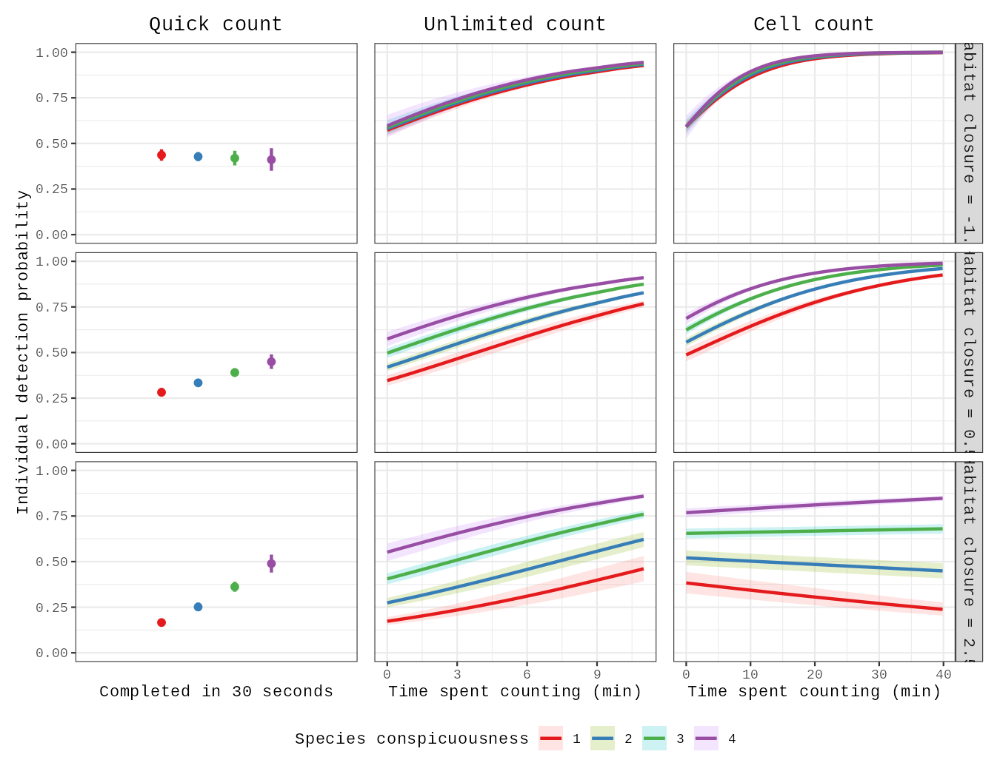

# Notebook catalog — page 3 of 5

[README / recent notebooks](../README.md#notebooks) · [Previous](page-002.md) · [Next](page-004.md)

Alphabetical entries 101–150 of 205. Generated from publication.json; includes generation conditions and execution previews.

| Paper and run details | Preview |
| --- | --- |
| **Improving the 3D representation of plant architecture and parameterization efficiency of functional–structural tree models using terrestrial LiDAR data** public_id: <code>p-5c9a697cdcf4a609715f4223aa5e9646</code>        <b>Generated with:</b> OpenCode · spark-local/GLM-5.3-Flash-EXL3 · variant: low <b>Demonstration:</b> Recomputes TLS-derived branch angles, internode lengths and height/DBH accuracy from the archived 4TU QSM outputs using the authors&#x27; scripts; GroIMP model runs and the Table 4 branch-angle/internode RMSE are not reproduced.  <b>Semantic tags:</b> modality:point_cloud, organ:stem, organ:whole_plant, task:morphology, task:object_detection, task:reconstruction, trait:architecture |  Measured vs TLS-estimated tree height and DBH for 35 Guyana trees (1:1 line and fit) |
| **Improving Wheat Yield Prediction Using Secondary Traits and High-Density Phenotyping Under Heat-Stressed Environments.** public_id: <code>p-b01140e333cf94b9e0d92f3df1020c27</code>        <b>Generated with:</b> OpenCode · spark-local/GLM-5.3-Flash-EXL3 · variant: low <b>Demonstration:</b> Executed the authors&#x27; 2015-16-season R pipeline (per-trial BLUEs, stepwise/LASSO/ridge/ENet all-trait yield prediction with leave-one-trial-out CV); accuracy r=0.58 matched paper Table 2, other seasons and analyses excluded.  <b>Semantic tags:</b> crop:wheat, environment:field, modality:spectral, modality:thermal, organ:whole_plant, task:yield_biomass, trait:pigment_color, trait:temperature, trait:yield |  Observed vs predicted grain-yield BLUEs (t/ha) per model and per-trial prediction accuracy, 2015-16 season |
| **In Situ Root Dataset Expansion Strategy Based on an Improved CycleGAN Generator.** public_id: <code>p-8f55a8fbe9d410d7a55170108973d846</code>        <b>Generated with:</b> OpenCode · spark-local/GLM-5.3-Flash-EXL3 · variant: low <b>Demonstration:</b> Partial demonstration: released Improved CycleGAN Model 1 generator translates a 256x256 annotated root mask into a textured root (masks-to-roots direction resolved empirically), followed by the authors&#x27; hcl.py background-separation postprocessing; input-vs-generated comparison figure. Training, FID/KID model comparison, and Improved_UNet evaluation are out of scope.  <b>Semantic tags:</b> organ:root, task:segmentation, trait:root_architecture |  Input root mask (1-100ANN.zip example) vs Model 1 generated root after hcl.py background separation |
| **In-Depth Quantification of Cell Division and Elongation Dynamics at the Tip of Growing Arabidopsis Roots Using 4D Microscopy, AI-Assisted Image Processing and Data Sonification.** public_id: <code>p-282084b764b7ac5d56e78cd1a5bf9278</code>        <b>Generated with:</b> Generation conditions not recorded <b>Demonstration:</b> Headless reproduction of the authors&#x27; pre-trained 2D U-Net nuclei detection plus GA/k-means cell-file clustering and lineage tracking on the 10 provided sample frames, validated against the included ground-truth XML; the private 4D dataset, training, sonification, and dataset-level accuracies are not covered.  <b>Semantic tags:</b> crop:arabidopsis, environment:laboratory, modality:microscopy, organ:cell, task:morphology, task:tracking, trait:growth_development |  Sample frame mid-slice: authors&#x27; ground-truth centroids (left) versus the pre-trained 2D U-Net detections (right). |
| **Integrating spectral, texture, soil and fertilization information for plot-level prediction of sugarcane yield, millable stalk population and Brix from Jilin-1 imagery** public_id: <code>p-61a6050762a9ebd5d9bb785d2c368efe</code>        <b>Generated with:</b> OpenCode · spark-local/GLM-5.3-Flash-EXL3 · variant: low <b>Demonstration:</b> Partial: authors&#x27; SVR_Model.py (SVR-RFE + LOOCV + grid search) run verbatim on the bundled random data_test.xlsx; metrics are pipeline checks, not paper results  <b>Semantic tags:</b> crop:sugarcane, environment:field, modality:spectral, organ:whole_plant, task:yield_biomass, trait:yield |  No image or graph generated for this data-only reproduction. |
| **Kinetic parameter prediction using neural networks identifies limitations to C 4 photosynthesis** public_id: <code>p-777b4fc5fbfd2aec864a56327234d76b</code>        <b>Generated with:</b> OpenCode · spark-local/GLM-5.3-Flash-EXL3 · variant: low <b>Demonstration:</b> Runs the authors&#x27; pretrained C4TUNE network on the 68 measured 2022 maize A/CO2 and A/light curves to predict all 236 kinetic parameters; training, ODE re-simulation and the limitation analysis are not executed.  <b>Semantic tags:</b> crop:maize, task:physiology, trait:photosynthesis |  Measured 2022 A/CO2 (11 CO2 steps) and A/light (6 light steps) curves of the 68 MAGIC maize genotypes, genotype SSA_00001 highlighted |
| **KineticGP: a computational framework for genomic prediction of leaf photosynthesis traits** public_id: <code>p-88d0f80b038259b9b4b2891d38bdcb0a</code>        <b>Generated with:</b> OpenCode · spark-local/GLM-5.3-Flash-EXL3 · variant: low <b>Demonstration:</b> Executed the authors&#x27; unmodified R rrBLUP cross-validation (fold out1/inner1) of their estimated top-11 C4 kinetic parameters against the 70k-SNP MAGIC maize matrix, matching their published fold output exactly; MCMC parameterization and C4 simulation are out of scope.  <b>Semantic tags:</b> crop:maize, environment:field, organ:leaf, task:physiology, trait:photosynthesis |  rrBLUP-predicted vs actual values for the best-predicted kinetic parameter in fold out1/inner1 (n=23 genotypes) |
| **Label3DMaize: toolkit for 3D point cloud data annotation of maize shoots.** public_id: <code>p-8d1e171ca872b7e24d1f590750fd419d</code>        <b>Generated with:</b> OpenCode · spark-local/GLM-5.3-Flash-EXL3 · variant: low <b>Demonstration:</b> Label3DMaize coarse segmentation (Sinkhorn OT) ported from MATLAB, one maize shoot vs authors&#x27; published coarse result (accuracy 0.9529)  <b>Semantic tags:</b> crop:maize, modality:point_cloud, organ:stem, organ:whole_plant, task:annotation_qc, task:segmentation, trait:architecture |  The mc-v6-4k shoot colored by the authors&#x27; published coarse organ annotation (reference overlay; stem, 9 organ instances; pot removed before scoring) |
| **LeafGen: Structure-aware Leaf Image Generation for Annotation-free Leaf Instance Segmentation.** public_id: <code>p-07c9da3eccfa6f320360b76303c5390b</code>        <b>Generated with:</b> Generation conditions not recorded <b>Demonstration:</b> Single-plant LeafGen pipeline (L-system Blender mask generation, GT instance masks, pretrained komatsuna pix2pix texturing) on CPU; dataset-scale generation, training, and downstream segmentation are out of scope.  <b>Semantic tags:</b> crop:arabidopsis, modality:rgb, organ:leaf, task:segmentation |  LeafGen synthetic komatsuna plant textured with the pretrained pix2pix leaf generator (left) beside its auto-generated ground-truth instance mask (right). |
| **Light dynamically regulates growth rate and cellular organisation of the Arabidopsis root meristem.** public_id: <code>p-90a1ec533d4072d493ab8988b00cbe88</code>        <b>Generated with:</b> Generation conditions not recorded <b>Demonstration:</b> Ran the authors&#x27; iRoCS nuclei-analysis pipeline (SVM nucleus detection, epidermis labelling, iRoCS coordinate attachment, cell-layer assignment) end-to-end on the author sample DAPI root-tip stack and reproduced the paper&#x27;s root-zonation model; partial demonstration on one DAPI-only sample, not the full atlas.  <b>Semantic tags:</b> crop:arabidopsis, modality:microscopy, organ:cell, organ:root, task:morphology, trait:growth_development |  Nuclei detected by the iRoCS SVM pipeline, colored by assigned root layer over the DAPI projection. |
| **Lincoln&#x27;s Annotated Spatio-Temporal Strawberry Dataset (LAST-Straw)** public_id: <code>p-25fc2dd035859c1889f9633edd77c633</code>        <b>Generated with:</b> OpenCode · spark-local/GLM-5.3-Flash-EXL3 · variant: low <b>Demonstration:</b> Minimal CPU reproduction of LAST-Straw skeletonisation assessment on one annotated scan (5 stems): GT skeletons registered into the scan frame and scored with the authors&#x27; GraphMatching3D metrics; the simplified Shortest-Path re-implementation recovers stem length (MAPE 0.11 vs paper 0.17) but scores below the paper on dense-node matching at the tight 0.396 mm threshold.  <b>Semantic tags:</b> crop:strawberry, modality:point_cloud, organ:whole_plant, task:morphology, task:segmentation, task:skeletonization, trait:plant_height |  Stem point clouds (grey) with registered ground-truth skeletons (green) and estimated Shortest-Path skeletons (red) for the five petiole instances of scan A2_20220512_a, in the paper&#x27;s Fig. 8 style. |
| **Looking behind occlusions: A study on amodal segmentation for robust on-tree apple fruit size estimation** public_id: <code>p-0e108836e8a4514b8486db589101c1d8</code>        <b>Generated with:</b> Generation conditions not recorded <b>Demonstration:</b> Amodal segmentation contours and depth maps for two apple images. Both runtime paths were validated; the saved outputs use CPU. Not a test-set performance evaluation.  <b>Semantic tags:</b> crop:apple, environment:field, modality:rgbd, organ:fruit, task:morphology, task:segmentation, trait:reproductive_traits |  Apple detections, amodal contours, and depth map |
| **Low-Cost Custom-Built Flow Meters for Plant Hydraulic Conductance: Validation of Accuracy, Precision, and Reproducibility.** public_id: <code>p-b7be1e0f7d7414d15b12905b922078b4</code>        <b>Generated with:</b> OpenCode · spark-local/GLM-5.3-Flash-EXL3 · variant: low <b>Demonstration:</b> Recomputes the paper Section 3.3 flow-meter device comparison (blue b1-b2 PEEK pair at 25 cm, devices X1-X3, n=15 each) from the FRDR deposit, reproducing biases -0.36 to +1.90 percent, CVs 0.7-1.9 percent, Jaccard indices, and all pairwise mean differences below 2.3 percent; the Bhattacharyya binning convention is unverifiable (no author analysis script) and is documented as an adaptation.  <b>Semantic tags:</b> environment:laboratory, organ:tissue, task:physiology, trait:water_status |  Boxplots of conductance per flow meter (X1-X3) for the blue b1-b2 PEEK pair at 25 cm with the water-displacement b2 reference line, JSI and Bhattacharyya annotations (paper Figure 2 redrawn from the deposited data). |
| **Machine learning classification of plant genotypes grown under different light conditions through the integration of multi-scale time-series data.** public_id: <code>p-ec195643370bc393728d48833a209286</code>        <b>Generated with:</b> OpenCode · spark-local/GLM-5.3-Flash-EXL3 · variant: low <b>Demonstration:</b> Reproduces the paper&#x27;s conventional-ML benchmark (LR/RF/Boosting/SVC-poly/stacking, 10-fold CV) on the authors&#x27; 0-min twilight 6-genotype dataset; accuracies fell 0.20-0.25 below published Table 1, so it is a partial, non-equivalent demonstration.  <b>Semantic tags:</b> organ:whole_plant, task:classification, task:time_series, trait:growth_development |  10-fold cross-validation accuracy per model (LR, RF, Gradient Boosting, polynomial SVC, stacking) on the authors&#x27; 0-min twilight 6-class plant-area dataset. |
| **Making WAVES in Breedbase: An Integrated Spectral Data Storage and Analysis Pipeline for Plant Breeding Programs** public_id: <code>p-57dbb7f466cda2e3dae16b3ae6a2857e</code>        <b>Generated with:</b> OpenCode · spark-local/GLM-5.3-Flash-EXL3 · variant: low <b>Demonstration:</b> Reproduces the paper&#x27;s example-dataset evaluation: waves (pinned GoreLab commit) PLSR on the bundled ikeogu.2017 cassava spectra in Colab via Rscript; test-set R2p 0.84 (RDMC, SNV) and 0.92 (TCC, SGD1) versus reported 0.86/0.95, CPU only, C16Mcal/C16Mval split instead of the unpublished Supplemental Table 2 split.  <b>Semantic tags:</b> modality:spectroscopy, task:preprocessing |  Observed vs. waves-PLSR-predicted root dry matter content on the held-out C16Mval test set (best pretreatment SNV, mean R2p 0.838). |
| **Mapping lignification dynamics with a combination of chemistry, data segmentation and ratiometric analysis** public_id: <code>p-cd3b7c4a2dfbfd18ed589bd4fe9fbe29</code>        <b>Generated with:</b> OpenCode · spark-local/GLM-5.3-Flash-EXL3 · variant: low <b>Demonstration:</b> ADAPTED PYTHON DEMONSTRATION — minimal single-example REPRISAL parametric cell-wall segmentation (Otsu wall mask, EDT Voronoi middle lamella, corner detection) and RM1/RM2 ratiometric tables on one 5-channel ND2 stem cross-section, ported from the authors&#x27; ImageJ macro parametric_segmentation.ijm  <b>Semantic tags:</b> crop:arabidopsis, crop:flax, crop:maize, crop:poplar, modality:fluorescence, organ:cell, organ:flower, organ:stem, organ:tissue, task:physiology, task:segmentation |  H* reporter channel of the authors&#x27; representative sample1.nd2 (Zenodo 4809980) with the adapted parametric segmentation overlay: cell corners (yellow), middle lamella (cyan), secondary wall (magenta) |
| **Maturity Classification of Rapeseed Using Hyperspectral Image Combined with Machine Learning.** public_id: <code>p-93fa928d5885615b855d12b533c5ccf4</code>        <b>Generated with:</b> OpenCode · spark-local/GLM-5.3-Flash-EXL3 · variant: low <b>Demonstration:</b> D2nd, IVISSA-SPA and RBF-SVM rapeseed maturity classification on the authors&#x27; deposited 1500-seed reflectance table; 375-seed test accuracy 97.07 percent vs paper 97.86 percent. AI-assisted Python port of the authors&#x27; MATLAB code with per-sample scaling and grid-search adaptations.  <b>Semantic tags:</b> crop:rapeseed, modality:spectral, organ:whole_plant, task:classification, trait:growth_development |  Confusion matrix of the D2nd-IVISSA-SPA-SVM maturity classifier on the 375-seed test set |
| **MinneApple: A Benchmark Dataset for Apple Detection and Segmentation** public_id: <code>p-feca74983cc9d1c5ff2a8dc4937dc604</code>        <b>Generated with:</b> OpenCode · spark-local/GLM-5.3-Flash-EXL3 · variant: high <b>Demonstration:</b> Reproduces MinneApple&#x27;s released detection annotations for one training image end to end: per-instance mask decoding and on-the-fly bounding-box extraction with the author&#x27;s verbatim AppleDataset loader (no detector run; no public weights exist).  <b>Semantic tags:</b> crop:apple, environment:field, organ:fruit, task:counting, task:object_detection, task:segmentation |  Input orchard image (left) with reference instance masks (center) and reference bounding boxes from the author&#x27;s AppleDataset (right); reference annotations from detection.tar.gz, not model predictions. |
| **Model selection and parameter estimation for root architecture models using likelihood-free inference.** public_id: <code>p-9d34a23737718edc5e1277da0358385a</code>        <b>Generated with:</b> OpenCode · spark-local/GLM-5.3-Flash-EXL3 · variant: low <b>Demonstration:</b> Runs the authors&#x27; pinned MATLAB ABC-SMC root-architecture inference (StochasticBiology/root-inference @ da98de2) under GNU Octave on the embedded Arabidopsis summary statistics (N=100, final tolerance 3), reproducing parameter posteriors and model selection; a single minimal example, not a full-paper verification.  <b>Semantic tags:</b> organ:root, task:morphology, trait:growth_development, trait:root_architecture |  ABC-SMC parameter posteriors for growth rate g, branching rate b, lateral ratio gl and l_max on the embedded Arabidopsis data (final tolerance 3) |
| **Multi-scale spatial-temporal remote sensing fusion for phenology identification in rice germplasm resources.** public_id: <code>p-a349992a9a7f836d25123f526c58c28a</code>        <b>Generated with:</b> OpenCode · spark-local/GLM-5.3-Flash-EXL3 · variant: low <b>Demonstration:</b> Inference-only run of the authors&#x27; released predict.py (MAGF+LSTM, pinned commit 5b9c2dd) on the repository&#x27;s datatest examples (10 plots) with the delta3 checkpoint; OA 0.946 on the example set only, not a paper-benchmark reproduction.  <b>Semantic tags:</b> crop:rice, environment:aerial, organ:whole_plant, task:classification, task:time_series, trait:growth_development |  Pinned example inputs: 20 m MR (left) and 4 m HR (right) images of plot J1B265 on 2024-08-22, ground-truth class Jointing stage (from datatest/). |
| **Multi-view BLUP: a promising solution for post-omics data integrative prediction** public_id: <code>p-2bd31da0e632a80444251edc20a538de</code>       <b>Generated with:</b> OpenCode · spark-local/GLM-5.3-Flash-EXL3 · variant: low <b>Demonstration:</b> Runs the authors&#x27; pinned MVBLUP R demo (8 views, 100 individuals, trait 1): differential-evolution view-weight learning with rrBLUP 5-fold CV fitness, achieving test accuracy 0.9459 identical to the author reference; the small bundled demo data do not validate the paper&#x27;s published dataset-level results. |  MVBLUP differential-evolution learning curve: per-view optimal weights across iterations, reproduced from the authors&#x27; pinned demo (author reference match). |
| **Natural variation in stomata size contributes to the local adaptation of water-use efficiency in Arabidopsis thaliana.** public_id: <code>p-a19e4f562c64e84e85556bde60dcad78</code>        <b>Generated with:</b> OpenCode · spark-local/GLM-5.3-Flash-EXL3 · variant: low <b>Demonstration:</b> Executed the authors&#x27; Appendix S2 R code on the published Dryad tables to reproduce stomata-size/density heritabilities (0.372/0.294), trait correlations and climatic-PC GLMs; genotype-dependent sections (GWAS, QST-FST, genetic-PC covariates) are not reproducible from published data.  <b>Semantic tags:</b> crop:arabidopsis, modality:microscopy, organ:stomata, task:morphology, trait:stomatal_traits, trait:water_status |  Stomata size vs density accession means (r = -0.51) and broad-sense heritabilities from the authors&#x27; lme models and the Python cross-check, compared with the paper&#x27;s values. |
| **NeuraLeaf: Disentangled Neural Parametric Modeling of Leaf Shape, Deformation, and Appearance** public_id: <code>p-744d06547d0cf81dc008f601a6fe839c</code>        <b>Generated with:</b> Generation conditions not recorded <b>Demonstration:</b> Shape generation plus leaf deformation transfer and interpolation. The fitting example is a model-generated round-trip; appearance modeling and dataset-level benchmarks are outside this run.  <b>Semantic tags:</b> modality:rgbd, organ:leaf, task:morphology, task:reconstruction, trait:leaf_traits |  Leaf shape and deformation results across four examples |
| **Non-invasive hydrodynamic imaging in plant roots at cellular resolution** public_id: <code>p-004ce732f6d0d7eb85c1fa4c08db5865</code>        <b>Generated with:</b> OpenCode · spark-local/GLM-5.3-Flash-EXL3 · variant: low <b>Demonstration:</b> Bounded Colab CPU re-run of the paper&#x27;s inverse-modeling loop 2: the authors&#x27; MECHA 4D-solute D2O wash-out simulator driven against 30 measured Col-0 traces with a 7-point xylem-flow-rate grid scan (best Q_xyl 0.008 cm3/d); the full fmincon/MultiStart 4-parameter optimization and other genotypes are out of scope.  <b>Semantic tags:</b> crop:arabidopsis, modality:spectroscopy, organ:cell, organ:root, task:physiology, trait:water_status |  Objective OF versus xylem flow rate over the scanned grid (left) and the best-fit simulated xylem D2O wash-out trace against the measured Col-0 mean ± SD of 30 plants (right) |
| **Non-invasive phenotyping for water and nitrogen uptake by deep roots explored using machine learning** public_id: <code>p-53c30ffda67420ce4c09594eec1ecbce</code>        <b>Generated with:</b> OpenCode · spark-local/GLM-5.3-Flash-EXL3 · variant: low <b>Demonstration:</b> Minimal CPU reproduction of the CropML 2018 analysis: 30 Sqrt_pRLD interval features from raw root profiles, author nested-CV RF/GB prediction of log d15N and d13C (out-of-fold r 0.45/0.42 vs paper 0.46/0.41), with SI/D50 depth estimates; the author&#x27;s stored SI values are not exactly reproduced (documented).  <b>Semantic tags:</b> crop:wheat, organ:root, task:morphology, task:physiology, trait:water_status |  RF feature importance by 10-cm soil-depth interval (2018): deep layers around 150-170 cm rank highest for log d15N, reproducing the paper&#x27;s key finding. |
| **Novel method for the quantification of rosette area from images of Arabidopsis seedlings grown on agar plates.** public_id: <code>p-947828c971e3a9b186c0001caf61e052</code>        <b>Generated with:</b> OpenCode · spark-local/GLM-5.3-Flash-EXL3 · variant: low <b>Demonstration:</b> Executed the authors&#x27; pinned plate-as-scale demo (plantcv 3.14.1) on their own test image p6.jpg in a fresh Colab CPU runtime; per-rosette raw pixel areas exactly match the demo&#x27;s saved outputs. One image only - dataset-level validation and ANOVA/heritability analyses are not reproducible (data not public).  <b>Semantic tags:</b> crop:arabidopsis, environment:laboratory, organ:leaf, task:morphology, task:segmentation, trait:leaf_traits |  Author demo image p6.jpg: agar plate with six Arabidopsis seedlings before analysis |
| **OpenAlea.HydroRoot: A modelling framework to dissect, predict and phenotype branched root hydraulic architecture** public_id: <code>p-f9a489165e744785cca13c6c4acd9895</code>        <b>Generated with:</b> OpenCode · spark-local/GLM-5.3-Flash-EXL3 · variant: low <b>Demonstration:</b> HydroRoot Tutorial 1 on Colab: hydrostatic water-flux solve of a measured Arabidopsis root (RSML) with the author&#x27;s pinned code; single-example CPU run, 3D viewer replaced by matplotlib rendering.  <b>Semantic tags:</b> crop:arabidopsis, crop:maize, crop:millet, organ:root, task:physiology, trait:root_architecture |  Total water uptake Jv vs radial (k) and axial (K) conductivity scaling, computed in-notebook from actual solves (paper Figs 4-5 style sensitivity) |
| **OpenEar: an ultra-affordable, high-throughput, and accurate maize ear phenotyping system.** public_id: <code>p-fe5b7b0c511e3a6e2185295a6dd692ad</code>        <b>Generated with:</b> Generation conditions not recorded <b>Demonstration:</b> Processes one author-provided maize video through frame correction, cylindrical projection, YOLO segmentation, ten trait calculations, and CNN quality control. Fresh CPU and T4 runs completed all 14 code cells with matching outputs; sample-scale demonstration only, not a dataset benchmark.  <b>Semantic tags:</b> crop:maize, organ:inflorescence, organ:seed, task:classification, task:morphology, task:segmentation, trait:reproductive_traits |  Kernel segmentation overlay from one author-provided maize video; one-sample demonstration. |
| **Operational Framework for Field-Scale Crop Sowing and Emergence Date Estimation Using Daily Synthetic Harmonized Landsat Sentinel-2 Time Series** public_id: <code>p-cac607b350005b99ef850fe315328b02</code>        <b>Generated with:</b> Generation conditions not recorded <b>Demonstration:</b> Seasonal EVI fit and estimated phenological stages for one site-year (`goodwaterbau`, 2023). Not a multi-site reproduction.  <b>Semantic tags:</b> crop:maize, crop:soybean, environment:field, modality:spectral, organ:whole_plant, task:time_series, trait:growth_development |  Seasonal EVI and estimated phenological stages |
| **Orangutan : An R Package for Analyzing and Visualizing Phenotypic Data in the Context of Species Descriptions and Population Comparisons.** public_id: <code>p-4d490655aff364e012a19a3dc5d16265</code>        <b>Generated with:</b> OpenCode · spark-local/GLM-5.3-Flash-EXL3 · variant: low <b>Demonstration:</b> run_orangutan() on the Torres 2024 anole dataset (34 specimens, allometric correction via main_length): PERMANOVA F=13.37, R2=0.648, p=0.001 vs paper 12.62/0.640/0.001; DAPC and PCA figures generated with the authors&#x27; pinned R code (Zenodo v2.0.0, commit 4df8536).  <b>Semantic tags:</b> task:classification |  DAPC discriminant-space plot of the Torres 2024 anole dataset generated in this run by the pinned Orangutan 2.0.0 pipeline (author code; not a copy of a paper figure). |
| **OrchardQuant ‐ 3D : combining drone and LiDAR to perform scalable 3D phenotyping for characterising key canopy and floral traits in fruit orchards** public_id: <code>p-138a6dea3b64aadf4843d6d64fcbf37b</code>        <b>Generated with:</b> OpenCode · spark-local/GLM-5.3-Flash-EXL3 · variant: low <b>Demonstration:</b> Executes the authors&#x27; OrchardQuant-3D pear LiDAR dormancy chain (SOR, CSF ground filter, CHM, RTK registration, tree detection, SLBC skeletons, canopy traits) on a small sub-orchard patch of the released Data_pear point cloud; the full 4.5 GB orchard and the apple fruit-detection branch are out of scope.  <b>Semantic tags:</b> crop:apple, crop:pear, environment:aerial, environment:field, modality:point_cloud, modality:rgb, organ:flower, organ:fruit, organ:whole_plant, task:morphology, task:object_detection, task:reconstruction, trait:architecture, trait:reproductive_traits |  Annotated canopy height model of the pear-orchard patch: 9 automatically detected individual trees (authors&#x27; extract_bbox) outlined on the LiDAR CHM. |
| **Petal to the metal: The slow road to automating large-scale phenology labeling for herbarium specimens** public_id: <code>p-447c3f5fed9ffacd051467132402e2db</code>        <b>Generated with:</b> OpenCode · spark-local/GLM-5.3-Flash-EXL3 · variant: high <b>Demonstration:</b> Re-runs the released 3-model flower ensemble with its released thresholds on the authors&#x27; 1,442-image held-out test split and reproduces the Table S1 confusion matrix (TP 794 and FP 67 exact; recall 96.5% present / 86.9% absent); training and the 22M-image inference are out of scope.  <b>Semantic tags:</b> organ:flower, task:annotation_qc, task:object_detection, trait:growth_development |  Held-out test herbarium specimen with its reference expert annotation and the recomputed ensemble decision overlaid |
| **Petal to the metal: The slow road to automating large-scale phenology labeling for herbarium specimens.** public_id: <code>p-b47e5ef7351e1f4dfa343ee31bd353d7</code>        <b>Generated with:</b> Generation conditions not recorded <b>Demonstration:</b> Runs the authors&#x27; published three-model flower ensemble (two ViT-384 classifiers + EfficientNet-528 regression with moved thresholds and two-thirds voting) on a 60-specimen balanced sample of the held-out test set, reproducing present/absent accuracy of the paper&#x27;s order (0.966/0.897 vs 0.963/0.868); sample-size noise and the ~7.2 GB weight download are the main limitations.  <b>Semantic tags:</b> organ:flower, task:object_detection, trait:growth_development |  Held-out herbarium specimen with per-model scores, thresholded votes and the ensemble verdict versus the expert label. |
| **PhenoApp: A mobile tool for plant phenotyping to record field and greenhouse observations** public_id: <code>p-70fa1c051d6fb330e7e8104d716387cf</code>        <b>Generated with:</b> OpenCode · spark-local/GLM-5.3-Flash-EXL3 · variant: low <b>Demonstration:</b> Adapted CPU demonstration of PhenoApp&#x27;s file-based import/export workflow: parses the authors&#x27; Input_example.xls, ports the Writer.java export transformation to Python, and verifies it cell-by-cell against the authors&#x27; real Output_example.xls; the Android GUI itself is not runnable in Colab.  <b>Semantic tags:</b> crop:apple, crop:grapevine, crop:maize, crop:potato, crop:rapeseed, crop:rice, environment:field, environment:greenhouse, environment:laboratory, organ:whole_plant, task:annotation_qc |  Per-descriptor agreement between the Python port of PhenoApp&#x27;s export logic and the authors&#x27; real app output (Output_example.xls). |
| **Phenology and health of Stenocereus Queretaroensis : A multimodal dataset combining multispectral imagery and spectrophotometry.** public_id: <code>p-cc11f812b657fdb55b484614bdebe334</code>        <b>Generated with:</b> OpenCode · spark-local/GLM-5.3-Flash-EXL3 · variant: low <b>Demonstration:</b> Reproduces the paper&#x27;s 2 nm cubic-spline spectral resampling to machine precision against the authors&#x27; own interpolated .mat files and computes an adapted monthly CARI distribution for 109 plants (Jan-May); the paper&#x27;s exact CARI normalization is unstated and drone imagery is absent from dataset v1.  <b>Semantic tags:</b> environment:field, modality:multimodal, modality:spectral, modality:spectroscopy, organ:whole_plant, task:preprocessing, trait:growth_development |  Monthly CARI boxplots (0-1 display-normalized) for 109 S. queretaroensis plants, January-May 2025, adapted computation |
| **Phenotyping grapevine resistance to downy mildew: deep learning as a promising tool to assess sporulation and necrosis.** public_id: <code>p-83b2a51c60a5a23fa6f5a266fc840633</code>        <b>Generated with:</b> OpenCode · spark-local/GLM-5.3-Flash-EXL3 · variant: low <b>Demonstration:</b> Inference-only partial demonstration: the released Swin CORN scorer (pinned author code and checkpoint) predicts OIV 452-1 ranks for 15 expert-annotated test leaf patches on CPU and T4; it does not reproduce dataset-level metrics or the detector/training pipeline.  <b>Semantic tags:</b> crop:grapevine, organ:leaf, task:classification, task:stress_disease, trait:disease_symptoms |  The 15 selected oiv_test leaf patches with their expert-annotated OIV 452-1 scores |
| **Phenotyping, genome-wide dissection, and prediction of maize root architecture for temperate adaptability.** public_id: <code>p-db3f8be98b089c555cac68adece401c3</code>        <b>Generated with:</b> OpenCode · spark-local/GLM-5.3-Flash-EXL3 · variant: high <b>Demonstration:</b> Reproduces the paper&#x27;s Figure 8 bagged-tree prediction of root projected area and primary root volume from 108 cross-section traits (inference with the authors&#x27; saved models, retraining with the pinned code, and a reduced top-k feature-count experiment) on a Colab CPU runtime; reduced replicate counts and split variance are the main limitations.  <b>Semantic tags:</b> crop:maize, task:morphology, trait:root_architecture |  Predicted vs. observed total root projected area (ProjArea) on the held-out 20% split — retrained caret bagged trees (Figure 8A reproduction); Pearson r = 0.66 (paper: 0.67). |
| **Physiology-Driven Irrigation Scheduling in Ananas comosus via Hybrid Machine Learning: UAV-Based Phenotyping of Water-Related Traits Coupled with FAO-56 Soil Water Balance.** public_id: <code>p-e88e02e32c4282a27c3e0b0eef2b803f</code>        <b>Generated with:</b> OpenCode · spark-local/GLM-5.3-Flash-EXL3 · variant: low <b>Demonstration:</b> Retrains the released PIML-GB GBM regressor and traffic-light DSS classifier on the pinned Mendeley fused matrix, reproducing the paper&#x27;s R2=0.842/RMSE=0.0705 hold-out regression; UAV image processing and CROPWAT water balance are out of scope.  <b>Semantic tags:</b> crop:pineapple, environment:aerial, environment:field, modality:spectral, organ:whole_plant, task:physiology, trait:water_status |  Traffic-light DSS confusion matrix from the retrained classifier (test split of the released N-row matrix) |
| **Plant cell wall enzymatic deconstruction: Bridging the gap between micro and nano scales.** public_id: <code>p-4ac8d64107193c40c6d43e0cc1923edd</code>        <b>Generated with:</b> OpenCode · spark-local/GLM-5.3-Flash-EXL3 · variant: low <b>Demonstration:</b> Runs the pinned WallTrack pipeline (segmentation, registration, segmentation propagation, voxel deconstruction map) on the authors&#x27; two-stack demo dataset; partial demonstration only, with matplotlib rendering in place of the BioModLab GUI.  <b>Semantic tags:</b> crop:poplar, modality:microscopy, organ:cell, organ:tissue, task:morphology, task:time_series, task:tracking, trait:architecture |  Deconstruction map z-slices: orange = deconstructed wall voxels, green = wall remaining, over the pre-hydrolysis confocal stack. |
| **Plant, space and time - linked together in an integrative and scalable data management system for phenomic approaches in agronomic field trials** public_id: <code>p-2b2f036450a96d50015e96cdb2b602fa</code>        <b>Generated with:</b> OpenCode · spark-local/GLM-5.3-Flash-EXL3 · variant: low <b>Demonstration:</b> Headless execution of the author&#x27;s pinned CropWatch backend (Node/Express + PostgreSQL/PostGIS) in Colab: the paper&#x27;s published example weather CSV (216 rows x 7 traits) is imported through the author&#x27;s own API flow and queried back (1512 rows); GUI, GeoServer and raster import are not covered and units/coordinates are labeled assumptions.  <b>Semantic tags:</b> environment:field, organ:whole_plant, task:object_detection, task:visualization, trait:yield |  Queried weather measurement series (LTmean/LTmax/LTmin air temperature, NSsum precipitation) after import through the author&#x27;s CropWatch DMIS API; ADAPTED visualization, assumed units. |
| **Plants stand still but hide: imperfect and heterogeneous detection is the rule when counting plants** public_id: <code>p-cdeb807babf91f2b6fe0f203dd5b5868</code>        <b>Generated with:</b> OpenCode · spark-local/GLM-5.3-Flash-EXL3 · variant: low <b>Demonstration:</b> Reproduces the authors&#x27; final binomial GLMM of individual detection in plant counts, their Figures 2 and 3, and the per-method detection rates (0.44/0.59/0.74) from the pinned public dataset; raw-data formatting, appendices and Figure 4 are out of scope.  <b>Semantic tags:</b> environment:field, organ:whole_plant, task:counting |  Reproduced Figure 3: model-predicted individual detection probability vs counting time for the three counting methods, by species conspicuousness and habitat closure. |
| **Predicting Phenotypic Traits Using a Massive RNA-seq Dataset** public_id: <code>p-1fad5a8aaeb9ad87574e562671e77946</code>        <b>Generated with:</b> OpenCode · spark-local/GLM-5.3-Flash-EXL3 · variant: low <b>Demonstration:</b> Retrains the paper&#x27;s tissue-4 random forest from the authors&#x27; archived MRN BioProject-disjoint split pickle with their exact final hyperparameters; test accuracy 0.9955 / macro F1 0.9968 (paper: 0.994/0.995). Does not reproduce SRA reprocessing, normalization ANOVA, age regression, or later analyses.  <b>Semantic tags:</b> crop:arabidopsis, organ:tissue, task:classification, task:preprocessing, task:time_series, trait:growth_development |  Test-set confusion matrix (Flower/Leaf/Root/Seed) of the reproduced tissue-4 random forest, 300 DPI |
| **Predicting photosynthetic pathway from anatomy using machine learning** public_id: <code>p-aaa04d55ed02d6b59bb4dbe28c44b888</code>        <b>Generated with:</b> OpenCode · spark-local/GLM-5.3-Flash-EXL3 · variant: low <b>Demonstration:</b> Reproduces the paper&#x27;s XGBoost CAM-phenotype classifiers (10-fold CV accuracy 0.958 multiclass / 0.965 binary vs reported 95.7%/96.1%) and the ROS recall improvement on the released 5,745-taxon anatomical dataset; only the supervised-classification subsection, not image phenotyping or phylogenetic analyses.  <b>Semantic tags:</b> organ:cell, organ:leaf, organ:tissue, task:classification, task:morphology, trait:leaf_traits, trait:photosynthesis |  Multiclass XGBoost confusion matrix and feature importance on the pinned CAM anatomy dataset |
| **Predicting plant trait dynamics from genetic markers** public_id: <code>p-34089365c8e5fb9d8b8e750c505484f8</code>        <b>Generated with:</b> OpenCode · spark-local/GLM-5.3-Flash-EXL3 · variant: low <b>Demonstration:</b> One CV iteration (of the paper&#x27;s 10) of the authors&#x27; maize dynamicGP pipeline: Schur DMD (r=2) plus RR-BLUP prediction of operator entries from 70,846 SNPs; iterative dynamicGP reached 0.447 mean accuracy vs 0.140 for the first-timepoint RR-BLUP baseline on the author validation set.  <b>Semantic tags:</b> crop:arabidopsis, crop:maize, task:time_series, trait:architecture, trait:pigment_color |  Mean prediction accuracy per DAS timepoint (single CV iteration, validation-set genotypes): iterative and recursive dynamicGP versus the first-timepoint RR-BLUP baseline. Additional notebook visualization, not an author figure. |
| **Quantifying physiological trait variation with automated hyperspectral imaging in rice.** public_id: <code>p-28f074ee4e709feeb203a3120b869fa0</code>        <b>Generated with:</b> OpenCode · spark-local/GLM-5.3-Flash-EXL3 · variant: low <b>Demonstration:</b> Executes the authors&#x27; R RReliefF-PLSR pipeline for leaf nitrogen from Week-9 side-view hyperspectral reflectance (70/18 split, 400 wavelengths, LOO-selected 6 components); validation R2 0.758 / RMSEP 0.268 vs the paper&#x27;s 0.797 / 0.264, CPU-only, single-trait scope.  <b>Semantic tags:</b> crop:rice, modality:spectral, organ:leaf, organ:whole_plant, task:classification |  Predicted vs observed leaf nitrogen (%) on the 18-sample validation set with jackknife confidence intervals (blue TRJ, red IND; open circles N2, filled N1) |
| **Rapid non-destructive method to phenotype stomatal traits** public_id: <code>p-fd6547e68e447695b47e63419be8b4a3</code>        <b>Generated with:</b> Generation conditions not recorded <b>Demonstration:</b> Executed the authors&#x27; Wheat 400x pipeline (YOLOv5 detection, bounding-box extraction, Detectron2 Mask R-CNN measurement) on one sample handheld-microscope image; single-image demonstration, not dataset-level validation.  <b>Semantic tags:</b> crop:arabidopsis, crop:rice, crop:tomato, crop:wheat, environment:field, modality:microscopy, organ:leaf, organ:stomata, organ:whole_plant, task:counting, task:morphology, task:object_detection, trait:growth_development, trait:photosynthesis, trait:stomatal_traits, trait:water_status |  Input Wheat 400x handheld-microscope image (left) with YOLOv5 stomata detections (right, model predictions, conf 0.4) |
| **Raspberry Pi-powered imaging for plant phenotyping.** public_id: <code>p-59fad09308b383d488e949a8fb42837b</code>        <b>Generated with:</b> OpenCode · spark-local/GLM-5.3-Flash-EXL3 · variant: low <b>Demonstration:</b> One-image PlantCV 4.x port of the paper&#x27;s Appendix 2 time-lapse example: segments the repository&#x27;s Arabidopsis flat photo, selects one plant, and extracts Tough-Spot-scaled area/shape/color traits; single-example partial demonstration, no accuracy benchmark.  <b>Semantic tags:</b> organ:seed, organ:whole_plant, task:morphology, trait:architecture, trait:pigment_color, trait:plant_height |  PlantCV analyze.size output: selected plant crop with measured shape traits drawn in magenta (area, hull, ellipse, centroid). |
| **Reciprocal BLUP: A Predictability-Guided Multi-Omics Framework for Plant Phenotype Prediction.** public_id: <code>p-66b346f895818d607747eca86f411abc</code>        <b>Generated with:</b> OpenCode · spark-local/GLM-5.3-Flash-EXL3 · variant: low <b>Demonstration:</b> Executed the authors&#x27; pinned R/RAINBOWR pipeline on the drought soybean panel: 265-metabolite BLUP predictability (genome and microbiome kernels) and a GBLUP vs top-25% MetBLUP 5-fold-CV phenotype comparison; single seed, single environment.  <b>Semantic tags:</b> crop:soybean, organ:whole_plant, task:yield_biomass, trait:biomass, trait:stress_response |  Drought phenotype prediction: mean 5-fold CV correlation per trait for GBLUP versus MetBLUP kernels built from the top 25% genome- and microbiome-predictable metabolites (executed run, seed 123). |
| **Registration of spatio-temporal point clouds of plants for phenotyping.** public_id: <code>p-40268bb6a161b9ba8f5788fd628251c1</code>        <b>Generated with:</b> OpenCode · spark-local/GLM-5.3-Flash-EXL3 · variant: low <b>Demonstration:</b> Runs the authors&#x27; HMM skeleton matching, iterative non-rigid registration, and point-cloud deformation on one maize scan pair with the pinned author code; our transforms match the shipped reference to 3.6e-5, but SVM segmentation/SOM skeleton extraction and dataset-level results are out of scope.  <b>Semantic tags:</b> modality:point_cloud, organ:whole_plant, task:registration, task:skeletonization, task:time_series |  Deformed 2020-03-13 maize point cloud (blue) registered onto the 2020-03-14 target scan (red) after skeleton-based non-rigid registration |
| **Remote sensing and machine learning for yield prediction of lowland paddy crops** public_id: <code>p-da8b7fe022c16f028b094d90ebcf00fd</code>        <b>Generated with:</b> Generation conditions not recorded <b>Demonstration:</b> Retrains the authors&#x27; Gradient Boosting Regressor on the paper&#x27;s published 267-row dataset (best scenario: 2000 estimators, lr 0.001, depth 4) and recomputes test RMSE against the reported 9766.72 quintal; ENVI remote-sensing preprocessing and the 90-scenario sweep are out of scope.  <b>Semantic tags:</b> crop:rice, environment:field, organ:whole_plant, trait:yield |  Observed vs predicted paddy yield (quintal) on the 53-row test split, authors&#x27; scatter plot with recomputed RMSE |

[README / recent notebooks](../README.md#notebooks) · [Previous](page-002.md) · [Next](page-004.md)
