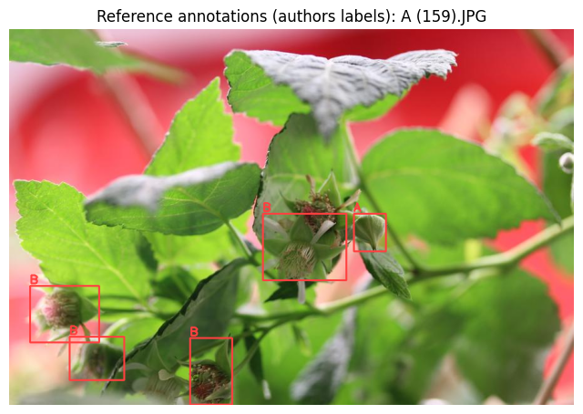

# Notebook catalog — page 4 of 5

[README / notebook index](../README.md#notebooks) · [Previous](page-003.md) · [Next](page-005.md)

Alphabetical entries 151–200 of 234. Generated from publication.json; includes generation conditions and execution previews.

| Paper and run details | Preview |
| --- | --- |
| **OpenEar: an ultra-affordable, high-throughput, and accurate maize ear phenotyping system.** <b>Journal:</b> Plant Methods <b>Authors:</b> Shaoqi Fan · Guoji Li · Revocatus Bahitwa · Zhiguo Jia · Hongwei Zhang · Jinghong Shao · Qiuying Yu · Xi Chen · Yiheng Qian · Mingchi Xu · Linlin Zhu · Hai Wang public_id: <code>p-fe5b7b0c511e3a6e2185295a6dd692ad</code>        <b>Generated with:</b> Generation conditions not recorded <b>Demonstration:</b> Processes one author-provided maize video through frame correction, cylindrical projection, YOLO segmentation, ten trait calculations, and CNN quality control. Fresh CPU and T4 runs completed all 14 code cells with matching outputs; sample-scale demonstration only, not a dataset benchmark.  <b>Semantic tags:</b> crop:maize, organ:inflorescence, organ:seed, task:classification, task:morphology, task:segmentation, trait:reproductive_traits |  Kernel segmentation overlay from one author-provided maize video; one-sample demonstration. |
| **Operational Framework for Field-Scale Crop Sowing and Emergence Date Estimation Using Daily Synthetic Harmonized Landsat Sentinel-2 Time Series** <b>Journal:</b> Journal of Remote Sensing <b>Authors:</b> Uilson R. V. Aires · Vitor S. Martins · Lucas B. Ferreira · Xin Zhang · Kambham R. Reddy · Yun Yang · Ieda D. A. Sanches public_id: <code>p-cac607b350005b99ef850fe315328b02</code>        <b>Generated with:</b> Generation conditions not recorded <b>Demonstration:</b> Seasonal EVI fit and estimated phenological stages for one site-year (`goodwaterbau`, 2023). Not a multi-site reproduction.  <b>Semantic tags:</b> crop:maize, crop:soybean, environment:field, modality:spectral, organ:whole_plant, task:time_series, trait:growth_development |  Seasonal EVI and estimated phenological stages |
| **Orangutan : An R Package for Analyzing and Visualizing Phenotypic Data in the Context of Species Descriptions and Population Comparisons.** <b>Journal:</b> Ecology and evolution <b>Authors:</b> Torres J. public_id: <code>p-4d490655aff364e012a19a3dc5d16265</code>        <b>Generated with:</b> OpenCode · spark-local/GLM-5.3-Flash-EXL3 · variant: low <b>Demonstration:</b> run_orangutan() on the Torres 2024 anole dataset (34 specimens, allometric correction via main_length): PERMANOVA F=13.37, R2=0.648, p=0.001 vs paper 12.62/0.640/0.001; DAPC and PCA figures generated with the authors&#x27; pinned R code (Zenodo v2.0.0, commit 4df8536).  <b>Semantic tags:</b> task:classification |  DAPC discriminant-space plot of the Torres 2024 anole dataset generated in this run by the pinned Orangutan 2.0.0 pipeline (author code; not a copy of a paper figure). |
| **OrchardQuant ‐ 3D : combining drone and LiDAR to perform scalable 3D phenotyping for characterising key canopy and floral traits in fruit orchards** <b>Journal:</b> Plant Biotechnology Journal <b>Authors:</b> Yunpeng Xia · Hanghang Li · Fanhang Zhang · Gang Sun · Kaijie Qi · Robert Jackson · Felipe Pinheiro · Xiaoman Liu · Yue Mu · Shaoling Zhang · Greg Deakin · E. Charles Whitfield · Shutian Tao · Ji Zhou public_id: <code>p-138a6dea3b64aadf4843d6d64fcbf37b</code>        <b>Generated with:</b> OpenCode · spark-local/GLM-5.3-Flash-EXL3 · variant: low <b>Demonstration:</b> Executes the authors&#x27; OrchardQuant-3D pear LiDAR dormancy chain (SOR, CSF ground filter, CHM, RTK registration, tree detection, SLBC skeletons, canopy traits) on a small sub-orchard patch of the released Data_pear point cloud; the full 4.5 GB orchard and the apple fruit-detection branch are out of scope.  <b>Semantic tags:</b> crop:apple, crop:pear, environment:aerial, environment:field, modality:point_cloud, modality:rgb, organ:flower, organ:fruit, organ:whole_plant, task:morphology, task:object_detection, task:reconstruction, trait:architecture, trait:reproductive_traits |  Annotated canopy height model of the pear-orchard patch: 9 automatically detected individual trees (authors&#x27; extract_bbox) outlined on the LiDAR CHM. |
| **Petal to the metal: The slow road to automating large-scale phenology labeling for herbarium specimens** <b>Journal:</b> bioRxiv <b>Authors:</b> Grady EL, LaFrance R, Li D, Dinnage R, Denny EG, Deck J, Guralnick RP. public_id: <code>p-447c3f5fed9ffacd051467132402e2db</code>        <b>Generated with:</b> OpenCode · spark-local/GLM-5.3-Flash-EXL3 · variant: high <b>Demonstration:</b> Re-runs the released 3-model flower ensemble with its released thresholds on the authors&#x27; 1,442-image held-out test split and reproduces the Table S1 confusion matrix (TP 794 and FP 67 exact; recall 96.5% present / 86.9% absent); training and the 22M-image inference are out of scope.  <b>Semantic tags:</b> organ:flower, task:annotation_qc, task:object_detection, trait:growth_development |  Held-out test herbarium specimen with its reference expert annotation and the recomputed ensemble decision overlaid |
| **Petal to the metal: The slow road to automating large-scale phenology labeling for herbarium specimens.** <b>Journal:</b> Applications in plant sciences <b>Authors:</b> Grady EL, LaFrance R, Li D, Dinnage R, Denny EG, Deck J, Guralnick RP. public_id: <code>p-b47e5ef7351e1f4dfa343ee31bd353d7</code>        <b>Generated with:</b> Generation conditions not recorded <b>Demonstration:</b> Runs the authors&#x27; published three-model flower ensemble (two ViT-384 classifiers + EfficientNet-528 regression with moved thresholds and two-thirds voting) on a 60-specimen balanced sample of the held-out test set, reproducing present/absent accuracy of the paper&#x27;s order (0.966/0.897 vs 0.963/0.868); sample-size noise and the ~7.2 GB weight download are the main limitations.  <b>Semantic tags:</b> organ:flower, task:object_detection, trait:growth_development |  Held-out herbarium specimen with per-model scores, thresholded votes and the ensemble verdict versus the expert label. |
| **PhenoApp: A mobile tool for plant phenotyping to record field and greenhouse observations** <b>Journal:</b> F1000Research <b>Authors:</b> Franco Röckel · Toni Schreiber · Danuta Schüler · Ulrike Braun · Ina Krukenberg · Florian Schwander · Andreas Peil · Christine Brandt · E. Willner · Daniel Gransow · Uwe Scholz · Steffen Kecke · Erika Maul · Matthias Lange · Reinhard Töpfer public_id: <code>p-70fa1c051d6fb330e7e8104d716387cf</code>        <b>Generated with:</b> OpenCode · spark-local/GLM-5.3-Flash-EXL3 · variant: low <b>Demonstration:</b> Adapted CPU demonstration of PhenoApp&#x27;s file-based import/export workflow: parses the authors&#x27; Input_example.xls, ports the Writer.java export transformation to Python, and verifies it cell-by-cell against the authors&#x27; real Output_example.xls; the Android GUI itself is not runnable in Colab.  <b>Semantic tags:</b> crop:apple, crop:grapevine, crop:maize, crop:potato, crop:rapeseed, crop:rice, environment:field, environment:greenhouse, environment:laboratory, organ:whole_plant, task:annotation_qc |  Per-descriptor agreement between the Python port of PhenoApp&#x27;s export logic and the authors&#x27; real app output (Output_example.xls). |
| **Phenology and health of Stenocereus Queretaroensis : A multimodal dataset combining multispectral imagery and spectrophotometry.** <b>Journal:</b> Data in brief <b>Authors:</b> Rivera-Romero CA, Pérez-Chimal RJ, Rivera-Romero R, Palacios-Hernández ER, Reyes-Portillo IA, Olivera-Reyna R, Olivera-Reyna R, Vite-Chavez O, Navarrete-Sanchez MA, Muñoz-Minjares JU. public_id: <code>p-cc11f812b657fdb55b484614bdebe334</code>        <b>Generated with:</b> OpenCode · spark-local/GLM-5.3-Flash-EXL3 · variant: low <b>Demonstration:</b> Reproduces the paper&#x27;s 2 nm cubic-spline spectral resampling to machine precision against the authors&#x27; own interpolated .mat files and computes an adapted monthly CARI distribution for 109 plants (Jan-May); the paper&#x27;s exact CARI normalization is unstated and drone imagery is absent from dataset v1.  <b>Semantic tags:</b> environment:field, modality:multimodal, modality:spectral, modality:spectroscopy, organ:whole_plant, task:preprocessing, trait:growth_development |  Monthly CARI boxplots (0-1 display-normalized) for 109 S. queretaroensis plants, January-May 2025, adapted computation |
| **Phenology-based learning framework for yield estimation and harvest forecasting of raspberry fruits** <b>Journal:</b> arXiv <b>Authors:</b> Parham Jafary · Lesley G. Campbell · Anna Bazangeya · Michelle Pham · Sajad Saeedi · Kourosh Zareinia · Habiba Bougherara public_id: <code>p-4394433e0bd011cf33b4d5414630dadf</code>        <b>Generated with:</b> OpenCode 1.18.34 · spark-local/GLM-5.3-Flash-EXL3 · variant: high · reasoning effort: high <b>Demonstration:</b> Loads the authors&#x27; pretrained YOLOv8-X checkpoint and validates the released Raspberry PhenoSet low-resolution test split (278 images) against the paper&#x27;s Table V row; training, segmentation, and v2-only field-test results are out of scope.  <b>Semantic tags:</b> crop:raspberry, organ:flower, organ:fruit, task:object_detection, task:yield_biomass, trait:growth_development, trait:yield |  Raspberry PhenoSet test image A (159).JPG with the authors&#x27; reference phenology-stage annotations (stages A-G), drawn from the released test labels. |
| **Phenotyping grapevine resistance to downy mildew: deep learning as a promising tool to assess sporulation and necrosis.** <b>Journal:</b> Plant Methods <b>Authors:</b> Felicià Maviane Macia · Tyrone Possamai · Marie-Annick Dorne · Marie-Céline Lacombe · Eric Duchêne · Didier Merdinoglu · Nemo Peeters · David Rousseau · Sabine Wiedemann-Merdinoglu public_id: <code>p-83b2a51c60a5a23fa6f5a266fc840633</code>        <b>Generated with:</b> OpenCode · spark-local/GLM-5.3-Flash-EXL3 · variant: low <b>Demonstration:</b> Inference-only partial demonstration: the released Swin CORN scorer (pinned author code and checkpoint) predicts OIV 452-1 ranks for 15 expert-annotated test leaf patches on CPU and T4; it does not reproduce dataset-level metrics or the detector/training pipeline.  <b>Semantic tags:</b> crop:grapevine, organ:leaf, task:classification, task:stress_disease, trait:disease_symptoms |  The 15 selected oiv_test leaf patches with their expert-annotated OIV 452-1 scores |
| **Phenotyping, genome-wide dissection, and prediction of maize root architecture for temperate adaptability.** <b>Journal:</b> iMeta <b>Authors:</b> Weijun Guo · Fanhua Wang · Jianyue Lv · Jia Yu · Yue Wu · Hada Wuriyanghan · Liang Le · Li Pu public_id: <code>p-db3f8be98b089c555cac68adece401c3</code>        <b>Generated with:</b> OpenCode · spark-local/GLM-5.3-Flash-EXL3 · variant: high <b>Demonstration:</b> Reproduces the paper&#x27;s Figure 8 bagged-tree prediction of root projected area and primary root volume from 108 cross-section traits (inference with the authors&#x27; saved models, retraining with the pinned code, and a reduced top-k feature-count experiment) on a Colab CPU runtime; reduced replicate counts and split variance are the main limitations.  <b>Semantic tags:</b> crop:maize, task:morphology, trait:root_architecture |  Predicted vs. observed total root projected area (ProjArea) on the held-out 20% split — retrained caret bagged trees (Figure 8A reproduction); Pearson r = 0.66 (paper: 0.67). |
| **Physiology-Driven Irrigation Scheduling in Ananas comosus via Hybrid Machine Learning: UAV-Based Phenotyping of Water-Related Traits Coupled with FAO-56 Soil Water Balance.** <b>Journal:</b> Plants <b>Authors:</b> Jorge Enrique Chaparro · Jose Edinson Aedo · Nelson Barrera Lombana public_id: <code>p-e88e02e32c4282a27c3e0b0eef2b803f</code>        <b>Generated with:</b> OpenCode · spark-local/GLM-5.3-Flash-EXL3 · variant: low <b>Demonstration:</b> Retrains the released PIML-GB GBM regressor and traffic-light DSS classifier on the pinned Mendeley fused matrix, reproducing the paper&#x27;s R2=0.842/RMSE=0.0705 hold-out regression; UAV image processing and CROPWAT water balance are out of scope.  <b>Semantic tags:</b> crop:pineapple, environment:aerial, environment:field, modality:spectral, organ:whole_plant, task:physiology, trait:water_status |  Traffic-light DSS confusion matrix from the retrained classifier (test split of the released N-row matrix) |
| **Plant cell wall enzymatic deconstruction: Bridging the gap between micro and nano scales.** <b>Journal:</b> Bioresource technology <b>Authors:</b> Refahi Y, Zoghlami A, Viné T, Terryn C, Paës G. public_id: <code>p-4ac8d64107193c40c6d43e0cc1923edd</code>        <b>Generated with:</b> OpenCode · spark-local/GLM-5.3-Flash-EXL3 · variant: low <b>Demonstration:</b> Runs the pinned WallTrack pipeline (segmentation, registration, segmentation propagation, voxel deconstruction map) on the authors&#x27; two-stack demo dataset; partial demonstration only, with matplotlib rendering in place of the BioModLab GUI.  <b>Semantic tags:</b> crop:poplar, modality:microscopy, organ:cell, organ:tissue, task:morphology, task:time_series, task:tracking, trait:architecture |  Deconstruction map z-slices: orange = deconstructed wall voxels, green = wall remaining, over the pre-hydrolysis confocal stack. |
| **Plant, space and time - linked together in an integrative and scalable data management system for phenomic approaches in agronomic field trials** <b>Journal:</b> Plant Methods <b>Authors:</b> Andreas Honecker · Henrik Schumann · Diana Becirevic · Lasse Klingbeil · Kai Volland · Steffi Forberig · Marc Jansen · Hinrich Paulsen · Heiner Kuhlmann · Jens Léon public_id: <code>p-2b2f036450a96d50015e96cdb2b602fa</code>        <b>Generated with:</b> OpenCode · spark-local/GLM-5.3-Flash-EXL3 · variant: low <b>Demonstration:</b> Headless execution of the author&#x27;s pinned CropWatch backend (Node/Express + PostgreSQL/PostGIS) in Colab: the paper&#x27;s published example weather CSV (216 rows x 7 traits) is imported through the author&#x27;s own API flow and queried back (1512 rows); GUI, GeoServer and raster import are not covered and units/coordinates are labeled assumptions.  <b>Semantic tags:</b> environment:field, organ:whole_plant, task:object_detection, task:visualization, trait:yield |  Queried weather measurement series (LTmean/LTmax/LTmin air temperature, NSsum precipitation) after import through the author&#x27;s CropWatch DMIS API; ADAPTED visualization, assumed units. |
| **Plants stand still but hide: imperfect and heterogeneous detection is the rule when counting plants** <b>Journal:</b> bioRxiv <b>Authors:</b> Perret, J. · Besnard, A. · Charpentier, A. · Papuga, G. public_id: <code>p-cdeb807babf91f2b6fe0f203dd5b5868</code>        <b>Generated with:</b> OpenCode · spark-local/GLM-5.3-Flash-EXL3 · variant: low <b>Demonstration:</b> Reproduces the authors&#x27; final binomial GLMM of individual detection in plant counts, their Figures 2 and 3, and the per-method detection rates (0.44/0.59/0.74) from the pinned public dataset; raw-data formatting, appendices and Figure 4 are out of scope.  <b>Semantic tags:</b> environment:field, organ:whole_plant, task:counting |  Reproduced Figure 3: model-predicted individual detection probability vs counting time for the three counting methods, by species conspicuousness and habitat closure. |
| **Predicting Phenotypic Traits Using a Massive RNA-seq Dataset** <b>Journal:</b> Journal not supplied <b>Authors:</b> Hadish JA, Honaas LA, Ficklin SP. public_id: <code>p-1fad5a8aaeb9ad87574e562671e77946</code>        <b>Generated with:</b> OpenCode · spark-local/GLM-5.3-Flash-EXL3 · variant: low <b>Demonstration:</b> Retrains the paper&#x27;s tissue-4 random forest from the authors&#x27; archived MRN BioProject-disjoint split pickle with their exact final hyperparameters; test accuracy 0.9955 / macro F1 0.9968 (paper: 0.994/0.995). Does not reproduce SRA reprocessing, normalization ANOVA, age regression, or later analyses.  <b>Semantic tags:</b> crop:arabidopsis, organ:tissue, task:classification, task:preprocessing, task:time_series, trait:growth_development |  Test-set confusion matrix (Flower/Leaf/Root/Seed) of the reproduced tissue-4 random forest, 300 DPI |
| **Predicting photosynthetic pathway from anatomy using machine learning** <b>Journal:</b> bioRxiv <b>Authors:</b> Gilman, I. S. · Heyduk, K. · Maya-Lastra, C. A. · Hancock, L. P. · Edwards, E. J. public_id: <code>p-aaa04d55ed02d6b59bb4dbe28c44b888</code>        <b>Generated with:</b> OpenCode · spark-local/GLM-5.3-Flash-EXL3 · variant: low <b>Demonstration:</b> Reproduces the paper&#x27;s XGBoost CAM-phenotype classifiers (10-fold CV accuracy 0.958 multiclass / 0.965 binary vs reported 95.7%/96.1%) and the ROS recall improvement on the released 5,745-taxon anatomical dataset; only the supervised-classification subsection, not image phenotyping or phylogenetic analyses.  <b>Semantic tags:</b> organ:cell, organ:leaf, organ:tissue, task:classification, task:morphology, trait:leaf_traits, trait:photosynthesis |  Multiclass XGBoost confusion matrix and feature importance on the pinned CAM anatomy dataset |
| **Predicting plant trait dynamics from genetic markers** <b>Journal:</b> Nature Plants <b>Authors:</b> David Hobby · Hao Tong · Marc C. Heuermann · Alain J Mbebi · Roosa A. E. Laitinen · Matteo Dell’Acqua · Thomas Altmann · Zoran Nikoloski public_id: <code>p-34089365c8e5fb9d8b8e750c505484f8</code>        <b>Generated with:</b> OpenCode · spark-local/GLM-5.3-Flash-EXL3 · variant: low <b>Demonstration:</b> One CV iteration (of the paper&#x27;s 10) of the authors&#x27; maize dynamicGP pipeline: Schur DMD (r=2) plus RR-BLUP prediction of operator entries from 70,846 SNPs; iterative dynamicGP reached 0.447 mean accuracy vs 0.140 for the first-timepoint RR-BLUP baseline on the author validation set.  <b>Semantic tags:</b> crop:arabidopsis, crop:maize, task:time_series, trait:architecture, trait:pigment_color |  Mean prediction accuracy per DAS timepoint (single CV iteration, validation-set genotypes): iterative and recursive dynamicGP versus the first-timepoint RR-BLUP baseline. Additional notebook visualization, not an author figure. |
| **Predictions of oil volume in palm fruit and estimates of their ripeness: A comparative study of machine learning algorithms** <b>Journal:</b> Acta Agrobotanica <b>Authors:</b> Sherif Eneye Shuaib · Pakwan Riyapan · Saysunee Jumrat · Yutthapong Pianroj · Jirapond Muangprathub public_id: <code>p-2fefe25503b28bfc4e9dc5bb5e548e9d</code>        <b>Generated with:</b> OpenCode 1.18.34 · spark-local/GLM-5.3-Flash-EXL3 · variant: high · reasoning effort: high <b>Demonstration:</b> Re-runs the paper&#x27;s seven-regressor oil-volume comparison (Table 4) on the published figshare v3 sensor spreadsheet for 30 semi-ripe and 30 unripe palm fruit; the oil-content-by-position branch is out of scope.  <b>Semantic tags:</b> crop:oil_palm, organ:fruit, task:classification, task:yield_biomass, trait:growth_development, trait:reproductive_traits |  Observed Soxhlet oil volume (red) versus each model&#x27;s prediction over all 30 semi-ripe fruit samples |
| **Quantifying physiological trait variation with automated hyperspectral imaging in rice.** <b>Journal:</b> Frontiers in Plant Science <b>Authors:</b> To‐Chia Ting · Augusto Souza · Rachel K. Imel · Carmela R. Guadagno · Chris Hoagland · Yang Yang · Diane Wang public_id: <code>p-28f074ee4e709feeb203a3120b869fa0</code>        <b>Generated with:</b> OpenCode · spark-local/GLM-5.3-Flash-EXL3 · variant: low <b>Demonstration:</b> Executes the authors&#x27; R RReliefF-PLSR pipeline for leaf nitrogen from Week-9 side-view hyperspectral reflectance (70/18 split, 400 wavelengths, LOO-selected 6 components); validation R2 0.758 / RMSEP 0.268 vs the paper&#x27;s 0.797 / 0.264, CPU-only, single-trait scope.  <b>Semantic tags:</b> crop:rice, modality:spectral, organ:leaf, organ:whole_plant, task:classification |  Predicted vs observed leaf nitrogen (%) on the 18-sample validation set with jackknife confidence intervals (blue TRJ, red IND; open circles N2, filled N1) |
| **Rapid non-destructive method to phenotype stomatal traits** <b>Journal:</b> bioRxiv <b>Authors:</b> Pathoumthong, P. · Zhang, Z. · Roy, S. · El Habti, A. public_id: <code>p-fd6547e68e447695b47e63419be8b4a3</code>        <b>Generated with:</b> Generation conditions not recorded <b>Demonstration:</b> Executed the authors&#x27; Wheat 400x pipeline (YOLOv5 detection, bounding-box extraction, Detectron2 Mask R-CNN measurement) on one sample handheld-microscope image; single-image demonstration, not dataset-level validation.  <b>Semantic tags:</b> crop:arabidopsis, crop:rice, crop:tomato, crop:wheat, environment:field, modality:microscopy, organ:leaf, organ:stomata, organ:whole_plant, task:counting, task:morphology, task:object_detection, trait:growth_development, trait:photosynthesis, trait:stomatal_traits, trait:water_status |  Input Wheat 400x handheld-microscope image (left) with YOLOv5 stomata detections (right, model predictions, conf 0.4) |
| **Raspberry Pi-powered imaging for plant phenotyping.** <b>Journal:</b> Applications in Plant Sciences <b>Authors:</b> José C. Tovar · J. Steen Hoyer · Andy Lin · Allison Tielking · Steven T. Callen · S. Elizabeth Castillo · Michael D. Miller · Monica Tessman · Noah Fahlgren · James C. Carrington · Dmitri A. Nusinow · Malia Gehan public_id: <code>p-59fad09308b383d488e949a8fb42837b</code>        <b>Generated with:</b> OpenCode · spark-local/GLM-5.3-Flash-EXL3 · variant: low <b>Demonstration:</b> One-image PlantCV 4.x port of the paper&#x27;s Appendix 2 time-lapse example: segments the repository&#x27;s Arabidopsis flat photo, selects one plant, and extracts Tough-Spot-scaled area/shape/color traits; single-example partial demonstration, no accuracy benchmark.  <b>Semantic tags:</b> organ:seed, organ:whole_plant, task:morphology, trait:architecture, trait:pigment_color, trait:plant_height |  PlantCV analyze.size output: selected plant crop with measured shape traits drawn in magenta (area, hull, ellipse, centroid). |
| **Rating Pome Fruit Quality Traits Using Deep Learning and Image Processing** <b>Journal:</b> Journal not supplied <b>Authors:</b> Nhan H. Nguyen · Joseph Michaud · René Mogollón · Huiting Zhang · Heidi L. Hargarten · Rachel S. Leisso · Carolina A. Torres · Loren A. Honaas · Stephen Patrick Ficklin public_id: <code>p-976ab37dbd74e4ac6793ec6fce37e741</code>        <b>Generated with:</b> OpenCode 1.18.34 · spark-local/GLM-5.3-Flash-EXL3 · variant: high · reasoning effort: high <b>Demonstration:</b> Executed the pinned Granny v1.1.0 starch-area module (author code, commit 411a6482) on 18 author-provided iodine-stained apple cross-sections in a Colab CPU runtime, producing starch-area ratings, 8 chart indices and mask overlays; human-validation datasets and the other modules are out of scope.  <b>Semantic tags:</b> crop:apple, crop:pear, organ:fruit, task:classification, trait:disease_symptoms, trait:pigment_color |  Iodine-stained apple cross-section input (left) and Granny v1.1.0 starch mask overlay (right); dark shading is the module&#x27;s detected starch area, not an author annotation. |
| **Reciprocal BLUP: A Predictability-Guided Multi-Omics Framework for Plant Phenotype Prediction.** <b>Journal:</b> Plants <b>Authors:</b> Hayato Yoshioka · Gota Morota · Hiroyoshi Iwata public_id: <code>p-66b346f895818d607747eca86f411abc</code>        <b>Generated with:</b> OpenCode · spark-local/GLM-5.3-Flash-EXL3 · variant: low <b>Demonstration:</b> Executed the authors&#x27; pinned R/RAINBOWR pipeline on the drought soybean panel: 265-metabolite BLUP predictability (genome and microbiome kernels) and a GBLUP vs top-25% MetBLUP 5-fold-CV phenotype comparison; single seed, single environment.  <b>Semantic tags:</b> crop:soybean, organ:whole_plant, task:yield_biomass, trait:biomass, trait:stress_response |  Drought phenotype prediction: mean 5-fold CV correlation per trait for GBLUP versus MetBLUP kernels built from the top 25% genome- and microbiome-predictable metabolites (executed run, seed 123). |
| **Registration of spatio-temporal point clouds of plants for phenotyping.** <b>Journal:</b> PLoS ONE <b>Authors:</b> Nived Chebrolu · Federico Magistri · Thomas Läbe · Cyrill Stachniss public_id: <code>p-40268bb6a161b9ba8f5788fd628251c1</code>        <b>Generated with:</b> OpenCode · spark-local/GLM-5.3-Flash-EXL3 · variant: low <b>Demonstration:</b> Runs the authors&#x27; HMM skeleton matching, iterative non-rigid registration, and point-cloud deformation on one maize scan pair with the pinned author code; our transforms match the shipped reference to 3.6e-5, but SVM segmentation/SOM skeleton extraction and dataset-level results are out of scope.  <b>Semantic tags:</b> modality:point_cloud, organ:whole_plant, task:registration, task:skeletonization, task:time_series |  Deformed 2020-03-13 maize point cloud (blue) registered onto the 2020-03-14 target scan (red) after skeleton-based non-rigid registration |
| **Remote sensing and machine learning for yield prediction of lowland paddy crops** <b>Journal:</b> F1000Research <b>Authors:</b> Septem Riza L, Yudianita AH, Nugraha E, Somantri L, Sitanggang IS, Abu Samah KAF, Nazir S. public_id: <code>p-da8b7fe022c16f028b094d90ebcf00fd</code>        <b>Generated with:</b> Generation conditions not recorded <b>Demonstration:</b> Retrains the authors&#x27; Gradient Boosting Regressor on the paper&#x27;s published 267-row dataset (best scenario: 2000 estimators, lr 0.001, depth 4) and recomputes test RMSE against the reported 9766.72 quintal; ENVI remote-sensing preprocessing and the 90-scenario sweep are out of scope.  <b>Semantic tags:</b> crop:rice, environment:field, organ:whole_plant, trait:yield |  Observed vs predicted paddy yield (quintal) on the 53-row test split, authors&#x27; scatter plot with recomputed RMSE |
| **RhizoVision Explorer: open-source software for root image analysis and measurement standardization.** <b>Journal:</b> AoB PLANTS <b>Authors:</b> Seethepalli A, Dhakal K, Griffiths M, Guo H, Freschet GT, York LM. public_id: <code>p-b14550f882c89332ee9aeb58cdb49bba</code>        <b>Generated with:</b> OpenCode · spark-local/GLM-5.3-Flash-EXL3 · variant: low <b>Demonstration:</b> Regenerates the paper&#x27;s statistical validation (copper-wire RMSE/MBE, simulated-root and species software comparisons) from the authors&#x27; Zenodo data+code deposit on a fresh CPU Colab runtime; the RVE image-analysis GUI itself is not re-run and a missing ground-truth .Rdata is reconstructed from the cited Rose &amp; Lobet 2019 record.  <b>Semantic tags:</b> environment:laboratory, organ:root, task:morphology, trait:root_architecture |  Regenerated copper-wire validation: estimated vs ground-truth length, average diameter, surface area and volume for RVE, WinRhizo and IJ_Rhizo (Fig. 4-style 4-panel comparison). |
| **Root phenotypic detection of different vigorous maize seeds based on Progressive Corrosion Joining algorithm of image.** <b>Journal:</b> Plant methods <b>Authors:</b> Lu W, Li Y, Deng Y. public_id: <code>p-2edda3dbdfadc4a75a267219d46751a5</code>        <b>Generated with:</b> OpenCode · spark-local/GLM-5.3-Flash-EXL3 · variant: low <b>Demonstration:</b> PCJ repair (thinning, progressive-corrosion splitting, adapted matching d1-d4, quintic joining) of one maize root image with pixel-unit RTN/RTL/RTW/REL; AI-assisted C++ port, single sample only.  <b>Semantic tags:</b> crop:maize, environment:laboratory, organ:root, task:morphology, task:reconstruction, trait:root_architecture |  Binarized input, PCJ-repaired result, and author-processed reference for sample test_1 |
| **Root Phenotyping Using Pose Estimation** <b>Journal:</b> Journal not supplied <b>Authors:</b> Elizabeth M. Berrigan · Lin Wang · Hannah Carrillo · Kimberly Echegoyen · Mikayla Kappes · Jorge Torres · Angel Ai-Perreira · Erica McCoy · Emily Shane · Charles Copeland · Lauren Ragel · Charidimos Georgousakis · Sang‐Hwa Lee · Dawn Reynolds · Avery Talgo · Juan Gonzalez · Ling Zhang · Ashish B. Rajurkar · M. Lozano Ruiz · Erin Daniels · Liezl Maree · Shree R. Pariyar · Wolfgang Busch · Talmo Pereira public_id: <code>p-ca62c72d99e31786d8df4af17a50ccc1</code>        <b>Generated with:</b> OpenCode · spark-local/GLM-5.3-Flash-EXL3 · variant: low <b>Demonstration:</b> Reproduces the paper&#x27;s dicot trait-extraction stage with sleap-roots DicotPipeline on the authors&#x27; 919QDUH canola fixture (72 frames), matching the authors&#x27; reference trait CSV; SLEAP inference and dataset-level results are not included.  <b>Semantic tags:</b> organ:root, task:classification, task:morphology, task:pose, trait:root_architecture |  919QDUH frame 0 RADICYL gel-cylinder image with the authors&#x27; SLEAP-predicted primary (orange) and lateral (cyan) root landmarks |
| **RoPod, a customizable toolkit for non-invasive root imaging, reveals cell type-specific dynamics of plant autophagy** <b>Journal:</b> bioRxiv <b>Authors:</b> Guichard, M. · Holla, S. · Wernerova, D. · Grossmann, G. E. A. · Minina, A. E. A. public_id: <code>p-872c60a837cfc85bf84b37dde14e20de</code>        <b>Generated with:</b> OpenCode · spark-local/GLM-5.3-Flash-EXL3 · variant: low <b>Demonstration:</b> Reproduces the paper&#x27;s semi-automated Fiji root-hair tip tracking pipeline (Fig. 2) as a Python port on the authors&#x27; published example image (5 hairs, 34 frames); rates agree with the authors&#x27; example results within ~7% (one shortest-window hair ~17%), single-example scope only.  <b>Semantic tags:</b> crop:arabidopsis, environment:laboratory, modality:microscopy, organ:cell, organ:root, task:time_series, trait:growth_development |  Example RoPod time-lapse input (frames 1 and 34) with the authors&#x27; five hair-selection ROI lines drawn on the last frame. |
| **Scaling photosynthetic function and CO 2 dynamics from leaf to canopy level for maize - dataset combining diurnal and seasonal measurements of vegetation fluorescence, reflectance and vegetation indices with canopy gross ecosystem productivity.** <b>Journal:</b> Data in brief <b>Authors:</b> Campbell P, Middleton E, Huemmrich K, Ward L, Julitta T, Yang P, van der Tol C, Daughtry C, Russ A, Alfieri J, Kustas W. public_id: <code>p-2313f06d496c5a417df30f736068f32e</code>        <b>Generated with:</b> OpenCode · spark-local/GLM-5.3-Flash-EXL3 · variant: low <b>Demonstration:</b> Reprocessed one day (DOY 192) of raw FLoX maize canopy spectra into reflectance, SIF and vegetation indices with the authors&#x27; pinned R packages; cycle-level reflectance matches the authors&#x27; own processed file (r=0.99), while their unreleased smoothing/interpolation steps bound the 30-minute comparison.  <b>Semantic tags:</b> crop:maize, environment:field, modality:fluorescence, organ:leaf, organ:whole_plant, task:physiology, task:time_series, trait:photosynthesis |  Cycle-level reflectance reproduced with the pinned author R code vs the authors&#x27; processed FLOX_R sheet (450/700/750 nm, 770 cycles, r=0.99) |
| **Seed Morphology in Key Spanish Grapevine Cultivars** <b>Journal:</b> Journal not supplied <b>Authors:</b> Cervantes E, Martín-Gómez JJ, Espinosa Roldán FE, Muñoz Organero G, Tocino Á, Cabello Sáenz de Santamaría F. public_id: <code>p-02f6f83e31a71dc69ce32db56b013ca3</code>        <b>Generated with:</b> Generation conditions not recorded <b>Demonstration:</b> Seed silhouette/model overlap and J-index for Albillo Real (30 seeds). Single-cultivar demo; scale-calibration discrepancy is documented.  <b>Semantic tags:</b> crop:grapevine, organ:seed, task:classification, task:morphology, trait:reproductive_traits |  Grapevine seed image and model overlap |
| **SeedGerm-VIG: an open and comprehensive pipeline to quantify seed vigor in wheat and other cereal crops using deep learning-powered dynamic phenotypic analysis.** <b>Journal:</b> GigaScience <b>Authors:</b> Dai J, Wen Z, Ali M, Huang J, Liu S, Zhao J, Pinheiro F, Yang C, Wang B, Ye L, Guan X, Zhou J. public_id: <code>p-5cde365672db8ac0d0a4a5592fc30d2e</code>        <b>Generated with:</b> OpenCode · spark-local/GLM-5.3-Flash-EXL3 · variant: high <b>Demonstration:</b> Executed the released SeedGerm-VIG pipeline (U-Net masks, YOLOv8x-Germ phase detection, temporal phase correction, skeleton root tracking) on the authors&#x27; G7 wheat example in Colab on T4; outputs match pinned reference masks (IoU 0.94-0.99) with small framework-version differences; single-genotype example only.  <b>Semantic tags:</b> crop:barley, crop:rice, crop:wheat, organ:root, organ:seed, task:object_detection, task:segmentation, task:time_series, trait:growth_development |  G7 final frame: original input, predicted YOLOv8x-Germ phase boxes, and seed masks predicted (cyan) vs pinned reference (yellow) |
| **SeedGerm: a cost‐effective phenotyping platform for automated seed imaging and machine‐learning based phenotypic analysis of crop seed germination** <b>Journal:</b> New Phytologist <b>Authors:</b> Joshua Colmer · Carmel M. O&#x27;Neill · Rachel Wells · Aaron Bostrom · Daniel Reynolds · Danny Websdale · Gagan Shiralagi · Wei Lu · Qiaojun Lou · Thomas Le Cornu · Joshua Ball · Jim Renema · Gema Flores Andaluz · Rene Benjamins · Steven Penfield · Ji Zhou public_id: <code>p-4b9e17d68a546cca54a31f48c22f9375</code>        <b>Generated with:</b> OpenCode · spark-local/GLM-5.3-Flash-EXL3 · variant: low <b>Demonstration:</b> Runs the pinned SeedGerm author pipeline end-to-end on the released tomato image series (167 hourly frames, 6 panels x 64 seeds) in Colab CPU, regenerating the germination CSVs and figures; GUI-only YUV slider values are replaced by a documented automatic threshold and per-panel germination fractions of 0.92-1.00 were observed.  <b>Semantic tags:</b> crop:barley, crop:maize, crop:pepper, crop:rapeseed, crop:tomato, environment:field, environment:greenhouse, organ:seed, organ:whole_plant, trait:growth_development |  Per-panel cumulative germination (SeedGerm pipeline output, tomato release v0.1.1 series) |
| **Self-pollinated cannabis seeds lead to less variation in shape: a technological approach of potential commercial interest.** <b>Journal:</b> BMC plant biology <b>Authors:</b> Torne FF, Idaszkin YL, Bigatti G, Navarro P, González-José R, Márquez F. public_id: <code>p-ea84fdc23cbdb4fa43830b2262339c66</code>        <b>Generated with:</b> OpenCode · spark-local/GLM-5.3-Flash-EXL3 · variant: low <b>Demonstration:</b> Retrains the paper&#x27;s four scikit-learn cultivar classifiers and the GridSearchCV-optimized Random Forest on the released 713-seed landmark coordinates, reproducing ~70% (7 cultivars) and ~78.9% (5 cultivars) test accuracy with confusion matrices and PC1/PC2 variability heatmaps; the paper&#x27;s desktop morphometrics stages (TPS, GPA, MorphoJ/InfoStat) are out of scope.  <b>Semantic tags:</b> organ:seed, task:classification, task:morphology, trait:reproductive_traits |  All 713 seed outlines drawn from the released raw landmark coordinates (authors&#x27; 00-dataset.ipynb rendering), the actual input of the reproduction. |
| **Semi-automated high content analysis of pollen performance using tubetracker.** <b>Journal:</b> Plant reproduction <b>Authors:</b> Ouonkap SVY, Oseguera Y, Okihiro B, Johnson MA. public_id: <code>p-cb702ccf3249852f0a993bad5fd464be</code>        <b>Generated with:</b> OpenCode · spark-local/GLM-5.3-Flash-EXL3 · variant: low <b>Demonstration:</b> Headless run of the authors&#x27; TubeTracker pipeline (segmentation, grain detection, segment-edge tips, tip-overlap germination, motpy elongation) on the bundled 129-frame sample_movie.avi; single-example demo with uncalibrated units, not the six-cultivar validation.  <b>Semantic tags:</b> crop:tomato, organ:flower, task:morphology, task:time_series, trait:reproductive_traits |  TubeTracker track overlay on a sample-movie frame (author draw_results output) |
| **SeptoSympto: A high-throughput image analysisof Septoria tritici blotch disease symptoms using deep learning methods** <b>Journal:</b> Research Square <b>Authors:</b> Laura Mathieu · Maxime Reder · Ali Siah · Aurélie Ducasse · Camilla Langlands-Perry · Thierry C. Marcel · Jean‐Benoit Morel · Cyrille Saintenac · Elsa Ballini public_id: <code>p-f5cc2b2abde4aecd698ddbc66195da9a</code>        <b>Generated with:</b> OpenCode · spark-local/GLM-5.3-Flash-EXL3 · variant: low <b>Demonstration:</b> Runs the authors&#x27; pinned SeptoSympto script (U-Net necrosis + YOLOv5 pycnidia inference) unchanged on two author-provided leaf images on CPU; raw 1200-dpi A4 scans are not public, so published evaluation-set JPGs are used.  <b>Semantic tags:</b> crop:wheat, organ:leaf, task:object_detection, task:segmentation, task:stress_disease, trait:disease_symptoms |  Author leaf image with SeptoSympto overlay: green necrosis contours and magenta pycnidia detections |
| **Simultaneous and Dynamic Super-Resolution Imaging of Two Proteins in Arabidopsis thaliana using dual-color sptPALM** <b>Journal:</b> bioRxiv <b>Authors:</b> Rohr L, Rausch L, Ehinger A, Burmeister NG, Meixner AJ, Kemmerling B, Harter K, zur Oven-Krockhaus S. public_id: <code>p-ba72ff372a5624ef5f676f99fee55860</code>        <b>Generated with:</b> OpenCode · spark-local/GLM-5.3-Flash-EXL3 · variant: low <b>Demonstration:</b> Partial CPU reproduction of the paper&#x27;s Figure 5C dual-color sptPALM diffusion statistics: per-cell log10(D) Gaussian peak fits (exact port of OneFlowTraX batchAnalysis.m) and Shapiro-Wilk/Kruskal-Wallis reanalysis of the authors&#x27; deposited batch results; the upstream MATLAB localization/tracking pipeline is out of scope.  <b>Semantic tags:</b> crop:arabidopsis, crop:tobacco, environment:laboratory, modality:microscopy, organ:cell, task:tracking, task:visualization |  Per-cell log10(D) distributions with Gaussian fits for the six Figure 5C conditions (BRI1 and RLP44, each PA-GFP/PATagRFP/mEos3.2) |
| **SISE, free LabView-based software for ion flux measurements.** <b>Journal:</b> Plant methods <b>Authors:</b> Ahmad N, Tennakoon K, Hedrich R, Huang S, Roelfsema MRG. public_id: <code>p-bd05a2d6963ba75f77fd9068930fe41a</code>        <b>Generated with:</b> OpenCode · spark-local/GLM-5.3-Flash-EXL3 · variant: low <b>Demonstration:</b> Executed an AI-assisted Python port of the SISE-Analyser110 drift-corrected dV, cylinder geometry correction, and chemical-potential vs Fick K+ flux calculations on a clearly labeled synthetic SISE-Monitor-format recording; the authors&#x27; recorded data file and Windows/LabView executables were unavailable.  <b>Semantic tags:</b> task:physiology |  Synthetic-demo K+ fluxes at a barley root: chemical potential (Newman), diffusion gradient (Fick), and C1-corrected chemical potential vs time |
| **Spatial analysis of cell patterning to aid genetic and phenotypic understanding of grass stomatal density: A case study in maize** <b>Journal:</b> The Plant Phenome Journal <b>Authors:</b> John G. Hodge · Andrew D.B. Leakey public_id: <code>p-53f95a3aee70cb34c44b841dc78ab66c</code>        <b>Generated with:</b> Generation conditions not recorded <b>Demonstration:</b> Executed the pySPP SPP pipeline (ranked Manhattan NN, KDD heatmap, trait extraction, random-null OEScore) on the authors&#x27; shipped maize example; single genotype/replicate only — no SEM/QTL or population-level results.  <b>Semantic tags:</b> crop:maize, organ:stomata, task:morphology, trait:stomatal_traits |  SPP kernel density heatmap (±150 µm, 1 µm² kernels) for maize genotype Z019E0047 with two in-file neighbor hotspots flanking the origin. |
| **Spatial ploidy inference using quantitative imaging** <b>Journal:</b> bioRxiv <b>Authors:</b> Russell, N. J. · Belato, P. B. · Oliver, L. S. · Chakraborty, A. · Roeder, A. H. K. · Fox, D. T. · Formosa-Jordan, P. public_id: <code>p-f27ea170567a399e3ab6755b83bb9397</code>        <b>Generated with:</b> OpenCode · spark-local/GLM-5.3-Flash-EXL3 · variant: low <b>Demonstration:</b> Executed the authors&#x27; iSPy 1D/2D Gaussian-mixture ploidy classification with spermatid normalization on one uninjured Drosophila pylorus sample, including the spatial ploidy map; single-sample scope only, no injury-severity comparison.  <b>Semantic tags:</b> crop:arabidopsis, organ:cell, organ:tissue, task:classification |  Spatial ploidy map of the uninjured Drosophila pylorus sample: sum projection with nuclei colored by the five-component 2D Gaussian-mixture ploidy prediction (iSPy author code, pinned commit). |
| **Spatial ploidy inference using quantitative imaging.** <b>Journal:</b> Cell reports methods <b>Authors:</b> Russell NJ, Belato PB, Oliver LS, Chakraborty A, Roeder AHK, Fox DT, Formosa-Jordan P. public_id: <code>p-ae3580837492741945d947fd48c62a2d</code>        <b>Generated with:</b> OpenCode · spark-local/GLM-5.3-Flash-EXL3 · variant: low <b>Demonstration:</b> Executed the iSPy Drosophila pylorus 2D Gaussian-mixture ploidy pipeline (normalized Hoechst intensity + projected area) on one deposited image per injury condition with the authors&#x27; pinned code, reproducing the 5-component selection and the severity-dependent ploidy trend, but not the paper&#x27;s dataset-level statistics.  <b>Semantic tags:</b> crop:arabidopsis, modality:microscopy, organ:cell, organ:tissue, task:classification |  Sum projections of uninjured, mildly, and severely injured pylori with predicted ploidy classes overlaid on segmented nuclei (pooled 2D GMM, K=5). |
| **Species wide inventory of Arabidopsis thaliana organellar variation reveals ample phenotypic variation for photosynthetic performance** <b>Journal:</b> bioRxiv (Cold Spring Harbor Laboratory) <b>Authors:</b> Tom P. J. M. Theeuwen · Raúl Y. Wijfjes · Delfi Dorussen · Aaron W. Lawson · Jorrit Lind · Kaining Jin · Janhenk Boekeloo · Dillian Tijink · David Hall · Corrie Hanhart · Frank Becker · Fred A. van Eeuwijk · David Kramer · T.G. Wijnker · Jeremy Harbinson · Maarten Koornneef · Mark G. M. Aarts public_id: <code>p-df228fecc74b51818b905c703b3d9d66</code>        <b>Generated with:</b> Generation conditions not recorded <b>Demonstration:</b> Minimal CPU reproduction of the paper&#x27;s Plasmotype Association Study: PLINK bed/bim/fam from the 60-progenitor chloroplast VCF, the authors&#x27; own R fam-phenotype merge (byte-identical to their saved file), exact GEMMA kinship, and 9 of 1986 GEMMA LMM trait fits matching the authors&#x27; saved -log10(p) within 3.6e-9, with the 313-combination Bonferroni threshold 3.797.  <b>Semantic tags:</b> crop:arabidopsis, organ:whole_plant, task:physiology, trait:photosynthesis, trait:yield |  Manhattan plot of the GEMMA Plasmotype Association results for fam phenotype column 614 (Cybrid_allphi2_55.0136) across the plastid genome, with the 3.797 Bonferroni threshold line; reproduced in Colab and matching the authors&#x27; saved PAS summary. |
| **SPIRAL: A versatile online single time-point circadian analysis platform for rice.** <b>Journal:</b> Science advances <b>Authors:</b> Shi Y, Yao L, Han Z, Ma Y, Xu Y, Wang X, Jiang Z, Wang S, Zhou M, Zou D, Zhang Z, Wang W. public_id: <code>p-3d49f79c4f6ddcf132e37fdb913d2812</code>        <b>Generated with:</b> OpenCode · spark-local/GLM-5.3-Flash-EXL3 · variant: low <b>Demonstration:</b> Partial reproduction of SPIRAL&#x27;s molecular timetable: weighted Cosinor-NLLS Phase28 estimation (R2 0.9596 vs paper 0.9574) and moving-correlation phase-shift analysis of 40C heat shock, re-derived from the authors&#x27; Table S1/Data S1 at supplement resolution; no gene-level reanalysis.  <b>Semantic tags:</b> crop:rice, organ:leaf, task:time_series |  Moving correlation of the 28-CT-group global-rhythm profile (control vs 40C heat shock), computed here, overlaid on the authors&#x27; Fig. 5D series; the correlation peak gives the heat-shock phase shift. |
| **Stepping up to the thermogradient plate: a data framework for predicting seed germination under climate change.** <b>Journal:</b> Annals of botany <b>Authors:</b> Collette JC, Sommerville KD, Lyons MB, Offord CA, Errington G, Newby ZJ, von Richter L, Emery NJ. public_id: <code>p-26803902b06687ba40965f751a09e633</code>        <b>Generated with:</b> OpenCode · spark-local/GLM-5.3-Flash-EXL3 · variant: low <b>Demonstration:</b> Reproduces the ThermoGradient v1.0 germination analysis (Steps 1-3.4) for Alectryon subdentatus on CPU: GAM imputation, germinationmetrics indices, and 7-candidate binomial GAM selection matching paper Table 1 (RMSE 0.083, correlation 0.963); climate-prediction sections (Steps 4-6) are omitted.  <b>Semantic tags:</b> environment:laboratory, organ:seed, task:time_series, trait:growth_development |  Observed final germination proportion of Alectryon subdentatus across the thermogradient plate (day vs night temperature), author Step 2 quilt plot. |
| **Still image and spatial-temporal tomato data enabling detection, segmentation, tracking, and video-instance segmentation using strong and weak labels** <b>Journal:</b> arXiv <b>Authors:</b> Michael Halstead · Esra Guclu · Mohamed Farag · Enrico Pallotta · Christian Hund · Ribana Roscher · Maren Bennewitz · Juergen Gall · Cyrill Stachniss · Chris McCool public_id: <code>p-872c46dfb335fe02801fd6ff531b1a55</code>        <b>Generated with:</b> OpenCode 1.18.34 · spark-local/GLM-5.3-Flash-EXL3 · variant: high · reasoning effort: high <b>Demonstration:</b> Executed the released BUTom21 dataloader and COCO-to-YOLO conversion (multiclass, single-class, depth-filtered) on the hand-annotated 293-image still dataset with annotation-count verification; model training, benchmarks and tracking are not reproducible because no weights or such code were released.  <b>Semantic tags:</b> crop:tomato, environment:field, organ:fruit, organ:whole_plant, task:object_detection, task:segmentation, task:tracking, trait:reproductive_traits |  BUTom21 still image with the dataset&#x27;s reference hand annotations: per-instance mask contours and bounding boxes colored by ripeness subclass (red, mixed_red, green, orange, mixed_orange). |
| **Strawberry Water Content Estimation and Ripeness Classification Using Hyperspectral Sensing** <b>Journal:</b> Agronomy <b>Authors:</b> Rahul Raj · Akansel Cosgun · Dana Kulić public_id: <code>p-6588323e0dafad2ced934b8fd8513b39</code>        <b>Generated with:</b> OpenCode 1.18.34 · spark-local/GLM-5.3-Flash-EXL3 · variant: high · reasoning effort: high <b>Demonstration:</b> Reruns the paper&#x27;s Section 5 ripeness classification (DT/SVM/MLP over NDSWI, WC, 670-750 nm and full-spectrum inputs) on the authors&#x27; 86-spectrum data.csv with repeated stratified CV; a 4-fold fall-back replaces the paper&#x27;s 5-fold because the smallest class has 4 spectra, and results are a single-seed plausibility check rather than dataset-level verification.  <b>Semantic tags:</b> crop:strawberry, modality:spectral, organ:fruit, task:classification, task:physiology, trait:reproductive_traits, trait:water_status |  NDSWI (Eq. 3) versus oven-dry water content for all 86 released spectra, colored by ripeness label; Pearson r = 0.668 matches the paper&#x27;s reported raw-NDSWI correlation of 0.66. |
| **Stress phenotyping of wild desert legume Acacia senegal with machine learning application and phytochemical characterization of bipinnate leaves.** <b>Journal:</b> Frontiers in Nutrition <b>Authors:</b> Karnika Singh · Rakhi Agrawal · P. M. Vighnesh · Ankur Lhila · Roshan Bagla · Pankaj Kumar Sharma · Mukul Joshi · Tanmaya Mahapatra public_id: <code>p-aab17249643718cb3456261950846f0c</code>        <b>Generated with:</b> Generation conditions not recorded <b>Demonstration:</b> Runs the authors unmodified preprocessing and training pipeline on 200 bundled images (800 after augmentation), combining EfficientNetB0 features and six tabular variables with polynomial SVM. Fresh CPU and T4 runs passed; sample-scale metrics are not paper-level results.  <b>Semantic tags:</b> environment:greenhouse, organ:leaf, task:classification, task:physiology, task:stress_disease, trait:biomass, trait:leaf_traits, trait:plant_height, trait:stress_response |  Preprocessed 224x224 healthy and unhealthy Acacia senegal leaf samples entering the model |
| **Structural parameter determination and pruning pattern analysis of pear tree shoots for dormant pruning.** <b>Journal:</b> Plant phenomics (Washington, D.C.) <b>Authors:</b> Li J, Sun H, Wu G, Xu H, Tao S, Guo W, Qi K, Yin H, Zhang S, Ninomiya S, Mu Y. public_id: <code>p-968ac05ebbfa7011f712219eb872049b</code>        <b>Generated with:</b> OpenCode · spark-local/GLM-5.3-Flash-EXL3 · variant: low <b>Demonstration:</b> Registers one sample pear tree&#x27;s before/after-pruning TLS clouds (e1-8), extracts annual and pruned shoots by 4x-RMSE overlap removal with DBSCAN, and measures per-shoot OBB angle and length; partial demonstration on a single public tree, not the paper&#x27;s 126-tree accuracy validation.  <b>Semantic tags:</b> crop:pear, modality:point_cloud, organ:stem, organ:whole_plant, task:morphology, trait:architecture |  Annual shoots (AS, green) and pruned shoots (PS, orange) extracted and clustered from the e1-8 sample tree point clouds. |
| **Sunpheno: A Deep Neural Network for Phenological Classification of Sunflower Images.** <b>Journal:</b> Plants (Basel, Switzerland) <b>Authors:</b> Luoni SAB, Ricci R, Corzo MA, Hoxha G, Melgani F, Fernandez P. public_id: <code>p-b6193d683a443e1448f2a9348ee333e3</code>        <b>Generated with:</b> OpenCode · spark-local/GLM-5.3-Flash-EXL3 · variant: low <b>Demonstration:</b> Runs the authors&#x27; released Sunpheno ResNet50 checkpoint to classify 35 author-provided smartphone sunflower images into stages S1-S5 with softmax confidence; inference-only, no accuracy verification or training.  <b>Semantic tags:</b> crop:sunflower, environment:field, organ:leaf, task:classification, trait:growth_development, trait:pigment_color |  Sunpheno predicted stage S1-S5 and softmax confidence overlaid on author-provided sample images (model output, not an author figure) |

[README / notebook index](../README.md#notebooks) · [Previous](page-003.md) · [Next](page-005.md)
