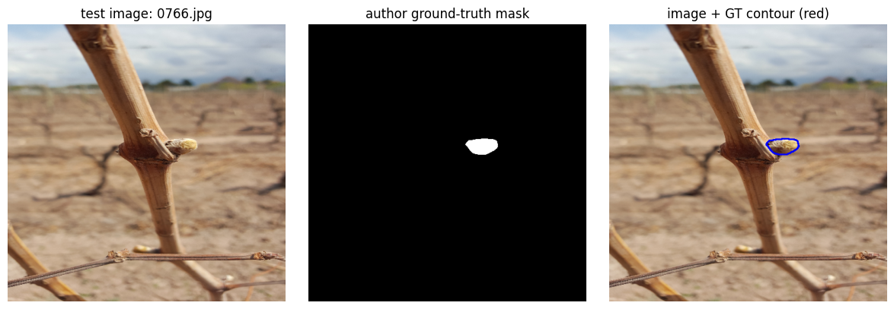
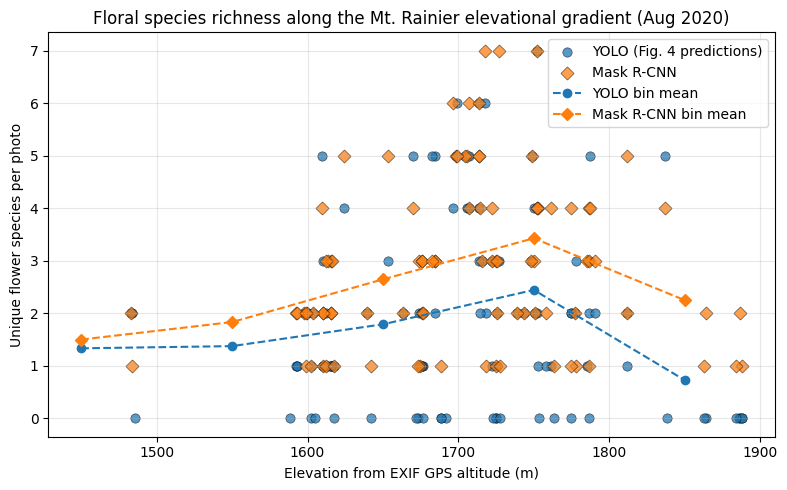
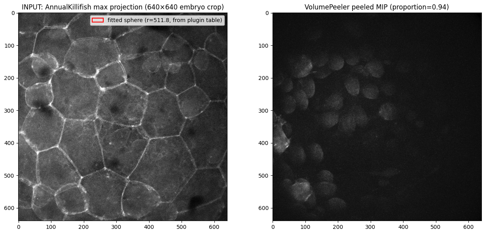
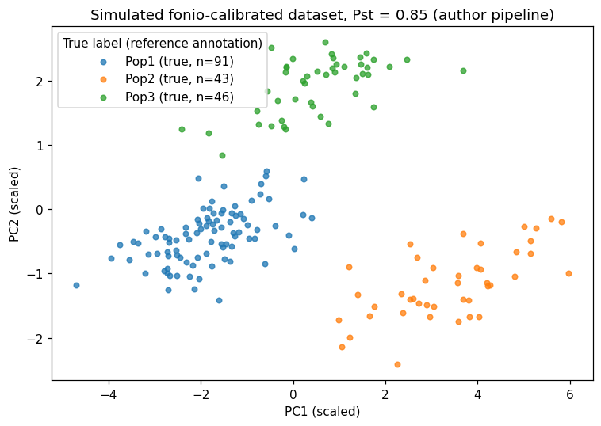
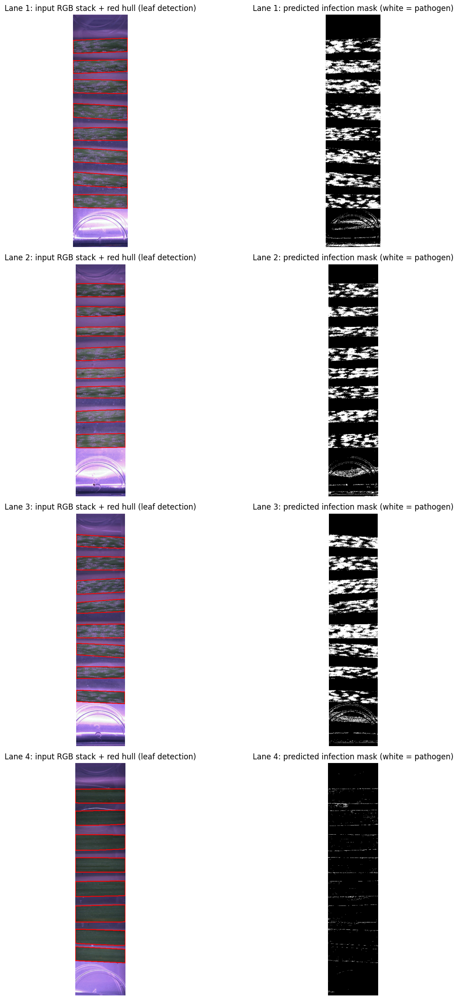

# Notebook catalog — page 5 of 5

[README / recent notebooks](../README.md#notebooks) · [Previous](page-004.md)

Alphabetical entries 201–219 of 219. Generated from publication.json; includes generation conditions and execution previews.

| Paper and run details | Preview |
| --- | --- |
| **Topological properties accurately predict cell division events and organization of shoot apical meristem in Arabidopsis thaliana.** public_id: <code>p-693a2a56425e76b3c425cc929186f228</code>        <b>Generated with:</b> OpenCode · spark-local/GLM-5.3-Flash-EXL3 · variant: low <b>Demonstration:</b> Executed the authors&#x27; WT SAM division-event pipeline (linear-kernel nested SVM, leave-one-plant-out CV, test plants P2/P9) on five precomputed feature sets in the pinned repository; test accuracies exactly match the authors&#x27; archived results and the paper&#x27;s ~76%, at ~5.6 h CPU training time.  <b>Semantic tags:</b> crop:arabidopsis, organ:cell, organ:tissue, task:classification, trait:architecture, trait:growth_development |  Test accuracy per feature set: this notebook&#x27;s run vs. the authors&#x27; archived results (identical), with the paper&#x27;s ~76% reference line. |
| **Towards practical 2D grapevine bud detection with fully convolutional networks** public_id: <code>p-d382c9876e92f6b951898f726878c92e</code>       <b>Generated with:</b> Generation conditions not recorded <b>Demonstration:</b> Inference with the released FCN-MN16s grapevine bud detection weights on the 140 image single bud test split, reproducing the paper detection metrics at IoU 0.5 or higher (recall 88.6 percent, mean TP IoU 83.1 percent). Training and the sliding windows baseline are out of scope.  <b>Semantic tags:</b> crop:grapevine, task:object_detection, task:segmentation |  Test image with the author-provided ground-truth bud mask contour (reference annotation) |
| **Tracking canopy gap dynamics across four sites in the Brazilian Amazon** public_id: <code>p-d258d4f4dcf8eb5d33bc8f892b665c15</code>        <b>Generated with:</b> OpenCode · spark-local/GLM-5.3-Flash-EXL3 · variant: low <b>Demonstration:</b> Executed the pinned author R logic (gap size-class tables, year chi-squared test, transition matrix) on the author-shipped Ducke gap/overlay layers for one Amazon site; other sites and the raw ALS pipeline are out of scope.  <b>Semantic tags:</b> environment:aerial, environment:field, modality:point_cloud, organ:whole_plant, task:time_series, task:tracking, trait:architecture |  Ducke canopy gap counts by size class, 2017 vs 2020 ALS flights |
| **Transfer learning for versatile plant disease recognition with limited data.** public_id: <code>p-fb64b46ffeb504759cfc7addb0e59e60</code>        <b>Generated with:</b> Generation conditions not recorded <b>Demonstration:</b> Executed 20-shot fine-tuning of the released PlantCLEF2022 ViT-Large on CGIARWheat (test top-1 83.0%) versus the same architecture trained from scratch (50.9%), using the author&#x27;s seed-15 split and hyperparameters; single dataset/mode, not a benchmark reproduction.  <b>Semantic tags:</b> task:classification, task:stress_disease, trait:disease_symptoms |  CGIARWheat 20-shot training samples (3 per class) from the author seed-15 split used for fine-tuning. |
| **TTADDA-UAV: A multi-season RGB and multispectral UAV dataset of potato fields collected in Japan and the Netherlands.** public_id: <code>p-cbd73b97da4fe4be89e0a1d69b29641a</code>        <b>Generated with:</b> OpenCode · spark-local/GLM-5.3-Flash-EXL3 · variant: low <b>Demonstration:</b> Loads the TTADDA_NARO_2021 study with the authors&#x27; verbatim MIAPPE loader after a ranged partial download of the 12.6 GB 4TU zip, showing observation units, variables, sensors, ground-truth yield, on-site weather and RGB orthomosaic links; only one small (46 MB) orthomosaic is displayed and ground-coverage comparisons are not executed.  <b>Semantic tags:</b> crop:potato, environment:aerial, environment:field, modality:rgb, modality:spectral, organ:whole_plant, trait:yield |  Smallest RGB orthomosaic of TTADDA_NARO_2021 field F1 (2021-05-18), extracted via HTTP-range partial download and displayed with rasterio |
| **Ultrasonic Sensing of Plant Water Needs for Agriculture.** public_id: <code>p-dc3f89f59fbebda2aed792de1c7d31ab</code>        <b>Generated with:</b> OpenCode · spark-local/GLM-5.3-Flash-EXL3 · variant: low <b>Demonstration:</b> Runs the paper&#x27;s published CT14_GD inverse problem (Sensors 2016 16:1089, Sect. 3.5) on the authors&#x27; sample membrane spectrum, extracting thickness/density/velocity/attenuation close to the authors&#x27; reference output and independent measurements; single generic-plate example, not the paper&#x27;s leaf results.  <b>Semantic tags:</b> crop:coffee, crop:grapevine, organ:leaf, task:morphology, task:physiology, trait:leaf_traits, trait:water_status |  Measured transmission spectrum (circles) versus the gradient-descent-fitted theoretical curve, in the -10 dB fitting band and extrapolated over the full measured range. |
| **Uncertainty Assessment in Deep Learning-based Plant Trait Retrievals from Hyperspectral data** public_id: <code>p-9baad9c5eb312453f79ed213979e5e7e</code>        <b>Generated with:</b> OpenCode · spark-local/GLM-5.3-Flash-EXL3 · variant: low <b>Demonstration:</b> Executed the released Dis_UN pipeline on the EnMAP Leipzig clip: subsample-validated dissimilarity indices, per-trait 95%-quantile uncertainty maps, and veg/non-veg KS OOD contrast (0.675 vs paper 0.648); embedding-space DIs recomputed on a 300-pixel subsample due to free-CPU limits.  <b>Semantic tags:</b> modality:spectral, organ:leaf, organ:whole_plant, task:physiology, trait:leaf_traits, trait:pigment_color, trait:water_status |  EnMAP Leipzig clip (NIR/R/G false color) with Dis_UN 95%-quantile uncertainty maps for LMA, LAI and N (257x226 px, 30 m). |
| **Unravelling the different components of nonphotochemical quenching using a novel analytical pipeline.** public_id: <code>p-914960d699e096d19546d1101dd210a3</code>        <b>Generated with:</b> OpenCode · spark-local/GLM-5.3-Flash-EXL3 · variant: low <b>Demonstration:</b> Executed the Yggdrasill NPQ deconvolution pipeline (PCA, full-harmonic phasor analysis, adapted-ALS NMF) as an AI-assisted Python reimplementation on the authors&#x27; 85-curve wt and 37-curve npq1 datasets; the author implementation is an opaque Windows binary, so results are plausibility-checked against paper text values only.  <b>Semantic tags:</b> crop:arabidopsis, modality:fluorescence, organ:whole_plant, task:physiology, trait:photosynthesis |  wt Arabidopsis NPQ induction curves (85) from the authors&#x27; pinned dataset, coloured by (1-qP)ss |
| **Using machine learning for image-based analysis of sweetpotato root sensory attributes.** public_id: <code>p-8469de70c76a84d7d0e0cef7a5e78faf</code>        <b>Generated with:</b> OpenCode · spark-local/GLM-5.3-Flash-EXL3 · variant: low <b>Demonstration:</b> Reproduces the deployed DigiEye tool&#x27;s inference path (K-means colour heuristic + pickled regressors, YOLOv5 ROI + EfficientNetB5 + gb.pickle mealiness) on one bundled real sample; qualitative only, no ground truth is public.  <b>Semantic tags:</b> environment:laboratory, organ:root, task:physiology, trait:pigment_color |  DigiEye input (cv. NASPOT 10 O boiled roots) with authors&#x27; YOLOv5 root bbox, K-means root mask, and background-removed image. |
| **Using photographs and deep neural networks to understand flowering phenology and diversity in mountain meadows** public_id: <code>p-39c5425f038d55e6b475a2eb722d70be</code>        <b>Generated with:</b> OpenCode · spark-local/GLM-5.3-Flash-EXL3 · variant: low <b>Demonstration:</b> Elevation-floral-richness reproduction (Figs 4A/5-style): parses the authors&#x27; stored YOLO and Mask R-CNN detection outputs from ajijohn/meadowflowers @ e3e82cf, joins them to August-2020 photo EXIF GPS altitude, and recomputes species richness per photo along the 1483-1888 m gradient plus temporal density; CPU-only, no retraining.  <b>Semantic tags:</b> environment:field, modality:rgb, organ:flower, task:object_detection, trait:growth_development |  Floral species richness per photo vs EXIF GPS altitude (Aug 2020, Mt. Rainier): YOLO and Mask R-CNN detections with elevation-bin means; richness peaks near 1700-1800 m. |
| **Variation within laminae: Semi-automated methods for quantifying leaf venation using phenoVein.** public_id: <code>p-668b86393f43ba07d15d1b0dd8036b29</code>        <b>Generated with:</b> OpenCode · spark-local/GLM-5.3-Flash-EXL3 · variant: low <b>Demonstration:</b> Ran the authors&#x27; CompilePhenoVein.R (pinned commit c753f9f) verbatim on their three sample phenoVein CSVs in Colab, reproducing their sample compiled output exactly; the phenoVein segmentation GUI and statistical models remain out of scope.  <b>Semantic tags:</b> modality:microscopy, organ:leaf, task:morphology, trait:leaf_traits |  Areole area distribution per leaf (mm^2) computed in Colab from the compiled phenoVein sample data. |
| **Viral infection impacts the 3D subcellular structure of the abundant marine diatom Guinardia delicatula** public_id: <code>p-39a81e5461357163ba90bf2d25a1f8d6</code>        <b>Generated with:</b> OpenCode · spark-local/GLM-5.3-Flash-EXL3 · variant: low <b>Demonstration:</b> Re-runs the authors&#x27; pinned R scripts on their own intermediate Excel tables to regenerate the paper&#x27;s Figure 1/3/4/5-style morphometry, biovolume/biomass, titer and Fv/Fm panels; upstream confocal/FIJI stages are not reproduced.  <b>Semantic tags:</b> environment:field, modality:microscopy, organ:cell, organ:whole_plant, task:morphology, task:object_detection, task:physiology, task:time_series, trait:architecture, trait:biomass |  Figure 4-style panel: chloroplast sphericity, chloroplast volume and nucleus volume per time point, infected (top) vs control (bottom) |
| **VolumePeeler: a novel FIJI plugin for geometric tissue peeling to improve visualization and quantification of 3D image stacks** public_id: <code>p-b11e2b3b758c4a1c8cfbbc8e2b29230e</code>        <b>Generated with:</b> OpenCode · spark-local/GLM-5.3-Flash-EXL3 · variant: low <b>Demonstration:</b> Headless Colab CPU reproduction of the authors&#x27; VolumePeeler Sphere_Projection on the paper&#x27;s synthetic test volume (RMSE vs published Fig. 2) and a real killifish embryo peel; single minimal example, unstated GUI parameters interpreted as documented.  <b>Semantic tags:</b> modality:microscopy, organ:tissue, task:preprocessing, task:visualization |  AnnualKillifish embryo (authors&#x27; example): input max projection with fitted sphere (r=511.8) vs VolumePeeler peeled projection exposing deeper cells (proportion 0.94). |
| **Wheat grain width: a clue for re-exploring visual indicators of grain weight.** public_id: <code>p-28d396da9e31523d20a4971b9e1cf174</code>        <b>Generated with:</b> OpenCode · spark-local/GLM-5.3-Flash-EXL3 · variant: low <b>Demonstration:</b> Executed the authors&#x27; Visual Grain Analyzer ImageJ macro headlessly in Colab on the three bundled non-touching sample grain images (89/166/408 grains), applying the paper&#x27;s linear MGW prediction formulas; dataset-level statistics and watershed separation of touching grains are not reproduced.  <b>Semantic tags:</b> crop:wheat, environment:field, organ:seed, task:morphology, trait:reproductive_traits |  Bundled sample image A with every grain detected by the VGA macro: centroids (red +) and fitted-ellipse axes (yellow) from the actual result table. |
| **WheatSpikeNet: an improved wheat spike segmentation model for accurate estimation from field imaging.** public_id: <code>p-b2c9032c744812c1d15f35db91dcbfd9</code>        <b>Generated with:</b> OpenCode · spark-local/GLM-5.3-Flash-EXL3 · variant: low <b>Demonstration:</b> Single-image wheat spike instance segmentation and counting (23 spikes) with the authors&#x27; released WheatSpikeNet checkpoint on their bundled demo image via the pinned mmdetection 2.28 stack on a Colab T4; not a dataset-level evaluation.  <b>Semantic tags:</b> crop:wheat, environment:field, organ:inflorescence, task:counting, task:object_detection, task:segmentation, trait:reproductive_traits |  Input demo image (left) and WheatSpikeNet prediction (right): predicted spike masks and boxes overlaid by the authors&#x27; show_result_pyplot. |
| **When to cluster phenotypic data? A simulation-based framework to guide decisions in agrobiodiversity research** public_id: <code>p-8d647b901d53aaa7f73f18ff5e0eafc4</code>        <b>Generated with:</b> OpenCode · spark-local/GLM-5.3-Flash-EXL3 · variant: low <b>Demonstration:</b> Reduced-grid (6 Pst values x 10 replicates) rerun of the authors&#x27; own R simulation-and-11-algorithm clustering benchmark; qualitative detectability pattern reproduced, exact published thresholds not claimed.  <b>Semantic tags:</b> task:classification |  Simulated fonio-calibrated phenotypic dataset (Pst=0.85) generated by the authors&#x27; pipeline, shown in PC1-PC2 space with true population labels |
| **WISER: an innovative and efficient method for correcting population structure in omics-based selection and association studies** public_id: <code>p-f91efd84027a58fbe6f03a9730173049</code>        <b>Generated with:</b> OpenCode · spark-local/GLM-5.3-Flash-EXL3 · variant: low <b>Demonstration:</b> Executed the author&#x27;s wiser R example (pinned commit d467f97): WISER breeding values for Trunk_increment on the embedded 30-genotype apple subset with default ZCA-cor whitening on Colab CPU; not a reproduction of the paper&#x27;s Tables 1-2 benchmark.  <b>Semantic tags:</b> crop:apple, crop:maize, crop:rice, modality:spectroscopy |  Distribution of WISER breeding values (v_hat, Trunk_increment) for the 30-genotype apple subset |
| **YieldLearn: An interpretable machine-learning pipeline for estimating yield-related traits based on physiological indicators** public_id: <code>p-783e81f38f776c444d5960f7c72f2f25</code>        <b>Generated with:</b> OpenCode · spark-local/GLM-5.3-Flash-EXL3 · variant: low <b>Demonstration:</b> Trains the author&#x27;s five caret classifiers for Yield_class High/Low on the YieldLearn example Pocket PEA data and reproduces SHAP interpretation with the committed saved random forest; Yield_class only, single-example scope.  <b>Semantic tags:</b> crop:wheat, environment:field, modality:fluorescence, task:classification, trait:photosynthesis, trait:yield |  SHAP beeswarm of the committed saved random forest for Yield_class, reproduced with the author&#x27;s kernelshap/shapviz parameters. |
| **‘Macrobot’–an automated segmentation-based system for powdery mildew disease quantification** public_id: <code>p-20afe95c7a327d82953a229470490c9b</code>        <b>Generated with:</b> OpenCode 1.18.34 · spark-local/GLM-5.3-Flash-EXL3 · variant: high · reasoning effort: high <b>Demonstration:</b> Runs the author&#x27;s minRGB powdery-mildew pipeline (pinned macrobot commit) on one barley test plate in Colab CPU, scoring 32 leaves into a per-leaf infection CSV and lane prediction masks; one-plate partial demonstration, not the paper&#x27;s 108-plate validation.  <b>Semantic tags:</b> crop:barley, crop:wheat, environment:field, organ:leaf, organ:whole_plant, task:segmentation, task:stress_disease, trait:disease_symptoms, trait:leaf_traits |  Test-plate lanes: input RGB stacks with author-pipeline leaf-detection hulls (red) beside predicted infection masks (white = pathogen). |

[README / recent notebooks](../README.md#notebooks) · [Previous](page-004.md)
