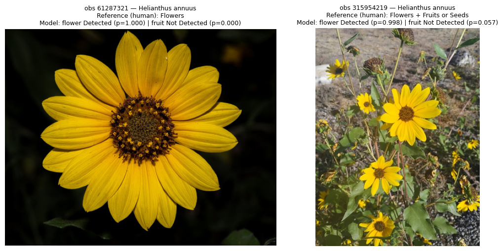
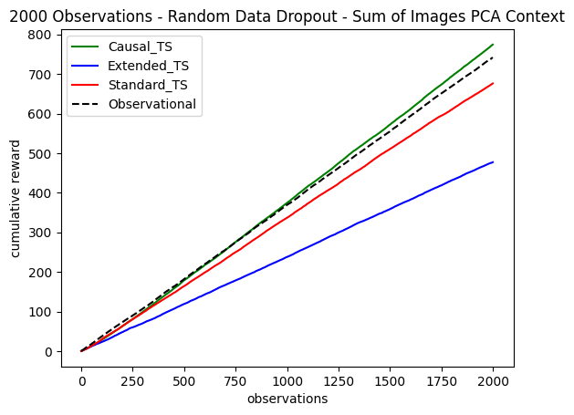
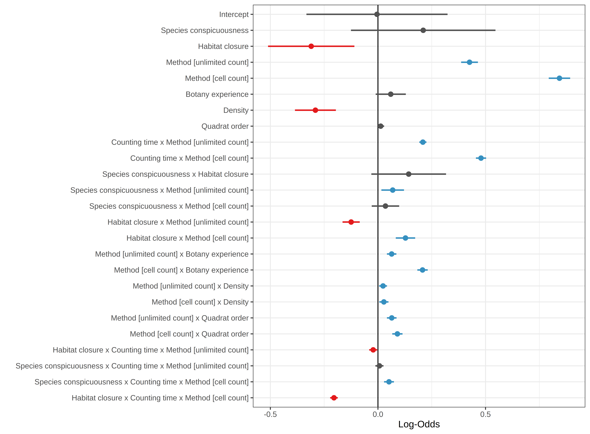
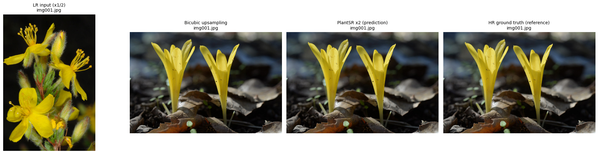
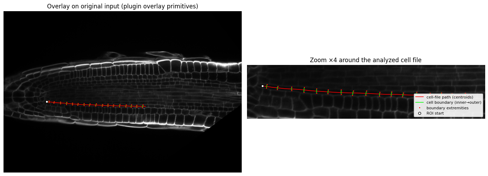
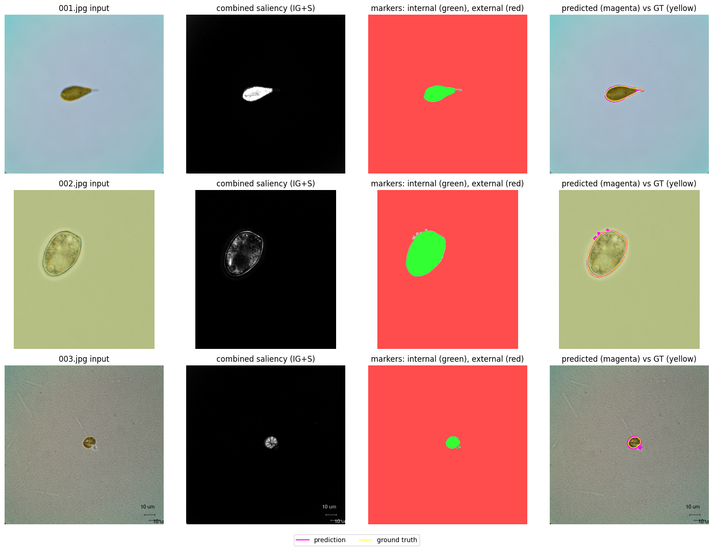
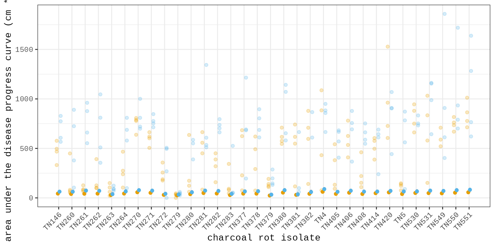
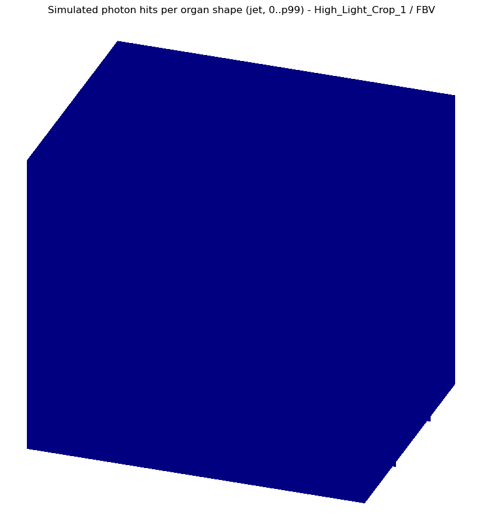

# Notebook catalog — page 5 of 6

[README / notebook index](../README.md#notebooks) · [Previous](page-004.md) · [Next](page-006.md)

Alphabetical entries 201–250 of 295. Generated from publication.json; includes generation conditions and execution previews.

| Paper and run details | Preview |
| --- | --- |
| **Phenotyping grapevine resistance to downy mildew: deep learning as a promising tool to assess sporulation and necrosis.** <b>Journal:</b> Plant Methods <b>Authors:</b> Felicià Maviane Macia · Tyrone Possamai · Marie-Annick Dorne · Marie-Céline Lacombe · Eric Duchêne · Didier Merdinoglu · Nemo Peeters · David Rousseau · Sabine Wiedemann-Merdinoglu public_id: <code>p-83b2a51c60a5a23fa6f5a266fc840633</code>        <b>Generated with:</b> OpenCode · spark-local/GLM-5.3-Flash-EXL3 · variant: low <b>Demonstration:</b> Inference-only partial demonstration: the released Swin CORN scorer (pinned author code and checkpoint) predicts OIV 452-1 ranks for 15 expert-annotated test leaf patches on CPU and T4; it does not reproduce dataset-level metrics or the detector/training pipeline.  <b>Semantic tags:</b> crop:grapevine, organ:leaf, task:classification, task:stress_disease, trait:disease_symptoms |  The 15 selected oiv_test leaf patches with their expert-annotated OIV 452-1 scores |
| **Phenotyping, genome-wide dissection, and prediction of maize root architecture for temperate adaptability.** <b>Journal:</b> iMeta <b>Authors:</b> Weijun Guo · Fanhua Wang · Jianyue Lv · Jia Yu · Yue Wu · Hada Wuriyanghan · Liang Le · Li Pu public_id: <code>p-db3f8be98b089c555cac68adece401c3</code>        <b>Generated with:</b> OpenCode · spark-local/GLM-5.3-Flash-EXL3 · variant: high <b>Demonstration:</b> Reproduces the paper&#x27;s Figure 8 bagged-tree prediction of root projected area and primary root volume from 108 cross-section traits (inference with the authors&#x27; saved models, retraining with the pinned code, and a reduced top-k feature-count experiment) on a Colab CPU runtime; reduced replicate counts and split variance are the main limitations.  <b>Semantic tags:</b> crop:maize, task:morphology, trait:root_architecture |  Predicted vs. observed total root projected area (ProjArea) on the held-out 20% split — retrained caret bagged trees (Figure 8A reproduction); Pearson r = 0.66 (paper: 0.67). |
| **PhenoVision: A framework for automating and delivering research-ready plant phenology data from field images** <b>Journal:</b> openRxiv <b>Authors:</b> Dinnage R, Grady E, Neal N, Deck J, Denny E, Walls R, Seltzer C, Guralnick R, Li D. public_id: <code>p-fe189ca7c3a7f2e045190dd6eff6102d</code>        <b>Generated with:</b> OpenCode 1.18.34 · spark-local/GLM-5.3-Flash-EXL3 · variant: high · reasoning effort: high <b>Demonstration:</b> Runs the published PhenoVision v1.1.0 weights on two CC-licensed iNaturalist sunflower photographs and converts sigmoid outputs to Detected/Not Detected/Equivocal calls with the authors&#x27; threshold/buffer file, compared against human reference annotations; a 2-image demonstration, not a validation of published accuracies.  <b>Semantic tags:</b> environment:field, organ:flower, organ:fruit, organ:leaf, organ:whole_plant, task:classification, task:preprocessing, task:tracking, trait:growth_development |  PhenoVision v1.1.0 flower/fruit probabilities and Detected/Not Detected calls for two iNaturalist sunflower photographs, shown with their human reference phenology annotations. |
| **PhoTorch: a robust and generalized biochemical photosynthesis model fitting package based on PyTorch.** <b>Journal:</b> Photosynthesis Research <b>Authors:</b> Tong Lei · Kyle T. Rizzo · Brian N. Bailey public_id: <code>p-f700126d169c9c1bf30e3739d2d87ac3</code>        <b>Generated with:</b> OpenCode 1.18.34 · spark-local/GLM-5.3-Flash-EXL3 · variant: high · reasoning effort: high <b>Demonstration:</b> Runs the author&#x27;s PhoTorch FvCB example end-to-end: fitting Vcmax25/Jmax25/TPU25/Rd25 per curve plus mesophyll conductance on the repository&#x27;s example A/Ci + light-response dataset, with fitted-versus-measured curve plots; a single-example demo, not the paper&#x27;s dataset-level robustness or speed benchmarks.  <b>Semantic tags:</b> task:physiology, trait:photosynthesis |  Fitted A/Ci curves (lines) over the measured example-data points (dots) from the author&#x27;s dfMAGIC043_lr.csv example, reproduced with PhoTorch at pinned commit e6e4265. |
| **Physiology-Driven Irrigation Scheduling in Ananas comosus via Hybrid Machine Learning: UAV-Based Phenotyping of Water-Related Traits Coupled with FAO-56 Soil Water Balance.** <b>Journal:</b> Plants <b>Authors:</b> Jorge Enrique Chaparro · Jose Edinson Aedo · Nelson Barrera Lombana public_id: <code>p-e88e02e32c4282a27c3e0b0eef2b803f</code>        <b>Generated with:</b> OpenCode · spark-local/GLM-5.3-Flash-EXL3 · variant: low <b>Demonstration:</b> Retrains the released PIML-GB GBM regressor and traffic-light DSS classifier on the pinned Mendeley fused matrix, reproducing the paper&#x27;s R2=0.842/RMSE=0.0705 hold-out regression; UAV image processing and CROPWAT water balance are out of scope.  <b>Semantic tags:</b> crop:pineapple, environment:aerial, environment:field, modality:spectral, organ:whole_plant, task:physiology, trait:water_status |  Traffic-light DSS confusion matrix from the retrained classifier (test split of the released N-row matrix) |
| **Picture-based and conversational decision support to diagnose post-harvest apple diseases** <b>Journal:</b> Expert Systems with Applications <b>Authors:</b> Gabriele Sottocornola · Sanja Baric · Maximilian Nocker · Fabio A. Stella · Markus Zanker public_id: <code>p-b7fc57797741c23192ed81af31b32b4d</code>        <b>Generated with:</b> OpenCode 1.18.34 · spark-local/GLM-5.3-Flash-EXL3 · variant: high · reasoning effort: high <b>Demonstration:</b> Executes the authors&#x27; DSSApple challenge-log bandit simulation (causal vs extended vs standard Thompson-sampling CMAB vs the observational user-intuition baseline, images-PCA context, 20 of the authors&#x27; 100 trials) with the authors&#x27; own recall and paired t-test analysis on a free-tier Colab CPU.  <b>Semantic tags:</b> crop:apple, organ:fruit, task:classification, trait:disease_symptoms |  Average cumulative reward over 2000 observations across 20 trials: causal, extended and standard Thompson-sampling CMAB versus the observational user-intuition baseline (dashed). |
| **Plant cell wall enzymatic deconstruction: Bridging the gap between micro and nano scales.** <b>Journal:</b> Bioresource technology <b>Authors:</b> Refahi Y, Zoghlami A, Viné T, Terryn C, Paës G. public_id: <code>p-4ac8d64107193c40c6d43e0cc1923edd</code>        <b>Generated with:</b> OpenCode · spark-local/GLM-5.3-Flash-EXL3 · variant: low <b>Demonstration:</b> Runs the pinned WallTrack pipeline (segmentation, registration, segmentation propagation, voxel deconstruction map) on the authors&#x27; two-stack demo dataset; partial demonstration only, with matplotlib rendering in place of the BioModLab GUI.  <b>Semantic tags:</b> crop:poplar, modality:microscopy, organ:cell, organ:tissue, task:morphology, task:time_series, task:tracking, trait:architecture |  Deconstruction map z-slices: orange = deconstructed wall voxels, green = wall remaining, over the pre-hydrolysis confocal stack. |
| **Plant, space and time - linked together in an integrative and scalable data management system for phenomic approaches in agronomic field trials** <b>Journal:</b> Plant Methods <b>Authors:</b> Andreas Honecker · Henrik Schumann · Diana Becirevic · Lasse Klingbeil · Kai Volland · Steffi Forberig · Marc Jansen · Hinrich Paulsen · Heiner Kuhlmann · Jens Léon public_id: <code>p-2b2f036450a96d50015e96cdb2b602fa</code>        <b>Generated with:</b> OpenCode · spark-local/GLM-5.3-Flash-EXL3 · variant: low <b>Demonstration:</b> Headless execution of the author&#x27;s pinned CropWatch backend (Node/Express + PostgreSQL/PostGIS) in Colab: the paper&#x27;s published example weather CSV (216 rows x 7 traits) is imported through the author&#x27;s own API flow and queried back (1512 rows); GUI, GeoServer and raster import are not covered and units/coordinates are labeled assumptions.  <b>Semantic tags:</b> environment:field, organ:whole_plant, task:object_detection, task:visualization, trait:yield |  Queried weather measurement series (LTmean/LTmax/LTmin air temperature, NSsum precipitation) after import through the author&#x27;s CropWatch DMIS API; ADAPTED visualization, assumed units. |
| **Plants stand still but hide: Imperfect and heterogeneous detection is the rule when counting plants** <b>Journal:</b> Journal of Ecology <b>Authors:</b> Jan Perret · Aurélien Besnard · Anne Charpentier · Guillaume Papuga public_id: <code>p-02a5940d3fa514def02d03da85db0334</code>        <b>Generated with:</b> OpenCode 1.18.34 · spark-local/GLM-5.3-Flash-EXL3 · variant: high · reasoning effort: high <b>Demonstration:</b> Runs the authors&#x27; pinned R code (commit 304f6cc) to fit their final binomial GLMM of plant-detection probability on their published tidy dataset and reproduces Figure 2 coefficient estimates; partial reproduction only (no raw-data pipeline, Figures 1/3/4, or model selection).  <b>Semantic tags:</b> environment:field, organ:whole_plant, task:counting |  Reproduced Figure 2: standardized log-odds coefficients with 95% CI from the paper&#x27;s final detection GLMM (authors&#x27; own R code and dataset) |
| **Plants stand still but hide: imperfect and heterogeneous detection is the rule when counting plants** <b>Journal:</b> bioRxiv <b>Authors:</b> Perret, J. · Besnard, A. · Charpentier, A. · Papuga, G. public_id: <code>p-cdeb807babf91f2b6fe0f203dd5b5868</code>        <b>Generated with:</b> OpenCode · spark-local/GLM-5.3-Flash-EXL3 · variant: low <b>Demonstration:</b> Reproduces the authors&#x27; final binomial GLMM of individual detection in plant counts, their Figures 2 and 3, and the per-method detection rates (0.44/0.59/0.74) from the pinned public dataset; raw-data formatting, appendices and Figure 4 are out of scope.  <b>Semantic tags:</b> environment:field, organ:whole_plant, task:counting |  Reproduced Figure 3: model-predicted individual detection probability vs counting time for the three counting methods, by species conspicuousness and habitat closure. |
| **PlantSR: Super-Resolution Improves Object Detection in Plant Images** <b>Journal:</b> Journal of Imaging <b>Authors:</b> Tianyou Jiang · Qun Yu · Yang Zhong · Mingshun Shao public_id: <code>p-41ac18c535939dc00012d26edac9c18d</code>        <b>Generated with:</b> OpenCode 1.18.34 · spark-local/GLM-5.3-Flash-EXL3 · variant: high · reasoning effort: high <b>Demonstration:</b> Pretrained PlantSR x2 inference with the authors&#x27; test protocol on 8 official test-split images (PSNR/SSIM vs bicubic plus visual panel); training, the full 200-image benchmark and the counting experiments are not covered.  <b>Semantic tags:</b> crop:apple, crop:soybean, organ:fruit, organ:seed, task:counting, task:object_detection, task:preprocessing |  LR input, bicubic, PlantSR x2 prediction and HR reference for test image img001.jpg (PlantSR +1.47 dB over bicubic) |
| **Predicting Phenotypic Traits Using a Massive RNA-seq Dataset** <b>Journal:</b> Journal not supplied <b>Authors:</b> Hadish JA, Honaas LA, Ficklin SP. public_id: <code>p-1fad5a8aaeb9ad87574e562671e77946</code>        <b>Generated with:</b> OpenCode · spark-local/GLM-5.3-Flash-EXL3 · variant: low <b>Demonstration:</b> Retrains the paper&#x27;s tissue-4 random forest from the authors&#x27; archived MRN BioProject-disjoint split pickle with their exact final hyperparameters; test accuracy 0.9955 / macro F1 0.9968 (paper: 0.994/0.995). Does not reproduce SRA reprocessing, normalization ANOVA, age regression, or later analyses.  <b>Semantic tags:</b> crop:arabidopsis, organ:tissue, task:classification, task:preprocessing, task:time_series, trait:growth_development |  Test-set confusion matrix (Flower/Leaf/Root/Seed) of the reproduced tissue-4 random forest, 300 DPI |
| **Predicting photosynthetic pathway from anatomy using machine learning** <b>Journal:</b> bioRxiv <b>Authors:</b> Gilman, I. S. · Heyduk, K. · Maya-Lastra, C. A. · Hancock, L. P. · Edwards, E. J. public_id: <code>p-aaa04d55ed02d6b59bb4dbe28c44b888</code>        <b>Generated with:</b> OpenCode · spark-local/GLM-5.3-Flash-EXL3 · variant: low <b>Demonstration:</b> Reproduces the paper&#x27;s XGBoost CAM-phenotype classifiers (10-fold CV accuracy 0.958 multiclass / 0.965 binary vs reported 95.7%/96.1%) and the ROS recall improvement on the released 5,745-taxon anatomical dataset; only the supervised-classification subsection, not image phenotyping or phylogenetic analyses.  <b>Semantic tags:</b> organ:cell, organ:leaf, organ:tissue, task:classification, task:morphology, trait:leaf_traits, trait:photosynthesis |  Multiclass XGBoost confusion matrix and feature importance on the pinned CAM anatomy dataset |
| **Predicting plant trait dynamics from genetic markers** <b>Journal:</b> Nature Plants <b>Authors:</b> David Hobby · Hao Tong · Marc C. Heuermann · Alain J Mbebi · Roosa A. E. Laitinen · Matteo Dell’Acqua · Thomas Altmann · Zoran Nikoloski public_id: <code>p-34089365c8e5fb9d8b8e750c505484f8</code>        <b>Generated with:</b> OpenCode · spark-local/GLM-5.3-Flash-EXL3 · variant: low <b>Demonstration:</b> One CV iteration (of the paper&#x27;s 10) of the authors&#x27; maize dynamicGP pipeline: Schur DMD (r=2) plus RR-BLUP prediction of operator entries from 70,846 SNPs; iterative dynamicGP reached 0.447 mean accuracy vs 0.140 for the first-timepoint RR-BLUP baseline on the author validation set.  <b>Semantic tags:</b> crop:arabidopsis, crop:maize, task:time_series, trait:architecture, trait:pigment_color |  Mean prediction accuracy per DAS timepoint (single CV iteration, validation-set genotypes): iterative and recursive dynamicGP versus the first-timepoint RR-BLUP baseline. Additional notebook visualization, not an author figure. |
| **Prediction of fruit shapes in F1 progenies of chili peppers (Capsicum annuum) based on parental image data using elliptic Fourier analysis** <b>Journal:</b> Computers and Electronics in Agriculture <b>Authors:</b> Fumiya Kondo · Yui Kumanomido · Mariasilvia D’Andrea · Valentino Palombo · Nahed Ahmed · Shino Futatsuyama · Kazuhiro Nemoto · Kenichi Matsushima public_id: <code>p-79c33e167e16a3ee77f188c7ec1a8d3d</code>        <b>Generated with:</b> OpenCode 1.18.34 · spark-local/GLM-5.3-Flash-EXL3 · variant: high · reasoning effort: high <b>Demonstration:</b> Executed the authors&#x27; own PPdelta trial R script (pinned commit) on their example .nef EFD data in a fresh Colab CPU runtime, redrawing parental and predicted F1 fruit contours; article-level accuracies remain unverified.  <b>Semantic tags:</b> crop:pepper, organ:fruit |  Parental chili pepper fruit contours reconstructed from the authors&#x27; SHAPE .nef EFD exports: raw per-fruit contours (black) and direction-averaged EFD contours (red) for two parents x two view directions. |
| **Predictions of oil volume in palm fruit and estimates of their ripeness: A comparative study of machine learning algorithms** <b>Journal:</b> Acta Agrobotanica <b>Authors:</b> Sherif Eneye Shuaib · Pakwan Riyapan · Saysunee Jumrat · Yutthapong Pianroj · Jirapond Muangprathub public_id: <code>p-2fefe25503b28bfc4e9dc5bb5e548e9d</code>        <b>Generated with:</b> OpenCode 1.18.34 · spark-local/GLM-5.3-Flash-EXL3 · variant: high · reasoning effort: high <b>Demonstration:</b> Re-runs the paper&#x27;s seven-regressor oil-volume comparison (Table 4) on the published figshare v3 sensor spreadsheet for 30 semi-ripe and 30 unripe palm fruit; the oil-content-by-position branch is out of scope.  <b>Semantic tags:</b> crop:oil_palm, organ:fruit, task:classification, task:yield_biomass, trait:growth_development, trait:reproductive_traits |  Observed Soxhlet oil volume (red) versus each model&#x27;s prediction over all 30 semi-ripe fruit samples |
| **Proximal near-infrared hyperspectral imaging dataset for identifying epicuticular wax loss in Masena blueberries to evaluate post-harvest quality.** <b>Journal:</b> Data in brief <b>Authors:</b> Faisal S, Thawdar Y, Ooi MP, Reutemann P, Fletcher D, Kuang YC, Abeysekera SK. public_id: <code>p-5dc3efaf0691d4ff3f7932753388d892</code>        <b>Generated with:</b> OpenCode 1.18.34 · spark-local/GLM-5.3-Flash-EXL3 · variant: high · reasoning effort: high <b>Demonstration:</b> Pixel-level bloom vs no-bloom classification of one MD5-verified 600 MB &#x27;No EW vs. Perfect EW&#x27; NIR hypercube from the BB-HSI dataset (Data in Brief 2025), following pinned happy-tools reader/model-map semantics; demo metrics only, as the paper is a data release reporting no accuracy.  <b>Semantic tags:</b> crop:blueberry, environment:laboratory, modality:spectral, organ:fruit, task:classification |  Input: band-mean reflectance of the 1046x640x224 &#x27;No EW vs. Perfect EW&#x27; scan (left) with the dataset&#x27;s reference FinalMask annotation (right): blue = Bloom (EW present), red = NoBloom (EW absent). Reference data, not a model output. |
| **Quantification of Cell Division Angles in the Arabidopsis Root.** <b>Journal:</b> Methods in molecular biology (Clifton, N.J.) <b>Authors:</b> Belcram K, Legland D, Pastuglia M. public_id: <code>p-070481a9ada817e77906bdbcf9389030</code>        <b>Generated with:</b> OpenCode 1.18.34 · spark-local/GLM-5.3-Flash-EXL3 · variant: high · reasoning effort: high <b>Demonstration:</b> Headless CPU run of the author&#x27;s Cell File Angles ImageJ plugin (pinned commit) on the plugin&#x27;s own calcofluor Col-0 root test sample, validated against the author&#x27;s JUnit expected label sequence; chapter text is paywalled and the GUI is not reproduced.  <b>Semantic tags:</b> crop:arabidopsis, environment:laboratory, modality:microscopy, organ:cell, organ:root, task:morphology, trait:architecture |  Measurement overlay on the original calcofluor image: cell-file path through centroids (red), inner-to-outer boundary segments (green), boundary extremities (dots) |
| **Quantifying physiological trait variation with automated hyperspectral imaging in rice.** <b>Journal:</b> Frontiers in Plant Science <b>Authors:</b> To‐Chia Ting · Augusto Souza · Rachel K. Imel · Carmela R. Guadagno · Chris Hoagland · Yang Yang · Diane Wang public_id: <code>p-28f074ee4e709feeb203a3120b869fa0</code>        <b>Generated with:</b> OpenCode · spark-local/GLM-5.3-Flash-EXL3 · variant: low <b>Demonstration:</b> Executes the authors&#x27; R RReliefF-PLSR pipeline for leaf nitrogen from Week-9 side-view hyperspectral reflectance (70/18 split, 400 wavelengths, LOO-selected 6 components); validation R2 0.758 / RMSEP 0.268 vs the paper&#x27;s 0.797 / 0.264, CPU-only, single-trait scope.  <b>Semantic tags:</b> crop:rice, modality:spectral, organ:leaf, organ:whole_plant, task:classification |  Predicted vs observed leaf nitrogen (%) on the 18-sample validation set with jackknife confidence intervals (blue TRJ, red IND; open circles N2, filled N1) |
| **Rapid non-destructive method to phenotype stomatal traits** <b>Journal:</b> bioRxiv <b>Authors:</b> Pathoumthong, P. · Zhang, Z. · Roy, S. · El Habti, A. public_id: <code>p-fd6547e68e447695b47e63419be8b4a3</code>        <b>Generated with:</b> Generation conditions not recorded <b>Demonstration:</b> Executed the authors&#x27; Wheat 400x pipeline (YOLOv5 detection, bounding-box extraction, Detectron2 Mask R-CNN measurement) on one sample handheld-microscope image; single-image demonstration, not dataset-level validation.  <b>Semantic tags:</b> crop:arabidopsis, crop:rice, crop:tomato, crop:wheat, environment:field, modality:microscopy, organ:leaf, organ:stomata, organ:whole_plant, task:counting, task:morphology, task:object_detection, trait:growth_development, trait:photosynthesis, trait:stomatal_traits, trait:water_status |  Input Wheat 400x handheld-microscope image (left) with YOLOv5 stomata detections (right, model predictions, conf 0.4) |
| **Raspberry Pi-powered imaging for plant phenotyping.** <b>Journal:</b> Applications in Plant Sciences <b>Authors:</b> José C. Tovar · J. Steen Hoyer · Andy Lin · Allison Tielking · Steven T. Callen · S. Elizabeth Castillo · Michael D. Miller · Monica Tessman · Noah Fahlgren · James C. Carrington · Dmitri A. Nusinow · Malia Gehan public_id: <code>p-59fad09308b383d488e949a8fb42837b</code>        <b>Generated with:</b> OpenCode · spark-local/GLM-5.3-Flash-EXL3 · variant: low <b>Demonstration:</b> One-image PlantCV 4.x port of the paper&#x27;s Appendix 2 time-lapse example: segments the repository&#x27;s Arabidopsis flat photo, selects one plant, and extracts Tough-Spot-scaled area/shape/color traits; single-example partial demonstration, no accuracy benchmark.  <b>Semantic tags:</b> organ:seed, organ:whole_plant, task:morphology, trait:architecture, trait:pigment_color, trait:plant_height |  PlantCV analyze.size output: selected plant crop with measured shape traits drawn in magenta (area, hull, ellipse, centroid). |
| **Rating Pome Fruit Quality Traits Using Deep Learning and Image Processing** <b>Journal:</b> Journal not supplied <b>Authors:</b> Nhan H. Nguyen · Joseph Michaud · René Mogollón · Huiting Zhang · Heidi L. Hargarten · Rachel S. Leisso · Carolina A. Torres · Loren A. Honaas · Stephen Patrick Ficklin public_id: <code>p-976ab37dbd74e4ac6793ec6fce37e741</code>        <b>Generated with:</b> OpenCode 1.18.34 · spark-local/GLM-5.3-Flash-EXL3 · variant: high · reasoning effort: high <b>Demonstration:</b> Executed the pinned Granny v1.1.0 starch-area module (author code, commit 411a6482) on 18 author-provided iodine-stained apple cross-sections in a Colab CPU runtime, producing starch-area ratings, 8 chart indices and mask overlays; human-validation datasets and the other modules are out of scope.  <b>Semantic tags:</b> crop:apple, crop:pear, organ:fruit, task:classification, trait:disease_symptoms, trait:pigment_color |  Iodine-stained apple cross-section input (left) and Granny v1.1.0 starch mask overlay (right); dark shading is the module&#x27;s detected starch area, not an author annotation. |
| **Reciprocal BLUP: A Predictability-Guided Multi-Omics Framework for Plant Phenotype Prediction.** <b>Journal:</b> Plants <b>Authors:</b> Hayato Yoshioka · Gota Morota · Hiroyoshi Iwata public_id: <code>p-66b346f895818d607747eca86f411abc</code>        <b>Generated with:</b> OpenCode · spark-local/GLM-5.3-Flash-EXL3 · variant: low <b>Demonstration:</b> Executed the authors&#x27; pinned R/RAINBOWR pipeline on the drought soybean panel: 265-metabolite BLUP predictability (genome and microbiome kernels) and a GBLUP vs top-25% MetBLUP 5-fold-CV phenotype comparison; single seed, single environment.  <b>Semantic tags:</b> crop:soybean, organ:whole_plant, task:yield_biomass, trait:biomass, trait:stress_response |  Drought phenotype prediction: mean 5-fold CV correlation per trait for GBLUP versus MetBLUP kernels built from the top 25% genome- and microbiome-predictable metabolites (executed run, seed 123). |
| **Registration of spatio-temporal point clouds of plants for phenotyping.** <b>Journal:</b> PLoS ONE <b>Authors:</b> Nived Chebrolu · Federico Magistri · Thomas Läbe · Cyrill Stachniss public_id: <code>p-40268bb6a161b9ba8f5788fd628251c1</code>        <b>Generated with:</b> OpenCode · spark-local/GLM-5.3-Flash-EXL3 · variant: low <b>Demonstration:</b> Runs the authors&#x27; HMM skeleton matching, iterative non-rigid registration, and point-cloud deformation on one maize scan pair with the pinned author code; our transforms match the shipped reference to 3.6e-5, but SVM segmentation/SOM skeleton extraction and dataset-level results are out of scope.  <b>Semantic tags:</b> modality:point_cloud, organ:whole_plant, task:registration, task:skeletonization, task:time_series |  Deformed 2020-03-13 maize point cloud (blue) registered onto the 2020-03-14 target scan (red) after skeleton-based non-rigid registration |
| **Remote sensing and machine learning for yield prediction of lowland paddy crops** <b>Journal:</b> F1000Research <b>Authors:</b> Septem Riza L, Yudianita AH, Nugraha E, Somantri L, Sitanggang IS, Abu Samah KAF, Nazir S. public_id: <code>p-da8b7fe022c16f028b094d90ebcf00fd</code>        <b>Generated with:</b> Generation conditions not recorded <b>Demonstration:</b> Retrains the authors&#x27; Gradient Boosting Regressor on the paper&#x27;s published 267-row dataset (best scenario: 2000 estimators, lr 0.001, depth 4) and recomputes test RMSE against the reported 9766.72 quintal; ENVI remote-sensing preprocessing and the 90-scenario sweep are out of scope.  <b>Semantic tags:</b> crop:rice, environment:field, organ:whole_plant, trait:yield |  Observed vs predicted paddy yield (quintal) on the 53-row test split, authors&#x27; scatter plot with recomputed RMSE |
| **RetOCTNet: Deep Learning–Based Segmentation of OCT Images Following Retinal Ganglion Cell Injury** <b>Journal:</b> Translational Vision Science &amp; Technology <b>Authors:</b> Gabriela Sanchez-Rodriguez · Linjiang Lou · Machelle T. Pardue · Andrew J. Feola public_id: <code>p-7516120ffdbb96b635da0d88bf46d6b8</code>        <b>Generated with:</b> OpenCode 1.18.34 · spark-local/GLM-5.3-Flash-EXL3 · variant: high · reasoning effort: high <b>Demonstration:</b> Pretrained RetOCTNet inference with the authors&#x27; unchanged code on four author-provided rat radial OCT B-scans, producing per-A-scan RNFL and retinal thickness in pixels; dataset-level accuracy is not reproduced (annotations not public). |  Input radial OCT B-scan with RetOCTNet prediction overlay (black=background, grey=RNFL, white=retina) - model output, not a reference annotation. |
| **RGB imaging and computer vision-based approaches for identifying spike number loci for wheat.** <b>Journal:</b> Plant phenomics (Washington, D.C.) <b>Authors:</b> Li L, Hassan MA, Wang D, Wan G, Beegum S, Rasheed A, Xia X, He Y, Zhang Y, He Z, Liu J, Xiao Y. public_id: <code>p-7d625010ddd4b31654968ecaabf340a2</code>        <b>Generated with:</b> OpenCode 1.18.34 · spark-local/GLM-5.3-Flash-EXL3 · variant: high · reasoning effort: high <b>Demonstration:</b> Inference-only YOLOX-P spike detection and counting with the authors&#x27; pinned Keras code and released checkpoints on three released CD/DD/XA canopy images, compared against released VOC annotations; single-image scale only, no dataset-level mAP or QTL reproduction.  <b>Semantic tags:</b> crop:wheat, modality:rgb, organ:inflorescence, task:counting, task:object_detection, trait:reproductive_traits |  Released CD, DD and XA canopy images with the authors&#x27; ground-truth spike bounding boxes (green) and per-image annotated spike counts. |
| **RhizoVision Explorer: open-source software for root image analysis and measurement standardization.** <b>Journal:</b> AoB PLANTS <b>Authors:</b> Seethepalli A, Dhakal K, Griffiths M, Guo H, Freschet GT, York LM. public_id: <code>p-b14550f882c89332ee9aeb58cdb49bba</code>        <b>Generated with:</b> OpenCode · spark-local/GLM-5.3-Flash-EXL3 · variant: low <b>Demonstration:</b> Regenerates the paper&#x27;s statistical validation (copper-wire RMSE/MBE, simulated-root and species software comparisons) from the authors&#x27; Zenodo data+code deposit on a fresh CPU Colab runtime; the RVE image-analysis GUI itself is not re-run and a missing ground-truth .Rdata is reconstructed from the cited Rose &amp; Lobet 2019 record.  <b>Semantic tags:</b> environment:laboratory, organ:root, task:morphology, trait:root_architecture |  Regenerated copper-wire validation: estimated vs ground-truth length, average diameter, surface area and volume for RVE, WinRhizo and IJ_Rhizo (Fig. 4-style 4-panel comparison). |
| **Robust and automatic cell detection and segmentation from microscopic images of non‐setae phytoplankton species** <b>Journal:</b> IET Image Processing <b>Authors:</b> Haiyong Zheng · Nan Wang · Zhibin Yu · Zhaorui Gu · Bing Zheng public_id: <code>p-6f6f91d8a594aba5c651095e6036dbd9</code>        <b>Generated with:</b> OpenCode 1.18.34 · spark-local/GLM-5.3-Flash-EXL3 · variant: high · reasoning effort: high <b>Demonstration:</b> AI-assisted Python port of the ACDS MATLAB marker-controlled watershed pipeline, executed on three benchmark single-cell phytoplankton images and compared with the authors&#x27; ground-truth masks (IoU 0.91/0.98/0.75); single-example scope, paper&#x27;s PRF/MHD metrics not reproduced.  <b>Semantic tags:</b> modality:microscopy, organ:cell, task:object_detection, task:segmentation |  ACDS single-cell samples: inputs, combined IG+saturation saliency maps, watershed markers, and predicted cell boundaries (magenta) versus the authors&#x27; ground-truth boundaries (yellow). |
| **Root phenotypic detection of different vigorous maize seeds based on Progressive Corrosion Joining algorithm of image.** <b>Journal:</b> Plant methods <b>Authors:</b> Lu W, Li Y, Deng Y. public_id: <code>p-2edda3dbdfadc4a75a267219d46751a5</code>        <b>Generated with:</b> OpenCode · spark-local/GLM-5.3-Flash-EXL3 · variant: low <b>Demonstration:</b> PCJ repair (thinning, progressive-corrosion splitting, adapted matching d1-d4, quintic joining) of one maize root image with pixel-unit RTN/RTL/RTW/REL; AI-assisted C++ port, single sample only.  <b>Semantic tags:</b> crop:maize, environment:laboratory, organ:root, task:morphology, task:reconstruction, trait:root_architecture |  Binarized input, PCJ-repaired result, and author-processed reference for sample test_1 |
| **Root Phenotyping Using Pose Estimation** <b>Journal:</b> Journal not supplied <b>Authors:</b> Elizabeth M. Berrigan · Lin Wang · Hannah Carrillo · Kimberly Echegoyen · Mikayla Kappes · Jorge Torres · Angel Ai-Perreira · Erica McCoy · Emily Shane · Charles Copeland · Lauren Ragel · Charidimos Georgousakis · Sang‐Hwa Lee · Dawn Reynolds · Avery Talgo · Juan Gonzalez · Ling Zhang · Ashish B. Rajurkar · M. Lozano Ruiz · Erin Daniels · Liezl Maree · Shree R. Pariyar · Wolfgang Busch · Talmo Pereira public_id: <code>p-ca62c72d99e31786d8df4af17a50ccc1</code>        <b>Generated with:</b> OpenCode · spark-local/GLM-5.3-Flash-EXL3 · variant: low <b>Demonstration:</b> Reproduces the paper&#x27;s dicot trait-extraction stage with sleap-roots DicotPipeline on the authors&#x27; 919QDUH canola fixture (72 frames), matching the authors&#x27; reference trait CSV; SLEAP inference and dataset-level results are not included.  <b>Semantic tags:</b> organ:root, task:classification, task:morphology, task:pose, trait:root_architecture |  919QDUH frame 0 RADICYL gel-cylinder image with the authors&#x27; SLEAP-predicted primary (orange) and lateral (cyan) root landmarks |
| **RoPod, a customizable toolkit for non-invasive root imaging, reveals cell type-specific dynamics of plant autophagy** <b>Journal:</b> bioRxiv <b>Authors:</b> Guichard, M. · Holla, S. · Wernerova, D. · Grossmann, G. E. A. · Minina, A. E. A. public_id: <code>p-872c60a837cfc85bf84b37dde14e20de</code>        <b>Generated with:</b> OpenCode · spark-local/GLM-5.3-Flash-EXL3 · variant: low <b>Demonstration:</b> Reproduces the paper&#x27;s semi-automated Fiji root-hair tip tracking pipeline (Fig. 2) as a Python port on the authors&#x27; published example image (5 hairs, 34 frames); rates agree with the authors&#x27; example results within ~7% (one shortest-window hair ~17%), single-example scope only.  <b>Semantic tags:</b> crop:arabidopsis, environment:laboratory, modality:microscopy, organ:cell, organ:root, task:time_series, trait:growth_development |  Example RoPod time-lapse input (frames 1 and 34) with the authors&#x27; five hair-selection ROI lines drawn on the last frame. |
| **Scaling photosynthetic function and CO 2 dynamics from leaf to canopy level for maize - dataset combining diurnal and seasonal measurements of vegetation fluorescence, reflectance and vegetation indices with canopy gross ecosystem productivity.** <b>Journal:</b> Data in brief <b>Authors:</b> Campbell P, Middleton E, Huemmrich K, Ward L, Julitta T, Yang P, van der Tol C, Daughtry C, Russ A, Alfieri J, Kustas W. public_id: <code>p-2313f06d496c5a417df30f736068f32e</code>        <b>Generated with:</b> OpenCode · spark-local/GLM-5.3-Flash-EXL3 · variant: low <b>Demonstration:</b> Reprocessed one day (DOY 192) of raw FLoX maize canopy spectra into reflectance, SIF and vegetation indices with the authors&#x27; pinned R packages; cycle-level reflectance matches the authors&#x27; own processed file (r=0.99), while their unreleased smoothing/interpolation steps bound the 30-minute comparison.  <b>Semantic tags:</b> crop:maize, environment:field, modality:fluorescence, organ:leaf, organ:whole_plant, task:physiology, task:time_series, trait:photosynthesis |  Cycle-level reflectance reproduced with the pinned author R code vs the authors&#x27; processed FLOX_R sheet (450/700/750 nm, 770 cycles, r=0.99) |
| **Seed Morphology in Key Spanish Grapevine Cultivars** <b>Journal:</b> Journal not supplied <b>Authors:</b> Cervantes E, Martín-Gómez JJ, Espinosa Roldán FE, Muñoz Organero G, Tocino Á, Cabello Sáenz de Santamaría F. public_id: <code>p-02f6f83e31a71dc69ce32db56b013ca3</code>        <b>Generated with:</b> Generation conditions not recorded <b>Demonstration:</b> Seed silhouette/model overlap and J-index for Albillo Real (30 seeds). Single-cultivar demo; scale-calibration discrepancy is documented.  <b>Semantic tags:</b> crop:grapevine, organ:seed, task:classification, task:morphology, trait:reproductive_traits |  Grapevine seed image and model overlap |
| **SeedGerm-VIG: an open and comprehensive pipeline to quantify seed vigor in wheat and other cereal crops using deep learning-powered dynamic phenotypic analysis.** <b>Journal:</b> GigaScience <b>Authors:</b> Dai J, Wen Z, Ali M, Huang J, Liu S, Zhao J, Pinheiro F, Yang C, Wang B, Ye L, Guan X, Zhou J. public_id: <code>p-5cde365672db8ac0d0a4a5592fc30d2e</code>        <b>Generated with:</b> OpenCode · spark-local/GLM-5.3-Flash-EXL3 · variant: high <b>Demonstration:</b> Executed the released SeedGerm-VIG pipeline (U-Net masks, YOLOv8x-Germ phase detection, temporal phase correction, skeleton root tracking) on the authors&#x27; G7 wheat example in Colab on T4; outputs match pinned reference masks (IoU 0.94-0.99) with small framework-version differences; single-genotype example only.  <b>Semantic tags:</b> crop:barley, crop:rice, crop:wheat, organ:root, organ:seed, task:object_detection, task:segmentation, task:time_series, trait:growth_development |  G7 final frame: original input, predicted YOLOv8x-Germ phase boxes, and seed masks predicted (cyan) vs pinned reference (yellow) |
| **SeedGerm: a cost‐effective phenotyping platform for automated seed imaging and machine‐learning based phenotypic analysis of crop seed germination** <b>Journal:</b> New Phytologist <b>Authors:</b> Joshua Colmer · Carmel M. O&#x27;Neill · Rachel Wells · Aaron Bostrom · Daniel Reynolds · Danny Websdale · Gagan Shiralagi · Wei Lu · Qiaojun Lou · Thomas Le Cornu · Joshua Ball · Jim Renema · Gema Flores Andaluz · Rene Benjamins · Steven Penfield · Ji Zhou public_id: <code>p-4b9e17d68a546cca54a31f48c22f9375</code>        <b>Generated with:</b> OpenCode · spark-local/GLM-5.3-Flash-EXL3 · variant: low <b>Demonstration:</b> Runs the pinned SeedGerm author pipeline end-to-end on the released tomato image series (167 hourly frames, 6 panels x 64 seeds) in Colab CPU, regenerating the germination CSVs and figures; GUI-only YUV slider values are replaced by a documented automatic threshold and per-panel germination fractions of 0.92-1.00 were observed.  <b>Semantic tags:</b> crop:barley, crop:maize, crop:pepper, crop:rapeseed, crop:tomato, environment:field, environment:greenhouse, organ:seed, organ:whole_plant, trait:growth_development |  Per-panel cumulative germination (SeedGerm pipeline output, tomato release v0.1.1 series) |
| **SEGMENT3D: A web-based application for collaborative segmentation of 3D images used in the shoot apical meristem** <b>Journal:</b> 2018 IEEE 15th International Symposium on Biomedical Imaging (ISBI 2018) <b>Authors:</b> Thiago V Spina · Johannes Stegmaier · Alexandre X. Falcao · Elliot Meyerowitz · Alexandre Cunha public_id: <code>p-46adbc3add7744936da1500b4bcd5ee3</code>        <b>Generated with:</b> OpenCode 1.18.34 · spark-local/GLM-5.3-Flash-EXL3 · variant: high · reasoning effort: high <b>Demonstration:</b> Headless CPU replay of SEGMENT3D&#x27;s IFT-SC correction of one embedded 60^3 meristem tile with the authors&#x27; pinned JavaScript, including one demonstrated DIFT-SC scribble correction; GUI, server, and user studies are out of scope.  <b>Semantic tags:</b> task:segmentation |  tile_00417 confocal meristem tile slices with the shipped pre-segmentation region borders (reference annotation) overlaid in red |
| **Self-pollinated cannabis seeds lead to less variation in shape: a technological approach of potential commercial interest.** <b>Journal:</b> BMC plant biology <b>Authors:</b> Torne FF, Idaszkin YL, Bigatti G, Navarro P, González-José R, Márquez F. public_id: <code>p-ea84fdc23cbdb4fa43830b2262339c66</code>        <b>Generated with:</b> OpenCode · spark-local/GLM-5.3-Flash-EXL3 · variant: low <b>Demonstration:</b> Retrains the paper&#x27;s four scikit-learn cultivar classifiers and the GridSearchCV-optimized Random Forest on the released 713-seed landmark coordinates, reproducing ~70% (7 cultivars) and ~78.9% (5 cultivars) test accuracy with confusion matrices and PC1/PC2 variability heatmaps; the paper&#x27;s desktop morphometrics stages (TPS, GPA, MorphoJ/InfoStat) are out of scope.  <b>Semantic tags:</b> organ:seed, task:classification, task:morphology, trait:reproductive_traits |  All 713 seed outlines drawn from the released raw landmark coordinates (authors&#x27; 00-dataset.ipynb rendering), the actual input of the reproduction. |
| **Self-supervised Representation Learning for Reliable Robotic Monitoring of Fruit Anomalies** <b>Journal:</b> arXiv <b>Authors:</b> Taeyeong Choi · Owen Would · Adrian Salazar-Gomez · Grzegorz Cielniak public_id: <code>p-65add3f3d49ff5dae3a1f577c49310dc</code>        <b>Generated with:</b> OpenCode 1.18.34 · spark-local/GLM-5.3-Flash-EXL3 · variant: high · reasoning effort: high <b>Demonstration:</b> Trains the CH-Rand self-supervised classifier on normal Ripe strawberries (Riseholme-2021 Split1) and evaluates kNN anomaly detection on the held-out test normals plus all 153 anomalous strawberries (k=1 ROC 0.924 vs paper 0.920); single seeded run with a 300-epoch cap, not the full 3-run/1500-epoch protocol.  <b>Semantic tags:</b> crop:strawberry, modality:rgb, organ:fruit, task:stress_disease, trait:pigment_color |  A real Ripe strawberry input (left) and its 26 possible CH-Rand channel randomisations - the self-supervised pretext transform the classifier learns to detect. |
| **Semi-automated high content analysis of pollen performance using tubetracker.** <b>Journal:</b> Plant reproduction <b>Authors:</b> Ouonkap SVY, Oseguera Y, Okihiro B, Johnson MA. public_id: <code>p-cb702ccf3249852f0a993bad5fd464be</code>        <b>Generated with:</b> OpenCode · spark-local/GLM-5.3-Flash-EXL3 · variant: low <b>Demonstration:</b> Headless run of the authors&#x27; TubeTracker pipeline (segmentation, grain detection, segment-edge tips, tip-overlap germination, motpy elongation) on the bundled 129-frame sample_movie.avi; single-example demo with uncalibrated units, not the six-cultivar validation.  <b>Semantic tags:</b> crop:tomato, organ:flower, task:morphology, task:time_series, trait:reproductive_traits |  TubeTracker track overlay on a sample-movie frame (author draw_results output) |
| **SeptoSympto: A high-throughput image analysisof Septoria tritici blotch disease symptoms using deep learning methods** <b>Journal:</b> Research Square <b>Authors:</b> Laura Mathieu · Maxime Reder · Ali Siah · Aurélie Ducasse · Camilla Langlands-Perry · Thierry C. Marcel · Jean‐Benoit Morel · Cyrille Saintenac · Elsa Ballini public_id: <code>p-f5cc2b2abde4aecd698ddbc66195da9a</code>        <b>Generated with:</b> OpenCode · spark-local/GLM-5.3-Flash-EXL3 · variant: low <b>Demonstration:</b> Runs the authors&#x27; pinned SeptoSympto script (U-Net necrosis + YOLOv5 pycnidia inference) unchanged on two author-provided leaf images on CPU; raw 1200-dpi A4 scans are not public, so published evaluation-set JPGs are used.  <b>Semantic tags:</b> crop:wheat, organ:leaf, task:object_detection, task:segmentation, task:stress_disease, trait:disease_symptoms |  Author leaf image with SeptoSympto overlay: green necrosis contours and magenta pycnidia detections |
| **Severity of Charcoal Rot Disease in Soybean Genotypes Inoculated with Macrophomina phaseolina Isolates Differs Among Growth Environments.** <b>Journal:</b> Plant disease <b>Authors:</b> Mengistu A, Read Q, Little C, Kelly H, Henry P, Bellaloui N. public_id: <code>p-4bc0dbba55a72fa4a802dc0793c0244c</code>        <b>Generated with:</b> OpenCode 1.18.34 · spark-local/GLM-5.3-Flash-EXL3 · variant: high · reasoning effort: high <b>Demonstration:</b> Executes the authors&#x27; Bayesian AUDPC mixed model, per-draw 1-D clustering classification, and data/model figures for the 32-isolate growth-chamber cut-tip experiment on a Colab CPU runtime (single-experiment partial demonstration; other experiments and the paywalled paper text are out of scope).  <b>Semantic tags:</b> crop:soybean, environment:field, environment:greenhouse, environment:growth_chamber, organ:stem, task:classification, trait:disease_symptoms |  Growth-chamber cut-tip experiment: observed AUDPC points with the authors&#x27; model-predicted marginal means (95% intervals and medians) per isolate, colored by literature resistance class (MR = DT974290, S = LS980358). |
| **Simulating light quantity and quality over plant organs using a ray-tracing method to investigate plant responses in growth chambers** <b>Journal:</b> Biosystems engineering. <b>Authors:</b> Demotes-Mainard S, Autret H, Pradal C, Le Gall J, Guérin V, Leduc N, Combes D, Renaud C, Chelle M, Bertheloot J. public_id: <code>p-7256f0954965a1ae9610b7521b5418c9</code>       <b>Generated with:</b> OpenCode 1.18.34 · spark-local/GLM-5.3-Flash-EXL3 · variant: high · reasoning effort: high <b>Demonstration:</b> Partial CPU reproduction of the paper&#x27;s SEC2 virtual-experiment step: the pinned openalea/rose High_Light_Crop_1/FBV rose mock-up is reconstructed in the chamber and solved with openalea.spice 1.1.1 photon mapping (1e6 photons) for relative per-organ light interception; lamp-spectrum calibration and measured-data validation are out of scope.  <b>Semantic tags:</b> environment:growth_chamber, modality:spectral, task:preprocessing |  Organ-scale light map: the reconstructed High_Light_Crop_1/FBV rose mock-up in the chamber, coloured by simulated photon hits per organ shape (jet, 0..p99); notebook-created visualisation, not an author figure. |
| **Simultaneous and Dynamic Super-Resolution Imaging of Two Proteins in Arabidopsis thaliana using dual-color sptPALM** <b>Journal:</b> bioRxiv <b>Authors:</b> Rohr L, Rausch L, Ehinger A, Burmeister NG, Meixner AJ, Kemmerling B, Harter K, zur Oven-Krockhaus S. public_id: <code>p-ba72ff372a5624ef5f676f99fee55860</code>        <b>Generated with:</b> OpenCode · spark-local/GLM-5.3-Flash-EXL3 · variant: low <b>Demonstration:</b> Partial CPU reproduction of the paper&#x27;s Figure 5C dual-color sptPALM diffusion statistics: per-cell log10(D) Gaussian peak fits (exact port of OneFlowTraX batchAnalysis.m) and Shapiro-Wilk/Kruskal-Wallis reanalysis of the authors&#x27; deposited batch results; the upstream MATLAB localization/tracking pipeline is out of scope.  <b>Semantic tags:</b> crop:arabidopsis, crop:tobacco, environment:laboratory, modality:microscopy, organ:cell, task:tracking, task:visualization |  Per-cell log10(D) distributions with Gaussian fits for the six Figure 5C conditions (BRI1 and RLP44, each PA-GFP/PATagRFP/mEos3.2) |
| **SISE, free LabView-based software for ion flux measurements.** <b>Journal:</b> Plant methods <b>Authors:</b> Ahmad N, Tennakoon K, Hedrich R, Huang S, Roelfsema MRG. public_id: <code>p-bd05a2d6963ba75f77fd9068930fe41a</code>        <b>Generated with:</b> OpenCode · spark-local/GLM-5.3-Flash-EXL3 · variant: low <b>Demonstration:</b> Executed an AI-assisted Python port of the SISE-Analyser110 drift-corrected dV, cylinder geometry correction, and chemical-potential vs Fick K+ flux calculations on a clearly labeled synthetic SISE-Monitor-format recording; the authors&#x27; recorded data file and Windows/LabView executables were unavailable.  <b>Semantic tags:</b> task:physiology |  Synthetic-demo K+ fluxes at a barley root: chemical potential (Newman), diffusion gradient (Fick), and C1-corrected chemical potential vs time |
| **Spatial analysis of cell patterning to aid genetic and phenotypic understanding of grass stomatal density: A case study in maize** <b>Journal:</b> The Plant Phenome Journal <b>Authors:</b> John G. Hodge · Andrew D.B. Leakey public_id: <code>p-53f95a3aee70cb34c44b841dc78ab66c</code>        <b>Generated with:</b> Generation conditions not recorded <b>Demonstration:</b> Executed the pySPP SPP pipeline (ranked Manhattan NN, KDD heatmap, trait extraction, random-null OEScore) on the authors&#x27; shipped maize example; single genotype/replicate only — no SEM/QTL or population-level results.  <b>Semantic tags:</b> crop:maize, organ:stomata, task:morphology, trait:stomatal_traits |  SPP kernel density heatmap (±150 µm, 1 µm² kernels) for maize genotype Z019E0047 with two in-file neighbor hotspots flanking the origin. |
| **Spatial ploidy inference using quantitative imaging** <b>Journal:</b> bioRxiv <b>Authors:</b> Russell, N. J. · Belato, P. B. · Oliver, L. S. · Chakraborty, A. · Roeder, A. H. K. · Fox, D. T. · Formosa-Jordan, P. public_id: <code>p-f27ea170567a399e3ab6755b83bb9397</code>        <b>Generated with:</b> OpenCode · spark-local/GLM-5.3-Flash-EXL3 · variant: low <b>Demonstration:</b> Executed the authors&#x27; iSPy 1D/2D Gaussian-mixture ploidy classification with spermatid normalization on one uninjured Drosophila pylorus sample, including the spatial ploidy map; single-sample scope only, no injury-severity comparison.  <b>Semantic tags:</b> crop:arabidopsis, organ:cell, organ:tissue, task:classification |  Spatial ploidy map of the uninjured Drosophila pylorus sample: sum projection with nuclei colored by the five-component 2D Gaussian-mixture ploidy prediction (iSPy author code, pinned commit). |
| **Spatial ploidy inference using quantitative imaging.** <b>Journal:</b> Cell reports methods <b>Authors:</b> Russell NJ, Belato PB, Oliver LS, Chakraborty A, Roeder AHK, Fox DT, Formosa-Jordan P. public_id: <code>p-ae3580837492741945d947fd48c62a2d</code>        <b>Generated with:</b> OpenCode · spark-local/GLM-5.3-Flash-EXL3 · variant: low <b>Demonstration:</b> Executed the iSPy Drosophila pylorus 2D Gaussian-mixture ploidy pipeline (normalized Hoechst intensity + projected area) on one deposited image per injury condition with the authors&#x27; pinned code, reproducing the 5-component selection and the severity-dependent ploidy trend, but not the paper&#x27;s dataset-level statistics.  <b>Semantic tags:</b> crop:arabidopsis, modality:microscopy, organ:cell, organ:tissue, task:classification |  Sum projections of uninjured, mildly, and severely injured pylori with predicted ploidy classes overlaid on segmented nuclei (pooled 2D GMM, K=5). |
| **Species wide inventory of Arabidopsis thaliana organellar variation reveals ample phenotypic variation for photosynthetic performance** <b>Journal:</b> bioRxiv (Cold Spring Harbor Laboratory) <b>Authors:</b> Tom P. J. M. Theeuwen · Raúl Y. Wijfjes · Delfi Dorussen · Aaron W. Lawson · Jorrit Lind · Kaining Jin · Janhenk Boekeloo · Dillian Tijink · David Hall · Corrie Hanhart · Frank Becker · Fred A. van Eeuwijk · David Kramer · T.G. Wijnker · Jeremy Harbinson · Maarten Koornneef · Mark G. M. Aarts public_id: <code>p-df228fecc74b51818b905c703b3d9d66</code>        <b>Generated with:</b> Generation conditions not recorded <b>Demonstration:</b> Minimal CPU reproduction of the paper&#x27;s Plasmotype Association Study: PLINK bed/bim/fam from the 60-progenitor chloroplast VCF, the authors&#x27; own R fam-phenotype merge (byte-identical to their saved file), exact GEMMA kinship, and 9 of 1986 GEMMA LMM trait fits matching the authors&#x27; saved -log10(p) within 3.6e-9, with the 313-combination Bonferroni threshold 3.797.  <b>Semantic tags:</b> crop:arabidopsis, organ:whole_plant, task:physiology, trait:photosynthesis, trait:yield |  Manhattan plot of the GEMMA Plasmotype Association results for fam phenotype column 614 (Cybrid_allphi2_55.0136) across the plastid genome, with the 3.797 Bonferroni threshold line; reproduced in Colab and matching the authors&#x27; saved PAS summary. |
| **SPIRAL: A versatile online single time-point circadian analysis platform for rice.** <b>Journal:</b> Science advances <b>Authors:</b> Shi Y, Yao L, Han Z, Ma Y, Xu Y, Wang X, Jiang Z, Wang S, Zhou M, Zou D, Zhang Z, Wang W. public_id: <code>p-3d49f79c4f6ddcf132e37fdb913d2812</code>        <b>Generated with:</b> OpenCode · spark-local/GLM-5.3-Flash-EXL3 · variant: low <b>Demonstration:</b> Partial reproduction of SPIRAL&#x27;s molecular timetable: weighted Cosinor-NLLS Phase28 estimation (R2 0.9596 vs paper 0.9574) and moving-correlation phase-shift analysis of 40C heat shock, re-derived from the authors&#x27; Table S1/Data S1 at supplement resolution; no gene-level reanalysis.  <b>Semantic tags:</b> crop:rice, organ:leaf, task:time_series |  Moving correlation of the 28-CT-group global-rhythm profile (control vs 40C heat shock), computed here, overlaid on the authors&#x27; Fig. 5D series; the correlation peak gives the heat-shock phase shift. |

[README / notebook index](../README.md#notebooks) · [Previous](page-004.md) · [Next](page-006.md)
