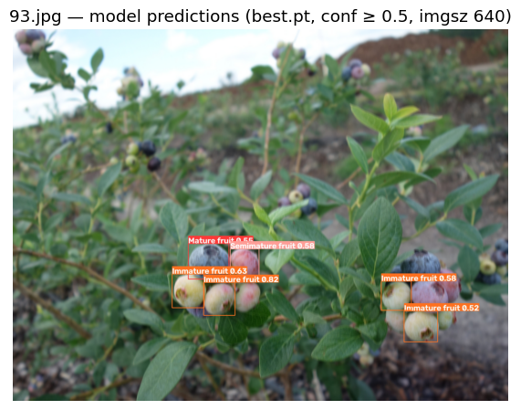

# Notebook catalog — page 7 of 7

[README / notebook index](../README.md#notebooks) · [Previous](page-006.md)

Alphabetical entries 301–302 of 302. Generated from publication.json; includes generation conditions and execution previews.

| Paper and run details | Preview |
| --- | --- |
| **YOLO-BLBE: A Novel Model for Identifying Blueberry Fruits with Different Maturities Using the I-MSRCR Method** <b>Journal:</b> Agronomy <b>Authors:</b> Chenglin Wang · Qiyu Han · Jianian Li · Chunjiang Li · Xiangjun Zou public_id: <code>p-92a6f52f8bcb7eda0de11213fcdfbb94</code>        <b>Generated with:</b> OpenCode 1.18.34 · spark-local/GLM-5.3-Flash-EXL3 · variant: high · reasoning effort: high <b>Demonstration:</b> Executed the authors&#x27; pinned YOLO-BLBE pipeline (repo MSRCR enhancement + 3-class blueberry maturity detection with the committed ghost+bifpn weights) on one committed sample field image on Colab CPU; single example only, no dataset-level accuracy validation.  <b>Semantic tags:</b> crop:blueberry, environment:field, modality:rgb, organ:fruit, task:object_detection, trait:reproductive_traits |  Model predictions from the authors&#x27; pinned best.pt (confidence 0.5 or higher, imgsz 640) overlaid on the repository sample data/sample/93.jpg |
| **‘Macrobot’–an automated segmentation-based system for powdery mildew disease quantification** <b>Journal:</b> bioRxiv <b>Authors:</b> Lück S, Strickert M, Lorbeer M, Melchert F, Backhaus A, Kilias D, Seiffert U, Schweizer P, Djamei A, Douchkov D. public_id: <code>p-20afe95c7a327d82953a229470490c9b</code>        <b>Generated with:</b> OpenCode 1.18.34 · spark-local/GLM-5.3-Flash-EXL3 · variant: high · reasoning effort: high <b>Demonstration:</b> Runs the author&#x27;s minRGB powdery-mildew pipeline (pinned macrobot commit) on one barley test plate in Colab CPU, scoring 32 leaves into a per-leaf infection CSV and lane prediction masks; one-plate partial demonstration, not the paper&#x27;s 108-plate validation.  <b>Semantic tags:</b> crop:barley, crop:wheat, environment:field, organ:leaf, organ:whole_plant, task:segmentation, task:stress_disease, trait:disease_symptoms, trait:leaf_traits |  Test-plate lanes: input RGB stacks with author-pipeline leaf-detection hulls (red) beside predicted infection masks (white = pathogen). |

[README / notebook index](../README.md#notebooks) · [Previous](page-006.md)
